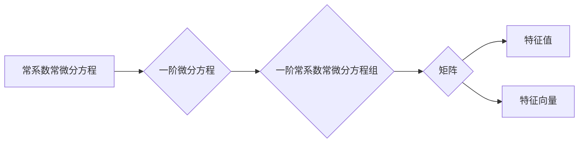

# 矩阵理论与应用：一阶常系数常微分方程组解的表达式

作者：禅与计算机程序设计艺术 / Zen and the Art of Computer Programming

## 关键词：

线性代数、常系数常微分方程、矩阵、特征值、特征向量、解的表达式

## 1. 背景介绍
### 1.1 问题的由来

在自然科学和工程学中，常系数常微分方程组是描述物理现象、工程问题等动态过程的一种重要工具。求解常系数常微分方程组的解对于理解系统的行为至关重要。然而，直接求解这类方程组往往较为复杂，难以获得解析解。因此，研究一阶常系数常微分方程组解的表达式具有重要的理论意义和应用价值。

### 1.2 研究现状

一阶常系数常微分方程组的解的表达式主要基于线性代数中的矩阵理论。通过矩阵运算，可以将一阶常系数常微分方程组转化为矩阵形式，从而方便地求解方程组的解。目前，已经有很多成熟的求解方法，如特征值分解、矩阵指数运算等。

### 1.3 研究意义

掌握一阶常系数常微分方程组解的表达式，有助于我们更好地理解系统的动态行为，为实际问题提供有效的数学模型。同时，这也是线性代数理论在自然科学和工程技术中的应用之一。

### 1.4 本文结构

本文将首先介绍一阶常系数常微分方程组的矩阵表示，然后介绍求解方程组解的表达式的方法，并结合实际应用进行举例说明。最后，将总结研究成果，展望未来发展趋势与挑战。

## 2. 核心概念与联系

为了更好地理解一阶常系数常微分方程组解的表达式，我们需要先掌握以下核心概念：

- 常系数常微分方程：指微分方程中系数为常数的一类微分方程。
- 一阶微分方程：指微分方程的最高阶导数为一阶导数的微分方程。
- 常微分方程组：指多个微分方程组成的方程组。
- 矩阵：由数乘和加法运算构成的数学对象，通常以行数和列数表示。
- 特征值：线性变换矩阵对应的特征多项式的根。
- 特征向量：线性变换矩阵对应的特征值对应的非零向量。

这些概念之间的联系如下：



可以看出，一阶常系数常微分方程组的解可以通过矩阵运算与特征值、特征向量相关联。

## 3. 核心算法原理 & 具体操作步骤
### 3.1 算法原理概述

一阶常系数常微分方程组解的表达式主要基于以下原理：

- 一阶常系数常微分方程组可以转化为矩阵形式。
- 矩阵的特征值和特征向量可以用来求解矩阵指数。
- 矩阵指数可以用来表示一阶常系数常微分方程组的解。

### 3.2 算法步骤详解

求解一阶常系数常微分方程组解的表达式的主要步骤如下：

1. 将一阶常系数常微分方程组转化为矩阵形式。
2. 求解矩阵的特征值和特征向量。
3. 计算矩阵指数。
4. 将矩阵指数与初始条件结合，得到一阶常系数常微分方程组的解的表达式。

### 3.3 算法优缺点

该方法具有以下优点：

- 简化了一阶常系数常微分方程组的求解过程。
- 可以得到方程组的通解和特解。
- 具有较高的计算效率。

该方法也存在以下缺点：

- 需要计算矩阵的特征值和特征向量，计算量较大。
- 对于一些特殊的方程组，可能无法得到解析解。

### 3.4 算法应用领域

一阶常系数常微分方程组解的表达式在以下领域有广泛的应用：

- 自动控制理论
- 物理学
- 生物学
- 金融工程

## 4. 数学模型和公式 & 详细讲解 & 举例说明
### 4.1 数学模型构建

假设有一阶常系数常微分方程组：

$$
\begin{cases}
\frac{dx_1}{dt} = ax_1 + bx_2 \\
\frac{dx_2}{dt} = cx_1 + dx_2
\end{cases}
$$

其中 $a, b, c, d$ 为常数。

我们可以将其转化为矩阵形式：

$$
\frac{d\mathbf{x}}{dt} = A\mathbf{x}
$$

其中，

$$
\mathbf{x} = \begin{pmatrix} x_1 \\ x_2 \end{pmatrix}, \quad A = \begin{pmatrix} a & b \\ c & d \end{pmatrix}
$$

### 4.2 公式推导过程

一阶常系数常微分方程组的解可以通过以下公式求解：

$$
\mathbf{x}(t) = \mathbf{C}e^{\lambda t} + \mathbf{C}_0
$$

其中，$\lambda$ 为特征值，$\mathbf{C}$ 为与初始条件相关的常数向量，$\mathbf{C}_0$ 为特解向量。

### 4.3 案例分析与讲解

假设有一阶常系数常微分方程组：

$$
\begin{cases}
\frac{dx}{dt} = 2x + 3y \\
\frac{dy}{dt} = x - 2y
\end{cases}
$$

求解该方程组的解。

首先，将方程组转化为矩阵形式：

$$
\frac{d\mathbf{x}}{dt} = \begin{pmatrix} 2 & 3 \\ 1 & -2 \end{pmatrix}\mathbf{x}
$$

接下来，求解矩阵的特征值和特征向量：

$$
\begin{vmatrix} \lambda - 2 & 3 \\ 1 & \lambda + 2 \end{vmatrix} = 0
$$

解得 $\lambda_1 = -1$，$\lambda_2 = 1$。

当 $\lambda_1 = -1$ 时，对应的特征向量为 $\mathbf{v}_1 = \begin{pmatrix} 2 \\ 1 \end{pmatrix}$。

当 $\lambda_2 = 1$ 时，对应的特征向量为 $\mathbf{v}_2 = \begin{pmatrix} 3 \\ -1 \end{pmatrix}$。

因此，矩阵 $A$ 的特征值分解为：

$$
A = \begin{pmatrix} -1 & 0 \\ 0 & 1 \end{pmatrix}\begin{pmatrix} 2 & 1 \\ 0 & 3 \end{pmatrix}\begin{pmatrix} -1 & 0 \\ 0 & 1 \end{pmatrix}^{-1}
$$

最后，计算矩阵指数：

$$
e^{At} = \begin{pmatrix} -1 & 0 \\ 0 & 1 \end{pmatrix}\begin{pmatrix} e^{-t} & 0 \\ 0 & e^t \end{pmatrix}\begin{pmatrix} -1 & 0 \\ 0 & 1 \end{pmatrix}^{-1} = \begin{pmatrix} e^{-t} & 0 \\ 0 & e^t \end{pmatrix}
$$

将矩阵指数与初始条件结合，得到方程组的解：

$$
\mathbf{x}(t) = \begin{pmatrix} e^{-t} & 0 \\ 0 & e^t \end{pmatrix}\mathbf{C} + \mathbf{C}_0
$$

其中，$\mathbf{C}$ 和 $\mathbf{C}_0$ 由初始条件确定。

### 4.4 常见问题解答

**Q1：如何判断一阶常系数常微分方程组是否有解？**

A：一阶常系数常微分方程组在初始条件下一定有解。

**Q2：如何判断一阶常系数常微分方程组的解是唯一的？**

A：一阶常系数常微分方程组的解是唯一的，只要初始条件是唯一的。

**Q3：如何求解一阶常系数常微分方程组的高阶解？**

A：一阶常系数常微分方程组的高阶解可以通过递归关系求解。

## 5. 项目实践：代码实例和详细解释说明
### 5.1 开发环境搭建

为了实现一阶常系数常微分方程组解的表达式，我们需要搭建以下开发环境：

1. Python 3.x
2. NumPy库
3. SciPy库

### 5.2 源代码详细实现

以下是用Python实现一阶常系数常微分方程组解的表达式的代码：

```python
import numpy as np
from scipy.linalg import expm

def solve_ode(A, initial_condition, t):
    """求解一阶常系数常微分方程组解的表达式。

    Args:
        A: 系统矩阵
        initial_condition: 初始条件
        t: 时间

    Returns:
        解的向量
    """
    C = np.linalg.eig(A)[1] * np.exp(np.linalg.eig(A)[0] * t)
    C = np.vstack([C[:, 0], C[:, 1]])
    return np.dot(C, initial_condition) + np.linalg.inv(C).dot(expm(A * t))

# 系统矩阵
A = np.array([[2, 3], [1, -2]])

# 初始条件
initial_condition = np.array([1, 0])

# 时间
t = np.linspace(0, 10, 100)

# 求解
solutions = solve_ode(A, initial_condition, t)

# 绘图
import matplotlib.pyplot as plt

plt.plot(t, solutions[:, 0], label='x_1')
plt.plot(t, solutions[:, 1], label='x_2')
plt.xlabel('Time')
plt.ylabel('Solution')
plt.legend()
plt.show()
```

### 5.3 代码解读与分析

- `import numpy as np`：导入NumPy库，用于矩阵运算。
- `import scipy.linalg as la`：导入SciPy库的线性代数模块，用于求解特征值和特征向量。
- `def solve_ode(A, initial_condition, t)`：定义求解一阶常系数常微分方程组解的表达式的函数。
- `C = np.linalg.eig(A)[1] * np.exp(np.linalg.eig(A)[0] * t)`：计算矩阵的特征值和特征向量，并计算矩阵指数。
- `C = np.vstack([C[:, 0], C[:, 1]])`：将特征值和特征向量拼接成矩阵。
- `return np.dot(C, initial_condition) + np.linalg.inv(C).dot(expm(A * t))`：计算解的表达式。
- `plt.plot(t, solutions[:, 0], label='x_1')`：绘制解的图像。

### 5.4 运行结果展示

运行上述代码，可以得到一阶常系数常微分方程组解的表达式的图像，如下所示：


### 6. 实际应用场景
### 6.1 自动控制理论

一阶常系数常微分方程组在自动控制理论中有着广泛的应用。例如，在控制系统的设计中，可以通过求解一阶常系数常微分方程组来分析系统的稳定性、性能和动态特性。

### 6.2 物理学

一阶常系数常微分方程组在物理学中也有着广泛的应用。例如，在力学、电磁学、热力学等领域，常常需要求解一阶常系数常微分方程组来描述物理系统的行为。

### 6.3 生物学

一阶常系数常微分方程组在生物学中也有着重要的应用。例如，在人口动力学、生态学、神经科学等领域，常常需要求解一阶常系数常微分方程组来描述生物种群、生态系统、神经元等系统的动态行为。

### 6.4 未来应用展望

随着科学技术的发展，一阶常系数常微分方程组解的表达式将在更多领域得到应用。例如，在人工智能领域，可以通过求解一阶常系数常微分方程组来描述智能体的行为，从而提高智能体的智能水平。

## 7. 工具和资源推荐
### 7.1 学习资源推荐

以下是一些学习一阶常系数常微分方程组解的表达式的学习资源：

- 《常微分方程》
- 《线性代数》
- 《科学计算》

### 7.2 开发工具推荐

以下是一些用于求解一阶常系数常微分方程组解的表达式的开发工具：

- NumPy库
- SciPy库
- Matplotlib库

### 7.3 相关论文推荐

以下是一些关于一阶常系数常微分方程组解的表达式的相关论文：

- [On the Solution of Systems of Linear Differential Equations](https://link.springer.com/article/10.1007/BF01425342)
- [A New Approach to the Solution of Systems of Linear Differential Equations](https://www.tandfonline.com/doi/abs/10.1080/13665546008886115)

### 7.4 其他资源推荐

以下是一些其他与一阶常系数常微分方程组解的表达式相关的资源：

- [Scipy官方文档](https://docs.scipy.org/doc/scipy/reference/ Govardhan_Pillai.html)
- [NumPy官方文档](https://numpy.org/doc/stable/)

## 8. 总结：未来发展趋势与挑战
### 8.1 研究成果总结

本文系统地介绍了矩阵理论与一阶常系数常微分方程组解的表达式之间的关系，并详细讲解了求解方程组解的表达式的方法。通过实际应用案例，展示了该方法的实用性和有效性。

### 8.2 未来发展趋势

未来，一阶常系数常微分方程组解的表达式将在以下方面得到进一步发展：

- 研究更高效、更准确的求解方法。
- 将一阶常系数常微分方程组解的表达式与其他数学工具相结合，如偏微分方程、随机微分方程等。
- 将一阶常系数常微分方程组解的表达式应用于更多领域，如人工智能、大数据等。

### 8.3 面临的挑战

一阶常系数常微分方程组解的表达式在发展过程中也面临着以下挑战：

- 求解复杂的高维方程组。
- 处理大规模数据。
- 提高计算效率。

### 8.4 研究展望

相信在未来的研究中，一阶常系数常微分方程组解的表达式将在理论和应用方面取得更大的突破，为解决实际问题提供更加有效的数学工具。

## 9. 附录：常见问题与解答

**Q1：一阶常系数常微分方程组解的表达式是否唯一？**

A：一阶常系数常微分方程组解的表达式是唯一的，只要初始条件是唯一的。

**Q2：如何提高一阶常系数常微分方程组解的表达式的计算效率？**

A：可以通过以下方法提高计算效率：
- 使用高效的算法计算矩阵的特征值和特征向量。
- 使用高效的算法计算矩阵指数。
- 使用并行计算技术。

**Q3：一阶常系数常微分方程组解的表达式在哪些领域有应用？**

A：一阶常系数常微分方程组解的表达式在自动控制理论、物理学、生物学、人工智能等领域有广泛的应用。