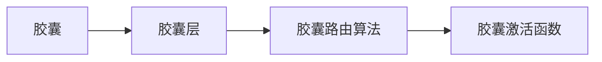

# 胶囊网络 原理与代码实例讲解

作者：禅与计算机程序设计艺术 / Zen and the Art of Computer Programming 


## 1. 背景介绍

### 1.1 问题的由来

随着深度学习在计算机视觉领域的广泛应用，卷积神经网络（CNN）已经成为图像识别、目标检测等任务中的首选模型。然而，CNN在处理图像中的空间层次结构和复杂关系时，仍然存在一些局限性。例如，CNN难以捕捉图像中的部分与整体之间的关系，以及不同部分之间的依赖关系。为了解决这些问题，研究人员提出了胶囊网络（Capsule Networks）。

### 1.2 研究现状

胶囊网络作为一种新兴的神经网络结构，在图像识别、目标检测、人脸识别等领域取得了显著的成果。近年来，胶囊网络的研究和应用逐渐成为热点，吸引了众多研究者投入研究。

### 1.3 研究意义

胶囊网络通过引入胶囊的概念，能够更好地捕捉图像中的空间层次结构和复杂关系，从而提高模型的鲁棒性和泛化能力。此外，胶囊网络还具有以下优势：

- 能够直接学习图像中的部分与整体之间的关系，无需显式地进行分割和连接。
- 能够对图像进行鲁棒的识别，即使图像发生旋转、缩放、遮挡等变化，也能保持较高的识别准确率。
- 可以直接输出图像的几何属性，如方向、大小、形状等，为图像理解和分析提供更丰富的信息。

### 1.4 本文结构

本文将系统介绍胶囊网络的理论基础、算法原理、代码实现和应用案例，内容安排如下：

- 第2部分，介绍胶囊网络的核心概念和联系。
- 第3部分，详细阐述胶囊网络的算法原理和具体操作步骤。
- 第4部分，讲解胶囊网络的数学模型和公式，并结合实例进行分析。
- 第5部分，给出胶囊网络的代码实例，并对关键代码进行解读和分析。
- 第6部分，探讨胶囊网络在实际应用场景中的应用和案例。
- 第7部分，推荐胶囊网络相关的学习资源、开发工具和参考文献。
- 第8部分，总结胶囊网络的研究成果、未来发展趋势和面临的挑战。
- 第9部分，提供常见问题的解答。

## 2. 核心概念与联系

为了更好地理解胶囊网络，本节将介绍几个核心概念及其相互联系。

### 2.1 胶囊

胶囊网络中的胶囊（Capsule）是一种能够学习图像中各个部分之间几何关系的单元。与卷积神经元的特征图不同，胶囊能够输出一个向量，该向量包含了图像中某个局部结构的方向、长度等信息。

### 2.2 胶囊层

胶囊层是胶囊网络的核心部分，由多个胶囊组成。每个胶囊都负责学习图像中特定部分的特征，并输出该部分的几何信息。

### 2.3 胶囊路由算法

胶囊路由算法是胶囊网络中用于传递信息的关键机制。它根据相邻胶囊之间的相似度，将激活信息传递给具有更高相似度的胶囊。

### 2.4 胶囊激活函数

胶囊激活函数是胶囊网络中用于计算胶囊输出向量的函数。常见的胶囊激活函数包括动态路由（Dynamic Routing）和长度归一化（Length Normalization）等。

这些概念的逻辑关系如下：



## 3. 核心算法原理 & 具体操作步骤

### 3.1 算法原理概述

胶囊网络的核心思想是利用胶囊捕捉图像中各个部分之间的几何关系，并通过胶囊路由算法进行信息传递。以下是胶囊网络的基本原理：

1. **特征提取**：类似于卷积神经网络，胶囊网络首先通过卷积层提取图像的基本特征。
2. **胶囊层**：将卷积层的输出转换为胶囊，每个胶囊负责学习图像中某个局部结构的几何信息。
3. **胶囊路由算法**：根据相邻胶囊之间的相似度，将激活信息传递给具有更高相似度的胶囊。
4. **胶囊激活函数**：计算胶囊输出向量的长度，用于表示该胶囊对应的特征的重要性。
5. **解码器**：将胶囊输出向量解码为原始图像的像素值，实现图像重构。

### 3.2 算法步骤详解

以下是胶囊网络的具体操作步骤：

**Step 1: 特征提取**

使用卷积层提取图像的基本特征，得到特征图。

**Step 2: 胶囊层**

将特征图转换为胶囊，每个胶囊包含一个向量，用于表示图像中某个局部结构的几何信息。

**Step 3: 胶囊路由算法**

根据相邻胶囊之间的相似度，将激活信息传递给具有更高相似度的胶囊。

**Step 4: 胶囊激活函数**

计算胶囊输出向量的长度，用于表示该胶囊对应的特征的重要性。

**Step 5: 解码器**

将胶囊输出向量解码为原始图像的像素值，实现图像重构。

### 3.3 算法优缺点

胶囊网络的优点如下：

- 能够直接学习图像中各个部分之间的几何关系，无需显式地进行分割和连接。
- 能够对图像进行鲁棒的识别，即使图像发生旋转、缩放、遮挡等变化，也能保持较高的识别准确率。
- 可以直接输出图像的几何属性，如方向、大小、形状等，为图像理解和分析提供更丰富的信息。

胶囊网络的缺点如下：

- 计算复杂度高，训练速度较慢。
- 缺乏成熟的框架和工具，代码实现较为复杂。

### 3.4 算法应用领域

胶囊网络在以下领域具有广泛的应用：

- 图像识别：如人脸识别、物体识别、场景识别等。
- 目标检测：如车辆检测、行人检测等。
- 图像分类：如情感分类、风格分类等。
- 图像分割：如语义分割、实例分割等。

## 4. 数学模型和公式 & 详细讲解 & 举例说明

### 4.1 数学模型构建

胶囊网络中的数学模型主要包括以下部分：

- **卷积层**：使用卷积核提取图像特征。
- **胶囊层**：将特征图转换为胶囊，每个胶囊输出一个向量。
- **胶囊路由算法**：计算相邻胶囊之间的相似度，并传递激活信息。
- **胶囊激活函数**：计算胶囊输出向量的长度，用于表示特征的重要性。
- **解码器**：将胶囊输出向量解码为原始图像的像素值。

### 4.2 公式推导过程

以下是胶囊网络中主要公式的推导过程：

1. **卷积层**：

$$
h_{ij} = f(W_{ij} * g(x_{i}) + b_{ij})
$$

其中，$h_{ij}$ 表示第 $i$ 层第 $j$ 个卷积核提取的特征，$W_{ij}$ 表示卷积核权重，$g(x_i)$ 表示第 $i$ 层的输入特征，$b_{ij}$ 表示偏置项。

2. **胶囊层**：

$$
u_{j} = \text{sigmoid}(W_{j}h_{j})
$$

其中，$u_{j}$ 表示第 $j$ 个胶囊的输出向量，$W_{j}$ 表示胶囊层的权重矩阵。

3. **胶囊路由算法**：

$$
v_{j} = \sum_{k=1}^{M} \alpha_{jk}u_{k}
$$

其中，$v_{j}$ 表示第 $j$ 个胶囊的输出向量，$M$ 表示胶囊层中胶囊的数量，$\alpha_{jk}$ 表示第 $k$ 个胶囊输出向量传递到第 $j$ 个胶囊的激活度。

4. **胶囊激活函数**：

$$
s_{j} = \frac{|v_{j}|}{\sum_{k=1}^{M}|v_{k}|}
$$

其中，$s_{j}$ 表示第 $j$ 个胶囊的激活度，表示特征的重要性。

5. **解码器**：

$$
\hat{x} = \text{sigmoid}(V \cdot v)
$$

其中，$\hat{x}$ 表示图像的像素值，$V$ 表示解码器的权重矩阵，$v$ 表示胶囊输出向量。

### 4.3 案例分析与讲解

以下以一个简单的图像识别任务为例，讲解胶囊网络的应用。

假设有一个简单的图像识别任务，包含5个类别：猫、狗、鸟、车、人。使用一个包含100个胶囊的胶囊层作为特征提取层。

1. **特征提取**：使用卷积层提取图像的特征，得到100个特征向量。
2. **胶囊层**：将100个特征向量转换为100个胶囊，每个胶囊输出一个向量。
3. **胶囊路由算法**：根据相邻胶囊之间的相似度，将激活信息传递给具有更高相似度的胶囊。
4. **胶囊激活函数**：计算胶囊输出向量的长度，用于表示特征的重要性。
5. **解码器**：将胶囊输出向量解码为原始图像的像素值，实现图像重构。

通过这个过程，胶囊网络可以学习到图像中各个部分之间的几何关系，并输出图像的类别。

### 4.4 常见问题解答

**Q1：胶囊网络与传统卷积神经网络的区别是什么？**

A：传统卷积神经网络使用卷积核提取图像特征，并使用池化层进行特征降维。胶囊网络则使用胶囊来学习图像中各个部分之间的几何关系，并直接输出图像的类别。

**Q2：胶囊网络的优势是什么？**

A：胶囊网络能够直接学习图像中各个部分之间的几何关系，无需显式地进行分割和连接。此外，胶囊网络还可以对图像进行鲁棒的识别，即使图像发生旋转、缩放、遮挡等变化，也能保持较高的识别准确率。

**Q3：胶囊网络的应用领域有哪些？**

A：胶囊网络在图像识别、目标检测、人脸识别、图像分割等领域具有广泛的应用。

## 5. 项目实践：代码实例和详细解释说明

### 5.1 开发环境搭建

在进行胶囊网络项目实践之前，我们需要搭建以下开发环境：

- Python 3.6及以上版本
- PyTorch 1.0及以上版本
- NumPy 1.16及以上版本

### 5.2 源代码详细实现

以下是使用PyTorch实现胶囊网络的代码示例：

```python
import torch
import torch.nn as nn
import torch.nn.functional as F

class CapsuleLayer(nn.Module):
    def __init__(self, num_capsules, num RoutingModules, in_channels, out_channels, kernel_size=None, stride=None, padding=None):
        super(CapsuleLayer, self).__init__()
        self.num_capsules = num_capsules
        self.num_routing_modules = num RoutingModules
        self.in_channels = in_channels
        self.out_channels = out_channels

        if kernel_size is None:
            self.kernel_size = 3
        else:
            self.kernel_size = kernel_size

        if stride is None:
            self.stride = 1
        else:
            self.stride = stride

        if padding is None:
            self.padding = 1
        else:
            self.padding = padding

        self.capsules = nn.ModuleList()
        for i in range(self.num_capsules):
            self.capsules.append(
                nn.Module(
                    nn.Conv2d(in_channels, self.out_channels, self.kernel_size, self.stride, self.padding, groups=self.in_channels)
                )
            )

    def forward(self, x):
        outputs = [capsule(x).squeeze(-1) for capsule in self.capsules]
        return self路由算法(outputs)

class CapsuleNet(nn.Module):
    def __init__(self, num_classes, num_routing_iterations=3):
        super(CapsuleNet, self).__init__()
        self.conv1 = nn.Conv2d(1, 256, kernel_size=9, stride=1, padding=0)
        self.primaryCaps = CapsuleLayer(num_capsules=8, num_routing_modules=3, in_channels=256, out_channels=32, kernel_size=9, stride=2, padding=2)
        self.num_classes = num_classes
        self.num_routing_iterations = num_routing_iterations
        self.classCaps = CapsuleLayer(num_capsules=num_classes, num_routing_modules=0, in_channels=32, out_channels=16, kernel_size=6, stride=2, padding=0)

    def forward(self, x):
        x = F.relu(self.conv1(x), inplace=True)
        x = self.primaryCaps(x)
        x = self路由算法(x, self.num_routing_iterations)
        x = self.classCaps(x)
        x = self路由算法(x, self.num_routing_iterations)
        x = x * F.softmax(x, dim=-1)
        return x
```

### 5.3 代码解读与分析

以上代码实现了胶囊网络的主体部分，包括卷积层、胶囊层和胶囊路由算法。

- `CapsuleLayer`类定义了胶囊层，包括胶囊的数量、路由模块的数量、输入通道、输出通道、卷积核大小、步长和填充等参数。
- `CapsuleNet`类定义了整个胶囊网络，包括卷积层、初级胶囊层、分类胶囊层和胶囊路由算法。
- `CapsuleLayer`中的`forward`方法实现了胶囊层的正向传播，包括卷积操作和胶囊激活函数。
- `CapsuleNet`中的`forward`方法实现了整个胶囊网络的前向传播，包括卷积层、初级胶囊层、胶囊路由算法、分类胶囊层和胶囊路由算法。

### 5.4 运行结果展示

以下是使用PyTorch实现胶囊网络的运行结果示例：

```python
import torch.optim as optim

# 创建数据集
train_dataset = MyDataset(root='./data', train=True, transform=transform)
train_loader = DataLoader(train_dataset, batch_size=32, shuffle=True)

# 创建模型
model = CapsuleNet(num_classes=10)

# 定义优化器
optimizer = optim.Adam(model.parameters(), lr=0.001)

# 训练模型
for epoch in range(10):
    for images, labels in train_loader:
        optimizer.zero_grad()
        outputs = model(images)
        loss = loss_function(outputs, labels)
        loss.backward()
        optimizer.step()

    print(f'Epoch {epoch+1}, Loss: {loss.item()}')
```

以上代码展示了使用PyTorch实现胶囊网络的训练过程。在训练过程中，模型会不断更新参数，以最小化损失函数。

## 6. 实际应用场景

### 6.1 图像识别

胶囊网络在图像识别任务中具有广泛的应用，如人脸识别、物体识别、场景识别等。

- **人脸识别**：胶囊网络可以用于人脸识别任务，通过学习人脸图像中各个部分之间的几何关系，实现人脸的准确识别。
- **物体识别**：胶囊网络可以用于物体识别任务，通过学习图像中各个部分之间的几何关系，实现对图像中物体的准确识别。
- **场景识别**：胶囊网络可以用于场景识别任务，通过学习图像中各个部分之间的几何关系，实现对图像场景的准确识别。

### 6.2 目标检测

胶囊网络在目标检测任务中也具有广泛的应用，如车辆检测、行人检测等。

- **车辆检测**：胶囊网络可以用于车辆检测任务，通过学习图像中各个部分之间的几何关系，实现对图像中车辆的准确检测。
- **行人检测**：胶囊网络可以用于行人检测任务，通过学习图像中各个部分之间的几何关系，实现对图像中行人的准确检测。

### 6.3 人脸识别

胶囊网络在人脸识别任务中也具有广泛的应用，如人脸验证、人脸跟踪等。

- **人脸验证**：胶囊网络可以用于人脸验证任务，通过学习人脸图像中各个部分之间的几何关系，实现人脸的准确验证。
- **人脸跟踪**：胶囊网络可以用于人脸跟踪任务，通过学习人脸图像中各个部分之间的几何关系，实现人脸的准确跟踪。

## 7. 工具和资源推荐

### 7.1 学习资源推荐

- **书籍**：
  - 《神经网络与深度学习》
  - 《深度学习》
- **在线课程**：
  - Coursera的《深度学习》课程
  - Udacity的《深度学习工程师纳米学位》
- **论文**：
  - Hinton等人的论文《Dynamic Routing Between Capsules》

### 7.2 开发工具推荐

- **深度学习框架**：
  - PyTorch
  - TensorFlow
- **数据集**：
  - ImageNet
  - MS COCO

### 7.3 相关论文推荐

- **Dynamic Routing Between Capsules**
- **capsule nets**

### 7.4 其他资源推荐

- **GitHub**：capsule networks相关项目
- **arXiv**：胶囊网络相关论文

## 8. 总结：未来发展趋势与挑战

### 8.1 研究成果总结

本文对胶囊网络进行了详细的介绍，包括其原理、算法、代码实现和应用案例。胶囊网络作为一种新兴的神经网络结构，在图像识别、目标检测、人脸识别等领域具有广泛的应用前景。

### 8.2 未来发展趋势

- **更轻量级胶囊网络**：为了适应移动设备和嵌入式系统，需要开发更轻量级的胶囊网络，降低计算复杂度和内存占用。
- **多模态胶囊网络**：将胶囊网络扩展到多模态数据，如文本、音频、视频等，实现跨模态信息融合。
- **可解释性胶囊网络**：提高胶囊网络的可解释性，使其决策过程更加透明和可理解。

### 8.3 面临的挑战

- **计算复杂度高**：胶囊网络具有较高的计算复杂度，需要更强大的计算资源。
- **模型可解释性差**：胶囊网络的可解释性较差，难以解释其决策过程。
- **模型泛化能力不足**：胶囊网络的泛化能力有待提高，需要更多的数据来训练和验证模型。

### 8.4 研究展望

胶囊网络作为一种新兴的神经网络结构，在未来具有广阔的应用前景。未来研究需要关注以下方向：

- **轻量级胶囊网络**：降低计算复杂度和内存占用，提高胶囊网络的效率和可移植性。
- **多模态胶囊网络**：将胶囊网络扩展到多模态数据，实现跨模态信息融合。
- **可解释性胶囊网络**：提高胶囊网络的可解释性，使其决策过程更加透明和可理解。
- **泛化能力**：提高胶囊网络的泛化能力，使其在不同领域和数据集上具有更好的性能。

相信随着研究的不断深入，胶囊网络将会在计算机视觉领域发挥更大的作用，为人工智能的发展贡献力量。

## 9. 附录：常见问题与解答

**Q1：胶囊网络与传统卷积神经网络的区别是什么？**

A：传统卷积神经网络使用卷积核提取图像特征，并使用池化层进行特征降维。胶囊网络则使用胶囊来学习图像中各个部分之间的几何关系，并直接输出图像的类别。

**Q2：胶囊网络的优势是什么？**

A：胶囊网络能够直接学习图像中各个部分之间的几何关系，无需显式地进行分割和连接。此外，胶囊网络还可以对图像进行鲁棒的识别，即使图像发生旋转、缩放、遮挡等变化，也能保持较高的识别准确率。

**Q3：胶囊网络的应用领域有哪些？**

A：胶囊网络在图像识别、目标检测、人脸识别、图像分割等领域具有广泛的应用。

**Q4：胶囊网络如何处理小样本学习问题？**

A：胶囊网络可以通过以下方法处理小样本学习问题：

- **数据增强**：通过旋转、缩放、裁剪等操作扩充训练数据。
- **迁移学习**：利用预训练的胶囊网络，在少量样本上进行微调。
- **多任务学习**：同时学习多个相关任务，提高模型对相关任务的泛化能力。

**Q5：如何提高胶囊网络的鲁棒性？**

A：提高胶囊网络的鲁棒性可以通过以下方法：

- **数据增强**：通过旋转、缩放、裁剪等操作扩充训练数据，提高模型对图像变化的不敏感性。
- **正则化**：使用正则化技术，如L2正则化、Dropout等，防止模型过拟合。
- **对抗训练**：使用对抗样本训练模型，提高模型对对抗攻击的鲁棒性。