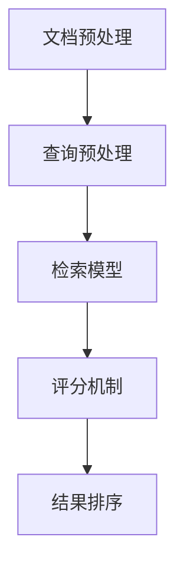

# 【LangChain编程：从入门到实践】多文档联合检索

## 1.背景介绍

在当今信息爆炸的时代，如何高效地从海量文档中提取有用信息成为了一个重要的研究课题。传统的单文档检索方法已经无法满足复杂的查询需求，多文档联合检索应运而生。LangChain作为一种新兴的编程框架，提供了强大的多文档联合检索功能，能够帮助开发者构建高效、智能的信息检索系统。

## 2.核心概念与联系

### 2.1 LangChain简介

LangChain是一种专注于自然语言处理（NLP）和信息检索的编程框架。它提供了一系列工具和库，帮助开发者快速构建和部署复杂的NLP应用。

### 2.2 多文档联合检索

多文档联合检索是指在多个文档集合中同时进行信息检索，以便找到最相关的答案。这种方法不仅提高了检索的准确性，还能提供更全面的信息。

### 2.3 核心概念

- **文档集合**：多个文档的集合，通常是一个数据库或文件系统。
- **查询**：用户输入的搜索请求，通常是一个自然语言句子。
- **检索模型**：用于匹配查询和文档的算法或模型。
- **评分机制**：用于评估文档与查询的相关性。

## 3.核心算法原理具体操作步骤

### 3.1 文档预处理

在进行多文档联合检索之前，需要对文档进行预处理，包括分词、去停用词、词干提取等。

### 3.2 查询预处理

与文档预处理类似，查询也需要进行分词、去停用词等操作，以便与文档进行匹配。

### 3.3 检索模型

常用的检索模型包括TF-IDF、BM25、BERT等。不同的模型有不同的优缺点，选择合适的模型是提高检索效果的关键。

### 3.4 评分机制

评分机制用于评估文档与查询的相关性。常用的评分机制包括余弦相似度、点积等。

### 3.5 结果排序

根据评分机制的结果，对文档进行排序，并返回给用户。



## 4.数学模型和公式详细讲解举例说明

### 4.1 TF-IDF模型

TF-IDF（Term Frequency-Inverse Document Frequency）是一种常用的文本检索模型。其核心思想是通过计算词频和逆文档频率来衡量词语的重要性。

$$
\text{TF-IDF}(t, d) = \text{TF}(t, d) \times \text{IDF}(t)
$$

其中，$\text{TF}(t, d)$ 表示词语 $t$ 在文档 $d$ 中出现的频率，$\text{IDF}(t)$ 表示词语 $t$ 的逆文档频率。

### 4.2 BM25模型

BM25是一种改进的TF-IDF模型，考虑了文档长度和词频的饱和效应。

$$
\text{BM25}(t, d) = \sum_{t \in q} \frac{\text{IDF}(t) \cdot (k_1 + 1) \cdot \text{TF}(t, d)}{\text{TF}(t, d) + k_1 \cdot (1 - b + b \cdot \frac{|d|}{\text{avgdl}})}
$$

其中，$k_1$ 和 $b$ 是调节参数，$|d|$ 表示文档 $d$ 的长度，$\text{avgdl}$ 表示所有文档的平均长度。

### 4.3 BERT模型

BERT（Bidirectional Encoder Representations from Transformers）是一种基于深度学习的预训练语言模型，能够捕捉上下文信息。

$$
\text{BERT}(q, d) = \text{CLS} \cdot W \cdot \text{CLS}^T
$$

其中，$\text{CLS}$ 表示BERT模型的输出向量，$W$ 是一个可训练的权重矩阵。

## 5.项目实践：代码实例和详细解释说明

### 5.1 环境配置

首先，安装必要的库和工具：

```bash
pip install langchain
pip install transformers
pip install scikit-learn
```

### 5.2 数据准备

准备一个包含多个文档的集合，假设文档存储在一个JSON文件中：

```json
[
    {"id": 1, "text": "这是第一个文档的内容。"},
    {"id": 2, "text": "这是第二个文档的内容。"},
    ...
]
```

### 5.3 文档预处理

使用LangChain对文档进行预处理：

```python
from langchain.preprocessing import preprocess_documents

documents = load_documents('documents.json')
preprocessed_docs = preprocess_documents(documents)
```

### 5.4 查询预处理

对用户查询进行预处理：

```python
from langchain.preprocessing import preprocess_query

query = "查询内容"
preprocessed_query = preprocess_query(query)
```

### 5.5 检索模型

使用TF-IDF模型进行检索：

```python
from langchain.models import TFIDFModel

model = TFIDFModel()
model.fit(preprocessed_docs)
results = model.search(preprocessed_query)
```

### 5.6 结果排序

根据评分机制对结果进行排序：

```python
sorted_results = sorted(results, key=lambda x: x['score'], reverse=True)
```

### 5.7 输出结果

输出检索结果：

```python
for result in sorted_results:
    print(f"文档ID: {result['id']}, 相关性评分: {result['score']}")
```

## 6.实际应用场景

### 6.1 企业知识库

在企业中，员工需要频繁地查找各种文档和资料。多文档联合检索可以帮助员工快速找到所需的信息，提高工作效率。

### 6.2 学术研究

学术研究需要查阅大量的文献和资料。多文档联合检索可以帮助研究人员快速找到相关的文献，提高研究效率。

### 6.3 客户服务

在客户服务中，客服人员需要快速查找客户问题的解决方案。多文档联合检索可以帮助客服人员快速找到相关的解决方案，提高客户满意度。

## 7.工具和资源推荐

### 7.1 LangChain

LangChain是一个强大的NLP编程框架，提供了丰富的工具和库，适用于多文档联合检索。

### 7.2 Transformers

Transformers是一个基于深度学习的NLP库，提供了多种预训练模型，如BERT、GPT等，适用于复杂的NLP任务。

### 7.3 Scikit-learn

Scikit-learn是一个广泛使用的机器学习库，提供了多种文本处理和检索算法，如TF-IDF、BM25等。

## 8.总结：未来发展趋势与挑战

### 8.1 发展趋势

随着人工智能和大数据技术的发展，多文档联合检索将会变得更加智能和高效。未来，基于深度学习的检索模型将会得到广泛应用，能够更好地理解和匹配用户查询。

### 8.2 挑战

尽管多文档联合检索有着广阔的应用前景，但也面临着一些挑战。例如，如何处理海量数据、如何提高检索速度和准确性、如何应对多语言和多领域的复杂查询等。

## 9.附录：常见问题与解答

### 9.1 如何选择合适的检索模型？

选择检索模型需要考虑多个因素，如数据规模、查询复杂度、计算资源等。一般来说，TF-IDF适用于小规模数据，BM25适用于中等规模数据，BERT适用于大规模数据和复杂查询。

### 9.2 如何提高检索准确性？

提高检索准确性可以从多个方面入手，如优化预处理步骤、选择合适的检索模型、调整模型参数、增加训练数据等。

### 9.3 如何处理多语言查询？

处理多语言查询需要使用多语言支持的检索模型，如多语言BERT。此外，还可以使用翻译工具将查询和文档转换为同一种语言进行匹配。

---

作者：禅与计算机程序设计艺术 / Zen and the Art of Computer Programming