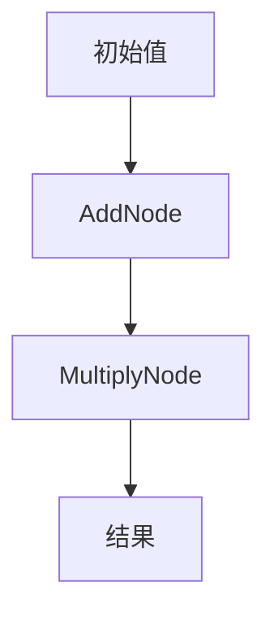

# 【LangChain编程：从入门到实践】示例选择器

## 1.背景介绍

在现代软件开发中，链式编程（Chaining Programming）已经成为一种重要的编程范式。LangChain作为一种新兴的编程框架，提供了强大的工具和库，帮助开发者更高效地实现链式编程。LangChain不仅简化了代码的编写，还提高了代码的可读性和可维护性。本文将深入探讨LangChain的核心概念、算法原理、数学模型、实际应用场景以及未来发展趋势。

## 2.核心概念与联系

### 2.1 LangChain简介

LangChain是一种基于链式编程思想的编程框架，旨在通过链式调用的方式简化代码结构。它允许开发者将多个操作链接在一起，从而减少中间变量的使用，提高代码的可读性。

### 2.2 链式编程的优势

- **简洁性**：通过链式调用，代码更加简洁明了。
- **可读性**：减少了中间变量的使用，使代码逻辑更加清晰。
- **可维护性**：链式编程使得代码模块化程度更高，便于维护和扩展。

### 2.3 LangChain的核心组件

- **链式操作符**：用于连接不同的操作。
- **操作节点**：每个操作节点代表一个具体的操作。
- **数据流**：数据在链式调用中流动，经过每个操作节点的处理。

## 3.核心算法原理具体操作步骤

### 3.1 链式调用的基本原理

链式调用的基本原理是通过返回自身或新的对象，使得多个方法可以连续调用。以下是一个简单的示例：

```python
class LangChain:
    def __init__(self, value):
        self.value = value

    def add(self, num):
        self.value += num
        return self

    def multiply(self, num):
        self.value *= num
        return self

# 使用示例
result = LangChain(5).add(3).multiply(2).value
print(result)  # 输出 16
```

### 3.2 操作节点的实现

每个操作节点都实现了特定的操作，并返回自身或新的对象，以便进行下一步操作。

```python
class AddNode:
    def __init__(self, value):
        self.value = value

    def add(self, num):
        self.value += num
        return self

class MultiplyNode:
    def __init__(self, value):
        self.value = value

    def multiply(self, num):
        self.value *= num
        return self
```

### 3.3 数据流的管理

数据在链式调用中流动，经过每个操作节点的处理。以下是一个数据流的示例：



## 4.数学模型和公式详细讲解举例说明

### 4.1 链式调用的数学模型

链式调用可以用数学模型来描述。假设有一系列操作 $f_1, f_2, \ldots, f_n$，初始值为 $x_0$，则链式调用的结果可以表示为：

$$
x_n = f_n(f_{n-1}(\ldots f_1(x_0) \ldots))
$$

### 4.2 具体示例

假设有以下操作：

- $f_1(x) = x + 3$
- $f_2(x) = x \times 2$

初始值 $x_0 = 5$，则链式调用的结果为：

$$
x_2 = f_2(f_1(x_0)) = f_2(5 + 3) = f_2(8) = 8 \times 2 = 16
$$

## 5.项目实践：代码实例和详细解释说明

### 5.1 项目背景

假设我们需要实现一个简单的计算器，支持加法和乘法操作，并且可以通过链式调用的方式进行操作。

### 5.2 代码实现

以下是一个简单的计算器实现：

```python
class Calculator:
    def __init__(self, value=0):
        self.value = value

    def add(self, num):
        self.value += num
        return self

    def multiply(self, num):
        self.value *= num
        return self

# 使用示例
calc = Calculator()
result = calc.add(5).multiply(3).value
print(result)  # 输出 15
```

### 5.3 详细解释

- **初始化**：创建一个Calculator对象，初始值为0。
- **加法操作**：调用add方法，增加指定的数值。
- **乘法操作**：调用multiply方法，乘以指定的数值。
- **结果输出**：通过value属性获取最终结果。

## 6.实际应用场景

### 6.1 数据处理

在数据处理领域，链式编程可以用于数据的清洗、转换和分析。例如，使用Pandas库进行数据处理时，可以通过链式调用的方式简化代码。

```python
import pandas as pd

df = pd.DataFrame({'A': [1, 2, 3], 'B': [4, 5, 6]})
result = df.assign(C=lambda x: x['A'] + x['B']).query('C > 5').sort_values('C')
print(result)
```

### 6.2 Web开发

在Web开发中，链式编程可以用于构建复杂的查询和操作。例如，使用SQLAlchemy进行数据库查询时，可以通过链式调用的方式构建查询。

```python
from sqlalchemy import create_engine, Column, Integer, String, Sequence
from sqlalchemy.ext.declarative import declarative_base
from sqlalchemy.orm import sessionmaker

Base = declarative_base()

class User(Base):
    __tablename__ = 'users'
    id = Column(Integer, Sequence('user_id_seq'), primary_key=True)
    name = Column(String(50))

engine = create_engine('sqlite:///:memory:')
Base.metadata.create_all(engine)

Session = sessionmaker(bind=engine)
session = Session()

# 插入数据
new_user = User(name='John Doe')
session.add(new_user)
session.commit()

# 查询数据
user = session.query(User).filter_by(name='John Doe').first()
print(user.name)
```

## 7.工具和资源推荐

### 7.1 开发工具

- **PyCharm**：一款强大的Python集成开发环境，支持链式编程的调试和开发。
- **Jupyter Notebook**：一个交互式的开发环境，适合进行数据处理和分析。

### 7.2 资源推荐

- **LangChain官方文档**：详细介绍了LangChain的使用方法和最佳实践。
- **Stack Overflow**：一个开发者社区，可以在这里找到解决问题的答案和讨论。

## 8.总结：未来发展趋势与挑战

### 8.1 未来发展趋势

随着编程语言和框架的不断发展，链式编程将会在更多领域得到应用。未来，LangChain可能会引入更多的操作节点和数据流管理工具，以满足不同场景的需求。

### 8.2 挑战

尽管链式编程有很多优势，但在某些情况下，链式调用可能会导致代码难以调试和维护。因此，开发者需要在使用链式编程时，权衡其优缺点，并根据具体情况选择合适的编程范式。

## 9.附录：常见问题与解答

### 9.1 什么是链式编程？

链式编程是一种编程范式，通过链式调用的方式，将多个操作连接在一起，从而简化代码结构，提高代码的可读性和可维护性。

### 9.2 LangChain的核心组件有哪些？

LangChain的核心组件包括链式操作符、操作节点和数据流。链式操作符用于连接不同的操作，操作节点代表具体的操作，数据流在链式调用中流动，经过每个操作节点的处理。

### 9.3 如何实现链式调用？

链式调用的实现通常通过返回自身或新的对象，使得多个方法可以连续调用。具体实现可以参考本文中的代码示例。

### 9.4 链式编程的优势是什么？

链式编程的优势包括简洁性、可读性和可维护性。通过链式调用，代码更加简洁明了，减少了中间变量的使用，使代码逻辑更加清晰，便于维护和扩展。

### 9.5 链式编程的应用场景有哪些？

链式编程在数据处理、Web开发等领域有广泛的应用。例如，使用Pandas库进行数据处理时，可以通过链式调用的方式简化代码；使用SQLAlchemy进行数据库查询时，可以通过链式调用的方式构建查询。

---

作者：禅与计算机程序设计艺术 / Zen and the Art of Computer Programming