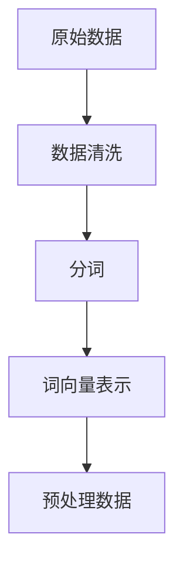

# 【大模型应用开发 动手做AI Agent】语言交互能力

## 1.背景介绍

在人工智能领域，语言交互能力是大模型应用开发中的一个关键组成部分。随着自然语言处理（NLP）技术的不断进步，AI Agent在理解和生成自然语言方面取得了显著的进展。大模型，如GPT-3和BERT，已经展示了其在多种语言任务中的卓越表现。这些模型不仅能够理解复杂的语言结构，还能生成高质量的文本，从而使得AI Agent在各种应用场景中变得更加智能和实用。

### 1.1 自然语言处理的演变

自然语言处理技术经历了从规则驱动到统计模型，再到深度学习模型的演变。早期的NLP系统依赖于手工编写的规则和词典，随后引入了基于统计的方法，如隐马尔可夫模型（HMM）和条件随机场（CRF）。近年来，深度学习模型，特别是基于Transformer架构的大模型，彻底改变了NLP领域。

### 1.2 大模型的崛起

大模型的崛起，尤其是基于Transformer架构的模型，如BERT、GPT-3等，标志着NLP技术的一个重要里程碑。这些模型通过大规模的预训练和微调，能够在多种语言任务中表现出色。它们不仅能够理解上下文，还能生成连贯的文本，从而使得AI Agent在语言交互方面具备了前所未有的能力。

### 1.3 语言交互能力的重要性

语言交互能力是AI Agent与用户进行有效沟通的基础。无论是智能客服、虚拟助手，还是内容生成和翻译，语言交互能力都是其核心功能。通过提升AI Agent的语言交互能力，可以显著提高用户体验和系统的实用性。

## 2.核心概念与联系

在探讨大模型应用开发中的语言交互能力时，我们需要理解一些核心概念和它们之间的联系。这些概念包括自然语言理解（NLU）、自然语言生成（NLG）、对话管理和上下文理解。

### 2.1 自然语言理解（NLU）

自然语言理解是指AI系统对用户输入的自然语言进行解析和理解的过程。NLU的目标是将非结构化的自然语言转换为结构化的数据，以便系统能够进行进一步的处理。NLU涉及的技术包括词性标注、命名实体识别、依存句法分析等。

### 2.2 自然语言生成（NLG）

自然语言生成是指AI系统根据结构化的数据生成自然语言文本的过程。NLG的目标是生成连贯、自然且符合上下文的文本。NLG涉及的技术包括文本生成、句子重构、语义一致性检查等。

### 2.3 对话管理

对话管理是指AI系统在与用户进行多轮对话时，管理对话状态和上下文的过程。对话管理的目标是确保对话的连贯性和有效性。对话管理涉及的技术包括对话状态跟踪、意图识别、策略选择等。

### 2.4 上下文理解

上下文理解是指AI系统在处理用户输入时，能够理解和利用对话上下文的信息。上下文理解的目标是提高系统对用户意图的准确理解和响应的连贯性。上下文理解涉及的技术包括上下文建模、记忆网络、注意力机制等。

### 2.5 核心概念之间的联系

自然语言理解、自然语言生成、对话管理和上下文理解是语言交互能力的四个核心组成部分。它们之间相互联系，共同构成了一个完整的语言交互系统。NLU负责解析用户输入，NLG负责生成系统响应，对话管理负责维护对话状态和策略选择，而上下文理解则确保系统能够利用对话上下文信息进行准确的理解和响应。

## 3.核心算法原理具体操作步骤

在大模型应用开发中，语言交互能力的实现依赖于一系列核心算法和操作步骤。以下是实现语言交互能力的具体操作步骤。

### 3.1 数据预处理

数据预处理是大模型训练的第一步。它包括数据清洗、分词、词向量表示等步骤。数据预处理的目标是将原始的自然语言数据转换为模型可以处理的格式。



### 3.2 模型预训练

模型预训练是指在大规模语料库上训练模型，以学习语言的基本结构和语义。预训练的目标是使模型具备基本的语言理解和生成能力。常用的预训练模型包括BERT、GPT等。

### 3.3 模型微调

模型微调是指在特定任务的数据集上对预训练模型进行进一步训练，以适应特定任务的需求。微调的目标是使模型在特定任务上达到最佳性能。

### 3.4 自然语言理解

自然语言理解包括词性标注、命名实体识别、依存句法分析等步骤。NLU的目标是将用户输入的自然语言转换为结构化的数据。

### 3.5 自然语言生成

自然语言生成包括文本生成、句子重构、语义一致性检查等步骤。NLG的目标是根据结构化的数据生成连贯、自然的文本。

### 3.6 对话管理

对话管理包括对话状态跟踪、意图识别、策略选择等步骤。对话管理的目标是确保对话的连贯性和有效性。

### 3.7 上下文理解

上下文理解包括上下文建模、记忆网络、注意力机制等步骤。上下文理解的目标是提高系统对用户意图的准确理解和响应的连贯性。

## 4.数学模型和公式详细讲解举例说明

在大模型应用开发中，数学模型和公式是实现语言交互能力的基础。以下是一些关键的数学模型和公式的详细讲解和举例说明。

### 4.1 词向量表示

词向量表示是将词语转换为向量的过程。常用的词向量表示方法包括Word2Vec、GloVe等。词向量表示的目标是将语义相似的词语映射到相近的向量空间。

$$
\text{Word2Vec:} \quad \mathbf{v}(w) = \frac{1}{|C(w)|} \sum_{c \in C(w)} \mathbf{v}(c)
$$

### 4.2 Transformer模型

Transformer模型是基于注意力机制的深度学习模型。它通过自注意力机制和多头注意力机制实现对输入序列的建模。

$$
\text{Self-Attention:} \quad \text{Attention}(Q, K, V) = \text{softmax}\left(\frac{QK^T}{\sqrt{d_k}}\right)V
$$

### 4.3 BERT模型

BERT模型是基于Transformer的双向编码器表示模型。它通过掩码语言模型（MLM）和下一句预测（NSP）任务进行预训练。

$$
\text{MLM:} \quad P(w_i | w_{1:i-1}, w_{i+1:n}) = \text{softmax}(W \cdot h_i)
$$

### 4.4 GPT模型

GPT模型是基于Transformer的生成预训练模型。它通过自回归语言模型（ARLM）进行预训练。

$$
\text{ARLM:} \quad P(w_1, w_2, \ldots, w_n) = \prod_{i=1}^n P(w_i | w_{1:i-1})
$$

### 4.5 对话状态跟踪

对话状态跟踪是对话管理中的一个关键任务。它通过跟踪对话中的状态信息，确保对话的连贯性和有效性。

$$
\text{DST:} \quad S_t = f(S_{t-1}, U_t)
$$

### 4.6 注意力机制

注意力机制是Transformer模型的核心组件。它通过计算输入序列中各个位置的注意力权重，实现对输入序列的建模。

$$
\text{Attention:} \quad \text{Attention}(Q, K, V) = \text{softmax}\left(\frac{QK^T}{\sqrt{d_k}}\right)V
$$

## 5.项目实践：代码实例和详细解释说明

在本节中，我们将通过一个具体的项目实例，展示如何实现一个具备语言交互能力的AI Agent。我们将使用Python和TensorFlow/Keras框架进行实现。

### 5.1 环境准备

首先，我们需要安装必要的库和工具。可以使用以下命令安装TensorFlow和其他依赖库：

```bash
pip install tensorflow transformers
```

### 5.2 数据预处理

我们将使用一个公开的对话数据集进行训练。首先，我们需要对数据进行预处理，包括数据清洗、分词和词向量表示。

```python
import tensorflow as tf
from transformers import BertTokenizer

# 加载数据集
data = load_data('dialogue_dataset.txt')

# 数据清洗和分词
tokenizer = BertTokenizer.from_pretrained('bert-base-uncased')
inputs = tokenizer(data, return_tensors='tf', padding=True, truncation=True)
```

### 5.3 模型预训练

我们将使用预训练的BERT模型进行微调。首先，加载预训练模型：

```python
from transformers import TFBertModel

# 加载预训练的BERT模型
model = TFBertModel.from_pretrained('bert-base-uncased')
```

### 5.4 模型微调

接下来，我们在特定任务的数据集上对模型进行微调：

```python
# 定义微调任务的损失函数和优化器
loss_fn = tf.keras.losses.SparseCategoricalCrossentropy(from_logits=True)
optimizer = tf.keras.optimizers.Adam(learning_rate=3e-5)

# 编译模型
model.compile(optimizer=optimizer, loss=loss_fn)

# 训练模型
model.fit(inputs['input_ids'], inputs['labels'], epochs=3, batch_size=32)
```

### 5.5 自然语言理解

在实现自然语言理解时，我们需要对用户输入进行解析和理解。以下是一个简单的NLU实现示例：

```python
def nlu(input_text):
    inputs = tokenizer(input_text, return_tensors='tf', padding=True, truncation=True)
    outputs = model(inputs['input_ids'])
    return outputs
```

### 5.6 自然语言生成

在实现自然语言生成时，我们需要根据结构化的数据生成自然语言文本。以下是一个简单的NLG实现示例：

```python
def nlg(structured_data):
    generated_text = model.generate(structured_data)
    return tokenizer.decode(generated_text, skip_special_tokens=True)
```

### 5.7 对话管理

在实现对话管理时，我们需要维护对话状态和策略选择。以下是一个简单的对话管理实现示例：

```python
class DialogueManager:
    def __init__(self):
        self.state = {}

    def update_state(self, user_input):
        self.state['last_input'] = user_input

    def get_response(self):
        return nlg(self.state)
```

### 5.8 上下文理解

在实现上下文理解时，我们需要利用对话上下文信息进行准确的理解和响应。以下是一个简单的上下文理解实现示例：

```python
def context_understanding(user_input, context):
    inputs = tokenizer(user_input, return_tensors='tf', padding=True, truncation=True)
    context_inputs = tokenizer(context, return_tensors='tf', padding=True, truncation=True)
    combined_inputs = tf.concat([context_inputs['input_ids'], inputs['input_ids']], axis=1)
    outputs = model(combined_inputs)
    return outputs
```

## 6.实际应用场景

语言交互能力在多个实际应用场景中具有重要作用。以下是一些典型的应用场景。

### 6.1 智能客服

智能客服系统通过语言交互能力，可以自动处理用户的咨询和问题，提高客服效率和用户满意度。

### 6.2 虚拟助手

虚拟助手通过语言交互能力，可以帮助用户完成各种任务，如日程管理、信息查询等，提高用户的生活和工作效率。

### 6.3 内容生成

内容生成系统通过语言交互能力，可以自动生成高质量的文本内容，如新闻报道、产品描述等，提高内容生产效率。

### 6.4 机器翻译

机器翻译系统通过语言交互能力，可以自动将一种语言的文本翻译成另一种语言，提高跨语言交流的效率。

### 6.5 教育和培训

教育和培训系统通过语言交互能力，可以提供个性化的学习和辅导，提高学习效果和用户体验。

## 7.工具和资源推荐

在大模型应用开发中，有许多工具和资源可以帮助我们实现语言交互能力。以下是一些推荐的工具和资源。

### 7.1 预训练模型

- BERT: https://github.com/google-research/bert
- GPT-3: https://github.com/openai/gpt-3

### 7.2 开发框架

- TensorFlow: https://www.tensorflow.org/
- PyTorch: https://pytorch.org/

### 7.3 数据集

- OpenSubtitles: https://opus.nlpl.eu/OpenSubtitles.php
- Cornell Movie Dialogues: https://www.cs.cornell.edu/~cristian/Cornell_Movie-Dialogs_Corpus.html

### 7.4 在线教程

- TensorFlow官方教程: https://www.tensorflow.org/tutorials
- PyTorch官方教程: https://pytorch.org/tutorials/

## 8.总结：未来发展趋势与挑战

语言交互能力是大模型应用开发中的一个重要方向。随着NLP技术的不断进步，AI Agent在语言交互方面将变得更加智能和实用。然而，未来的发展也面临一些挑战。

### 8.1 未来发展趋势

- 多模态交互：未来的AI Agent将不仅具备语言交互能力，还将具备图像、语音等多模态交互能力。
- 个性化定制：未来的AI Agent将能够根据用户的个性化需求，提供定制化的服务和响应。
- 自主学习：未来的AI Agent将具备自主学习能力，能够不断提升自身的语言交互能力。

### 8.2 面临的挑战

- 数据隐私：在大规模数据训练中，如何保护用户的隐私是一个重要的挑战。
- 模型解释性：大模型的复杂性使得其内部机制难以解释，如何提高模型的解释性是一个重要的研究方向。
- 伦理问题：AI Agent在语言交互中可能涉及伦理问题，如偏见和歧视，如何解决这些问题是一个重要的挑战。

## 9.附录：常见问题与解答

### 9.1 如何选择合适的预训练模型？

选择预训练模型时，可以根据具体任务的需求和数据集的特点进行选择。BERT适合需要双向编码的任务，如问答和文本分类；GPT适合生成任务，如文本生成和对话系统。

### 9.2 如何提高模型的训练效率？

提高模型训练效率的方法包括使用更高效的硬件（如GPU和TPU）、优化数据预处理流程、使用分布式训练等。

### 9.3 如何处理对话中的上下文信息？

处理对话中的上下文信息可以使用记忆网络、注意力机制等技术。通过建模对话上下文，可以提高系统对用户意图的准确理解和响应的连贯性。

### 9.4 如何评估语言交互系统的性能？

评估语言交互系统的性能可以使用多种指标，如准确率、召回率、F1值等。此外，还可以通过用户反馈和实际应用效果进行评估。

### 9.5 如何解决模型的偏见问题？

解决模型的偏见问题可以通过多样化的数据集、引入公平性约束、进行偏见检测和修正等方法。

---

作者：禅与计算机程序设计艺术 / Zen and the Art of Computer Programming