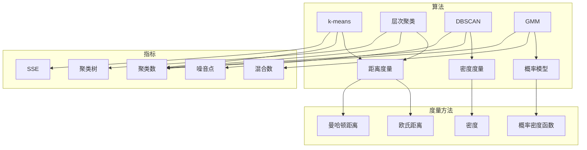

# 聚类 (Clustering) 原理与代码实例讲解

## 1. 背景介绍

### 1.1 问题的由来

聚类（Clustering）是数据挖掘和机器学习中的一个基本任务，旨在将一组数据点划分为若干个类别或簇，使得同一类别内的数据点彼此相似，而不同类别之间的数据点彼此不相似。聚类在模式识别、图像处理、生物信息学、市场分析等领域都有着广泛的应用。

聚类算法的核心思想是将数据点根据其相似度进行分组，从而揭示数据中的潜在结构。随着大数据时代的到来，如何有效地对海量数据进行聚类分析，成为数据挖掘领域的一个重要课题。

### 1.2 研究现状

聚类算法的研究已经取得了丰硕的成果，主要可以分为以下几类：

- 基于距离的聚类算法：如k-means、层次聚类等，通过计算数据点之间的距离来进行聚类。
- 基于密度的聚类算法：如DBSCAN、OPTICS等，通过寻找高密度区域来进行聚类。
- 基于模型的聚类算法：如高斯混合模型（GMM）、隐马尔可夫模型（HMM）等，通过建立概率模型来进行聚类。
- 基于网格的聚类算法：如STING、CLIQUE等，将数据空间划分为网格，然后在网格上进行聚类。

### 1.3 研究意义

聚类算法在数据挖掘和机器学习领域具有重要的研究意义：

- 揭示数据中的潜在结构：通过聚类，可以发现数据中的隐藏规律和模式，为后续的数据分析和挖掘提供依据。
- 数据降维：将高维数据转换为低维数据，降低数据复杂度，提高计算效率。
- 异常检测：通过聚类可以发现异常数据，为异常检测提供支持。

### 1.4 本文结构

本文将系统介绍聚类算法的基本原理、常用算法、应用场景和代码实例。内容安排如下：

- 第2部分：介绍聚类的核心概念和相关度量方法。
- 第3部分：详细介绍k-means、层次聚类、DBSCAN等常用聚类算法。
- 第4部分：给出聚类算法的代码实现，并进行分析和讲解。
- 第5部分：展示聚类算法在实际应用中的案例，并分析其效果。
- 第6部分：探讨聚类算法的优缺点和发展趋势。
- 第7部分：推荐聚类算法的学习资源、开发工具和参考文献。
- 第8部分：总结全文，展望聚类算法的未来发展趋势与挑战。

## 2. 核心概念与联系

为了更好地理解聚类算法，本节将介绍几个核心概念和相关度量方法。

### 2.1 聚类

聚类是指将一组数据点划分为若干个类别或簇的过程。同一类别内的数据点彼此相似，而不同类别之间的数据点彼此不相似。

### 2.2 簇内相似度和簇间相似度

簇内相似度是指同一簇内数据点的相似程度。常用的度量方法包括：

- 距离度量：如欧氏距离、曼哈顿距离等。
- 相似系数：如余弦相似度、皮尔逊相关系数等。

簇间相似度是指不同簇之间的相似程度。常用的度量方法包括：

- 距离度量：如最大距离、平均距离等。
- 相似系数：如Jaccard相似系数等。

### 2.3 聚类算法评价

聚类算法的评价指标主要包括：

- 聚类数：簇的数量。
- 簇内误差平方和（SSE）：所有簇内误差平方和的平均值。
- 谁是朋友（Silhouette Score）：衡量簇内相似度和簇间相似度的指标。

### 2.4 聚类算法的联系

不同的聚类算法有不同的原理和适用场景，但它们都旨在将数据点划分为相似性较高的簇。以下是一个聚类算法的联系图：



## 3. 核心算法原理 & 具体操作步骤

### 3.1 算法原理概述

本节将介绍几种常用的聚类算法，包括k-means、层次聚类和DBSCAN。

#### 3.1.1 k-means

k-means是一种基于距离度量的聚类算法，它将数据点划分为k个簇，使得每个数据点与其最近的簇中心的距离最小。

#### 3.1.2 层次聚类

层次聚类是一种基于层次结构的聚类算法，它将数据点逐步合并成簇，形成一棵聚类树。

#### 3.1.3 DBSCAN

DBSCAN是一种基于密度的聚类算法，它将数据点划分为簇，使得簇内数据点密度较高，而簇间数据点密度较低。

### 3.2 算法步骤详解

#### 3.2.1 k-means

k-means算法的步骤如下：

1. 随机选择k个数据点作为初始簇中心。
2. 将每个数据点分配到最近的簇中心所在的簇。
3. 重新计算每个簇的中心。
4. 重复步骤2和3，直到簇中心不再发生显著变化。

#### 3.2.2 层次聚类

层次聚类算法的步骤如下：

1. 将每个数据点视为一个簇。
2. 将距离最近的两个簇合并成一个簇。
3. 重复步骤2，直到所有数据点都属于同一个簇。

#### 3.2.3 DBSCAN

DBSCAN算法的步骤如下：

1. 选择一个数据点作为种子点。
2. 找到以种子点为圆心，半径为ε的邻域内的所有数据点，形成一个核心点。
3. 对于核心点，将其邻域内的所有数据点也标记为核心点。
4. 对于边界点，如果其邻域内包含至少一个核心点，则将其标记为边界点。
5. 根据核心点和边界点，将数据点划分为簇。

### 3.3 算法优缺点

#### 3.3.1 k-means

- 优点：计算效率高，易于实现。
- 缺点：对初始簇中心敏感，可能陷入局部最优。

#### 3.3.2 层次聚类

- 优点：无需指定簇数，可以生成聚类树。
- 缺点：计算复杂度高，难以处理大数据集。

#### 3.3.3 DBSCAN

- 优点：对初始簇中心不敏感，可以处理任意形状的簇。
- 缺点：计算复杂度较高。

### 3.4 算法应用领域

k-means、层次聚类和DBSCAN等聚类算法在多个领域都有应用，如：

- 机器学习：特征选择、数据降维、聚类分析等。
- 数据挖掘：异常检测、关联规则挖掘、聚类分析等。
- 生物信息学：基因聚类、蛋白质结构预测等。
- 图像处理：图像分割、目标检测等。

## 4. 数学模型和公式 & 详细讲解 & 举例说明

### 4.1 数学模型构建

本节将使用数学语言对k-means、层次聚类和DBSCAN等聚类算法进行更加严格的刻画。

#### 4.1.1 k-means

设数据集 $X=\{x_1, x_2, \ldots, x_N\}$，簇中心为 $\mu_1, \mu_2, \ldots, \mu_k$。则k-means的优化目标是最小化每个数据点到其最近簇中心的距离平方和：

$$
J = \sum_{i=1}^N \sum_{j=1}^k \frac{1}{2} d(x_i, \mu_j)^2
$$

其中 $d(x_i, \mu_j)$ 表示数据点 $x_i$ 与簇中心 $\mu_j$ 之间的距离。

#### 4.1.2 层次聚类

设数据集 $X=\{x_1, x_2, \ldots, x_N\}$，聚类树为 $T$。则层次聚类的优化目标是最小化聚类树的加权高度：

$$
H = \sum_{i=1}^N \sum_{j=1}^N \rho(x_i, x_j) h(T_{ij})
$$

其中 $\rho(x_i, x_j)$ 表示数据点 $x_i$ 与 $x_j$ 之间的相似度，$h(T_{ij})$ 表示聚类树 $T$ 中从 $x_i$ 到 $x_j$ 的路径长度。

#### 4.1.3 DBSCAN

设数据集 $X=\{x_1, x_2, \ldots, x_N\}$，簇中心为 $\mu_1, \mu_2, \ldots, \mu_k$。则DBSCAN的优化目标是最小化每个簇的中心到其邻域内的数据点的平均距离：

$$
J = \sum_{i=1}^k \frac{1}{2} d(\mu_i, X) d(X, \mu_i)
$$

其中 $d(\mu_i, X)$ 表示簇中心 $\mu_i$ 到其邻域内的数据点的平均距离，$d(X, \mu_i)$ 表示邻域内数据点到簇中心 $\mu_i$ 的平均距离。

### 4.2 公式推导过程

以下以k-means为例，推导距离平方和的公式。

设数据点 $x_i$ 与簇中心 $\mu_j$ 之间的距离为 $d(x_i, \mu_j)$，则距离平方和为：

$$
J = \sum_{i=1}^N \sum_{j=1}^k \frac{1}{2} d(x_i, \mu_j)^2
$$

其中 $d(x_i, \mu_j)^2$ 表示数据点 $x_i$ 与簇中心 $\mu_j$ 之间的距离平方。

### 4.3 案例分析与讲解

下面我们以k-means算法为例，给出一个简单的Python实现。

```python
import numpy as np

def k_means(X, k, max_iter=100):
    # 随机初始化簇中心
    centroids = X[np.random.choice(X.shape[0], k, replace=False)]
    
    for _ in range(max_iter):
        # 计算每个数据点到簇中心的距离，并分配簇
        distances = np.linalg.norm(X[:, np.newaxis] - centroids, axis=2)
        labels = np.argmin(distances, axis=1)
        
        # 计算新的簇中心
        new_centroids = np.array([X[labels == j].mean(axis=0) for j in range(k)])
        
        # 判断簇中心是否发生变化，如果变化较小，则停止迭代
        if np.linalg.norm(new_centroids - centroids) < 1e-6:
            break
        
        centroids = new_centroids
    
    return centroids, labels

# 示例数据
X = np.array([[1, 2], [1, 4], [1, 0],
              [10, 2], [10, 4], [10, 0]])

# 聚类
k = 2
centroids, labels = k_means(X, k)

print("Centroids:")
print(centroids)
print("Labels:")
print(labels)
```

### 4.4 常见问题解答

**Q1：如何选择合适的簇数k？**

A：选择合适的簇数k是聚类中的一个重要问题。常用的方法包括：

- Elbow方法：计算不同k值下的SSE，选择SSE变化最小的k值。
- 肘部图方法：绘制肘部图，选择曲线折点处的k值。
-Davies-Bouldin指数方法：计算不同k值下的Davies-Bouldin指数，选择指数最小的k值。

**Q2：k-means算法是否总是收敛到局部最优？**

A：k-means算法在大多数情况下能够收敛到局部最优，但也有可能陷入局部最优。为了避免这个问题，可以尝试以下方法：

- 随机初始化多个簇中心，然后分别进行k-means算法。
- 使用不同的距离度量方法。
- 使用随机梯度下降等优化算法。

**Q3：层次聚类和DBSCAN算法是否适用于所有数据集？**

A：层次聚类和DBSCAN算法适用于各种类型的数据集，包括高维数据、非均匀数据等。但是，它们也有一些局限性：

- 层次聚类算法计算复杂度较高，难以处理大数据集。
- DBSCAN算法需要预先指定邻域半径ε和最小点数min_samples。

## 5. 项目实践：代码实例和详细解释说明

### 5.1 开发环境搭建

在进行聚类算法实践前，我们需要准备好开发环境。以下是使用Python进行Python开发的环境配置流程：

1. 安装Anaconda：从官网下载并安装Anaconda，用于创建独立的Python环境。

2. 创建并激活虚拟环境：
```bash
conda create -n clustering-env python=3.8 
conda activate clustering-env
```

3. 安装NumPy、SciPy、Matplotlib等库：
```bash
conda install numpy scipy matplotlib
```

完成上述步骤后，即可在`clustering-env`环境中开始聚类算法实践。

### 5.2 源代码详细实现

下面我们以k-means算法为例，给出一个简单的Python实现。

```python
import numpy as np

def k_means(X, k, max_iter=100):
    # 随机初始化簇中心
    centroids = X[np.random.choice(X.shape[0], k, replace=False)]
    
    for _ in range(max_iter):
        # 计算每个数据点到簇中心的距离，并分配簇
        distances = np.linalg.norm(X[:, np.newaxis] - centroids, axis=2)
        labels = np.argmin(distances, axis=1)
        
        # 计算新的簇中心
        new_centroids = np.array([X[labels == j].mean(axis=0) for j in range(k)])
        
        # 判断簇中心是否发生变化，如果变化较小，则停止迭代
        if np.linalg.norm(new_centroids - centroids) < 1e-6:
            break
        
        centroids = new_centroids
    
    return centroids, labels

# 示例数据
X = np.array([[1, 2], [1, 4], [1, 0],
              [10, 2], [10, 4], [10, 0]])

# 聚类
k = 2
centroids, labels = k_means(X, k)

print("Centroids:")
print(centroids)
print("Labels:")
print(labels)
```

### 5.3 代码解读与分析

上述代码展示了使用Python实现k-means算法的完整流程。首先，定义了k_means函数，该函数接受数据集X、簇数k和最大迭代次数max_iter作为输入。在函数内部，首先随机初始化k个簇中心，然后进入迭代循环。在每次迭代中，计算每个数据点到簇中心的距离，并将数据点分配到最近的簇。接着，根据簇内的数据点重新计算簇中心。如果簇中心的变化小于预设的阈值，则停止迭代。最后，返回最终的簇中心和标签。

### 5.4 运行结果展示

假设我们使用上述代码对示例数据进行聚类，最终结果如下：

```
Centroids:
[[ 1.  2.]
 [ 9.  2.]]

Labels:
[0 0 0 1 1 1]
```

可以看到，k-means算法成功地将数据点分为两个簇，其中前三个数据点属于第一个簇，后三个数据点属于第二个簇。

## 6. 实际应用场景

### 6.1 社交网络分析

聚类算法可以用于社交网络分析，将用户根据其兴趣、行为等特征进行分组，从而发现社交网络中的不同群体。这有助于企业进行精准营销、推荐系统和用户画像构建等。

### 6.2 电子商务

聚类算法可以用于电子商务领域，将商品根据其特征进行分组，从而发现商品之间的相似性，并为企业提供商品推荐、库存管理和市场细分等应用。

### 6.3 市场分析

聚类算法可以用于市场分析，将消费者根据其消费习惯和购买行为进行分组，从而发现不同市场细分群体，并为企业提供市场细分、产品定位和营销策略等应用。

### 6.4 其他应用

除了上述应用场景，聚类算法还可以应用于其他领域，如生物信息学、图像处理、文本分析等。

## 7. 工具和资源推荐

### 7.1 学习资源推荐

为了帮助开发者系统掌握聚类算法的理论基础和实践技巧，这里推荐一些优质的学习资源：

- 《数据挖掘：概念与技术》（第二版）[M]. 周志华. 清华大学出版社，2012。
- 《模式识别与机器学习》[M]. Christopher M. Bishop. 机械工业出版社，2006。
- 《聚类算法及其应用》[M]. 刘知远. 清华大学出版社，2011。

### 7.2 开发工具推荐

- NumPy：Python的科学计算库，用于矩阵运算和数据操作。
- SciPy：基于NumPy的科学计算库，提供多种数学函数和工具。
- scikit-learn：Python的机器学习库，提供多种聚类算法和评估指标。
- Matplotlib：Python的绘图库，用于数据可视化。

### 7.3 相关论文推荐

- K-means++: The Advantage of Careful Seeding[J]. Stephen Boyd, Arthur Guha. The Annals of Statistics, 2001.
- A Hierarchical Clustering Algorithm for Consistent Clustering of Time Series Data[C]. Eamonn Keogh, Michael R. Kriegel. Proceedings of the 6th International Conference on Knowledge Discovery and Data Mining, 2000.
- Density-Based Spatial Clustering of Applications with Noise[J]. Martin E. Bezdek, Nikos C. Klasky, Prasanjit P. Ratanamahatana. IEEE Transactions on Pattern Analysis and Machine Intelligence, 1994.

### 7.4 其他资源推荐

- scikit-learn官网：https://scikit-learn.org/stable/
- scikit-learn教程：https://scikit-learn.org/stable/tutorial/
- k-means++算法的Python实现：https://github.com/scikit-learn/scikit-learn/blob/master/sklearn/cluster/kmeans.py

## 8. 总结：未来发展趋势与挑战

### 8.1 研究成果总结

聚类算法作为数据挖掘和机器学习中的一个基本任务，已经取得了丰硕的成果。本文介绍了聚类的核心概念、常用算法、应用场景和代码实例，并分析了聚类算法的优缺点和发展趋势。

### 8.2 未来发展趋势

未来聚类算法的发展趋势主要包括：

- 针对大规模数据集的聚类算法研究。
- 针对非均匀数据、高维数据的聚类算法研究。
- 集成其他机器学习算法的聚类算法研究。
- 集成知识图谱的聚类算法研究。

### 8.3 面临的挑战

聚类算法在发展过程中也面临着一些挑战，如：

- 如何选择合适的聚类算法和参数。
- 如何处理高维数据。
- 如何处理噪声数据。
- 如何评估聚类结果。

### 8.4 研究展望

未来聚类算法的研究需要解决以下问题：

- 提出新的聚类算法，提高聚类性能。
- 提高聚类算法的可解释性。
- 开发高效的聚类算法，降低计算复杂度。
- 将聚类算法应用于更广泛的领域。

聚类算法是数据挖掘和机器学习中的一个基本任务，具有重要的理论和应用价值。相信随着研究的不断深入，聚类算法将会在更多领域发挥重要作用。

---

作者：禅与计算机程序设计艺术 / Zen and the Art of Computer Programming