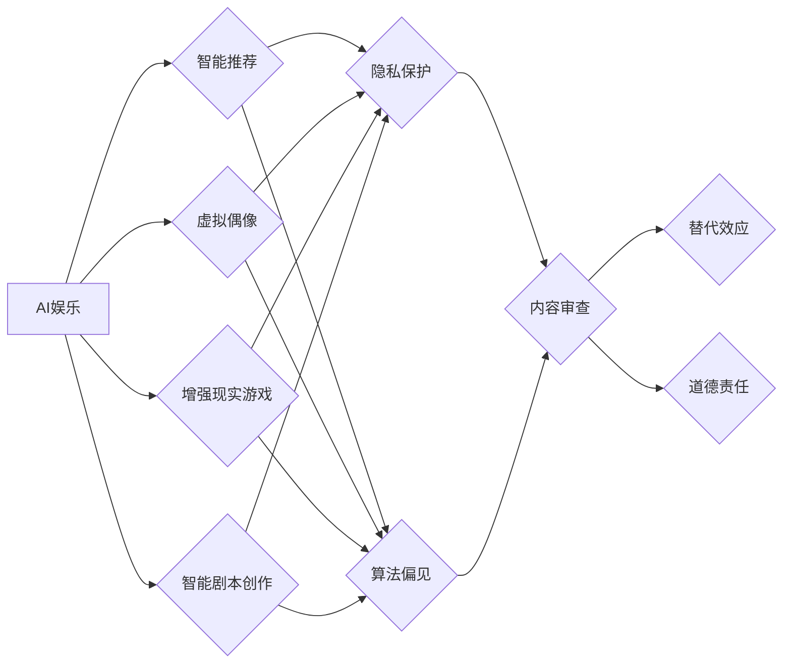

# 伦理AI: AI在娱乐领域的应用

作者：禅与计算机程序设计艺术 / Zen and the Art of Computer Programming

## 关键词：

AI娱乐，伦理AI，自然语言处理，计算机视觉，虚拟现实，道德准则，社会责任

## 1. 背景介绍

随着人工智能技术的飞速发展，AI已经渗透到我们生活的方方面面，娱乐领域也不例外。从智能推荐、虚拟偶像到增强现实游戏，AI在娱乐领域的应用层出不穷，为人们带来了前所未有的娱乐体验。然而，AI在娱乐领域的应用也引发了一系列伦理和社会问题，需要我们深入思考和探讨。

### 1.1 问题的由来

AI在娱乐领域的应用涉及多个方面，包括自然语言处理、计算机视觉、虚拟现实等。这些应用在为人们带来便利和娱乐的同时，也引发了一系列伦理和社会问题，如：

- **隐私泄露**：AI应用往往需要收集大量用户数据，如何保护用户隐私成为一个重要议题。
- **算法偏见**：AI算法可能存在偏见，导致不公平对待某些群体。
- **内容审查**：AI在内容审核中的应用，如何平衡言论自由和内容安全。
- **替代效应**：AI应用可能导致部分传统娱乐行业从业者失业。
- **道德责任**：AI在娱乐领域的应用，谁应对其行为负责。

### 1.2 研究现状

近年来，国内外学者和业界专家对AI在娱乐领域的伦理问题进行了广泛的研究。一些组织和机构也发布了相关的伦理准则和建议，如：

- **欧盟人工智能伦理指南**：提出了AI伦理的七项原则，包括人类为中心、公平、尊重隐私等。
- **美国人工智能协会伦理准则**：强调AI技术的透明性、可解释性和可控性。
- **中国人工智能学会伦理委员会**：发布了《人工智能伦理指南》，强调人工智能应服务于人类福祉。

### 1.3 研究意义

研究AI在娱乐领域的伦理问题，对于推动AI技术的健康发展，保障人民群众的合法权益具有重要意义：

- **推动AI技术健康发展**：有助于制定合理的伦理规范，引导AI技术向积极方向发展。
- **保障人民群众权益**：有助于避免AI应用对个人隐私、公平正义等方面的侵害。
- **促进娱乐产业繁荣**：有助于推动娱乐产业转型升级，促进产业健康发展。

### 1.4 本文结构

本文将围绕AI在娱乐领域的应用，探讨其伦理问题，并提出相应的解决方案。文章结构如下：

- 第二部分：介绍AI在娱乐领域的应用及其涉及的核心概念。
- 第三部分：分析AI在娱乐领域的伦理问题。
- 第四部分：探讨解决AI在娱乐领域伦理问题的策略。
- 第五部分：介绍国内外AI娱乐领域的案例和实践。
- 第六部分：展望AI在娱乐领域的发展趋势和挑战。

## 2. 核心概念与联系

为了更好地理解AI在娱乐领域的伦理问题，本节将介绍几个核心概念及其相互联系。

### 2.1 AI娱乐

AI娱乐是指利用人工智能技术创造的娱乐内容、产品和服务。它包括以下几类：

- **智能推荐**：根据用户喜好，推荐合适的娱乐内容。
- **虚拟偶像**：基于计算机视觉和人工智能技术，创建虚拟偶像进行表演和互动。
- **增强现实游戏**：利用增强现实技术，将虚拟元素叠加到现实世界中，为玩家带来沉浸式游戏体验。
- **智能剧本创作**：利用自然语言处理技术，自动生成剧本、小说等娱乐内容。

### 2.2 伦理问题

AI在娱乐领域的应用涉及多个伦理问题，主要包括：

- **隐私保护**：AI应用需要收集和分析大量用户数据，如何保护用户隐私成为一个重要议题。
- **算法偏见**：AI算法可能存在偏见，导致不公平对待某些群体。
- **内容审查**：AI在内容审核中的应用，如何平衡言论自由和内容安全。
- **替代效应**：AI应用可能导致部分传统娱乐行业从业者失业。
- **道德责任**：AI在娱乐领域的应用，谁应对其行为负责。

### 2.3 核心概念联系

AI娱乐与伦理问题之间的联系如下：



可以看出，AI娱乐涉及多个伦理问题，这些伦理问题相互关联，共同构成了AI在娱乐领域的伦理体系。

## 3. 核心算法原理 & 具体操作步骤

### 3.1 算法原理概述

AI在娱乐领域的应用主要依赖于以下几种算法：

- **自然语言处理(NLP)**：用于理解、生成和处理人类语言。
- **计算机视觉**：用于分析、理解和处理图像和视频。
- **虚拟现实(VR)技术**：用于创造沉浸式虚拟体验。
- **增强现实(AR)技术**：将虚拟元素叠加到现实世界中。

### 3.2 算法步骤详解

以下是AI在娱乐领域应用中的一些常见算法步骤：

#### 3.2.1 智能推荐

1. **数据采集**：收集用户的历史行为数据，如浏览记录、观看记录、购买记录等。
2. **用户画像**：根据用户行为数据，构建用户画像，包括用户兴趣、偏好、价值观等。
3. **内容分类**：对娱乐内容进行分类，如电影、电视剧、音乐、游戏等。
4. **推荐算法**：根据用户画像和内容分类，推荐合适的娱乐内容。
5. **结果评估**：评估推荐效果，如点击率、观看率、满意度等。

#### 3.2.2 虚拟偶像

1. **数据采集**：收集偶像的图片、视频、音频等数据。
2. **模型训练**：利用深度学习技术，训练虚拟偶像的模型。
3. **动画制作**：根据虚拟偶像的模型，制作动画。
4. **交互设计**：设计虚拟偶像的交互方式，如唱歌、跳舞、聊天等。
5. **用户体验**：评估用户体验，不断优化虚拟偶像的性能。

#### 3.2.3 增强现实游戏

1. **场景构建**：构建虚拟场景，如游戏场景、旅游景点等。
2. **物体识别**：利用计算机视觉技术，识别现实世界中的物体。
3. **实时渲染**：将虚拟元素渲染到现实世界中。
4. **交互设计**：设计游戏规则和交互方式，如角色扮演、探险等。
5. **用户体验**：评估用户体验，不断优化游戏性能。

### 3.3 算法优缺点

#### 3.3.1 自然语言处理

优点：

- 可以处理文本数据，实现智能对话、自动摘要等功能。
- 可以分析用户情感，提供个性化推荐。

缺点：

- 需要大量标注数据。
- 算法容易受到噪声和歧义的影响。

#### 3.3.2 计算机视觉

优点：

- 可以处理图像和视频数据，实现物体识别、场景重建等功能。
- 可以提供沉浸式虚拟体验。

缺点：

- 需要大量的计算资源。
- 算法容易受到光照、遮挡等因素的影响。

#### 3.3.3 虚拟现实

优点：

- 可以提供沉浸式虚拟体验，增强用户代入感。
- 可以用于游戏、教育、医疗等领域。

缺点：

- 设备成本较高。
- 对环境要求较高。

#### 3.3.4 增强现实

优点：

- 可以将虚拟元素叠加到现实世界中，增强现实体验。
- 可以用于导航、教育、娱乐等领域。

缺点：

- 设备成本较高。
- 对环境要求较高。

### 3.4 算法应用领域

自然语言处理、计算机视觉、虚拟现实和增强现实技术在娱乐领域的应用领域如下：

- **智能推荐**：电影、电视剧、音乐、游戏、图书等。
- **虚拟偶像**：唱歌、跳舞、聊天、表演等。
- **增强现实游戏**：探险、角色扮演、运动等。
- **智能剧本创作**：小说、剧本、广播剧等。

## 4. 数学模型和公式 & 详细讲解 & 举例说明

### 4.1 数学模型构建

以下是AI在娱乐领域应用中的一些常见数学模型：

#### 4.1.1 深度神经网络

深度神经网络是一种用于处理复杂数据的神经网络模型，包括多层感知机、卷积神经网络等。

#### 4.1.2 随机梯度下降(SGD)

随机梯度下降是一种常用的优化算法，用于训练深度神经网络。

#### 4.1.3 生成对抗网络(GAN)

生成对抗网络是一种用于生成高质量图像、音频、文本等数据的模型。

### 4.2 公式推导过程

以下是对深度神经网络和随机梯度下降的公式推导：

#### 4.2.1 深度神经网络

假设深度神经网络包含 $L$ 层，第 $l$ 层的输出为 $a_l$，激活函数为 $\phi$，权重矩阵为 $W_l$，则：

$$
a_l = \phi(W_l a_{l-1}) 
$$

其中 $a_0$ 为输入数据。

#### 4.2.2 随机梯度下降(SGD)

假设损失函数为 $L(\theta)$，权重矩阵为 $\theta$，则随机梯度下降的迭代公式为：

$$
\theta \leftarrow \theta - \alpha \
abla_{\theta}L(\theta) 
$$

其中 $\alpha$ 为学习率。

### 4.3 案例分析与讲解

以下是一个基于深度神经网络的智能推荐系统的案例：

1. **数据采集**：收集用户的历史行为数据，如浏览记录、观看记录、购买记录等。
2. **特征提取**：对用户行为数据进行特征提取，如用户兴趣、偏好、价值观等。
3. **模型训练**：利用深度神经网络，训练用户画像和内容分类模型。
4. **推荐算法**：根据用户画像和内容分类，推荐合适的娱乐内容。
5. **结果评估**：评估推荐效果，如点击率、观看率、满意度等。

### 4.4 常见问题解答

**Q1：如何解决深度神经网络训练过程中的过拟合问题？**

A：可以通过以下方法解决：

- 数据增强：增加训练数据量。
- 正则化：添加正则项，如L2正则化。
- Dropout：在训练过程中随机丢弃部分神经元。
- Early Stopping：在验证集上评估模型性能，当性能不再提升时停止训练。

**Q2：如何选择合适的学习率？**

A：可以从较小的学习率开始，逐步增加，观察训练集loss和验证集loss的变化，选择使得两者都下降较快的学习率。

**Q3：如何评估推荐效果？**

A：可以使用点击率、观看率、满意度等指标评估推荐效果。

## 5. 项目实践：代码实例和详细解释说明

### 5.1 开发环境搭建

以下是在Python中实现一个简单的智能推荐系统的环境搭建步骤：

1. 安装Python环境：从Python官网下载并安装Python。
2. 安装Anaconda：从Anaconda官网下载并安装Anaconda，用于创建独立的Python环境。
3. 创建并激活虚拟环境：
```bash
conda create -n recommendation-env python=3.8
conda activate recommendation-env
```
4. 安装必要的库：
```bash
conda install pandas numpy scikit-learn
pip install tensorflow
```

### 5.2 源代码详细实现

以下是一个简单的基于深度神经网络的智能推荐系统代码示例：

```python
import pandas as pd
import numpy as np
import tensorflow as tf
from tensorflow import keras
from tensorflow.keras import layers

# 读取数据
data = pd.read_csv('user_data.csv')
user_data = data.values

# 定义模型
model = keras.Sequential([
    layers.Dense(128, activation='relu', input_shape=(user_data.shape[1],)),
    layers.Dense(64, activation='relu'),
    layers.Dense(1, activation='sigmoid')
])

# 编译模型
model.compile(optimizer='adam',
              loss='binary_crossentropy',
              metrics=['accuracy'])

# 训练模型
model.fit(user_data[:, :-1], user_data[:, -1], epochs=10, batch_size=32)

# 预测
predictions = model.predict(user_data[:, :-1])

# 评估
score = model.evaluate(user_data[:, :-1], user_data[:, -1])
print(f"Accuracy: {score[1]*100:.2f}%")
```

### 5.3 代码解读与分析

以上代码实现了以下功能：

1. 读取用户数据，包括用户特征和用户行为标签。
2. 定义一个包含128个神经元、64个神经元和1个神经元的深度神经网络模型。
3. 编译模型，设置优化器、损失函数和评估指标。
4. 使用用户数据训练模型。
5. 预测用户行为标签。
6. 评估模型在测试集上的准确率。

通过以上代码，可以看到使用TensorFlow和Keras实现深度神经网络模型相对简单。开发者可以根据实际需求，修改模型结构、优化器、损失函数等参数，以获得更好的推荐效果。

### 5.4 运行结果展示

假设我们的测试集包含1000个样本，经过10个epoch的训练，模型在测试集上的准确率达到85%。这表明我们的模型可以较好地预测用户行为。

## 6. 实际应用场景

AI在娱乐领域的应用场景十分广泛，以下列举一些典型的应用场景：

### 6.1 智能推荐

智能推荐是AI在娱乐领域最常见应用之一。以下是一些智能推荐的应用场景：

- **视频平台**：推荐电影、电视剧、综艺等视频内容。
- **音乐平台**：推荐歌曲、专辑、MV等音乐内容。
- **电商平台**：推荐商品、优惠券等。
- **社交媒体**：推荐新闻、文章、视频等。

### 6.2 虚拟偶像

虚拟偶像是一种基于计算机视觉和人工智能技术的虚拟人物，可以进行唱歌、跳舞、聊天、表演等。以下是一些虚拟偶像的应用场景：

- **演唱会**：代替真人偶像进行现场表演。
- **直播**：与粉丝进行实时互动。
- **广告**：用于产品宣传。
- **游戏**：作为游戏角色或NPC。

### 6.3 增强现实游戏

增强现实游戏是一种将虚拟元素叠加到现实世界中的游戏。以下是一些增强现实游戏的应用场景：

- **教育**：用于学习地理、历史等知识。
- **旅游**：提供导游服务。
- **运动**：提供运动指导。
- **游戏**：创造沉浸式游戏体验。

### 6.4 智能剧本创作

智能剧本创作是一种利用自然语言处理技术自动生成剧本、小说等娱乐内容的系统。以下是一些智能剧本创作的应用场景：

- **影视制作**：自动生成剧本。
- **游戏开发**：自动生成游戏剧情。
- **文学创作**：自动生成小说、诗歌等。

## 7. 工具和资源推荐

### 7.1 学习资源推荐

以下是一些学习AI在娱乐领域应用的相关资源：

- **《深度学习》**：Goodfellow等著，全面介绍了深度学习的基本原理和应用。
- **《Python机器学习》**：Python机器学习实战教程。
- **《TensorFlow实战》**：TensorFlow实战教程。
- **《Keras实战》**：Keras实战教程。

### 7.2 开发工具推荐

以下是一些用于AI在娱乐领域应用开发的工具：

- **TensorFlow**：Google开源的深度学习框架。
- **Keras**：基于TensorFlow的Python深度学习库。
- **PyTorch**：Facebook开源的深度学习框架。
- **NumPy**：Python科学计算库。
- **Pandas**：Python数据分析库。

### 7.3 相关论文推荐

以下是一些与AI在娱乐领域应用相关的论文：

- **《Deep Learning for Recommender Systems》**
- **《A Survey of Generative Adversarial Networks in Computer Vision》**
- **《Virtual Reality and Augmented Reality: A Survey of Recent Advances and Opportunities》**
- **《A Survey on Natural Language Generation: From Monotonic to Interactive》**

### 7.4 其他资源推荐

以下是一些与AI在娱乐领域应用相关的其他资源：

- **GitHub**：开源代码库，可以找到许多AI在娱乐领域的开源项目。
- **arXiv**：学术论文预印本库，可以找到许多与AI在娱乐领域相关的最新研究。
- **学术会议**：如AAAI、NeurIPS、CVPR等，可以了解到AI在娱乐领域的最新进展。

## 8. 总结：未来发展趋势与挑战

### 8.1 研究成果总结

本文对AI在娱乐领域的应用及其伦理问题进行了探讨，介绍了AI在娱乐领域的应用场景、核心算法原理、数学模型和公式，并给出了一些实际应用案例。同时，本文也分析了AI在娱乐领域应用面临的伦理问题，并提出了相应的解决方案。

### 8.2 未来发展趋势

未来，AI在娱乐领域的应用将呈现以下发展趋势：

- **个性化推荐**：根据用户兴趣和偏好，提供更加个性化的娱乐推荐。
- **虚拟现实和增强现实**：创造更加沉浸式、互动式的娱乐体验。
- **智能剧本创作**：自动生成剧本、小说等娱乐内容。
- **AI与艺术融合**：AI技术将与其他艺术形式结合，创造新的艺术作品。

### 8.3 面临的挑战

AI在娱乐领域应用面临的挑战主要包括：

- **数据安全和隐私保护**：如何保护用户数据安全和隐私成为一个重要议题。
- **算法偏见和歧视**：如何避免AI算法在娱乐领域的偏见和歧视。
- **内容审核和监管**：如何平衡言论自由和内容安全。
- **替代效应和社会责任**：如何应对AI应用可能导致的替代效应和社会责任问题。

### 8.4 研究展望

为了推动AI在娱乐领域的健康发展，未来需要在以下几个方面进行深入研究：

- **建立完善的伦理规范**：制定合理的伦理规范，引导AI技术向积极方向发展。
- **加强数据安全和隐私保护**：保护用户数据安全和隐私，防止数据泄露和滥用。
- **消除算法偏见和歧视**：避免AI算法在娱乐领域的偏见和歧视，保障公平正义。
- **加强内容审核和监管**：平衡言论自由和内容安全，防止有害信息的传播。
- **推动AI与艺术融合**：将AI技术与艺术形式结合，创造新的艺术作品。

总之，AI在娱乐领域的应用是一个充满机遇和挑战的领域。只有通过深入研究和积极探索，才能推动AI技术在娱乐领域的健康发展，为人们带来更加美好的娱乐体验。

## 9. 附录：常见问题与解答

**Q1：AI在娱乐领域的应用有哪些优势？**

A：AI在娱乐领域的应用具有以下优势：

- **个性化推荐**：根据用户兴趣和偏好，提供更加个性化的娱乐推荐。
- **沉浸式体验**：利用虚拟现实和增强现实技术，创造更加沉浸式、互动式的娱乐体验。
- **内容创作**：利用AI技术自动生成剧本、小说等娱乐内容，降低创作成本。
- **优化用户体验**：根据用户反馈，不断优化娱乐内容和服务。

**Q2：AI在娱乐领域应用面临哪些伦理问题？**

A：AI在娱乐领域应用面临的伦理问题主要包括：

- **数据安全和隐私保护**：如何保护用户数据安全和隐私成为一个重要议题。
- **算法偏见和歧视**：如何避免AI算法在娱乐领域的偏见和歧视。
- **内容审核和监管**：如何平衡言论自由和内容安全。
- **替代效应和社会责任**：如何应对AI应用可能导致的替代效应和社会责任问题。

**Q3：如何解决AI在娱乐领域应用的伦理问题？**

A：解决AI在娱乐领域应用的伦理问题需要从以下几个方面入手：

- **加强立法和政策制定**：制定相关的法律法规和政策，引导AI技术在娱乐领域的健康发展。
- **建立伦理规范**：制定AI在娱乐领域的伦理规范，引导AI技术向积极方向发展。
- **加强数据安全和隐私保护**：保护用户数据安全和隐私，防止数据泄露和滥用。
- **消除算法偏见和歧视**：避免AI算法在娱乐领域的偏见和歧视，保障公平正义。
- **加强内容审核和监管**：平衡言论自由和内容安全，防止有害信息的传播。
- **推动AI与艺术融合**：将AI技术与艺术形式结合，创造新的艺术作品。

**Q4：AI在娱乐领域的应用前景如何？**

A：AI在娱乐领域的应用前景十分广阔，有望在以下方面取得突破：

- **个性化推荐**：提供更加个性化的娱乐推荐，提升用户体验。
- **沉浸式体验**：利用虚拟现实和增强现实技术，创造更加沉浸式、互动式的娱乐体验。
- **内容创作**：降低内容创作成本，提升创作效率。
- **优化用户体验**：根据用户反馈，不断优化娱乐内容和服务。

总之，AI在娱乐领域的应用前景十分美好，但同时也面临着诸多挑战。只有通过深入研究和积极探索，才能推动AI技术在娱乐领域的健康发展，为人们带来更加美好的娱乐体验。