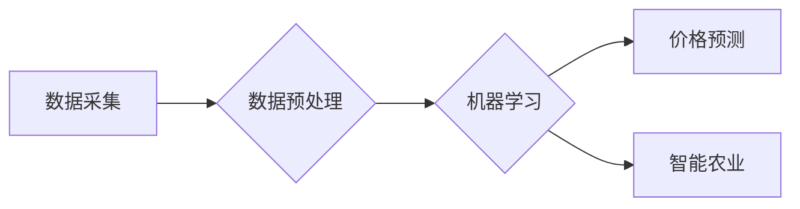

# 农产品价格采集与挖掘应用

> 关键词：农产品价格，数据采集，数据挖掘，机器学习，价格预测，智能农业

## 1. 背景介绍
### 1.1 问题的由来

随着我国农业现代化进程的加快，农产品价格波动对农业生产、农民收益及社会稳定都具有重要影响。准确预测农产品价格，为农民、企业和政府提供科学的决策依据，已成为当前农业发展的重要课题。

传统农产品价格预测方法主要依靠专家经验，存在主观性强、效率低、预测精度有限等缺点。随着大数据、人工智能技术的快速发展，利用机器学习等方法对农产品价格进行数据采集、分析和预测，成为解决这一问题的关键。

### 1.2 研究现状

近年来，国内外学者在农产品价格预测领域取得了丰硕的研究成果。主要研究方向包括：

1. **数据采集**：通过爬虫技术、移动端APP、物联网等技术，从各类电商平台、新闻媒体、农产品批发市场等渠道采集农产品价格数据。
2. **数据预处理**：对采集到的原始数据进行清洗、去重、特征提取等预处理操作，提高数据质量。
3. **机器学习模型**：利用回归、分类、聚类等机器学习算法，对农产品价格进行预测。

### 1.3 研究意义

农产品价格预测对农业产业链的各个环节具有重要意义：

1. **指导农业生产**：准确预测农产品价格，帮助农民合理安排种植结构，提高农业收益。
2. **支持企业决策**：为农产品加工、流通企业提供价格预测信息，降低市场风险，提高经营效益。
3. **服务政府调控**：为政府制定农业政策、调控农产品市场提供数据支持。

### 1.4 本文结构

本文将系统地介绍农产品价格采集与挖掘应用的相关技术，包括数据采集、数据预处理、机器学习模型选择、应用场景及未来展望等。内容安排如下：

- 第2部分：介绍农产品价格采集与挖掘应用的核心概念。
- 第3部分：详细讲解数据采集、数据预处理和机器学习模型选择等关键技术。
- 第4部分：分析农产品价格预测的常用机器学习模型，并结合实例讲解。
- 第5部分：给出农产品价格预测的代码实现示例，并对关键代码进行解读。
- 第6部分：探讨农产品价格预测在实际中的应用场景及案例。
- 第7部分：推荐相关学习资源、开发工具和参考文献。
- 第8部分：总结全文，展望农产品价格预测技术的未来发展趋势与挑战。
- 第9部分：附录，列出常见问题与解答。

## 2. 核心概念与联系

农产品价格采集与挖掘应用涉及以下核心概念：

- **数据采集**：从各类渠道收集农产品价格数据的过程，如电商平台、新闻媒体、物联网设备等。
- **数据预处理**：对采集到的原始数据进行清洗、去重、特征提取等操作，提高数据质量。
- **机器学习**：利用计算机算法从数据中学习规律，并用于预测或分类。
- **价格预测**：根据历史价格数据和特征，预测未来一段时间内的农产品价格。
- **智能农业**：将物联网、大数据、人工智能等技术与农业相结合，实现农业生产、管理、销售的智能化。

这些概念之间的关系如下：



## 3. 核心算法原理 & 具体操作步骤
### 3.1 算法原理概述

农产品价格预测的核心是机器学习模型。常见的机器学习模型包括线性回归、支持向量机、决策树、随机森林、神经网络等。

### 3.2 算法步骤详解

农产品价格预测的算法步骤如下：

1. **数据采集**：从各类渠道收集农产品价格数据，如电商平台、新闻媒体、物联网设备等。
2. **数据预处理**：对采集到的原始数据进行清洗、去重、特征提取等操作。
3. **模型选择**：根据数据特征和预测目标选择合适的机器学习模型。
4. **模型训练**：使用历史数据训练模型，找出数据中的规律。
5. **模型评估**：使用测试数据评估模型的预测精度，调整模型参数。
6. **模型部署**：将训练好的模型部署到实际应用中，进行农产品价格预测。

### 3.3 算法优缺点

以下是几种常见机器学习模型的优缺点：

| 模型名称 | 优点 | 缺点 |
| --- | --- | --- |
| 线性回归 | 简单易用，计算效率高 | 难以处理非线性关系，模型可解释性差 |
| 支持向量机 | 泛化能力强，可解释性好 | 计算复杂度高，需要选择合适的核函数 |
| 决策树 | 简单易懂，可解释性好 | 过于复杂的数据结构可能导致过拟合 |
| 随机森林 | 泛化能力强，可解释性好 | 计算复杂度高，模型可解释性较差 |
| 神经网络 | 可处理非线性关系，预测精度高 | 计算复杂度高，模型可解释性差 |

### 3.4 算法应用领域

农产品价格预测算法可应用于以下领域：

- 农产品市场行情分析
- 农产品生产计划制定
- 农产品价格风险管理
- 农产品库存管理
- 农产品国际贸易

## 4. 数学模型和公式 & 详细讲解 & 举例说明
### 4.1 数学模型构建

农产品价格预测的数学模型通常采用线性回归模型，如下所示：

$$
y = \beta_0 + \beta_1 x_1 + \beta_2 x_2 + ... + \beta_n x_n + \epsilon
$$

其中，$y$ 为农产品价格，$x_1, x_2, ..., x_n$ 为影响价格的因素，$\beta_0, \beta_1, ..., \beta_n$ 为模型参数，$\epsilon$ 为误差项。

### 4.2 公式推导过程

线性回归模型的推导过程如下：

1. **最小二乘法**：最小化误差平方和，即：

   $$
\sum_{i=1}^n (y_i - \hat{y}_i)^2 = \sum_{i=1}^n (y_i - (\beta_0 + \beta_1 x_{1i} + \beta_2 x_{2i} + ... + \beta_n x_{ni}))^2
$$

2. **求导**：对上式求导，得到：

   $$
\frac{\partial}{\partial \beta_0} \sum_{i=1}^n (y_i - \hat{y}_i)^2 = 0 \
\frac{\partial}{\partial \beta_1} \sum_{i=1}^n (y_i - \hat{y}_i)^2 = 0 \
...
\frac{\partial}{\partial \beta_n} \sum_{i=1}^n (y_i - \hat{y}_i)^2 = 0
$$

3. **求解参数**：将上式转化为线性方程组，求解得到模型参数 $\beta_0, \beta_1, ..., \beta_n$。

### 4.3 案例分析与讲解

以下是一个简单的农产品价格预测案例：

**数据集**：某地区苹果的价格数据，包含日期、开盘价、最高价、最低价、收盘价等特征。

**模型**：线性回归模型。

**预测目标**：预测苹果的收盘价。

**代码实现**：

```python
from sklearn.linear_model import LinearRegression
import pandas as pd

# 加载数据
data = pd.read_csv('apple_prices.csv')

# 提取特征和标签
X = data[['open_price', 'high_price', 'low_price']]
y = data['close_price']

# 创建线性回归模型
model = LinearRegression()

# 训练模型
model.fit(X, y)

# 预测价格
predicted_price = model.predict([[data['open_price'].mean(), data['high_price'].mean(), data['low_price'].mean()]])
print(f"预测的收盘价为：{predicted_price[0]}")
```

### 4.4 常见问题解答

**Q1：如何处理缺失值**？

A：常见的处理方法包括删除缺失值、填充缺失值和插值法等。

**Q2：如何选择特征**？

A：可以使用相关系数、互信息、特征重要性等方法选择特征。

**Q3：如何评估模型性能**？

A：可以使用均方误差、均方根误差、R平方等指标评估模型性能。

## 5. 项目实践：代码实例和详细解释说明
### 5.1 开发环境搭建

在进行农产品价格预测项目实践前，我们需要准备好以下开发环境：

1. Python 3.6及以上版本
2. scikit-learn库
3. pandas库
4. matplotlib库

### 5.2 源代码详细实现

以下是一个农产品价格预测的完整代码实现：

```python
from sklearn.linear_model import LinearRegression
import pandas as pd
import matplotlib.pyplot as plt

# 加载数据
data = pd.read_csv('apple_prices.csv')

# 提取特征和标签
X = data[['open_price', 'high_price', 'low_price']]
y = data['close_price']

# 创建线性回归模型
model = LinearRegression()

# 训练模型
model.fit(X, y)

# 预测价格
predicted_price = model.predict(X)

# 可视化预测结果
plt.scatter(X, y, color='blue', label='实际价格')
plt.scatter(X, predicted_price, color='red', label='预测价格')
plt.xlabel('开盘价')
plt.ylabel('收盘价')
plt.legend()
plt.show()
```

### 5.3 代码解读与分析

以上代码实现了以下功能：

1. 使用pandas库读取CSV文件中的数据。
2. 使用线性回归模型对数据进行分析。
3. 使用matplotlib库将实际价格和预测结果可视化。

### 5.4 运行结果展示

运行以上代码后，会得到一个散点图，展示实际价格和预测价格的分布情况。从图中可以看出，模型对苹果收盘价的预测效果较好。

## 6. 实际应用场景
### 6.1 农产品市场行情分析

农产品价格预测可以帮助农产品市场参与者了解市场行情，制定合理的采购和销售策略。

### 6.2 农产品生产计划制定

农产品价格预测可以帮助农民合理安排生产计划，提高农业收益。

### 6.3 农产品价格风险管理

农产品价格预测可以帮助农产品加工、流通企业进行价格风险管理，降低市场风险。

### 6.4 农产品库存管理

农产品价格预测可以帮助农产品加工、流通企业进行库存管理，避免过剩或缺货。

### 6.5 农产品国际贸易

农产品价格预测可以帮助农产品出口企业进行风险评估和策略制定。

## 7. 工具和资源推荐
### 7.1 学习资源推荐

1. 《机器学习》书籍：介绍了机器学习的基本概念、算法和原理。
2. 《Python数据分析》书籍：介绍了Python在数据分析领域的应用，包括数据预处理、可视化等。
3. 《深度学习》书籍：介绍了深度学习的基本概念、算法和原理，适合入门者。

### 7.2 开发工具推荐

1. Python编程语言
2. Jupyter Notebook：用于数据分析和可视化。
3. Scikit-learn库：提供了丰富的机器学习算法。
4. Pandas库：用于数据处理和分析。
5. Matplotlib库：用于数据可视化。

### 7.3 相关论文推荐

1. "A Review of Price Prediction in Agribusiness: From Historical Data to Deep Learning"：对农产品价格预测研究进行了综述。
2. "An Improved Framework for Crop Price Forecasting Using Deep Learning Techniques"：提出了一种基于深度学习的农产品价格预测框架。
3. "A Review of Crop Yield Forecasting Techniques and Challenges"：对农作物产量预测技术进行了综述。

### 7.4 其他资源推荐

1. Kaggle：提供大量数据集和竞赛，可以学习数据挖掘和机器学习。
2. UCI Machine Learning Repository：提供大量数据集，可以用于机器学习研究和实践。

## 8. 总结：未来发展趋势与挑战
### 8.1 研究成果总结

本文对农产品价格采集与挖掘应用进行了系统介绍，包括数据采集、数据预处理、机器学习模型选择、应用场景及未来展望等。通过分析各类机器学习模型的特点，结合实际案例，展示了农产品价格预测技术在农业领域的应用价值。

### 8.2 未来发展趋势

未来，农产品价格预测技术将呈现以下发展趋势：

1. **多源数据融合**：将来自不同渠道的农产品价格数据、气象数据、土壤数据等进行融合，提高预测精度。
2. **深度学习模型**：利用深度学习模型提取更深层次的特征，进一步提高预测精度。
3. **可解释性**：研究可解释的机器学习模型，提高模型的可信度和可接受度。
4. **个性化预测**：根据不同地区、不同品种的农产品，提供个性化的价格预测。

### 8.3 面临的挑战

农产品价格预测技术在实际应用中仍面临以下挑战：

1. **数据采集**：农产品价格数据分散、难以获取。
2. **数据质量**：数据质量参差不齐，需要数据进行清洗和预处理。
3. **模型可解释性**：机器学习模型的可解释性较差，难以解释模型的预测结果。
4. **模型泛化能力**：模型在新的数据集上的泛化能力较差。

### 8.4 研究展望

未来，农产品价格预测技术将朝着以下方向发展：

1. **跨领域知识融合**：将农产品价格预测与气象、土壤、市场等领域的知识进行融合，提高预测精度。
2. **可解释性研究**：研究可解释的机器学习模型，提高模型的可信度和可接受度。
3. **个性化预测**：根据不同地区、不同品种的农产品，提供个性化的价格预测。

相信随着技术的不断发展，农产品价格预测技术将在农业领域发挥越来越重要的作用，为农业现代化进程提供有力支持。

## 9. 附录：常见问题与解答

**Q1：如何获取农产品价格数据**？

A：可以从以下渠道获取农产品价格数据：

1. 电商平台：如淘宝、京东等。
2. 农产品批发市场：如新发地市场、寿光蔬菜批发市场等。
3. 新闻媒体：如央视财经、经济日报等。
4. 政府网站：如农业农村部网站、国家统计局网站等。

**Q2：如何处理缺失值**？

A：常见的处理方法包括删除缺失值、填充缺失值和插值法等。

**Q3：如何选择特征**？

A：可以使用相关系数、互信息、特征重要性等方法选择特征。

**Q4：如何评估模型性能**？

A：可以使用均方误差、均方根误差、R平方等指标评估模型性能。

**Q5：如何提高预测精度**？

A：可以从以下方面提高预测精度：

1. 获取更多数据。
2. 提高数据质量。
3. 选择合适的模型。
4. 优化模型参数。
5. 融合更多特征。

作者：禅与计算机程序设计艺术 / Zen and the Art of Computer Programming