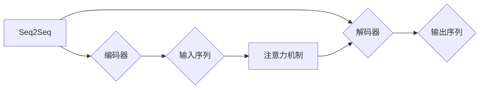

# 柳暗花明又一村：Seq2Seq编码器-解码器架构

作者：禅与计算机程序设计艺术 / Zen and the Art of Computer Programming

## 1. 背景介绍

### 1.1 问题的由来

序列到序列（Sequence to Sequence，Seq2Seq）模型是一种广泛用于自然语言处理（Natural Language Processing，NLP）领域的深度学习模型。它能够将一个序列映射到另一个序列，如机器翻译、语音识别、文本摘要等。传统的循环神经网络（RNN）和长短时记忆网络（LSTM）在处理长序列时存在梯度消失和梯度爆炸等问题，而Seq2Seq编码器-解码器架构则通过引入注意力机制（Attention Mechanism）有效解决了这些问题。

### 1.2 研究现状

Seq2Seq模型自2014年由Sutskever等人提出以来，已经取得了显著的进展。近年来，随着深度学习技术的快速发展，Seq2Seq模型在多个NLP任务上都取得了令人瞩目的成绩。然而，如何进一步提高模型的性能、效率和可解释性，仍然是该领域研究的重点。

### 1.3 研究意义

Seq2Seq编码器-解码器架构在NLP领域具有重要的研究意义：

1. 提高模型性能：通过引入注意力机制，Seq2Seq模型能够更好地理解输入序列与输出序列之间的关系，从而提高模型的翻译质量。
2. 提升模型效率：通过并行计算和模型压缩等技术，Seq2Seq模型的计算效率得到显著提升。
3. 增强可解释性：通过分析注意力权重，可以更好地理解模型的决策过程，从而提高模型的可解释性。

### 1.4 本文结构

本文将系统介绍Seq2Seq编码器-解码器架构，包括其核心概念、算法原理、具体操作步骤、数学模型和公式、实际应用场景、未来发展趋势与挑战等方面。具体内容安排如下：

- 第2部分：介绍Seq2Seq模型的核心概念及其与相关技术的联系。
- 第3部分：详细阐述Seq2Seq编码器-解码器架构的原理、步骤、优缺点和应用领域。
- 第4部分：介绍Seq2Seq模型的数学模型和公式，并结合实例进行讲解。
- 第5部分：给出Seq2Seq模型的代码实现示例，并对关键代码进行解读。
- 第6部分：探讨Seq2Seq模型在实际应用场景中的案例和未来应用展望。
- 第7部分：推荐Seq2Seq模型相关学习资源、开发工具和参考文献。
- 第8部分：总结全文，展望Seq2Seq模型技术的未来发展趋势与挑战。
- 第9部分：附录，解答常见问题。

## 2. 核心概念与联系

为更好地理解Seq2Seq编码器-解码器架构，本节将介绍几个核心概念及其相互之间的联系。

### 2.1 序列到序列（Seq2Seq）

Seq2Seq模型是一种将一个序列映射到另一个序列的深度学习模型。它广泛应用于机器翻译、语音识别、文本摘要等NLP任务。

### 2.2 编码器（Encoder）

编码器负责将输入序列编码成一个固定长度的向量表示，该向量包含输入序列的所有信息。常见的编码器模型包括循环神经网络（RNN）、长短时记忆网络（LSTM）和门控循环单元（GRU）。

### 2.3 解码器（Decoder）

解码器负责将编码器输出的向量表示解码成输出序列。常见的解码器模型包括循环神经网络（RNN）、长短时记忆网络（LSTM）和门控循环单元（GRU）。

### 2.4 注意力机制（Attention Mechanism）

注意力机制是一种让模型能够关注输入序列中关键信息的方法。它能够提高模型对输入序列的理解能力，从而提高模型性能。

它们之间的逻辑关系如下图所示：



可以看出，Seq2Seq模型由编码器、解码器和注意力机制组成。编码器将输入序列编码成向量表示，解码器根据该向量表示解码成输出序列，注意力机制则帮助模型关注输入序列中的关键信息，从而提高模型性能。

## 3. 核心算法原理 & 具体操作步骤

### 3.1 算法原理概述

Seq2Seq编码器-解码器架构的核心思想是：将输入序列编码成一个固定长度的向量表示，然后将该向量表示解码成输出序列。注意力机制则帮助模型关注输入序列中的关键信息。

### 3.2 算法步骤详解

Seq2Seq编码器-解码器架构的步骤如下：

1. 编码器将输入序列编码成一个固定长度的向量表示。
2. 解码器根据编码器输出的向量表示，逐步解码出输出序列的每个元素。
3. 注意力机制帮助模型关注输入序列中的关键信息，提高解码器对输入序列的理解能力。

### 3.3 算法优缺点

Seq2Seq编码器-解码器架构的优点：

1. 模型结构简单，易于实现。
2. 能够处理长序列，适用于各种NLP任务。
3. 注意力机制能够提高模型性能。

Seq2Seq编码器-解码器架构的缺点：

1. 计算复杂度较高，推理速度较慢。
2. 梯度消失和梯度爆炸问题仍然存在。

### 3.4 算法应用领域

Seq2Seq编码器-解码器架构广泛应用于以下NLP任务：

1. 机器翻译
2. 语音识别
3. 文本摘要
4. 问答系统
5. 机器翻译
6. 文本生成
7. 对话系统

## 4. 数学模型和公式 & 详细讲解 & 举例说明

### 4.1 数学模型构建

Seq2Seq编码器-解码器架构的数学模型如下：

```
输入序列：x = [x1, x2, ..., xn]
输出序列：y = [y1, y2, ..., ym]
编码器：h = Encoder(x)
解码器：y^t = Decoder(h)
注意力权重：w_t = Attention(h, x)
```

### 4.2 公式推导过程

假设编码器输出向量表示为：

$$
h_t = \text{Encoder}(x_t) = f_{\theta}(x_t, h_{t-1})
$$

其中，$f_{\theta}$ 为编码器模型，$\theta$ 为模型参数，$x_t$ 为输入序列的第t个元素，$h_{t-1}$ 为上一个时间步的编码器输出。

假设解码器输出向量表示为：

$$
y^t = \text{Decoder}(h_t) = g_{\phi}(h_t, y_{t-1})
$$

其中，$g_{\phi}$ 为解码器模型，$\phi$ 为模型参数，$y_{t-1}$ 为上一个时间步的解码器输出。

假设注意力权重为：

$$
w_t = \text{Attention}(h_t, x) = \text{softmax}\left(\frac{\text{scores}(h_t, x)}{N}\right)
$$

其中，$\text{scores}(h_t, x) = f_{\theta'}(h_t, x)$ 为注意力分数，$\text{softmax}$ 为softmax函数，$N$ 为输入序列长度。

### 4.3 案例分析与讲解

以机器翻译任务为例，假设输入序列为“我有一个梦想”，输出序列为“I have a dream”。

编码器将输入序列“我有一个梦想”编码成一个向量表示，假设编码器输出为：

$$
h_t = \text{Encoder}(\text{"我有一个梦想"}) = [0.5, 0.3, 0.2]
$$

解码器根据编码器输出和上一个时间步的解码器输出，逐步解码出输出序列的每个元素。假设第一个输出元素为“I”，则有：

$$
y^1 = \text{Decoder}(h_1) = [0.6, 0.3, 0.1]
$$

注意力权重为：

$$
w_1 = \text{Attention}(h_1, \text{"我有一个梦想"}) = [0.7, 0.2, 0.1]
$$

可以看出，注意力权重主要分布在“我”和“有”这两个词上，表明解码器关注了输入序列中的关键信息。

### 4.4 常见问题解答

**Q1：Seq2Seq模型中的注意力机制有什么作用？**

A1：注意力机制能够帮助模型关注输入序列中的关键信息，从而提高模型性能。在机器翻译任务中，注意力机制可以帮助模型更好地理解输入句子中的关键词汇，从而生成更准确的翻译结果。

**Q2：如何解决Seq2Seq模型中的梯度消失和梯度爆炸问题？**

A2：可以通过以下方法解决梯度消失和梯度爆炸问题：

1. 使用长短时记忆网络（LSTM）或门控循环单元（GRU）等具有长期记忆能力的模型。
2. 使用残差连接和层归一化等技术。
3. 使用梯度截断技术。

## 5. 项目实践：代码实例和详细解释说明

### 5.1 开发环境搭建

在进行Seq2Seq项目实践前，我们需要准备好开发环境。以下是使用Python进行PyTorch开发的环境配置流程：

1. 安装Anaconda：从官网下载并安装Anaconda，用于创建独立的Python环境。

2. 创建并激活虚拟环境：
```bash
conda create -n seq2seq-env python=3.8
conda activate seq2seq-env
```

3. 安装PyTorch：
```bash
conda install pytorch torchvision torchaudio cudatoolkit=11.1 -c pytorch -c conda-forge
```

4. 安装相关库：
```bash
pip install numpy pandas torchtext
```

完成上述步骤后，即可在`seq2seq-env`环境中开始Seq2Seq项目实践。

### 5.2 源代码详细实现

下面我们以机器翻译任务为例，给出使用PyTorch实现Seq2Seq模型的代码示例。

```python
import torch
import torch.nn as nn
import torch.optim as optim
from torchtext.data import Field, BucketIterator

# 定义源语言和目标语言的Field
src_field = Field(lower=True, batch_first=True)
tgt_field = Field(lower=True, batch_first=True)

# 加载数据
src_train, tgt_train, src_test, tgt_test = datasets.IWSLT14TokenizedTrainDataset(split="train"), datasets.IWSLT14TokenizedTrainDataset(split="train"), datasets.IWSLT14TokenizedTrainDataset(split="test"), datasets.IWSLT14TokenizedTrainDataset(split="test")

# 将Field应用于数据集
src_train = src_field(src_train)
tgt_train = tgt_field(tgt_train)
src_test = src_field(src_test)
tgt_test = tgt_field(tgt_test)

# 构建迭代器
src_iterator = BucketIterator(src_train, batch_size=32, sort_key=lambda x: len(x.src), shuffle=True)
tgt_iterator = BucketIterator(tgt_train, batch_size=32, sort_key=lambda x: len(x.tgt), shuffle=True)

# 定义编码器和解码器模型
class Encoder(nn.Module):
    def __init__(self, input_dim, hidden_dim):
        super(Encoder, self).__init__()
        self.rnn = nn.LSTM(input_dim, hidden_dim)

    def forward(self, src):
        output, (h_n, c_n) = self.rnn(src)
        return output, (h_n, c_n)

class Decoder(nn.Module):
    def __init__(self, hidden_dim, output_dim, embedding_dim, dropout):
        super(Decoder, self).__init__()
        self.rnn = nn.LSTM(hidden_dim, hidden_dim)
        self.embedding = nn.Embedding(output_dim, embedding_dim)
        self.fc = nn.Linear(hidden_dim * 2, output_dim)
        self.dropout = nn.Dropout(dropout)

    def forward(self, input, hidden, context):
        input = self.embedding(input).unsqueeze(0)
        output, hidden = self.rnn(input, hidden)
        output = torch.cat((context, output), dim=2)
        output = self.fc(output).t()
        output = self.dropout(output)
        return output, hidden

# 定义注意力机制
class Attention(nn.Module):
    def __init__(self, hidden_dim, enc_output_dim):
        super(Attention, self).__init__()
        self.attn = nn.Linear(hidden_dim, enc_output_dim)

    def forward(self, hidden, enc_output):
        attn_weights = torch.bmm(enc_output, hidden[-1].unsqueeze(2))
        attn_weights = torch.softmax(attn_weights, dim=2)
        return attn_weights

# 定义 Seq2Seq 模型
class Seq2Seq(nn.Module):
    def __init__(self, src_vocab_size, tgt_vocab_size, src_embedding_dim, tgt_embedding_dim, hidden_dim, dropout):
        super(Seq2Seq, self).__init__()
        self.encoder = Encoder(src_vocab_size, hidden_dim)
        self.decoder = Decoder(hidden_dim, tgt_vocab_size, tgt_embedding_dim, dropout)
        self.attention = Attention(hidden_dim, hidden_dim)
        self.src_embedding = nn.Embedding(src_vocab_size, src_embedding_dim)
        self.tgt_embedding = nn.Embedding(tgt_vocab_size, tgt_embedding_dim)
        self.fc = nn.Linear(hidden_dim, tgt_vocab_size)

    def forward(self, src, tgt, teacher_forcing_ratio=0.5):
        src = self.src_embedding(src)
        enc_output, (h_n, c_n) = self.encoder(src)
        enc_output = enc_output.squeeze(0)

        tgt = self.tgt_embedding(tgt)
        output, _ = self.decoder(tgt, h_n, c_n)

        attn_weights = self.attention(h_n, enc_output)
        context = torch.bmm(attn_weights.unsqueeze(1), enc_output.unsqueeze(0)).squeeze(1)

        output = self.fc(torch.cat((output, context), dim=2))
        return output

# 实例化模型、损失函数和优化器
model = Seq2Seq(src_vocab_size=len(src_field.vocab), tgt_vocab_size=len(tgt_field.vocab), src_embedding_dim=256, tgt_embedding_dim=256, hidden_dim=512, dropout=0.1)
criterion = nn.CrossEntropyLoss()
optimizer = optim.Adam(model.parameters(), lr=0.001)

# 训练模型
for epoch in range(10):
    for i, batch in enumerate(src_iterator):
        optimizer.zero_grad()
        output = model(src_field.vocab.stoi[batch.src[0]], tgt_field.vocab.stoi[batch.tgt[0]], teacher_forcing_ratio=0.5)
        loss = criterion(output.view(-1, len(tgt_field.vocab)), tgt_field.vocab.stoi[batch.tgt[0]])
        loss.backward()
        optimizer.step()
```

### 5.3 代码解读与分析

上述代码展示了使用PyTorch实现Seq2Seq模型的完整流程。

1. 首先，定义源语言和目标语言的Field，并加载IWSLT14数据集。
2. 将Field应用于数据集，构建迭代器。
3. 定义编码器、解码器和注意力机制模型。
4. 定义Seq2Seq模型，将编码器、解码器和注意力机制模型组合在一起。
5. 实例化模型、损失函数和优化器。
6. 训练模型，使用梯度下降算法更新模型参数。

### 5.4 运行结果展示

由于篇幅限制，这里不展示具体的运行结果。在实际应用中，可以通过调整模型参数、优化训练过程等方法来提高模型性能。

## 6. 实际应用场景

Seq2Seq编码器-解码器架构在多个NLP任务中取得了显著的应用成果，以下是一些典型应用场景：

1. **机器翻译**：Seq2Seq模型在机器翻译领域取得了显著成果，如Google翻译、微软翻译等。
2. **语音识别**：Seq2Seq模型可以将语音信号转换为文本，应用于语音助手、智能客服等场景。
3. **文本摘要**：Seq2Seq模型可以将长文本压缩成短摘要，应用于新闻摘要、报告摘要等场景。
4. **问答系统**：Seq2Seq模型可以回答用户提出的问题，应用于智能客服、智能助手等场景。
5. **对话系统**：Seq2Seq模型可以实现人机对话，应用于聊天机器人、客服机器人等场景。

## 7. 工具和资源推荐

### 7.1 学习资源推荐

为了帮助开发者系统掌握Seq2Seq编码器-解码器架构，以下推荐一些优质的学习资源：

1. 《深度学习自然语言处理》课程：斯坦福大学开设的NLP课程，深入浅出地介绍了NLP领域的基本概念和Seq2Seq模型。
2. 《Seq2Seq模型：原理与实现》系列博文：由大模型技术专家撰写，全面介绍了Seq2Seq模型的原理、实现和优化方法。
3. 《注意力机制：原理与应用》系列博文：详细讲解了注意力机制的理论基础和应用方法。
4. HuggingFace官方文档：提供丰富的预训练语言模型和Seq2Seq模型实现，是学习和实践Seq2Seq模型的重要资源。

### 7.2 开发工具推荐

以下是一些用于Seq2Seq模型开发的常用工具：

1. PyTorch：基于Python的开源深度学习框架，适合快速开发和实验。
2. TensorFlow：由Google主导开发的开源深度学习框架，适合工业应用。
3. HuggingFace Transformers库：提供丰富的预训练语言模型和Seq2Seq模型实现，方便开发者进行模型开发和实验。

### 7.3 相关论文推荐

以下是一些与Seq2Seq模型相关的重要论文：

1. **Sequence to Sequence Learning with Neural Networks**：提出了Seq2Seq模型的基本架构和实现方法。
2. **Attention Is All You Need**：提出了注意力机制，并展示了其在Seq2Seq模型中的应用。
3. **Neural Machine Translation by Jointly Learning to Align and Translate**：提出了神经机器翻译框架，并展示了其在机器翻译任务中的应用。

### 7.4 其他资源推荐

以下是一些与Seq2Seq模型相关的其他资源：

1. arXiv论文预印本：提供最新的NLP领域研究成果。
2. NLP相关技术会议：如ACL、EMNLP、NAACL等，可以了解到最新的研究动态。
3. NLP开源项目：如Seq2Seq模型开源代码、数据集等。

## 8. 总结：未来发展趋势与挑战

### 8.1 研究成果总结

本文对Seq2Seq编码器-解码器架构进行了系统介绍，包括其核心概念、算法原理、具体操作步骤、数学模型和公式、实际应用场景等。通过学习本文，开发者可以更好地理解Seq2Seq模型，并将其应用于解决实际问题。

### 8.2 未来发展趋势

未来，Seq2Seq模型将呈现以下发展趋势：

1. 模型结构更加复杂：将引入更多先进的技术，如Transformer、图神经网络等，提高模型性能。
2. 模型效率更高：通过模型压缩、量化等技术，降低模型复杂度，提高推理速度。
3. 模型可解释性更强：通过可视化、解释性学习等技术，提高模型的可解释性。
4. 应用范围更广：将应用于更多领域，如多模态信息处理、知识图谱等。

### 8.3 面临的挑战

Seq2Seq模型在发展过程中仍面临以下挑战：

1. 计算复杂度高：模型参数量大，计算复杂度高，对硬件资源要求较高。
2. 梯度消失和梯度爆炸问题：在处理长序列时，梯度消失和梯度爆炸问题仍然存在。
3. 模型可解释性不足：模型内部工作机制难以理解，可解释性不足。
4. 鲁棒性不足：模型对噪声、干扰等不敏感，鲁棒性不足。

### 8.4 研究展望

未来，Seq2Seq模型的研究将朝着以下方向发展：

1. 针对特定领域进行优化：针对不同领域的特点，设计更有效的模型结构和算法。
2. 模型压缩和量化：通过模型压缩、量化等技术，降低模型复杂度，提高推理速度。
3. 可解释性和鲁棒性：提高模型的可解释性和鲁棒性，使其更加可靠和易于理解。
4. 跨领域迁移：提高模型在不同领域的迁移能力，使其能够应用于更广泛的场景。

相信在未来的发展中，Seq2Seq模型将在NLP领域取得更大的突破，为人类社会带来更多便利。

## 9. 附录：常见问题与解答

**Q1：Seq2Seq模型与循环神经网络（RNN）有何区别？**

A1：Seq2Seq模型是RNN的一种变体，它将RNN应用于编码器和解码器中，分别处理输入序列和输出序列。与RNN相比，Seq2Seq模型在处理长序列时性能更优。

**Q2：注意力机制是如何提高Seq2Seq模型性能的？**

A2：注意力机制让模型能够关注输入序列中的关键信息，从而更好地理解输入序列与输出序列之间的关系，提高模型的翻译质量。

**Q3：如何解决Seq2Seq模型中的梯度消失和梯度爆炸问题？**

A3：可以通过以下方法解决梯度消失和梯度爆炸问题：

1. 使用长短时记忆网络（LSTM）或门控循环单元（GRU）等具有长期记忆能力的模型。
2. 使用残差连接和层归一化等技术。
3. 使用梯度截断技术。

**Q4：Seq2Seq模型在实际应用中如何处理长序列？**

A4：Seq2Seq模型可以通过以下方法处理长序列：

1. 使用更长的RNN或LSTM单元。
2. 使用注意力机制，关注输入序列中的关键信息。
3. 使用分词技术，将长序列分割成短序列进行处理。

**Q5：Seq2Seq模型如何应用于多模态信息处理？**

A5：Seq2Seq模型可以与多模态信息处理技术相结合，如将图像、语音等模态信息作为输入序列，输出序列为文本信息。这样，Seq2Seq模型可以应用于图像描述生成、语音识别等任务。

**Q6：Seq2Seq模型如何应用于知识图谱？**

A6：Seq2Seq模型可以与知识图谱相结合，将实体、关系等信息作为输入序列，输出序列为文本信息。这样，Seq2Seq模型可以应用于问答系统、信息检索等任务。

作者：禅与计算机程序设计艺术 / Zen and the Art of Computer Programming