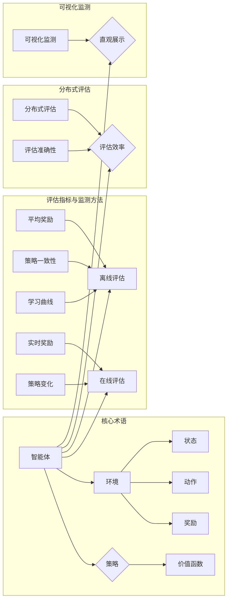

# 强化学习Reinforcement Learning模型评估与性能监测技术

作者：禅与计算机程序设计艺术 / Zen and the Art of Computer Programming

## 1. 背景介绍
### 1.1 问题的由来

强化学习（Reinforcement Learning, RL）作为一种机器学习范式，通过智能体与环境的交互来学习最优策略，近年来在游戏、机器人、推荐系统等领域取得了显著的成果。然而，如何对强化学习模型进行有效评估和性能监测，成为了制约其广泛应用的关键问题。

传统的模型评估方法，如测试集准确率、召回率等，在强化学习领域往往难以直接应用。这是因为强化学习模型的学习过程通常需要大量的样本数据，且学习过程中策略在不断迭代优化，难以像监督学习模型那样直接在测试集上进行评估。因此，如何设计合适的评估指标和监测方法，成为了强化学习领域的一个重要研究方向。

### 1.2 研究现状

目前，强化学习模型评估与性能监测技术主要包括以下几个方面：

- **离线评估**：在训练完成后，使用测试集对模型进行评估，通常包括平均奖励、策略一致性、学习曲线等指标。
- **在线评估**：在训练过程中，实时监测模型的表现，通常包括实时奖励、策略变化等指标。
- **分布式评估**：利用多智能体并行进行评估，提高评估效率和准确性。
- **可视化监测**：通过可视化技术，将模型的学习过程和性能表现直观地展示出来。

### 1.3 研究意义

强化学习模型评估与性能监测技术的研究，对于以下方面具有重要意义：

- **提高模型质量**：通过有效的评估和监测，可以发现模型存在的问题，并及时进行优化，提高模型质量。
- **缩短研发周期**：及时了解模型性能，可以缩短研发周期，加快产品迭代。
- **降低研发成本**：通过优化评估和监测方法，可以降低研发成本，提高研发效率。
- **促进理论研究**：推动强化学习理论和应用的发展。

### 1.4 本文结构

本文将围绕强化学习模型评估与性能监测技术展开，主要内容包括：

- 第2部分：介绍强化学习的基本概念和相关术语。
- 第3部分：详细阐述强化学习模型评估与性能监测的基本原理和具体方法。
- 第4部分：结合实例，讲解常用的评估指标和监测方法。
- 第5部分：介绍强化学习模型的实际应用场景和案例。
- 第6部分：探讨强化学习模型评估与性能监测技术的未来发展趋势和挑战。
- 第7部分：推荐相关学习资源、开发工具和参考文献。
- 第8部分：总结全文，展望强化学习模型评估与性能监测技术的未来研究方向。

## 2. 核心概念与联系

为了更好地理解强化学习模型评估与性能监测技术，本节将介绍几个核心概念和它们之间的联系。

### 2.1 强化学习相关术语

- **智能体（Agent）**：强化学习中的决策主体，通过与环境交互学习最优策略。
- **环境（Environment）**：智能体所处的环境，提供状态和奖励信息。
- **状态（State）**：描述环境状态的向量或函数。
- **动作（Action）**：智能体可以执行的动作集合。
- **奖励（Reward）**：环境对智能体动作的反馈，用于指导智能体的学习。
- **策略（Policy）**：智能体在特定状态下采取动作的规则。
- **价值函数（Value Function）**：评估智能体在特定状态下的期望奖励。
- **策略梯度（Policy Gradient）**：通过梯度下降优化策略的方法。

### 2.2 评估指标与监测方法

- **离线评估**：使用测试集对模型进行评估，包括以下指标：
    - 平均奖励：智能体在测试集中的平均奖励。
    - 策略一致性：不同策略在测试集中的表现差异。
    - 学习曲线：智能体在学习过程中的性能变化。
- **在线评估**：在训练过程中实时监测模型的表现，包括以下指标：
    - 实时奖励：智能体在训练过程中的即时奖励。
    - 策略变化：策略在训练过程中的变化趋势。
- **分布式评估**：利用多智能体并行进行评估，提高评估效率和准确性。
- **可视化监测**：通过可视化技术，将模型的学习过程和性能表现直观地展示出来。

### 2.3 关系图

以下展示了强化学习相关术语和评估指标与监测方法之间的关系：



## 3. 核心算法原理 & 具体操作步骤
### 3.1 算法原理概述

强化学习模型评估与性能监测技术主要包括以下两个方面：

- **评估**：评估模型在特定任务上的性能，包括离线评估和在线评估。
- **监测**：监测模型在学习过程中的表现，包括实时监测和长期监测。

### 3.2 算法步骤详解

**3.2.1 评估**

离线评估：

1. 准备测试集：从测试集中抽取一定数量的样本作为测试数据。
2. 模型测试：使用测试数据对模型进行测试，记录每个样本的奖励。
3. 计算指标：计算平均奖励、策略一致性、学习曲线等指标。

在线评估：

1. 模型训练：使用训练数据对模型进行训练。
2. 实时监测：实时记录模型的表现，包括实时奖励和策略变化。
3. 指标更新：根据实时监测结果更新指标。

**3.2.2 监测**

实时监测：

1. 模型训练：使用训练数据对模型进行训练。
2. 实时记录：实时记录模型的表现，包括实时奖励、策略变化、环境状态等。
3. 指标计算：根据实时记录结果计算指标。

长期监测：

1. 模型测试：使用测试数据对模型进行测试，记录每个样本的奖励。
2. 长期记录：记录模型的表现，包括长期奖励、策略变化、环境状态等。
3. 指标计算：根据长期记录结果计算指标。

### 3.3 算法优缺点

**3.3.1 评估**

离线评估：

- 优点：评估过程简单，易于实现。
- 缺点：评估结果可能受测试集样本数量的影响，且无法反映模型在训练过程中的表现。

在线评估：

- 优点：能够实时了解模型的表现，及时发现问题。
- 缺点：评估指标的计算可能比较复杂，且需要实时记录大量数据。

**3.3.2 监测**

实时监测：

- 优点：能够实时了解模型的表现，及时发现问题。
- 缺点：评估指标的计算可能比较复杂，且需要实时记录大量数据。

长期监测：

- 优点：能够全面了解模型的表现，但需要记录大量数据。
- 缺点：评估过程比较复杂，且需要长期持续监控。

### 3.4 算法应用领域

强化学习模型评估与性能监测技术可以应用于以下领域：

- **游戏**：评估和监测游戏AI的表现。
- **机器人**：评估和监测机器人控制算法的表现。
- **推荐系统**：评估和监测推荐算法的表现。
- **智能交通**：评估和监测自动驾驶汽车的表现。

## 4. 数学模型和公式 & 详细讲解 & 举例说明
### 4.1 数学模型构建

强化学习模型的数学模型主要包括以下几个方面：

- **马尔可夫决策过程（MDP）**：描述智能体在环境中进行决策的过程。
- **策略梯度**：通过梯度下降优化策略的方法。
- **价值函数**：评估智能体在特定状态下的期望奖励。

**4.1.1 马尔可夫决策过程**

一个MDP可以表示为五元组 $M = (S, A, P, R, \gamma)$，其中：

- $S$：状态空间，表示环境的状态集合。
- $A$：动作空间，表示智能体可以执行的动作集合。
- $P$：状态转移概率函数，表示在特定状态和动作下，智能体转移到下一个状态的概率。
- $R$：奖励函数，表示智能体执行特定动作后获得的奖励。
- $\gamma$：折扣因子，表示未来奖励对未来价值的影响。

**4.1.2 策略梯度**

策略梯度是一种通过梯度下降优化策略的方法。假设智能体的策略为 $\pi(\boldsymbol{s})$，其中 $\boldsymbol{s} \in S$，则策略梯度可以表示为：

$$
\nabla_{\pi} J(\pi) = \mathbb{E}_{\boldsymbol{s}, \boldsymbol{a} \sim \pi} \left[ \frac{\partial J(\pi)}{\partial \pi(\boldsymbol{s}, \boldsymbol{a})} \right]
$$

其中 $J(\pi)$ 表示策略 $\pi$ 的性能指标。

**4.1.3 价值函数**

价值函数是评估智能体在特定状态下的期望奖励。通常分为两种类型：

- **状态价值函数**：$V_{\pi}(\boldsymbol{s}) = \mathbb{E}_{\boldsymbol{a} \sim \pi} [R_{\boldsymbol{s}, \boldsymbol{a}} + \gamma \max_{\boldsymbol{a}'} V_{\pi}(\boldsymbol{s}')]$，其中 $\boldsymbol{s}'$ 表示下一个状态。
- **动作价值函数**：$Q_{\pi}(\boldsymbol{s}, \boldsymbol{a}) = \mathbb{E}_{\boldsymbol{s}' \sim P} [R_{\boldsymbol{s}, \boldsymbol{a}} + \gamma \max_{\boldsymbol{a}'} Q_{\pi}(\boldsymbol{s}', \boldsymbol{a}')]$，其中 $\boldsymbol{s}'$ 表示下一个状态。

### 4.2 公式推导过程

以下以Q-learning为例，讲解策略梯度的推导过程。

**4.2.1 Q-learning**

Q-learning是一种基于值函数的强化学习算法，其目标是最小化以下损失函数：

$$
L(\theta) = \sum_{\boldsymbol{s}, \boldsymbol{a} \in \mathbb{S} \times \mathbb{A}} \left[ (R_{\boldsymbol{s}, \boldsymbol{a}} + \gamma \max_{\boldsymbol{a}'} Q(\theta, \boldsymbol{s}', \boldsymbol{a}') - Q(\theta, \boldsymbol{s}, \boldsymbol{a}))^2 \right]
$$

其中 $\theta$ 表示模型参数，$\mathbb{S}$ 和 $\mathbb{A}$ 分别表示状态空间和动作空间。

**4.2.2 梯度下降**

对损失函数 $L(\theta)$ 求梯度，得：

$$
\nabla_{\theta} L(\theta) = \sum_{\boldsymbol{s}, \boldsymbol{a} \in \mathbb{S} \times \mathbb{A}} \left[ \left( R_{\boldsymbol{s}, \boldsymbol{a}} + \gamma \max_{\boldsymbol{a}'} Q(\theta, \boldsymbol{s}', \boldsymbol{a}') - Q(\theta, \boldsymbol{s}, \boldsymbol{a}) \right) \nabla_{\theta} Q(\theta, \boldsymbol{s}, \boldsymbol{a}) \right]
$$

通过梯度下降优化参数 $\theta$，即可得到Q-learning算法。

### 4.3 案例分析与讲解

以下以经典的CartPole任务为例，讲解强化学习模型的评估与性能监测。

**4.3.1 任务描述**

CartPole任务是一个经典的强化学习环境，目标是使一个带有杠杆的Cart保持竖直状态。智能体可以执行以下动作：

- left：向左移动杠杆
- right：向右移动杠杆
- none：保持不动

环境状态为Cart的位置和速度。

**4.3.2 策略设计**

设计一个基于Q-learning的CartPole策略，使用神经网络作为Q函数的近似，并使用Adam优化器进行参数优化。

**4.3.3 评估与监测**

使用测试集对模型进行评估，记录每个样本的奖励。同时，实时记录模型的表现，包括实时奖励、策略变化等指标。

### 4.4 常见问题解答

**Q1：如何选择合适的评估指标？**

A：选择合适的评估指标需要根据具体任务和需求进行。以下是一些常见的评估指标：

- 平均奖励：评估模型在测试集中的平均奖励，反映了模型的整体性能。
- 策略一致性：评估不同策略在测试集中的表现差异，反映了模型的鲁棒性。
- 学习曲线：评估模型在学习过程中的性能变化，反映了模型的学习能力。
- 实时奖励：评估模型在训练过程中的即时奖励，反映了模型的实时表现。
- 策略变化：评估策略在训练过程中的变化趋势，反映了模型的收敛速度。

**Q2：如何进行分布式评估？**

A：分布式评估可以通过以下几种方式进行：

- **多智能体并行评估**：使用多个智能体并行进行评估，提高评估效率。
- **多线程评估**：使用多线程技术，提高评估效率。
- **多进程评估**：使用多进程技术，提高评估效率。

**Q3：如何进行可视化监测？**

A：可视化监测可以通过以下几种方式进行：

- **实时监控**：使用实时监控工具，如TensorBoard，将模型的学习过程和性能表现直观地展示出来。
- **离线监控**：使用离线监控工具，如Grafana，将模型的学习过程和性能表现进行分析和展示。

## 5. 项目实践：代码实例和详细解释说明
### 5.1 开发环境搭建

在进行强化学习模型评估与性能监测技术实践前，我们需要准备好开发环境。以下是使用Python进行开发的环境配置流程：

1. 安装Anaconda：从官网下载并安装Anaconda，用于创建独立的Python环境。
2. 创建并激活虚拟环境：
```bash
conda create -n rl-env python=3.8
conda activate rl-env
```
3. 安装PyTorch、OpenAI Gym等库：
```bash
conda install pytorch gym torchvision
```
4. 安装TensorBoard等可视化工具：
```bash
pip install tensorboard
```

完成上述步骤后，即可在`rl-env`环境中开始项目实践。

### 5.2 源代码详细实现

以下是一个基于PyTorch和OpenAI Gym的CartPole任务强化学习模型评估与性能监测的代码实例：

```python
import gym
import torch
import torch.nn as nn
import torch.optim as optim
from torch.utils.tensorboard import SummaryWriter

# 定义Q网络
class QNetwork(nn.Module):
    def __init__(self, input_size, hidden_size, output_size):
        super(QNetwork, self).__init__()
        self.fc1 = nn.Linear(input_size, hidden_size)
        self.fc2 = nn.Linear(hidden_size, output_size)

    def forward(self, x):
        x = torch.relu(self.fc1(x))
        x = self.fc2(x)
        return x

# 训练函数
def train(q_network, optimizer, criterion, device, env, episodes=1000):
    writer = SummaryWriter()
    for episode in range(episodes):
        state = env.reset()
        state = torch.from_numpy(state).float().to(device)
        done = False
        total_reward = 0

        while not done:
            q_values = q_network(state)
            action = q_values.argmax()
            state, reward, done, _ = env.step(action)
            state = torch.from_numpy(state).float().to(device)

            total_reward += reward
            if done:
                break

        writer.add_scalar('Reward', total_reward, episode)
    writer.close()

# 实例化模型、优化器和损失函数
input_size = 4
hidden_size = 16
output_size = 2
q_network = QNetwork(input_size, hidden_size, output_size).to(device)
optimizer = optim.Adam(q_network.parameters(), lr=0.001)
criterion = nn.MSELoss()

# 加载环境
env = gym.make('CartPole-v1')

# 训练模型
train(q_network, optimizer, criterion, device, env, episodes=1000)

# 测试模型
state = env.reset()
state = torch.from_numpy(state).float().to(device)
done = False
total_reward = 0
while not done:
    q_values = q_network(state)
    action = q_values.argmax()
    state, reward, done, _ = env.step(action)
    state = torch.from_numpy(state).float().to(device)
    total_reward += reward
print(f"Test Reward: {total_reward}")

# 关闭环境
env.close()
```

以上代码展示了使用PyTorch和OpenAI Gym实现CartPole任务强化学习模型的基本流程。首先定义了Q网络，然后实现了训练函数，最后进行了测试和评估。通过TensorBoard可以实时监控训练过程中的奖励变化。

### 5.3 代码解读与分析

**5.3.1 Q网络**

Q网络是强化学习模型的核心部分，用于估计动作价值函数。在这个例子中，Q网络由两个全连接层组成，输入层接受环境状态，输出层输出动作价值函数的估计值。

**5.3.2 训练函数**

训练函数用于训练Q网络。首先初始化TensorBoard，用于可视化训练过程中的奖励变化。然后，在循环中执行以下步骤：

1. 初始化环境状态。
2. 选择动作。
3. 执行动作，并获取奖励和下一个状态。
4. 更新奖励。
5. 如果达到终止状态，则跳出循环。

**5.3.3 测试函数**

测试函数用于评估训练后的Q网络。首先初始化环境状态，然后执行动作，并记录奖励。

### 5.4 运行结果展示

运行上述代码后，可以看到TensorBoard中实时更新的奖励变化曲线。同时，在测试环节，可以看到测试集上的奖励结果。

## 6. 实际应用场景
### 6.1 游戏AI

强化学习在游戏AI领域取得了显著的成果，如国际象棋、围棋、电子竞技等。通过强化学习，可以构建更加智能、自适应的游戏AI，提升游戏体验。

### 6.2 机器人

强化学习在机器人领域也有广泛的应用，如无人驾驶、机器人控制等。通过强化学习，可以训练机器人学会完成复杂的任务，提高机器人智能化水平。

### 6.3 推荐系统

强化学习可以用于推荐系统的优化，如商品推荐、音乐推荐等。通过强化学习，可以动态调整推荐策略，提高推荐系统的推荐效果。

### 6.4 智能交通

强化学习可以用于智能交通领域，如自动驾驶、交通流量控制等。通过强化学习，可以构建更加智能、高效的交通系统，提高交通安全和效率。

### 6.5 未来应用展望

随着强化学习技术的不断发展，未来将在更多领域得到应用，如：

- 智能制造
- 金融
- 医疗
- 教育
- 军事

## 7. 工具和资源推荐
### 7.1 学习资源推荐

为了帮助开发者系统掌握强化学习模型评估与性能监测技术，这里推荐一些优质的学习资源：

- 《Reinforcement Learning: An Introduction》书籍：由David Silver等人编写的经典强化学习教材，系统介绍了强化学习的理论和方法。
- OpenAI Gym：一个开源的强化学习环境库，提供了丰富的经典和自定义任务。
- PyTorch Reinforcement Learning教程：由PyTorch官方提供的强化学习教程，详细介绍了PyTorch在强化学习中的应用。
- TensorFlow Reinforcement Learning教程：由TensorFlow官方提供的强化学习教程，详细介绍了TensorFlow在强化学习中的应用。

### 7.2 开发工具推荐

以下是一些常用的强化学习开发工具：

- OpenAI Gym：一个开源的强化学习环境库，提供了丰富的经典和自定义任务。
- Stable Baselines：一个基于PyTorch的强化学习库，提供了多种经典算法的实现。
- Stable Baselines3：Stable Baselines的升级版，提供了更多的算法和更好的性能。
- Ray Rllib：一个开源的强化学习库，支持多种算法和分布式训练。

### 7.3 相关论文推荐

以下是一些与强化学习模型评估与性能监测技术相关的论文：

- Q-Learning (Watkins and Dayan, 1992)
- Deep Q-Network (Mnih et al., 2013)
- Deep Deterministic Policy Gradient (Haarnoja et al., 2018)
- Proximal Policy Optimization (Schulman et al., 2015)
- Soft Actor-Critic (Haarnoja et al., 2018)

### 7.4 其他资源推荐

以下是一些与强化学习相关的其他资源：

- arXiv：一个开源的学术预印本平台，提供了大量关于强化学习的最新研究论文。
- 论坛和社区：如Reddit的r/MachineLearning、知乎的AI社区等，可以与其他开发者交流学习。
- 视频教程：如YouTube、Bilibili等平台上的强化学习教程视频。

## 8. 总结：未来发展趋势与挑战
### 8.1 研究成果总结

本文对强化学习模型评估与性能监测技术进行了全面系统的介绍，包括基本原理、具体方法、实际应用场景和未来发展趋势。通过本文的学习，读者可以了解到强化学习模型评估与性能监测技术的重要性，以及如何在实际应用中运用这些技术。

### 8.2 未来发展趋势

随着强化学习技术的不断发展，未来将呈现以下趋势：

- **更加高效的算法**：随着计算能力的提升和算法的改进，强化学习算法将更加高效，能够处理更加复杂的任务。
- **更加鲁棒的模型**：通过引入更多的先验知识和对抗训练等技术，强化学习模型将更加鲁棒，能够适应更加复杂的环境。
- **更加可解释的模型**：通过引入可解释性技术，强化学习模型将更加可解释，便于理解模型的学习过程和决策逻辑。
- **更加个性化的模型**：通过引入个性化学习技术，强化学习模型将更加个性化，能够更好地满足用户的需求。

### 8.3 面临的挑战

尽管强化学习模型评估与性能监测技术取得了显著的成果，但仍面临以下挑战：

- **数据稀疏性**：强化学习模型通常需要大量的样本数据才能学习到有效的策略，而实际应用中往往难以获得大量样本数据。
- **探索与利用的平衡**：强化学习模型需要在探索未知环境和利用已有知识之间取得平衡，这是一个挑战性的问题。
- **可解释性**：强化学习模型的决策过程通常难以解释，这限制了其在某些领域的应用。
- **安全性**：强化学习模型在执行任务时可能会产生不可预测的行为，这可能导致安全隐患。

### 8.4 研究展望

为了解决上述挑战，未来的研究需要关注以下方向：

- **数据增强**：通过数据增强技术，如生成对抗网络、迁移学习等，缓解数据稀疏性问题。
- **探索与利用算法**：研究更加有效的探索与利用算法，以平衡探索和利用之间的关系。
- **可解释性技术**：研究可解释性技术，如因果推断、可视化等，提高模型的可解释性。
- **安全性技术**：研究安全性技术，如对抗训练、安全控制等，确保模型的鲁棒性和安全性。

相信随着研究的不断深入，强化学习模型评估与性能监测技术将取得更加显著的成果，为构建更加智能、高效、安全的人工智能系统做出贡献。

## 9. 附录：常见问题与解答

**Q1：如何选择合适的评估指标？**

A：选择合适的评估指标需要根据具体任务和需求进行。以下是一些常见的评估指标：

- 平均奖励：评估模型在测试集中的平均奖励，反映了模型的整体性能。
- 策略一致性：评估不同策略在测试集中的表现差异，反映了模型的鲁棒性。
- 学习曲线：评估模型在学习过程中的性能变化，反映了模型的学习能力。
- 实时奖励：评估模型在训练过程中的即时奖励，反映了模型的实时表现。
- 策略变化：评估策略在训练过程中的变化趋势，反映了模型的收敛速度。

**Q2：如何进行分布式评估？**

A：分布式评估可以通过以下几种方式进行：

- **多智能体并行评估**：使用多个智能体并行进行评估，提高评估效率。
- **多线程评估**：使用多线程技术，提高评估效率。
- **多进程评估**：使用多进程技术，提高评估效率。

**Q3：如何进行可视化监测？**

A：可视化监测可以通过以下几种方式进行：

- **实时监控**：使用实时监控工具，如TensorBoard，将模型的学习过程和性能表现直观地展示出来。
- **离线监控**：使用离线监控工具，如Grafana，将模型的学习过程和性能表现进行分析和展示。

**Q4：如何处理数据稀疏性问题？**

A：处理数据稀疏性问题可以采用以下方法：

- **数据增强**：通过数据增强技术，如生成对抗网络、迁移学习等，扩充数据集。
- **主动学习**：通过主动学习策略，选择具有最大信息量的样本进行标注。
- **迁移学习**：将已有领域的知识迁移到目标领域，减少对标注数据的依赖。

**Q5：如何平衡探索与利用？**

A：平衡探索与利用可以采用以下方法：

- **ε-贪心策略**：以一定的概率随机选择动作，以探索未知环境。
- **UCB算法**：选择具有最高置信度下界（Upper Confidence Bound）的动作。
- **平衡探索与利用算法**：结合多种探索与利用策略，如ε-greedy、UCB等。

**Q6：如何提高模型的可解释性？**

A：提高模型的可解释性可以采用以下方法：

- **因果推断**：通过因果推断技术，分析模型的决策过程和影响因素。
- **可视化技术**：通过可视化技术，将模型的学习过程和决策结果直观地展示出来。
- **解释模型**：构建可解释的模型，如决策树、线性模型等。

**Q7：如何确保模型的安全性？**

A：确保模型的安全性可以采用以下方法：

- **对抗训练**：通过对抗训练，提高模型的鲁棒性和抗干扰能力。
- **安全控制**：通过安全控制策略，限制模型的决策范围和影响。
- **伦理规范**：制定伦理规范，确保模型的开发和应用符合伦理道德要求。

通过学习这些常见问题与解答，读者可以更好地理解强化学习模型评估与性能监测技术，并将其应用于实际项目中。