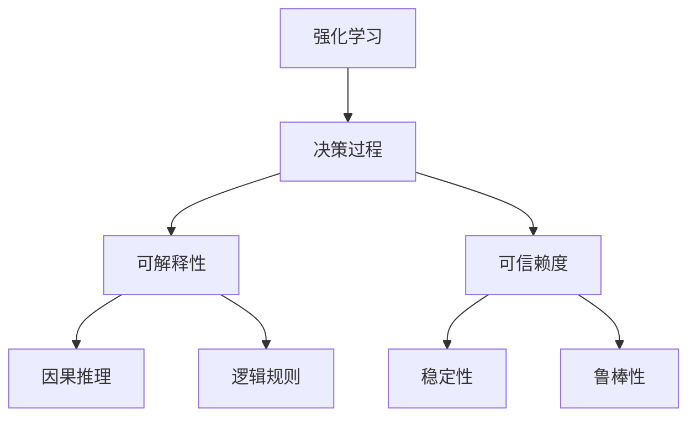

# 强化学习Reinforcement Learning的算法可解释性和可信赖度

关键词：强化学习、可解释性、可信赖度、深度学习、决策过程

## 1. 背景介绍
### 1.1  问题的由来
近年来，随着人工智能技术的飞速发展，强化学习(Reinforcement Learning, RL)在各个领域得到了广泛的应用，如机器人控制、自动驾驶、游戏AI等。强化学习通过智能体(Agent)与环境的交互，根据反馈的奖励信号来优化决策策略，使得智能体能够学习到最优的行为策略。

然而，随着强化学习算法的不断发展，尤其是深度强化学习(Deep Reinforcement Learning, DRL)的兴起，RL算法变得越来越复杂，其决策过程也变得难以理解和解释。这导致了RL算法在实际应用中的可信赖度和可解释性问题日益突出。

### 1.2  研究现状
目前，学术界和工业界都在积极探索RL算法的可解释性和可信赖度问题。一些研究者提出了基于因果推理、逻辑规则等方法来解释RL算法的决策过程；另一些研究者则从算法的稳定性、鲁棒性等角度来提高RL算法的可信赖度。

尽管已经取得了一些进展，但RL算法的可解释性和可信赖度问题仍然面临诸多挑战，如高维状态空间、长期信赖、非平稳环境等。这些挑战都亟需研究者们进一步探索和攻克。

### 1.3  研究意义
RL算法的可解释性和可信赖度问题具有重要的研究意义：

1. 提高RL算法的应用价值。只有当RL算法的决策过程清晰可解释，人们才能够信任并采纳其给出的决策建议，这对于RL算法在自动驾驶、医疗诊断等高风险领域的应用至关重要。

2. 促进RL算法的可持续发展。RL算法的"黑箱"特性一定程度上阻碍了其进一步发展。通过研究RL算法的可解释性和可信赖度问题，有助于我们更好地理解RL的内在机理，促进相关理论的突破和算法的创新。

3. 推动人工智能的可信、可控发展。RL是人工智能的重要分支，提高RL算法的可信赖度，有利于构建可信、可控的人工智能系统，让人工智能更好地造福人类社会。

### 1.4  本文结构
本文将重点探讨强化学习算法的可解释性和可信赖度问题。全文共分为9个章节：第1章介绍研究背景；第2章阐述核心概念；第3章讨论核心算法原理；第4章建立数学模型并举例说明；第5章通过项目实践展示代码实例；第6章分析实际应用场景；第7章推荐相关工具和资源；第8章总结全文并展望未来；第9章附录常见问题解答。

## 2. 核心概念与联系

在讨论强化学习的可解释性和可信赖度之前，我们首先需要明确几个核心概念：

- 强化学习(Reinforcement Learning)：一种通过智能体与环境交互来学习最优决策的机器学习范式。智能体根据环境反馈的奖励信号，不断调整策略以获得最大化的累积奖励。

- 可解释性(Interpretability)：让人能够理解决策系统给出某个决定的原因，即决策过程和结果是透明、可解释的。可解释性让我们能够知其然并知其所以然。

- 可信赖度(Trustworthiness)：决策系统给出的决策是可靠的、可信的，在各种环境下都能稳定正确地工作。可信赖度让我们敢于将决策权交给智能系统。

- 因果推理(Causal Reasoning)：通过分析因果关系来解释决策系统的行为，即环境状态的变化如何"导致"了智能体采取某个行动。

- 逻辑规则(Logic Rules)：将智能体学到的决策策略总结提炼为一系列"if-then"形式的逻辑规则，从而解释其决策依据。

这几个核心概念之间有着紧密的内在联系。RL算法的可解释性需要从因果推理、逻辑规则等角度来分析决策过程；而可信赖度则要求RL算法具备稳定性和鲁棒性。下图展示了这些概念之间的关联：

可以看到，强化学习的核心是决策过程，其可解释性和可信赖度是我们分析和改进RL算法的两个重要视角。接下来，我们将详细讨论如何提升RL算法在这两个方面的表现。

## 3. 核心算法原理 & 具体操作步骤
### 3.1  算法原理概述
强化学习的核心是马尔可夫决策过程(Markov Decision Process, MDP)。MDP由状态空间 $\mathcal{S}$、动作空间 $\mathcal{A}$、状态转移概率 $\mathcal{P}$、奖励函数 $\mathcal{R}$ 和折扣因子 $\gamma$ 构成。RL的目标是学习一个策略 $\pi: \mathcal{S} \rightarrow \mathcal{A}$，使得期望累积奖励最大化：

$$
\pi^* = \arg\max_{\pi} \mathbb{E}\left[\sum_{t=0}^{\infty} \gamma^t r_t | \pi \right]
$$

其中，$r_t$ 是在时刻 $t$ 采取动作 $a_t$ 后获得的奖励。

RL算法主要分为基于值函数(Value-based)和基于策略(Policy-based)两大类。前者通过学习状态-动作值函数 $Q(s,a)$ 来选择最优动作；后者则直接学习策略函数 $\pi(a|s)$。此外，还有一类结合了两种方法的Actor-Critic算法。

### 3.2  算法步骤详解
以DQN(Deep Q-Network)算法为例，其核心步骤如下：

1. 初始化Q网络参数 $\theta$，目标网络参数 $\theta^-=\theta$。

2. 初始化经验回放池 $\mathcal{D}$。

3. for episode = 1 to M do

4. &emsp;&emsp;初始化环境状态 $s_0$。

5. &emsp;&emsp;for t = 1 to T do

6. &emsp;&emsp;&emsp;&emsp;根据 $\epsilon-greedy$ 策略选择动作 $a_t$。

7. &emsp;&emsp;&emsp;&emsp;执行动作 $a_t$，观察奖励 $r_t$ 和下一状态 $s_{t+1}$。

8. &emsp;&emsp;&emsp;&emsp;将转移样本 $(s_t, a_t, r_t, s_{t+1})$ 存入 $\mathcal{D}$。

9. &emsp;&emsp;&emsp;&emsp;从 $\mathcal{D}$ 中采样小批量转移样本 $(s, a, r, s')$。

10. &emsp;&emsp;&emsp;&emsp;计算目标值 $y=r+\gamma \max_{a'}Q(s',a';\theta^-)$。

11. &emsp;&emsp;&emsp;&emsp;最小化TD误差 $\mathcal{L}(\theta)=\mathbb{E}[(y-Q(s,a;\theta))^2]$ 更新 $\theta$。

12. &emsp;&emsp;&emsp;&emsp;每隔C步更新目标网络 $\theta^-=\theta$。

13. &emsp;&emsp;end for

14. end for

DQN通过深度神经网络来逼近最优Q函数，并引入了经验回放和目标网络等技巧来提高训练效率和稳定性。

### 3.3  算法优缺点
DQN的主要优点有：

1. 端到端的学习方式，不需要人工设计特征。
2. 通过函数逼近解决了连续状态空间的问题。
3. 经验回放提高了样本利用效率，打破了数据的相关性。
4. 目标网络的引入提升了训练稳定性。

但DQN也存在一些缺陷：

1. 不能有效处理连续动作空间。
2. 难以学习随机性策略。
3. 对奖励函数的设计比较敏感。
4. 探索与利用的平衡问题。

### 3.4  算法应用领域
DQN及其变体在很多领域取得了不错的效果，如：

- 游戏：Atari系列游戏、星际争霸、Dota等
- 机器人控制：机械臂操纵、四足机器人运动规划等
- 自然语言处理：对话系统、文本生成等
- 计算机视觉：图像分类、目标检测等
- 推荐系统：电影推荐、广告投放等

## 4. 数学模型和公式 & 详细讲解 & 举例说明
### 4.1  数学模型构建
为了研究RL算法的可解释性，我们需要建立一个数学模型来刻画RL系统的因果关系。假设智能体的决策过程可以用一个结构因果模型(Structural Causal Model, SCM)来描述：

$$
\begin{aligned}
S & \leftarrow f_S(S, A, U_S) \
A & \leftarrow f_A(S, U_A) \
R & \leftarrow f_R(S, A, U_R)
\end{aligned}
$$

其中，$S$、$A$、$R$ 分别表示状态、动作和奖励变量，$U_S$、$U_A$ 和 $U_R$ 是相应的外生变量(噪声)，$f_S$、$f_A$ 和 $f_R$ 是因果机制函数。这个SCM刻画了状态、动作、奖励之间的因果依赖关系。

在此基础上，我们可以定义RL算法的可解释性。设 $X$ 表示所有观测变量集合，$\pi$ 表示RL算法学到的策略，则 $\pi$ 关于 $X$ 的可解释性可以定义为：

$$
I(\pi, X) = \mathbb{E}_{x \sim X} [\log \frac{P(\pi(x) | x, \text{do}(X=x))}{P(\pi(x) | x)}]
$$

其中，$\text{do}(X=x)$ 表示对变量集 $X$ 进行干预，将其设置为 $x$。可解释性 $I(\pi, X)$ 衡量了在观测到 $X=x$ 的条件下，干预 $X$ 对策略 $\pi$ 的影响。$I(\pi, X)$ 越大，说明策略 $\pi$ 越依赖于观测 $X$，从 $X$ 出发就越能解释 $\pi$ 的决策。

### 4.2  公式推导过程
为了求解可解释性 $I(\pi, X)$，我们需要计算两个概率项：$P(\pi(x) | x, \text{do}(X=x))$ 和 $P(\pi(x) | x)$。

根据因果计算的do-calculus理论，干预分布 $P(\pi(x) | x, \text{do}(X=x))$ 可以表示为：

$$
P(\pi(x) | x, \text{do}(X=x)) = \frac{P(x, \pi(x))}{\sum_{\pi} P(x, \pi)}
$$

而观测分布 $P(\pi(x) | x)$ 可以直接从数据中估计。

将上式代入可解释性定义，化简可得：

$$
\begin{aligned}
I(\pi, X) & = \mathbb{E}_{x \sim X} [\log \frac{P(\pi(x) | x, \text{do}(X=x))}{P(\pi(x) | x)}] \
& = \mathbb{E}_{x \sim X} [\log \frac{P(x, \pi(x))}{P(\pi(x) | x) \sum_{\pi} P(x, \pi)}] \
& = \mathbb{E}_{x \sim X} [\log \frac{P(x | \pi(x)) P(\pi(x))}{P(x) P(\pi(x) | x)}] \
& = \mathbb{E}_{x \sim X} [\log \frac{P(x | \pi(x))}{P(x)} - \log \frac{P(\pi(x) | x)}{P(\pi(x))}] \
& = \mathbb{E}_{x \sim X} [\log \frac{P(x | \pi(x))}{P(x)}] - \