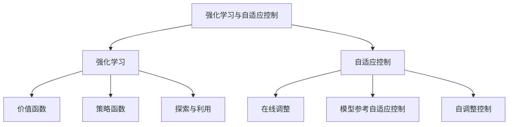

# 强化学习与自适应控制原理与代码实战案例讲解

## 1. 背景介绍

### 1.1 问题的由来

在当今快节奏的环境中,控制系统需要能够适应不断变化的条件和不确定性。传统的控制方法通常依赖于精确建模和预定义的规则,但在复杂动态环境中,这些方法可能效率低下或根本无法应用。强化学习(Reinforcement Learning)作为一种基于经验的学习范式,为解决这一挑战提供了一种有前景的方法。

自适应控制(Adaptive Control)是另一个关键领域,旨在设计能够在线调整控制策略以适应系统变化的控制器。结合强化学习和自适应控制的思想,可以创建能够通过与环境交互来学习最优控制策略的智能系统。

### 1.2 研究现状

近年来,强化学习在控制领域的应用受到了广泛关注。深度强化学习(Deep Reinforcement Learning)的兴起进一步推动了该领域的发展,使得智能体能够从高维观测数据中学习复杂的控制策略。同时,自适应控制理论也在不断发展,提出了多种适应性控制算法。

然而,将强化学习与自适应控制相结合仍然是一个具有挑战性的问题。需要解决诸如探索与利用权衡、环境动态性、稳定性保证等问题。此外,如何在实际系统中有效部署这些算法也是一个重要课题。

### 1.3 研究意义

结合强化学习和自适应控制的方法具有重要的理论和实际意义:

- 理论层面:可以推动机器学习、控制理论和智能系统等多个领域的交叉发展,提出新的理论模型和算法。
- 实际应用:在机器人控制、自动驾驶、工业自动化等领域具有广泛的应用前景,可以提高系统的智能化水平和适应能力。

### 1.4 本文结构

本文将系统地介绍强化学习与自适应控制的原理、算法和实践案例。文章结构如下:

1. 背景介绍
2. 核心概念与联系
3. 核心算法原理与具体操作步骤
4. 数学模型和公式详细讲解与举例说明
5. 项目实践:代码实例和详细解释说明
6. 实际应用场景
7. 工具和资源推荐
8. 总结:未来发展趋势与挑战
9. 附录:常见问题与解答

## 2. 核心概念与联系

强化学习(Reinforcement Learning)和自适应控制(Adaptive Control)是两个密切相关但又有所区别的概念。

**强化学习**是一种基于奖赏或惩罚的学习范式,智能体(Agent)通过与环境(Environment)交互来学习最优策略。其核心概念包括:

- **价值函数(Value Function)**: 评估当前状态或状态-动作对的期望回报,用于指导智能体的决策。
- **策略函数(Policy Function)**: 定义了智能体在每个状态下采取的行为。
- **探索与利用(Exploration vs Exploitation)**: 在学习过程中,智能体需要权衡探索新的行为和利用已学习的知识。

**自适应控制**旨在设计能够在线调整控制策略以适应系统变化的控制器。其核心思想包括:

- **在线调整(Online Adjustment)**: 控制器根据系统的实时反馈调整控制参数或策略。
- **模型参考自适应控制(Model Reference Adaptive Control)**: 控制器根据参考模型的输出调整参数,使实际系统输出跟踪参考模型。
- **自调整控制(Self-Tuning Control)**: 控制器通过在线估计系统参数,并基于估计值调整控制策略。

强化学习和自适应控制可以相互借鉴和结合:

- 强化学习可以用于自适应控制中的在线策略优化,智能体通过与环境交互来学习最优控制策略。
- 自适应控制理论可以为强化学习提供稳定性保证和收敛性分析。
- 将两者结合可以创建能够在复杂动态环境中自主学习和自适应的智能控制系统。

## 3. 核心算法原理与具体操作步骤

在这一部分,我们将介绍强化学习与自适应控制相结合的核心算法原理和具体操作步骤。

### 3.1 算法原理概述

结合强化学习和自适应控制的算法通常包括以下几个关键组成部分:

1. **智能体(Agent)**: 负责与环境交互并学习最优控制策略。
2. **环境(Environment)**: 表示被控制的动态系统,智能体通过对环境采取行动并观察反馈来学习。
3. **价值函数近似(Value Function Approximation)**: 使用函数逼近器(如神经网络)来表示价值函数,从而处理连续状态和动作空间。
4. **策略优化(Policy Optimization)**: 通过优化价值函数或直接优化策略函数来搜索最优控制策略。
5. **自适应机制(Adaptive Mechanism)**: 在线调整控制策略或学习算法参数,以适应系统变化和不确定性。

算法的工作流程通常如下:

1. 初始化智能体和环境。
2. 智能体与环境交互,采取行动并观察反馈。
3. 根据反馈更新价值函数近似或策略函数。
4. 根据自适应机制调整控制策略或算法参数。
5. 重复步骤2-4,直到策略收敛或达到停止条件。

### 3.2 算法步骤详解

下面我们将详细介绍算法的具体步骤:

1. **初始化**
   - 定义环境动态模型和奖励函数。
   - 初始化智能体的策略函数和价值函数近似器(如神经网络)。
   - 设置算法超参数,如学习率、折扣因子等。

2. **交互与采样**
   - 智能体根据当前策略在环境中采取行动。
   - 观察环境的反馈(下一状态和奖励)。
   - 将状态转换、行动、奖励和下一状态存储在经验回放缓冲区中。

3. **策略评估(基于价值函数的方法)**
   - 从经验回放缓冲区采样批次数据。
   - 使用时序差分(Temporal Difference)等方法计算价值函数目标。
   - 通过minimizing均方误差等方式更新价值函数近似器的参数。

4. **策略改进(基于策略梯度的方法)**
   - 从经验回放缓冲区采样批次数据。
   - 计算策略梯度,即对期望回报的策略参数梯度估计。
   - 使用策略梯度上升等方法更新策略函数参数。

5. **自适应调整**
   - 监测环境或系统的变化。
   - 根据变化调整控制策略、学习算法参数或自适应机制参数。
   - 常见的自适应机制包括:
     - 增量学习(Incremental Learning):在线微调策略或价值函数。
     - 元学习(Meta-Learning):学习调整算法超参数的方法。
     - 多模型集成(Multiple Model Ensemble):结合多个模型的预测。

6. **终止条件检查**
   - 检查策略是否收敛或达到预定的性能阈值。
   - 检查是否达到最大训练步数或其他停止条件。

上述步骤通常在训练循环中重复执行,直到算法收敛或满足终止条件。在测试阶段,可以使用学习到的最优策略在环境中执行控制任务。

### 3.3 算法优缺点

结合强化学习和自适应控制的算法具有以下优点:

- **适应性强**: 能够在线调整控制策略,适应环境和系统的变化。
- **无需精确建模**: 通过与环境交互学习,不需要精确的系统模型。
- **最优性**: 可以搜索最优控制策略,提高控制性能。
- **通用性**: 可以应用于各种控制任务和环境。

但同时也存在一些缺点和挑战:

- **样本效率低**: 需要大量的交互数据来学习有效的策略。
- **收敛性问题**: 难以保证算法的收敛性和稳定性。
- **超参数调优**: 算法性能对超参数设置敏感,需要大量调优。
- **安全性和可解释性**: 学习到的策略可能缺乏安全性和可解释性。

### 3.4 算法应用领域

结合强化学习和自适应控制的算法可以应用于各种控制领域,包括但不限于:

- **机器人控制**: 让机器人能够自主学习运动技能并适应环境变化。
- **自动驾驶**: 训练自动驾驶系统在复杂交通场景下做出适应性决策。
- **工业自动化**: 优化工业过程控制,提高生产效率和质量。
- **能源系统控制**: 实现对可再生能源系统的智能控制和优化。
- **航空航天控制**: 提高航天器在不确定环境中的适应性和鲁棒性。

## 4. 数学模型和公式详细讲解与举例说明

在这一部分,我们将介绍强化学习与自适应控制相关的数学模型和公式,并通过具体案例进行详细讲解。

### 4.1 数学模型构建

强化学习问题通常建模为**马尔可夫决策过程(Markov Decision Process, MDP)**,定义如下:

$$
\mathcal{M} = \langle \mathcal{S}, \mathcal{A}, \mathcal{P}, \mathcal{R}, \gamma \rangle
$$

其中:

- $\mathcal{S}$ 是状态空间集合
- $\mathcal{A}$ 是动作空间集合
- $\mathcal{P}$ 是状态转移概率函数,定义为 $\mathcal{P}_{ss'}^a = \mathbb{P}(s_{t+1}=s'|s_t=s, a_t=a)$
- $\mathcal{R}$ 是奖励函数,定义为 $\mathcal{R}_s^a = \mathbb{E}[r_{t+1}|s_t=s, a_t=a]$
- $\gamma \in [0, 1)$ 是折扣因子,用于权衡即时奖励和长期回报

目标是找到一个策略 $\pi: \mathcal{S} \rightarrow \mathcal{A}$,能够最大化期望的累积折扣回报:

$$
J(\pi) = \mathbb{E}_\pi \left[ \sum_{t=0}^\infty \gamma^t r_t \right]
$$

自适应控制通常建模为**不确定系统**,可以用状态空间模型表示:

$$
\begin{aligned}
x_{t+1} &= f(x_t, u_t, \theta_t) \
y_t &= h(x_t, \theta_t)
\end{aligned}
$$

其中:

- $x_t \in \mathcal{X}$ 是系统状态
- $u_t \in \mathcal{U}$ 是控制输入
- $y_t \in \mathcal{Y}$ 是系统输出
- $\theta_t \in \Theta$ 是未知的时变系统参数
- $f$ 和 $h$ 分别是状态转移方程和观测方程

目标是设计一个自适应控制器,使系统输出 $y_t$ 跟踪期望轨迹 $y_t^{ref}$,同时估计未知参数 $\theta_t$。

将强化学习和自适应控制相结合,我们可以将不确定系统建模为马尔可夫决策过程,智能体通过与系统交互来学习最优控制策略,并在线调整策略以适应系统变化。

### 4.2 公式推导过程

在这一小节,我们将推导强化学习算法中的一些核心公式,如贝尔曼方程和策略梯度定理。

**贝尔曼方程**

贝尔曼方程是强化学习中的基础,用于定义最优价值函数。对于任意策略 $\pi$,其状态价值函数 $V^\pi(s)$ 满足:

$$
V^\pi(s) = \mathbb{E}_\pi \left[ \sum_{k=0}^\infty \gamma^