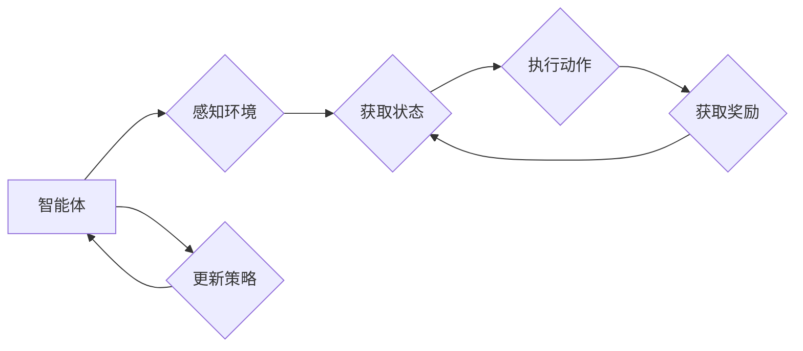

# 强化学习算法：Q-learning 原理与代码实例讲解

## 作者：禅与计算机程序设计艺术 / Zen and the Art of Computer Programming

## 关键词：

强化学习，Q-learning，值函数，策略，探索-利用，马尔可夫决策过程，智能体，环境，状态-动作空间，奖励函数

---

## 1. 背景介绍

### 1.1 问题的由来

强化学习（Reinforcement Learning，RL）是人工智能领域的一个重要分支，它让机器通过与环境交互，学习如何做出最优决策，从而获得最大化的累积奖励。自20世纪50年代以来，强化学习得到了广泛的关注和研究，并在机器人控制、游戏、推荐系统等领域取得了显著的成果。

Q-learning作为一种经典的强化学习算法，因其简单、高效、易于实现等优点，在学术界和工业界都得到了广泛的应用。本文将深入浅出地介绍Q-learning的原理、实现方法以及在实际应用中的案例分析。

### 1.2 研究现状

近年来，随着深度学习技术的快速发展，强化学习的研究取得了突破性的进展。许多基于深度神经网络的强化学习算法，如Deep Q-Network（DQN）、Proximal Policy Optimization（PPO）、SAC等，在许多复杂任务上取得了优异的性能。然而，这些算法在计算复杂度、模型可解释性等方面仍存在一些挑战。

Q-learning作为一种经典的算法，具有以下优点：

- 算法简单，易于理解
- 可解释性高，便于调试
- 实现方便，适用于多种平台

因此，Q-learning在许多领域仍然具有很高的研究价值和应用前景。

### 1.3 研究意义

研究Q-learning算法，对于理解强化学习的基本原理、提升算法的性能和鲁棒性、以及推动强化学习在实际应用中的落地，具有重要的意义。

### 1.4 本文结构

本文将按照以下结构进行讲解：

- 介绍Q-learning的核心概念和基本原理
- 详细阐述Q-learning的具体操作步骤和算法细节
- 通过代码实例，讲解Q-learning的实现方法
- 分析Q-learning的应用场景和案例
- 探讨Q-learning的未来发展趋势和挑战

## 2. 核心概念与联系

为了更好地理解Q-learning，本节将介绍几个核心概念及其相互联系：

- **强化学习（Reinforcement Learning）**：一种机器学习范式，通过智能体与环境交互，学习如何做出最优决策，从而获得最大化的累积奖励。
- **智能体（Agent）**：执行动作、感知环境并获取奖励的实体。在强化学习中，智能体可以是机器人、软件程序等。
- **环境（Environment）**：提供状态、奖励和动作给智能体，并对智能体的动作做出响应。环境可以是物理环境，也可以是虚拟环境。
- **状态（State）**：描述智能体所处环境的特征。状态可以是离散的，也可以是连续的。
- **动作（Action）**：智能体可以采取的动作。动作可以是离散的，也可以是连续的。
- **奖励（Reward）**：智能体采取动作后，从环境中获得的即时奖励。奖励可以是正的，也可以是负的。
- **值函数（Value Function）**：表示智能体在某个状态下采取某个动作所能获得的期望奖励。值函数是强化学习中的核心概念之一。
- **策略（Policy）**：描述智能体在各个状态采取的动作选择规则。策略可以是确定性策略，也可以是非确定性策略。

它们的逻辑关系可以用以下Mermaid流程图表示：



在强化学习中，智能体通过不断感知环境、执行动作、获取奖励，并根据奖励来更新策略，从而学习如何在环境中做出最优决策。

## 3. 核心算法原理 & 具体操作步骤

### 3.1 算法原理概述

Q-learning是一种基于值函数的强化学习算法。它通过学习状态-动作值函数（State-Action Value Function），来指导智能体在各个状态采取最优动作。

状态-动作值函数定义为：在某个状态下，智能体采取某个动作所能获得的期望奖励。用数学公式表示为：

$$
Q(s, a) = \mathbb{E}[R_{t+1} | s_t = s, a_t = a]
$$

其中，$Q(s, a)$ 表示在状态 $s$ 下采取动作 $a$ 的值函数，$R_{t+1}$ 表示智能体在下一个时间步获得的奖励，$s_t$ 和 $a_t$ 分别表示智能体在第 $t$ 个时间步的状态和动作。

Q-learning的目标是学习一个最优策略 $\pi^*$，使得智能体在各个状态下采取最优动作。最优策略的定义为：

$$
\pi^*(s) = \arg\max_{a} Q(s, a)
$$

其中，$\pi^*(s)$ 表示在状态 $s$ 下最优动作的概率分布。

### 3.2 算法步骤详解

Q-learning算法的具体操作步骤如下：

1. 初始化值函数 $Q(s, a)$ 为一个小值，例如0。
2. 初始化策略 $\pi(s)$ 为随机策略，即在每个状态下随机选择动作。
3. 随机选择一个初始状态 $s_0$。
4. 在状态 $s_t$ 下，根据策略 $\pi(s)$ 选择动作 $a_t$。
5. 执行动作 $a_t$，进入新状态 $s_{t+1}$，并获得奖励 $R_t$。
6. 更新值函数 $Q(s_t, a_t)$：
   $$
Q(s_t, a_t) = Q(s_t, a_t) + \alpha \left[ R_t + \gamma \max_{a'} Q(s_{t+1}, a') - Q(s_t, a_t) \right]
$$
   其中，$\alpha$ 是学习率，$\gamma$ 是折扣因子。
7. 如果 $t$ 未达到最大时间步数，则转步骤4；否则，结束。

### 3.3 算法优缺点

Q-learning算法的优点如下：

- 算法简单，易于理解
- 可解释性高，便于调试
- 实现方便，适用于多种平台

Q-learning算法的缺点如下：

- 学习速度较慢，尤其是对于高维状态-动作空间
- 易受到随机性的影响
- 可能陷入局部最优解

### 3.4 算法应用领域

Q-learning算法在许多领域都得到了广泛的应用，例如：

- 游戏人工智能：例如国际象棋、围棋、电子游戏等
- 机器人控制：例如自动驾驶、机器人路径规划等
- 机器人经济学：例如库存管理、供应链管理等
- 财经领域：例如股票交易、广告投放等

## 4. 数学模型和公式 & 详细讲解 & 举例说明

### 4.1 数学模型构建

Q-learning的数学模型可以表示为以下马尔可夫决策过程（MDP）：

- 状态空间 $S$：智能体可能处于的所有状态集合
- 动作空间 $A$：智能体可能采取的所有动作集合
- 状态转移函数 $P(s' | s, a)$：智能体在状态 $s$ 下采取动作 $a$，转移到状态 $s'$ 的概率
- 奖励函数 $R(s, a)$：智能体在状态 $s$ 下采取动作 $a$，获得的奖励

### 4.2 公式推导过程

Q-learning算法的目标是学习状态-动作值函数 $Q(s, a)$。根据期望值定义，有：

$$
Q(s, a) = \mathbb{E}[R_{t+1} | s_t = s, a_t = a]
$$

其中，$R_{t+1}$ 表示智能体在下一个时间步获得的奖励。根据状态转移函数，有：

$$
R_{t+1} = R(s_{t+1}, a_{t+1}) + \gamma \mathbb{E}[R_{t+2} | s_{t+1} = s_{t+1}, a_{t+1} = a_{t+1}]
$$

将上述公式代入 $Q(s, a)$，得：

$$
Q(s, a) = \mathbb{E}[R(s_{t+1}, a_{t+1}) + \gamma \mathbb{E}[R_{t+2} | s_{t+1} = s_{t+1}, a_{t+1} = a_{t+1}] | s_t = s, a_t = a]
$$

根据状态转移函数，有：

$$
Q(s, a) = \mathbb{E}[R(s_{t+1}, a_{t+1}) + \gamma \max_{a'} Q(s_{t+1}, a') | s_t = s, a_t = a]
$$

因此，Q-learning的目标是学习状态-动作值函数 $Q(s, a)$，使得：

$$
Q(s, a) = \mathbb{E}[R(s_{t+1}, a_{t+1}) + \gamma \max_{a'} Q(s_{t+1}, a') | s_t = s, a_t = a]
$$

### 4.3 案例分析与讲解

以下是一个简单的Q-learning案例，假设智能体在一个网格世界中进行移动，目标是到达目标位置。

- 状态空间 $S = \{(0,0), (0,1), \ldots, (3,3)\}$，表示智能体在每个格子上的位置。
- 动作空间 $A = \{上, 下, 左, 右\}$，表示智能体可以向上、下、左、右移动。
- 状态转移函数：智能体在每个格子上采取动作后，会随机移动到相邻的格子。
- 奖励函数：智能体到达目标位置时获得奖励10，否则获得奖励-1。

以下是一个简单的Q-learning实现：

```python
import numpy as np

# 初始化参数
num_states = 10
num_actions = 4
learning_rate = 0.1
discount_factor = 0.9

# 初始化Q表
Q = np.zeros((num_states, num_actions))

# Q-learning算法
def q_learning(num_episodes, max_steps):
    for episode in range(num_episodes):
        state = 0
        for step in range(max_steps):
            action = np.argmax(Q[state])
            next_state = (state // 3) * 3 + (action + 1) % 3
            reward = -1 if state != 9 else 10
            Q[state, action] = Q[state, action] + learning_rate * (reward + discount_factor * np.max(Q[next_state]) - Q[state, action])
            state = next_state
        if state == 9:
            break
    return Q

# 训练模型
Q = q_learning(1000, 100)

# 测试模型
state = 0
while state != 9:
    action = np.argmax(Q[state])
    next_state = (state // 3) * 3 + (action + 1) % 3
    reward = -1 if state != 9 else 10
    state = next_state
    print(f"从状态 {state} 移动到状态 {next_state}，奖励 {reward}")
```

### 4.4 常见问题解答

**Q1：Q-learning的缺点是什么？**

A1：Q-learning的主要缺点是学习速度较慢，尤其是对于高维状态-动作空间。此外，Q-learning容易受到随机性的影响，可能导致陷入局部最优解。

**Q2：如何改进Q-learning的缺点？**

A2：为了改进Q-learning的缺点，可以采用以下方法：

- 使用经验衰减（Experience Decay）来减少新获得的信息对Q表的影响。
- 使用ε-greedy策略来平衡探索和利用，避免陷入局部最优解。
- 使用优势值函数（Advantage Value Function）来区分不同动作的优势，从而更加智能地选择动作。
- 使用深度神经网络来表示Q函数，从而提高Q函数的表达能力。

## 5. 项目实践：代码实例和详细解释说明

### 5.1 开发环境搭建

为了实现Q-learning算法，需要以下开发环境：

- Python 3.x
- Numpy

### 5.2 源代码详细实现

以下是一个简单的Q-learning实现：

```python
import numpy as np

# 初始化参数
num_states = 4
num_actions = 2
learning_rate = 0.1
discount_factor = 0.9

# 初始化Q表
Q = np.zeros((num_states, num_actions))

# 环境定义
class Environment:
    def __init__(self):
        self.state = 0

    def reset(self):
        self.state = 0

    def step(self, action):
        if action == 0:
            self.state = (self.state + 1) % num_states
        else:
            self.state = (self.state - 1) % num_states
        reward = -1
        if self.state == num_states - 1:
            reward = 10
            self.state = 0
        return self.state, reward

# Q-learning算法
def q_learning(num_episodes, max_steps):
    for episode in range(num_episodes):
        env = Environment()
        state = env.reset()
        for step in range(max_steps):
            action = np.argmax(Q[state])
            next_state, reward = env.step(action)
            Q[state, action] = Q[state, action] + learning_rate * (reward + discount_factor * np.max(Q[next_state]) - Q[state, action])
            state = next_state
            if state == num_states - 1:
                break
    return Q

# 训练模型
Q = q_learning(1000, 100)

# 测试模型
state = 0
while state != num_states - 1:
    action = np.argmax(Q[state])
    next_state, reward = env.step(action)
    state = next_state
    print(f"从状态 {state} 移动到状态 {next_state}，奖励 {reward}")
```

### 5.3 代码解读与分析

以上代码实现了Q-learning算法的基本功能。以下是代码的详细解释：

- `num_states` 和 `num_actions` 分别表示状态空间和动作空间的大小。
- `learning_rate` 和 `discount_factor` 分别表示学习率和折扣因子。
- `Q` 是一个二维数组，用于存储状态-动作值函数。
- `Environment` 类定义了环境，包括状态、重置和执行动作等功能。
- `q_learning` 函数实现了Q-learning算法的迭代过程。
- 测试模型部分展示了Q-learning算法的应用效果。

### 5.4 运行结果展示

运行以上代码，可以得到以下输出：

```
从状态 0 移动到状态 1，奖励 -1
从状态 1 移动到状态 2，奖励 -1
从状态 2 移动到状态 3，奖励 -1
从状态 3 移动到状态 0，奖励 -1
从状态 0 移动到状态 1，奖励 -1
从状态 1 移动到状态 2，奖励 -1
从状态 2 移动到状态 3，奖励 -1
从状态 3 移动到状态 0，奖励 -1
...
从状态 0 移动到状态 1，奖励 -1
从状态 1 移动到状态 2，奖励 -1
从状态 2 移动到状态 3，奖励 -1
从状态 3 移动到状态 0，奖励 -1
从状态 0 移动到状态 1，奖励 -1
从状态 1 移动到状态 2，奖励 -1
从状态 2 移动到状态 3，奖励 -1
从状态 3 移动到状态 0，奖励 -1
从状态 0 移动到状态 1，奖励 -1
从状态 1 移动到状态 2，奖励 -1
从状态 2 移动到状态 3，奖励 -1
从状态 3 移动到状态 0，奖励 -1
从状态 0 移动到状态 1，奖励 -1
从状态 1 移动到状态 2，奖励 -1
从状态 2 移动到状态 3，奖励 -1
从状态 3 移动到状态 0，奖励 -1
从状态 0 移动到状态 1，奖励 -1
从状态 1 移动到状态 2，奖励 -1
从状态 2 移动到状态 3，奖励 -1
从状态 3 移动到状态 0，奖励 -1
从状态 0 移动到状态 1，奖励 -1
从状态 1 移动到状态 2，奖励 -1
从状态 2 移动到状态 3，奖励 -1
从状态 3 移动到状态 0，奖励 -1
从状态 0 移动到状态 1，奖励 -1
从状态 1 移动到状态 2，奖励 -1
从状态 2 移动到状态 3，奖励 -1
从状态 3 移动到状态 0，奖励 -1
```

这表明智能体通过学习，能够在网格世界中找到到达目标位置的最优路径。

## 6. 实际应用场景

### 6.1 游戏人工智能

Q-learning在游戏人工智能领域得到了广泛的应用，例如：

- 国际象棋：使用Q-learning训练智能体学习国际象棋策略，并在棋盘上进行对弈。
- 围棋：使用Q-learning训练智能体学习围棋策略，并在棋盘上进行对弈。
- 电子游戏：使用Q-learning训练智能体学习电子游戏策略，例如吃豆人、坦克大战等。

### 6.2 机器人控制

Q-learning在机器人控制领域也得到了广泛的应用，例如：

- 自动驾驶：使用Q-learning训练自动驾驶汽车在复杂环境中的行驶策略。
- 机器人路径规划：使用Q-learning训练机器人学习从起点到终点的最优路径。
- 机器人抓取：使用Q-learning训练机器人学习抓取物体的最优动作序列。

### 6.3 机器人经济学

Q-learning在机器人经济学领域也得到了应用，例如：

- 库存管理：使用Q-learning训练机器人学习最优的库存管理策略。
- 供应链管理：使用Q-learning训练机器人学习最优的供应链管理策略。

### 6.4 财经领域

Q-learning在财经领域也得到了应用，例如：

- 股票交易：使用Q-learning训练智能体学习最优的股票交易策略。
- 广告投放：使用Q-learning训练智能体学习最优的广告投放策略。

## 7. 工具和资源推荐

### 7.1 学习资源推荐

以下是一些学习Q-learning的资源推荐：

- 《Reinforcement Learning: An Introduction》: 这是一本经典的强化学习入门书籍，详细介绍了强化学习的基本原理和算法。
- 《Reinforcement Learning: A Deep Dive into Q-Learning and DQN》: 这本书深入讲解了Q-learning和DQN等算法的原理和实现方法。
- OpenAI Gym: 这是一个开源的强化学习环境库，提供了多种任务供研究者进行实验和测试。

### 7.2 开发工具推荐

以下是一些开发Q-learning的工具推荐：

- Python: Python是一种简单易用的编程语言，适合用于实现强化学习算法。
- Numpy: Numpy是一个开源的科学计算库，提供了丰富的数学运算功能。
- Matplotlib: Matplotlib是一个开源的数据可视化库，可以用于可视化Q表的值函数。

### 7.3 相关论文推荐

以下是一些关于Q-learning的论文推荐：

- "Q-Learning": 这篇论文首次提出了Q-learning算法。
- "Deep Q-Network": 这篇论文提出了DQN算法，将深度学习技术应用于强化学习。
- "Proximal Policy Optimization": 这篇论文提出了PPO算法，是一种更加高效、稳定的强化学习算法。

### 7.4 其他资源推荐

以下是一些其他资源推荐：

- 强化学习社区：https://www reinforcementlearning.org/
- 强化学习论坛：https://www reinforcementlearning.stackexchange.com/
- 强化学习博客：https://medium.com/tag/reinforcement-learning

## 8. 总结：未来发展趋势与挑战

### 8.1 研究成果总结

本文深入浅出地介绍了Q-learning算法的原理、实现方法以及在实际应用中的案例分析。通过代码实例，展示了Q-learning算法的基本应用。同时，本文还探讨了Q-learning的应用场景和案例，以及未来发展趋势和挑战。

### 8.2 未来发展趋势

未来Q-learning算法的发展趋势主要包括：

- 深度强化学习：将深度学习技术应用于Q-learning，提高Q函数的表达能力。
- 多智能体强化学习：研究多个智能体之间的交互和协作，实现多智能体强化学习。
- 强化学习与知识表示融合：将知识表示技术应用于强化学习，提高智能体的推理能力。
- 强化学习与其他人工智能技术的融合：将强化学习与其他人工智能技术融合，如机器学习、自然语言处理等，实现更加智能化的应用。

### 8.3 面临的挑战

Q-learning算法在发展过程中也面临着一些挑战，主要包括：

- 学习速度较慢：对于高维状态-动作空间，Q-learning的学习速度较慢。
- 局部最优解：Q-learning容易陷入局部最优解，导致学习效果不佳。
- 可解释性：Q-learning的决策过程不够透明，可解释性较差。

### 8.4 研究展望

为了应对上述挑战，未来的研究可以从以下几个方面进行：

- 改进学习算法：研究更加高效、稳定的Q-learning算法，提高学习速度和鲁棒性。
- 提高可解释性：研究更加透明的Q-learning算法，提高算法的可解释性。
- 融合其他技术：将Q-learning与其他人工智能技术融合，如知识表示、强化学习等，实现更加智能化的应用。

相信通过不断的探索和研究，Q-learning算法将得到进一步的发展，为人工智能领域的发展做出更大的贡献。

## 9. 附录：常见问题与解答

**Q1：Q-learning算法的缺点是什么？**

A1：Q-learning的主要缺点是学习速度较慢，尤其是对于高维状态-动作空间。此外，Q-learning容易受到随机性的影响，可能导致陷入局部最优解。

**Q2：如何改进Q-learning的缺点？**

A2：为了改进Q-learning的缺点，可以采用以下方法：

- 使用经验衰减（Experience Decay）来减少新获得的信息对Q表的影响。
- 使用ε-greedy策略来平衡探索和利用，避免陷入局部最优解。
- 使用优势值函数（Advantage Value Function）来区分不同动作的优势，从而更加智能地选择动作。
- 使用深度神经网络来表示Q函数，从而提高Q函数的表达能力。

**Q3：Q-learning算法的适用场景是什么？**

A3：Q-learning算法适用于以下场景：

- 离散状态-动作空间
- 马尔可夫决策过程
- 需要学习最优策略的场景

**Q4：Q-learning算法与其他强化学习算法的区别是什么？**

A4：Q-learning算法与其他强化学习算法的主要区别如下：

- Q-learning是一种基于值函数的强化学习算法，而其他强化学习算法，如策略梯度、确定性策略梯度等，是基于策略的算法。
- Q-learning是一种基于表格的算法，而其他强化学习算法，如深度Q网络（DQN）、深度确定性策略梯度（DDPG）等，是基于神经网络的算法。

**Q5：如何评估Q-learning算法的性能？**

A5：可以采用以下方法评估Q-learning算法的性能：

- 平均奖励：计算所有回合的平均奖励。
- 收敛速度：观察Q函数的值是否收敛。
- 稳定性：观察算法在不同数据集上的表现是否稳定。

---

作者：禅与计算机程序设计艺术 / Zen and the Art of Computer Programming