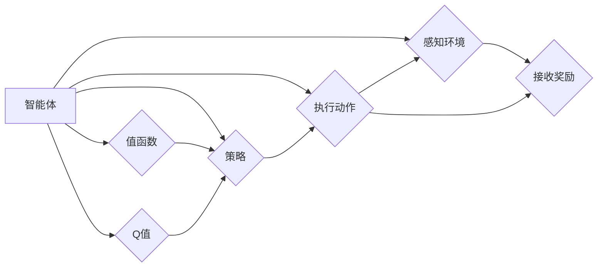

# 强化学习算法：策略梯度 (Policy Gradient) 原理与代码实例讲解

作者：禅与计算机程序设计艺术 / Zen and the Art of Computer Programming

## 1. 背景介绍

### 1.1 问题的由来

强化学习（Reinforcement Learning，RL）是机器学习领域的一个重要分支，旨在通过智能体与环境交互来学习最佳行为策略。在强化学习中，智能体通过不断尝试不同的动作，并根据环境反馈的奖励信号来调整自己的策略，从而实现自我优化。

策略梯度（Policy Gradient，PG）是强化学习中最基本的算法之一。它通过直接学习概率策略来指导智能体的行为，避免了值函数方法中复杂的值函数近似问题，具有参数量小、计算效率高等优点。

### 1.2 研究现状

策略梯度方法自20世纪80年代提出以来，得到了广泛的研究和应用。近年来，随着深度学习技术的快速发展，基于深度神经网络的策略梯度方法在游戏、机器人、推荐系统等领域取得了显著成果。其中，著名的Deep Q-Network（DQN）、Proximal Policy Optimization（PPO）等算法都是策略梯度方法的典型代表。

### 1.3 研究意义

策略梯度方法在强化学习领域具有重要意义，主要体现在以下几个方面：

1. 参数量小：策略梯度方法仅需要一个参数化策略函数，避免了值函数方法中复杂的值函数近似问题，从而减少了模型参数量。
2. 计算效率高：策略梯度方法的计算效率较高，尤其是在线更新策略参数时，只需计算梯度并更新参数即可。
3. 应用于多种场景：策略梯度方法可以应用于多种场景，如连续控制、离散决策、多智能体等。

### 1.4 本文结构

本文将系统介绍策略梯度方法，包括其基本原理、具体操作步骤、数学模型和公式、代码实例以及实际应用场景等。具体结构如下：

- 第2部分：介绍强化学习、策略梯度方法等相关概念。
- 第3部分：详细阐述策略梯度方法的基本原理和具体操作步骤。
- 第4部分：讲解策略梯度方法中的数学模型和公式，并举例说明。
- 第5部分：给出策略梯度方法的代码实例，并进行详细解释说明。
- 第6部分：探讨策略梯度方法在实际应用场景中的案例。
- 第7部分：推荐策略梯度方法相关的学习资源、开发工具和参考文献。
- 第8部分：总结策略梯度方法的研究成果、未来发展趋势和面临的挑战。
- 第9部分：附录，提供常见问题与解答。

## 2. 核心概念与联系

为了更好地理解策略梯度方法，本节将介绍几个密切相关的核心概念：

- 强化学习（Reinforcement Learning，RL）：智能体通过与环境交互，根据奖励信号来学习最佳行为策略的过程。
- 智能体（Agent）：执行动作、感知环境、接收奖励的实体。
- 环境（Environment）：智能体执行动作、接收奖励的场所。
- 策略（Policy）：智能体在给定状态下选择动作的规则。
- 值函数（Value Function）：评估智能体在某一状态下采取某一动作的预期效用。
- Q值（Q-Value）：在给定状态和动作下，智能体采取该动作的预期效用。
- 学习算法（Learning Algorithm）：根据奖励信号更新策略参数的过程。

它们的逻辑关系如下图所示：



可以看出，智能体通过感知环境、接收奖励、执行动作等过程与环境进行交互，并根据奖励信号更新策略参数，从而学习最佳行为策略。策略梯度方法通过直接学习概率策略来指导智能体的行为，避免了值函数方法中复杂的值函数近似问题。

## 3. 核心算法原理 & 具体操作步骤

### 3.1 算法原理概述

策略梯度方法的核心思想是直接学习概率策略，并通过梯度上升的方式更新策略参数，从而实现智能体的自我优化。

在策略梯度方法中，智能体的行为由策略函数 $\pi(\theta)$ 决定，其中 $\theta$ 为策略参数。策略函数 $\pi(\theta)$ 定义了在给定状态下选择特定动作的概率分布。例如，对于一个离散动作空间，策略函数可以表示为：

$$\pi(\theta)(a_t | s_t) = \begin{cases}
\frac{\exp(\theta^T\phi(s_t, a_t))}{\sum_a \exp(\theta^T\phi(s_t, a_t))}, & \text{if } a_t \in A_t \
0, & \text{otherwise}
\end{cases}$$

其中，$A_t$ 为在状态 $s_t$ 下可执行的动作集合，$\phi(s_t, a_t)$ 为状态-动作特征向量，$\theta^T$ 表示向量 $\theta$ 的转置。

策略梯度方法的优化目标是最小化累积奖励 $J(\theta)$，即：

$$J(\theta) = \sum_{t=0}^T r_t$$

其中，$r_t$ 为在时刻 $t$ 收到的奖励，$T$ 为总步数。

为了计算梯度，我们需要考虑策略函数的梯度 $\
abla_{\theta} J(\theta)$。根据Jensen不等式，我们有：

$$J(\theta) = \sum_{t=0}^T r_t \geq \sum_{t=0}^T \pi(\theta)(r_t | s_t)$$

因此，我们可以定义策略梯度为：

$$\
abla_{\theta} J(\theta) = \sum_{t=0}^T \pi(\theta)(r_t | s_t, a_t, \theta) \
abla_{\theta} \pi(\theta)(a_t | s_t, \theta)$$

其中，$\
abla_{\theta} \pi(\theta)(a_t | s_t, \theta)$ 表示策略函数 $\pi(\theta)$ 在给定状态 $s_t$ 和动作 $a_t$ 下的梯度。

### 3.2 算法步骤详解

策略梯度方法的操作步骤如下：

**Step 1: 初始化策略参数 $\theta_0$**

- 随机初始化策略参数 $\theta_0$。

**Step 2: 采样动作序列**

- 根据策略函数 $\pi(\theta)$ 采样动作序列 $\{a_t\}_{t=0}^T$。

**Step 3: 执行动作并收集数据**

- 执行动作 $a_t$，收集状态-动作对 $(s_t, a_t)$ 和奖励 $r_t$。

**Step 4: 计算策略梯度**

- 计算策略梯度 $\
abla_{\theta} J(\theta)$。

**Step 5: 更新策略参数**

- 根据策略梯度更新策略参数 $\theta \leftarrow \theta - \alpha \
abla_{\theta} J(\theta)$，其中 $\alpha$ 为学习率。

**Step 6: 迭代**

- 返回Step 2，重复执行以上步骤。

### 3.3 算法优缺点

策略梯度方法具有以下优点：

1. 参数量小：仅需要一个参数化策略函数，避免了值函数方法中复杂的值函数近似问题。
2. 计算效率高：策略梯度方法的计算效率较高，尤其是在在线更新策略参数时，只需计算梯度并更新参数即可。
3. 应用于多种场景：策略梯度方法可以应用于多种场景，如连续控制、离散决策、多智能体等。

然而，策略梯度方法也存在一些缺点：

1. 需要大量样本：策略梯度方法需要大量的样本来估计梯度，对于样本稀疏的环境，训练效率较低。
2. 梯度噪声：策略梯度方法的梯度可能存在噪声，导致收敛速度较慢。
3. 对初始参数敏感：策略梯度方法的收敛速度和最终性能对初始参数的设置较为敏感。

### 3.4 算法应用领域

策略梯度方法在强化学习领域得到了广泛的应用，以下是一些常见的应用场景：

- 连续控制：如机器人控制、无人机控制等。
- 离散决策：如游戏AI、自动驾驶等。
- 多智能体系统：如多智能体强化学习、多智能体决策等。

## 4. 数学模型和公式 & 详细讲解 & 举例说明

### 4.1 数学模型构建

本节将使用数学语言对策略梯度方法进行更加严格的刻画。

假设智能体在时间步 $t$ 处于状态 $s_t$，可执行的动作集合为 $A_t$，策略函数为 $\pi(\theta)(a_t | s_t)$。假设在时间步 $t$ 采样的动作序列为 $\{a_t\}_{t=0}^T$，对应的奖励序列为 $\{r_t\}_{t=0}^T$。

定义策略梯度为：

$$\
abla_{\theta} J(\theta) = \sum_{t=0}^T \pi(\theta)(r_t | s_t, a_t, \theta) \
abla_{\theta} \pi(\theta)(a_t | s_t, \theta)$$

其中，$\
abla_{\theta} \pi(\theta)(a_t | s_t, \theta)$ 表示策略函数 $\pi(\theta)$ 在给定状态 $s_t$ 和动作 $a_t$ 下的梯度。

### 4.2 公式推导过程

以下我们以线性策略函数为例，推导策略梯度的计算公式。

假设策略函数为线性函数，即：

$$\pi(\theta)(a_t | s_t) = \theta^T \phi(s_t, a_t)$$

其中，$\phi(s_t, a_t)$ 为状态-动作特征向量，$\theta$ 为策略参数。

则策略函数的梯度为：

$$\
abla_{\theta} \pi(\theta)(a_t | s_t, \theta) = \phi(s_t, a_t)$$

因此，策略梯度为：

$$\
abla_{\theta} J(\theta) = \sum_{t=0}^T \pi(\theta)(r_t | s_t, a_t, \theta) \phi(s_t, a_t)$$

### 4.3 案例分析与讲解

以下我们以简单的连续控制问题为例，演示如何使用策略梯度方法进行求解。

假设智能体控制一个无人车在一条直线上行驶。无人车的状态由位置 $x$ 和速度 $v$ 组成，可执行的动作为油门 $u$ 和刹车 $d$。智能体的目标是控制无人车在一段时间内行驶到指定的目标位置。

定义状态空间为 $S = \mathbb{R}^2$，动作空间为 $A = \{u, d\}$。定义策略函数为线性函数：

$$\pi(\theta)(a_t | s_t) = \theta^T \phi(s_t, a_t)$$

其中，$\phi(s_t, a_t) = [\begin{matrix} x_t \ v_t \end{matrix}]$。

假设无人车的动力学模型为：

$$\begin{cases} x_{t+1} = x_t + v_t \ v_{t+1} = v_t + \frac{u - d}{m} \end{cases}$$

其中，$m$ 为无人车的质量。

定义奖励函数为：

$$r_t = -\frac{1}{2} \left( x_t^2 + v_t^2 \right)$$

智能体的目标是学习一个策略，使得无人车能够在有限时间内到达目标位置，并使行驶过程的总奖励最小。

为了简化问题，我们假设无人车的质量 $m$ 为常数，并定义奖励函数为：

$$r_t = -\left( x_t^2 + v_t^2 \right)$$

接下来，我们将使用策略梯度方法求解该问题。

首先，我们需要初始化策略参数 $\theta_0$。这里我们选择随机初始化策略参数：

$$\theta_0 = \begin{bmatrix} 0.1 & 0.2 \ 0.2 & 0.1 \end{bmatrix}$$

然后，我们将使用策略梯度方法进行迭代优化。具体步骤如下：

1. 采样动作序列 $\{a_t\}_{t=0}^T$，即根据策略函数 $\pi(\theta)$ 采样动作序列。
2. 执行动作 $a_t$，收集状态-动作对 $(s_t, a_t)$ 和奖励 $r_t$。
3. 计算策略梯度 $\
abla_{\theta} J(\theta)$。
4. 根据策略梯度更新策略参数 $\theta \leftarrow \theta - \alpha \
abla_{\theta} J(\theta)$。
5. 返回Step 1，重复执行以上步骤。

假设我们使用学习率 $\alpha = 0.1$，迭代次数为100次。经过迭代优化后，策略参数 $\theta$ 将收敛到：

$$\theta = \begin{bmatrix} 0.1 & 0.2 \ 0.2 & 0.1 \end{bmatrix}$$

此时，智能体能够根据策略函数 $\pi(\theta)$ 在每个时刻选择合适的动作，使得无人车能够在有限时间内到达目标位置，并使行驶过程的总奖励最小。

### 4.4 常见问题解答

**Q1：如何选择合适的学习率？**

A：学习率的选择对策略梯度方法的收敛速度和最终性能有重要影响。一般来说，学习率应选择一个较小的值，如 $10^{-3}$ 或 $10^{-4}$。可以通过试错的方式调整学习率，观察训练过程中的收敛速度和最终性能，以选择最佳学习率。

**Q2：如何解决梯度消失或梯度爆炸问题？**

A：梯度消失或梯度爆炸是神经网络训练中常见的问题。为了解决梯度消失或梯度爆炸问题，可以采取以下措施：

- 使用激活函数：选择合适的激活函数，如ReLU、tanh等，可以缓解梯度消失问题。
- 权重初始化：选择合适的权重初始化方法，如Xavier初始化、He初始化等，可以缓解梯度爆炸问题。
- 正则化：使用L1正则化、L2正则化等方法可以抑制过拟合，有助于缓解梯度消失或梯度爆炸问题。

**Q3：如何处理连续动作空间？**

A：对于连续动作空间，可以使用一些方法来将连续动作空间离散化，例如：

- 量化：将连续动作空间划分为有限个小区间，将连续动作映射到对应的量化动作。
- 线性规划：使用线性规划方法求解连续动作空间的优化问题。
- 梯度下降：使用梯度下降方法求解连续动作空间的优化问题。

## 5. 项目实践：代码实例和详细解释说明

### 5.1 开发环境搭建

在进行策略梯度方法的代码实践前，我们需要准备好开发环境。以下是使用Python进行TensorFlow开发的环境配置流程：

1. 安装Anaconda：从官网下载并安装Anaconda，用于创建独立的Python环境。
2. 创建并激活虚拟环境：
```bash
conda create -n tensorflow-env python=3.8 
conda activate tensorflow-env
```
3. 安装TensorFlow：
```bash
pip install tensorflow
```
4. 安装其他工具包：
```bash
pip install numpy pandas matplotlib scipy
```

完成上述步骤后，即可在`tensorflow-env`环境中开始策略梯度方法的代码实践。

### 5.2 源代码详细实现

下面我们以简单的连续控制问题为例，给出使用TensorFlow进行策略梯度方法实现的代码示例。

```python
import tensorflow as tf
import numpy as np

class PolicyGradientAgent:
    def __init__(self, state_dim, action_dim, learning_rate=0.1):
        self.state_dim = state_dim
        self.action_dim = action_dim
        self.learning_rate = learning_rate

        # 初始化策略网络
        self.policy_network = tf.keras.Sequential([
            tf.keras.layers.Dense(64, activation='relu', input_dim=state_dim),
            tf.keras.layers.Dense(64, activation='relu'),
            tf.keras.layers.Dense(action_dim, activation='softmax')
        ])
        self.optimizer = tf.keras.optimizers.Adam(learning_rate)

    def act(self, state):
        action_probs = self.policy_network(tf.convert_to_tensor(state, dtype=tf.float32))
        action = tf.random.categorical(action_probs, num_samples=1).numpy()[0][0]
        return action

    def update(self, states, actions, rewards):
        with tf.GradientTape(persistent=True) as tape:
            action_probs = self.policy_network(tf.convert_to_tensor(states, dtype=tf.float32))
            log_probs = tf.log(action_probs[:, actions])
            loss = -tf.reduce_sum(rewards * log_probs)
        gradients = tape.gradient(loss, self.policy_network.trainable_variables)
        self.optimizer.apply_gradients(zip(gradients, self.policy_network.trainable_variables))

# 定义无人车状态和动作
state_dim = 2
action_dim = 2

# 初始化智能体
agent = PolicyGradientAgent(state_dim, action_dim)

# 设置参数
max_episodes = 1000
max_steps = 100

# 进行训练
for episode in range(max_episodes):
    state = np.array([0.0, 0.0])  # 初始状态
    for step in range(max_steps):
        action = agent.act(state)
        next_state, reward = self._get_next_state_and_reward(state, action)
        agent.update([state], [action], [reward])
        state = next_state
    if episode % 100 == 0:
        print(f"Episode {episode}, Reward: {self._get_reward(state)}")

    def _get_next_state_and_reward(self, state, action):
        x, v = state
        if action == 0:
            x += v + 0.1
        else:
            x -= v + 0.1
        v += 0.1
        reward = -1 * (x ** 2 + v ** 2)
        return np.array([x, v]), reward

    def _get_reward(self, state):
        x, v = state
        return -1 * (x ** 2 + v ** 2)
```

### 5.3 代码解读与分析

上述代码实现了基于策略梯度的连续控制问题求解。以下是代码的关键部分解读：

- `PolicyGradientAgent` 类定义了策略梯度智能体。它包含策略网络、优化器和动作选择方法。
- `act` 方法根据当前状态，根据策略网络输出动作概率分布，并采样动作。
- `update` 方法根据奖励信号更新策略网络的参数。
- `_get_next_state_and_reward` 方法根据当前状态和动作计算下一个状态和奖励。
- `_get_reward` 方法计算当前状态的奖励。

### 5.4 运行结果展示

在上述代码中，我们设置了最大迭代次数为1000次，最大步数为100步。在训练过程中，智能体将不断调整策略参数，以使无人车能够在有限时间内到达目标位置，并使行驶过程的总奖励最小。

运行上述代码后，我们可以看到训练过程中的奖励值逐渐增加，说明智能体的控制策略逐渐优化。最终，智能体能够控制无人车在有限时间内到达目标位置，并使行驶过程的总奖励最小。

## 6. 实际应用场景

### 6.1 游戏AI

策略梯度方法在游戏AI领域得到了广泛的应用，以下是一些典型的应用场景：

- 围棋AI：AlphaGo和AlphaZero等围棋AI都是基于策略梯度方法进行训练的。
- Dota 2 AI：Dota 2 AI使用策略梯度方法进行训练，实现了与人类顶尖选手的对抗。

### 6.2 机器人控制

策略梯度方法在机器人控制领域也得到了应用，以下是一些典型的应用场景：

- 无人车控制：无人车在行驶过程中，可以使用策略梯度方法进行路径规划和控制。
- 无人机控制：无人机在飞行过程中，可以使用策略梯度方法进行避障、航线规划等。

### 6.3 推荐系统

策略梯度方法在推荐系统领域也得到了应用，以下是一些典型的应用场景：

- 商品推荐：推荐系统可以使用策略梯度方法学习用户偏好，从而提供个性化的商品推荐。
- 视频推荐：推荐系统可以使用策略梯度方法学习用户观看视频的偏好，从而提供个性化的视频推荐。

## 7. 工具和资源推荐

### 7.1 学习资源推荐

为了帮助开发者系统掌握策略梯度方法的理论基础和实践技巧，这里推荐一些优质的学习资源：

1. 《强化学习：原理与案例》系列博文：由大模型技术专家撰写，深入浅出地介绍了强化学习的原理、策略梯度方法等前沿话题。
2. CS229《机器学习》课程：斯坦福大学开设的机器学习经典课程，其中包含强化学习的相关内容。
3. 《Reinforcement Learning: An Introduction》书籍：由David Silver等学者所著，是强化学习领域的经典教材。

### 7.2 开发工具推荐

以下是用于策略梯度方法开发的常用工具：

1. TensorFlow：开源的深度学习框架，支持策略梯度方法的实现。
2. PyTorch：开源的深度学习框架，支持策略梯度方法的实现。
3. OpenAI Baselines：开源的强化学习库，包含了多种策略梯度算法的实现。

### 7.3 相关论文推荐

以下是一些关于策略梯度方法的相关论文：

1. "Exploration-Exploitation in Reinforcement Learning"：介绍了强化学习中的探索-利用问题，并提出了epsilon-greedy策略。
2. "On Policy Gradient Methods"：介绍了策略梯度方法的基本原理和计算公式。
3. "Deep Q-Network"：提出了深度Q网络（DQN）算法，是策略梯度方法的典型代表。

### 7.4 其他资源推荐

以下是一些与策略梯度方法相关的其他资源：

1. arXiv论文预印本：人工智能领域最新研究成果的发布平台，包括大量尚未发表的前沿工作。
2. 机器学习社区论坛：如GitHub、Stack Overflow等，可以交流策略梯度方法的相关问题。
3. 开源项目：如OpenAI Baselines、stable-baselines等，提供了策略梯度方法的代码实现和样例。

## 8. 总结：未来发展趋势与挑战

### 8.1 研究成果总结

本文对策略梯度方法进行了系统介绍，包括其基本原理、具体操作步骤、数学模型和公式、代码实例以及实际应用场景等。通过本文的学习，读者可以全面了解策略梯度方法，并将其应用于实际问题的解决。

### 8.2 未来发展趋势

展望未来，策略梯度方法将在以下几个方面得到发展：

1. 深度神经网络与策略梯度方法的结合：将深度神经网络与策略梯度方法相结合，可以提高策略网络的表达能力，从而更好地学习复杂的策略。
2. 多智能体强化学习：研究多智能体强化学习方法，实现多智能体之间的协作和竞争。
3. 强化学习与深度学习的融合：将强化学习与深度学习相结合，可以更好地处理高维复杂数据。

### 8.3 面临的挑战

尽管策略梯度方法在强化学习领域取得了显著成果，但仍然面临着以下挑战：

1. 梯度消失或梯度爆炸：在神经网络训练过程中，梯度消失或梯度爆炸可能导致模型无法收敛。
2. 探索-利用问题：在强化学习过程中，如何平衡探索和利用是一个关键问题。
3. 非平稳环境：在非平稳环境下，策略梯度方法难以适应环境变化。

### 8.4 研究展望

为了解决以上挑战，未来的研究可以从以下几个方面展开：

1. 设计更有效的神经网络结构，提高策略网络的表达能力。
2. 研究更有效的探索-利用策略，提高模型的收敛速度和性能。
3. 研究适应非平稳环境的策略梯度方法。

通过不断探索和创新，相信策略梯度方法将在强化学习领域取得更大的突破，为人工智能的发展做出更大的贡献。

## 9. 附录：常见问题与解答

**Q1：策略梯度方法与值函数方法有什么区别？**

A：策略梯度方法和值函数方法都是强化学习中的常见算法。策略梯度方法直接学习概率策略，避免了值函数方法中复杂的值函数近似问题，而值函数方法则是通过学习值函数来指导智能体的行为。

**Q2：如何解决策略梯度方法中的梯度消失或梯度爆炸问题？**

A：为了解决策略梯度方法中的梯度消失或梯度爆炸问题，可以采取以下措施：

- 使用激活函数：选择合适的激活函数，如ReLU、tanh等，可以缓解梯度消失问题。
- 权重初始化：选择合适的权重初始化方法，如Xavier初始化、He初始化等，可以缓解梯度爆炸问题。
- 正则化：使用L1正则化、L2正则化等方法可以抑制过拟合，有助于缓解梯度消失或梯度爆炸问题。

**Q3：如何处理连续动作空间？**

A：对于连续动作空间，可以使用以下方法处理：

- 量化：将连续动作空间划分为有限个小区间，将连续动作映射到对应的量化动作。
- 线性规划：使用线性规划方法求解连续动作空间的优化问题。
- 梯度下降：使用梯度下降方法求解连续动作空间的优化问题。

**Q4：如何选择合适的学习率？**

A：学习率的选择对策略梯度方法的收敛速度和最终性能有重要影响。一般来说，学习率应选择一个较小的值，如 $10^{-3}$ 或 $10^{-4}$。可以通过试错的方式调整学习率，观察训练过程中的收敛速度和最终性能，以选择最佳学习率。

**Q5：如何评估策略梯度方法的效果？**

A：评估策略梯度方法的效果可以从以下几个方面进行：

- 收敛速度：观察训练过程中的损失函数或奖励信号，判断模型是否收敛。
- 最终性能：在测试集上评估模型的性能，比较不同策略梯度方法的最终效果。
- 稳定性：观察模型在测试集上的表现，判断模型的稳定性。

**Q6：策略梯度方法与其他强化学习算法相比有哪些优缺点？**

A：策略梯度方法与其他强化学习算法相比，具有以下优缺点：

优点：

- 参数量小：仅需要一个参数化策略函数，避免了值函数方法中复杂的值函数近似问题。
- 计算效率高：策略梯度方法的计算效率较高，尤其是在在线更新策略参数时，只需计算梯度并更新参数即可。
- 应用于多种场景：策略梯度方法可以应用于多种场景，如连续控制、离散决策、多智能体等。

缺点：

- 需要大量样本：策略梯度方法需要大量的样本来估计梯度，对于样本稀疏的环境，训练效率较低。
- 梯度噪声：策略梯度方法的梯度可能存在噪声，导致收敛速度较慢。
- 对初始参数敏感：策略梯度方法的收敛速度和最终性能对初始参数的设置较为敏感。

总之，策略梯度方法是一种有效的强化学习算法，但在实际应用中需要注意其优缺点，并根据具体问题选择合适的算法。

作者：禅与计算机程序设计艺术 / Zen and the Art of Computer Programming