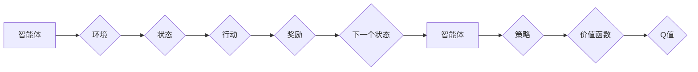

# 强化学习：基础概念解析

作者：禅与计算机程序设计艺术 / Zen and the Art of Computer Programming

## 关键词：

强化学习，多智能体，马尔可夫决策过程，Q学习，策略梯度，深度强化学习，应用场景

## 1. 背景介绍

### 1.1 问题的由来

强化学习（Reinforcement Learning，RL）是人工智能领域的一个重要分支，它模拟了人类学习和决策的过程。在强化学习中，智能体通过与环境的交互，不断学习最优策略，以实现目标。随着深度学习技术的快速发展，深度强化学习（Deep Reinforcement Learning，DRL）逐渐成为研究热点，并在游戏、机器人、自动驾驶等领域取得了显著成果。

### 1.2 研究现状

近年来，强化学习取得了长足的进步。从早期的Q学习、SARSA等基于值函数的方法，到基于策略梯度的方法，再到深度强化学习，强化学习的研究不断深入。随着深度学习技术的应用，DRL在图像识别、语音识别、自然语言处理等领域也取得了突破。

### 1.3 研究意义

强化学习具有广泛的应用前景，它可以应用于机器人控制、自动驾驶、游戏AI、推荐系统、智能客服等领域。研究强化学习有助于推动人工智能技术的发展，提高机器的学习和决策能力。

### 1.4 本文结构

本文将系统地介绍强化学习的基础概念、核心算法、应用场景等，帮助读者全面了解强化学习。

## 2. 核心概念与联系

强化学习涉及到许多核心概念，以下是其中一些重要的概念：

- **智能体（Agent）**：强化学习中的主体，负责与环境交互，并学习最优策略。
- **环境（Environment）**：智能体所在的动态环境，智能体通过观察环境的输出，并采取行动，与环境相互作用。
- **状态（State）**：描述环境状态的变量，智能体可以通过观察状态来了解环境信息。
- **行动（Action）**：智能体可以采取的行动，智能体的行动会影响环境的下一个状态。
- **奖励（Reward）**：智能体采取行动后，环境给予的奖励，奖励可以用来指导智能体的学习过程。
- **策略（Policy）**：智能体在特定状态下采取行动的概率分布。
- **价值函数（Value Function）**：描述智能体在某个状态下采取某个行动所能获得的最大期望奖励。
- **策略梯度（Policy Gradient）**：通过优化策略来最大化累积奖励。
- **Q值（Q-value）**：描述智能体在某个状态下采取某个行动所能获得的最大期望奖励。

这些概念之间的关系可以用以下Mermaid流程图表示：



## 3. 核心算法原理 & 具体操作步骤

### 3.1 算法原理概述

强化学习算法的核心思想是：智能体通过与环境交互，不断学习最优策略，以实现目标。强化学习算法可以分为基于值函数的方法和基于策略梯度的方法。

### 3.2 算法步骤详解

以下是一个基于值函数的强化学习算法——Q学习的具体操作步骤：

1. 初始化Q表：根据经验或随机策略初始化Q表。
2. 选择行动：在当前状态下，根据策略选择行动。
3. 执行行动：执行选择的行动，并观察环境的下一个状态和奖励。
4. 更新Q值：根据新的状态、奖励和Q学习公式更新Q值。
5. 迭代：重复步骤2-4，直到满足终止条件。

### 3.3 算法优缺点

Q学习算法的优点是：

- 理论基础完善，易于理解。
- 对环境的要求相对较低，适用于离散状态和行动空间。
- 可以通过异步方式进行学习，提高学习效率。

Q学习算法的缺点是：

- 对于连续状态和行动空间，Q学习算法难以应用。
- 学习过程可能需要较长时间，难以收敛。

### 3.4 算法应用领域

Q学习算法可以应用于以下领域：

- 机器人控制：如无人驾驶、机器臂控制等。
- 游戏AI：如棋类游戏、电子游戏等。
- 自动化：如自动化生产线、自动化测试等。

## 4. 数学模型和公式 & 详细讲解 & 举例说明

### 4.1 数学模型构建

强化学习的数学模型主要包括以下几个部分：

- 状态空间：$S$，表示所有可能的状态集合。
- 行动空间：$A$，表示所有可能的行为集合。
- 策略：$\pi(s)$，表示在状态$s \in S$下采取行动$a \in A$的概率。
- 奖励函数：$R(s, a)$，表示在状态$s$采取行动$a$后获得的奖励。

### 4.2 公式推导过程

以下是Q学习算法的核心公式：

$$
Q(s,a) = Q(s,a) + \alpha [R(s,a) + \gamma \max_{a'} Q(s',a') - Q(s,a)]
$$

其中：

- $Q(s,a)$ 表示在状态$s$采取行动$a$的期望奖励。
- $\alpha$ 表示学习率。
- $\gamma$ 表示折扣因子，表示对未来奖励的重视程度。
- $\max_{a'} Q(s',a')$ 表示在状态$s'$下采取所有行动的最大Q值。

### 4.3 案例分析与讲解

以下是一个简单的Q学习案例：

假设有一个智能体在网格世界中移动，它的目标是到达目标位置。智能体的状态由其当前位置表示，行动包括向上下左右四个方向移动。奖励函数为：

- 当智能体到达目标位置时，获得奖励+1。
- 当智能体移动到墙壁或其他障碍物时，获得奖励-1。
- 当智能体移动到其他位置时，获得奖励0。

使用Q学习算法训练智能体，可以按照以下步骤进行：

1. 初始化Q表：根据经验或随机策略初始化Q表。
2. 选择行动：在当前状态下，根据策略选择行动。
3. 执行行动：执行选择的行动，并观察环境的下一个状态和奖励。
4. 更新Q值：根据新的状态、奖励和Q学习公式更新Q值。
5. 迭代：重复步骤2-4，直到满足终止条件。

通过Q学习算法训练，智能体可以学会在网格世界中移动到目标位置。

### 4.4 常见问题解答

**Q1：Q学习和SARSA算法有什么区别？**

A：Q学习和SARSA算法都是基于值函数的强化学习算法，但它们在更新Q值的方式上有所不同。Q学习在更新Q值时，使用的是下一个状态下的最大Q值，而SARSA算法使用的是下一个状态下的实际Q值。

**Q2：Q学习算法需要手动设置学习率和折扣因子吗？**

A：是的，Q学习算法需要手动设置学习率和折扣因子。学习率和折扣因子的选择对学习效果有较大影响，需要根据具体问题进行调优。

## 5. 项目实践：代码实例和详细解释说明

### 5.1 开发环境搭建

以下是使用Python和OpenAI的Gym库进行Q学习实验的开发环境搭建步骤：

1. 安装Anaconda：从官网下载并安装Anaconda，用于创建独立的Python环境。
2. 创建并激活虚拟环境：
```bash
conda create -n rl-env python=3.8
conda activate rl-env
```
3. 安装必要的库：
```bash
conda install gym numpy matplotlib torch
```

### 5.2 源代码详细实现

以下是一个使用PyTorch和Gym库实现Q学习的代码实例：

```python
import gym
import numpy as np
import torch
import torch.nn as nn
import torch.optim as optim

# 定义Q网络
class QNetwork(nn.Module):
    def __init__(self, state_dim, action_dim):
        super(QNetwork, self).__init__()
        self.fc1 = nn.Linear(state_dim, 128)
        self.fc2 = nn.Linear(128, action_dim)

    def forward(self, state):
        x = torch.relu(self.fc1(state))
        return self.fc2(x)

# 初始化参数
state_dim = 4
action_dim = 4
q_network = QNetwork(state_dim, action_dim)
optimizer = optim.Adam(q_network.parameters(), lr=0.01)
criterion = nn.MSELoss()

# 训练函数
def train(q_network, optimizer, criterion, env, episodes=1000):
    for episode in range(episodes):
        state = env.reset()
        done = False
        total_reward = 0
        while not done:
            action = np.argmax(q_network(state).detach().numpy())
            next_state, reward, done, _ = env.step(action)
            total_reward += reward
            q_next = q_network(next_state).detach().numpy()
            q_current = q_network(state).detach().numpy()
            q_current[0, action] = reward + 0.99 * np.max(q_next)
            optimizer.zero_grad()
            loss = criterion(torch.from_numpy(q_current), torch.from_numpy(q_next))
            loss.backward()
            optimizer.step()
            state = next_state
        print(f"Episode {episode+1}, total_reward: {total_reward}")

# 创建环境
env = gym.make("CartPole-v0")

# 训练模型
train(q_network, optimizer, criterion, env)

# 评估模型
state = env.reset()
done = False
while not done:
    action = np.argmax(q_network(state).detach().numpy())
    state, reward, done, _ = env.step(action)
    env.render()
```

### 5.3 代码解读与分析

以上代码实现了基于PyTorch和Gym库的Q学习算法。首先，定义了一个简单的Q网络，用于预测Q值。然后，初始化参数和优化器。接着，定义了训练函数，通过反向传播算法更新Q网络的参数。最后，创建环境并训练模型。

### 5.4 运行结果展示

运行以上代码，可以看到智能体在CartPole环境中的训练过程。随着训练次数的增加，智能体的表现越来越好，最终可以稳定地控制CartPole。

## 6. 实际应用场景

强化学习在许多领域都有广泛的应用，以下是一些典型的应用场景：

- **游戏AI**：如国际象棋、围棋、电子游戏等。
- **机器人控制**：如无人驾驶、无人机、机器臂控制等。
- **自动化**：如自动化生产线、自动化测试等。
- **推荐系统**：如电影推荐、新闻推荐等。
- **智能客服**：如自动客服机器人、智能语音助手等。

## 7. 工具和资源推荐

### 7.1 学习资源推荐

以下是一些学习强化学习资源的推荐：

- 《深度强化学习》书籍：全面介绍了深度强化学习的基本概念、算法和案例。
- OpenAI Gym：一个开源的强化学习环境库，提供了丰富的游戏和模拟环境。
- PyTorch Reinforcement Learning教程：PyTorch官方提供的强化学习教程，介绍了PyTorch在强化学习中的应用。
- DRL.js：一个使用JavaScript实现的强化学习库，可以在线实验和可视化强化学习算法。

### 7.2 开发工具推荐

以下是一些开发强化学习项目的工具推荐：

- PyTorch：一个开源的深度学习框架，支持强化学习算法的编写和训练。
- TensorFlow：一个开源的深度学习框架，支持强化学习算法的编写和训练。
- OpenAI Gym：一个开源的强化学习环境库，提供了丰富的游戏和模拟环境。
- RLLIB：一个基于PyTorch的强化学习库，提供了多种强化学习算法和工具。

### 7.3 相关论文推荐

以下是一些强化学习领域的经典论文推荐：

- **Deep Reinforcement Learning** (Silver et al., 2016)：全面介绍了深度强化学习的基本概念、算法和应用。
- **Human-level control through deep reinforcement learning** (Silver et al., 2017)：介绍了AlphaGo如何通过深度强化学习战胜世界围棋冠军。
- **Mastering Chess and Shogi by Self-Play with a General Reinforcement Learning Algorithm** (Silver et al., 2018)：介绍了AlphaZero如何通过自我博弈训练，达到人类大师水平。
- **Policy Gradient Methods** (Sutton et al., 1999)：介绍了策略梯度算法的基本原理和应用。

### 7.4 其他资源推荐

以下是一些其他资源推荐：

- **强化学习课程**：斯坦福大学的强化学习课程，提供了丰富的教学视频和实验代码。
- **强化学习社区**：GitHub上的强化学习社区，可以交流学习经验，分享代码和资源。
- **强化学习比赛**：参加强化学习比赛，可以了解最新的研究成果，提升自己的技术能力。

## 8. 总结：未来发展趋势与挑战

### 8.1 研究成果总结

本文系统地介绍了强化学习的基础概念、核心算法、应用场景等。从Q学习、SARSA算法到深度强化学习，强化学习在理论和应用上都取得了显著成果。

### 8.2 未来发展趋势

未来，强化学习将朝着以下方向发展：

- **多智能体强化学习**：研究多个智能体在复杂环境中的协同合作和竞争策略。
- **强化学习与深度学习融合**：将深度学习技术应用于强化学习，提高模型的学习效率和学习效果。
- **强化学习与知识表示融合**：将知识表示技术应用于强化学习，提高模型的知识推理能力。
- **强化学习与强化学习伦理**：研究强化学习在伦理和安全方面的挑战和解决方案。

### 8.3 面临的挑战

尽管强化学习取得了显著成果，但仍然面临以下挑战：

- **环境建模**：如何准确地建模复杂环境，使得智能体能够快速学习到有效策略。
- **样本效率**：如何提高样本效率，降低学习成本。
- **可解释性**：如何提高强化学习算法的可解释性，使得算法的决策过程更加透明。
- **安全性**：如何保证强化学习算法的安全性，避免算法的恶意应用。

### 8.4 研究展望

未来，强化学习将在以下方面取得突破：

- **应用领域拓展**：将强化学习应用于更多领域，如医疗、教育、金融等。
- **算法创新**：提出新的强化学习算法，提高学习效率和学习效果。
- **理论发展**：深入探索强化学习的理论基础，为算法研究和应用提供指导。
- **伦理和安全**：研究强化学习的伦理和安全问题，确保算法的合理应用。

总之，强化学习是人工智能领域的一个重要分支，具有广泛的应用前景。随着研究的不断深入，强化学习将为人工智能的发展和应用带来更多可能性。