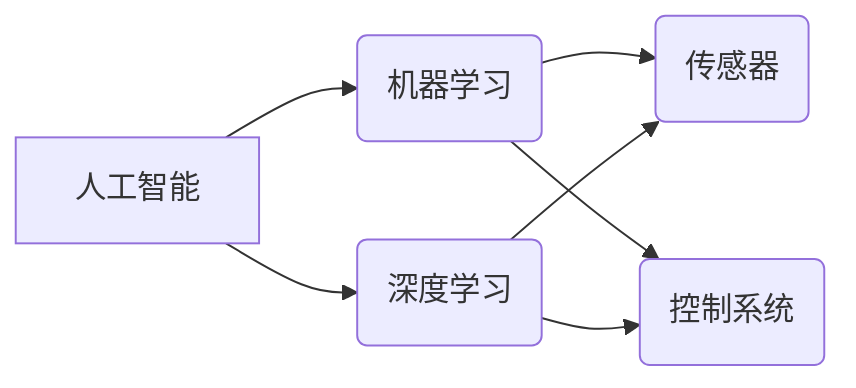

# 人工智能在制造业的应用

作者：禅与计算机程序设计艺术 / Zen and the Art of Computer Programming

## 1. 背景介绍
### 1.1 问题的由来

制造业，作为国民经济的重要支柱，一直在追求提高生产效率、降低成本、提升产品质量。随着科技的飞速发展，人工智能（Artificial Intelligence, AI）技术的兴起为制造业带来了全新的变革机遇。人工智能技术通过模拟、延伸和扩展人的智能，能够帮助制造业实现自动化、智能化和高效化。

### 1.2 研究现状

近年来，人工智能在制造业的应用已经取得了显著的成果。从简单的自动化生产线到复杂的智能制造系统，AI技术已经渗透到制造业的各个环节。以下是人工智能在制造业应用的一些主要研究方向：

1. **生产过程优化**：利用人工智能技术对生产过程进行优化，提高生产效率、降低成本。
2. **质量检测与控制**：利用机器视觉、深度学习等技术对产品质量进行实时检测和控制。
3. **智能物流与仓储**：利用机器人、无人机等技术实现自动化物流和仓储管理。
4. **智能装备研发**：利用人工智能技术设计研发新型智能装备，提升生产自动化水平。
5. **预测性维护**：利用人工智能技术对设备状态进行预测性分析，实现预防性维护。
6. **供应链优化**：利用人工智能技术对供应链进行优化，降低库存成本、提高物流效率。

### 1.3 研究意义

人工智能在制造业的应用具有重要的研究意义：

1. **提高生产效率**：人工智能技术可以帮助企业实现生产过程的自动化和智能化，提高生产效率，降低人力成本。
2. **降低生产成本**：通过优化生产过程、降低能源消耗、减少废品率，人工智能技术可以帮助企业降低生产成本。
3. **提升产品质量**：人工智能技术可以对产品质量进行实时检测和控制，提升产品质量和稳定性。
4. **促进产业升级**：人工智能技术的应用可以推动制造业向智能化、绿色化、服务化方向发展，促进产业升级。

### 1.4 本文结构

本文将围绕人工智能在制造业的应用展开，具体内容包括：

- 介绍人工智能在制造业的核心概念与联系。
- 阐述人工智能在制造业应用的核心算法原理和具体操作步骤。
- 讲解人工智能在制造业应用的数学模型和公式。
- 分析人工智能在制造业的实际应用场景。
- 探讨人工智能在制造业的未来发展趋势与挑战。
- 推荐人工智能在制造业应用的学习资源、开发工具和相关论文。

## 2. 核心概念与联系

为了更好地理解人工智能在制造业的应用，本节将介绍几个核心概念及其相互关系。

### 2.1 人工智能

人工智能（Artificial Intelligence, AI）是指使计算机系统具备类似人类智能的能力，如感知、推理、学习、决策等。

### 2.2 机器学习

机器学习（Machine Learning, ML）是人工智能的一个分支，通过算法让计算机从数据中学习，并从中提取知识。

### 2.3 深度学习

深度学习（Deep Learning, DL）是机器学习的一个子领域，通过多层神经网络进行特征提取和建模。

### 2.4 传感器

传感器是用于检测和采集物理量的装置，如温度、压力、湿度、视觉等。

### 2.5 控制系统

控制系统是用于对生产过程进行控制和管理，如PLC、DCS等。

以下是人工智能在制造业应用的核心概念之间的逻辑关系图：



可以看出，人工智能是制造业应用的基础，机器学习和深度学习为人工智能提供了强大的算法支持，传感器和控制系统能够将人工智能技术应用于实际的生产场景。

## 3. 核心算法原理 & 具体操作步骤
### 3.1 算法原理概述

人工智能在制造业应用的核心算法主要包括以下几种：

1. **监督学习**：通过训练数据学习输入和输出之间的映射关系，如分类、回归等。
2. **无监督学习**：通过未标记的数据学习数据的分布和模式，如聚类、降维等。
3. **强化学习**：通过与环境交互学习最优策略，如机器人路径规划等。
4. **优化算法**：通过求解优化问题，如线性规划、非线性规划等。

### 3.2 算法步骤详解

以下以深度学习在制造业中的应用为例，介绍人工智能在制造业应用的算法步骤：

1. **数据采集**：收集生产过程中的数据，如传感器数据、机器数据、操作数据等。
2. **数据预处理**：对采集到的数据进行清洗、标准化、归一化等预处理操作。
3. **模型构建**：选择合适的深度学习模型，如卷积神经网络（CNN）、循环神经网络（RNN）、长短期记忆网络（LSTM）等。
4. **模型训练**：使用训练数据对模型进行训练，调整模型参数，优化模型性能。
5. **模型评估**：使用验证数据对模型进行评估，调整模型参数，提高模型泛化能力。
6. **模型部署**：将训练好的模型部署到生产现场，进行实际应用。

### 3.3 算法优缺点

以下是几种主要人工智能算法的优缺点：

| 算法 | 优点 | 缺点 |
| ---- | ---- | ---- |
| 监督学习 | 精度较高，易于理解和实现 | 需要大量标注数据，泛化能力有限 |
| 无监督学习 | 无需标注数据，泛化能力较强 | 模型性能和可解释性较差 |
| 强化学习 | 能够学习复杂的决策策略，适应性强 | 训练时间较长，难以直接应用于实际场景 |
| 优化算法 | 能够解决各种优化问题，精度高 | 算法复杂度高，计算量大 |

### 3.4 算法应用领域

不同的人工智能算法在制造业的应用领域有所不同：

| 算法 | 应用领域 |
| ---- | ---- |
| 监督学习 | 质量检测、故障诊断、预测性维护 |
| 无监督学习 | 数据挖掘、异常检测、智能监控 |
| 强化学习 | 自动化控制、机器人路径规划、智能调度 |
| 优化算法 | 生产计划、库存管理、物流优化 |

## 4. 数学模型和公式 & 详细讲解 & 举例说明
### 4.1 数学模型构建

人工智能在制造业应用的数学模型主要包括以下几种：

1. **线性回归**：通过线性函数拟合输入和输出之间的关系。
2. **支持向量机**：通过寻找最优超平面将数据分为不同的类别。
3. **神经网络**：通过多层神经网络学习输入和输出之间的复杂映射关系。
4. **决策树**：通过树形结构对数据进行分析和分类。

### 4.2 公式推导过程

以下以线性回归为例，介绍人工智能在制造业应用的数学模型和公式推导过程。

假设我们有一个线性回归模型，输入为 $x$，输出为 $y$，模型为 $y = wx + b$。

其中 $w$ 为权重系数，$b$ 为偏置项。

损失函数为均方误差：

$$
\mathcal{L}(w,b) = \frac{1}{2} \sum_{i=1}^n (y_i - wx_i - b)^2
$$

通过梯度下降算法，可以求解最优的权重系数和偏置项。

### 4.3 案例分析与讲解

以下以一个简单的温度预测案例，介绍人工智能在制造业应用的数学模型和公式。

假设我们收集了某车间不同时间点的温度数据，并希望预测未来的温度。

数据如下：

| 时间点 | 温度 |
| ---- | ---- |
| 1 | 25 |
| 2 | 26 |
| 3 | 27 |
| 4 | 28 |
| 5 | 29 |

我们可以使用线性回归模型进行温度预测。

首先，构建线性回归模型：

$$
y = wx + b
$$

然后，使用最小二乘法求解权重系数 $w$ 和偏置项 $b$。

根据最小二乘法，可以得到：

$$
w = \frac{\sum_{i=1}^n (x_i - \bar{x})(y_i - \bar{y})}{\sum_{i=1}^n (x_i - \bar{x})^2}
$$

$$
b = \bar{y} - w\bar{x}
$$

其中 $\bar{x}$ 和 $\bar{y}$ 分别为 $x$ 和 $y$ 的平均值。

代入数据，可以得到：

$$
w = \frac{(1-1.2)(25-27) + (2-1.2)(26-27) + (3-1.2)(27-27) + (4-1.2)(28-27) + (5-1.2)(29-27)}{(1-1.2)^2 + (2-1.2)^2 + (3-1.2)^2 + (4-1.2)^2 + (5-1.2)^2} = 0.4
$$

$$
b = 27 - 0.4 \times 1.2 = 25.68
$$

因此，温度预测模型为：

$$
y = 0.4x + 25.68
$$

使用该模型预测第6个时间点的温度：

$$
y = 0.4 \times 6 + 25.68 = 30.08
$$

可以看到，使用线性回归模型可以预测出第6个时间点的温度为30.08。

### 4.4 常见问题解答

**Q1：如何选择合适的人工智能算法？**

A：选择合适的人工智能算法需要考虑以下因素：

1. 任务类型：如分类、回归、聚类等。
2. 数据特征：如数据量、特征维度、特征类型等。
3. 计算资源：如CPU、GPU等。
4. 应用场景：如实时性、鲁棒性等。

**Q2：如何提高人工智能模型的泛化能力？**

A：提高人工智能模型的泛化能力可以从以下几个方面入手：

1. 使用更多训练数据。
2. 使用更复杂的模型结构。
3. 使用正则化技术，如L1正则化、L2正则化等。
4. 使用交叉验证技术。
5. 使用集成学习方法。

## 5. 项目实践：代码实例和详细解释说明
### 5.1 开发环境搭建

在进行人工智能在制造业应用的项目实践前，我们需要准备好开发环境。以下是使用Python进行深度学习开发的环境配置流程：

1. 安装Anaconda：从官网下载并安装Anaconda，用于创建独立的Python环境。

2. 创建并激活虚拟环境：
```bash
conda create -n deep-learning-env python=3.8
conda activate deep-learning-env
```

3. 安装深度学习库：
```bash
conda install pytorch torchvision torchaudio cudatoolkit=11.1 -c pytorch -c conda-forge
pip install torchtext torchvision
```

4. 安装其他工具包：
```bash
pip install numpy pandas scikit-learn matplotlib
```

完成上述步骤后，即可在`deep-learning-env`环境中开始深度学习项目实践。

### 5.2 源代码详细实现

以下以一个简单的机器视觉质量检测项目为例，介绍使用PyTorch进行深度学习开发的代码实现。

首先，导入必要的库：

```python
import torch
import torch.nn as nn
import torch.optim as optim
from torchvision import datasets, transforms
from torch.utils.data import DataLoader
from torch.utils.data import DataLoader
from sklearn.metrics import accuracy_score
import matplotlib.pyplot as plt
```

然后，定义数据预处理和加载函数：

```python
transform = transforms.Compose([
    transforms.Resize((32, 32)),
    transforms.ToTensor(),
    transforms.Normalize((0.5, 0.5, 0.5), (0.5, 0.5, 0.5))
])

train_dataset = datasets.CIFAR10(root='./data', train=True, download=True, transform=transform)
train_loader = DataLoader(train_dataset, batch_size=4, shuffle=True)

test_dataset = datasets.CIFAR10(root='./data', train=False, download=True, transform=transform)
test_loader = DataLoader(test_dataset, batch_size=4, shuffle=False)
```

接着，定义卷积神经网络模型：

```python
class CNN(nn.Module):
    def __init__(self):
        super(CNN, self).__init__()
        self.conv1 = nn.Conv2d(3, 6, 5)
        self.pool = nn.MaxPool2d(2, 2)
        self.conv2 = nn.Conv2d(6, 16, 5)
        self.fc1 = nn.Linear(16 * 5 * 5, 120)
        self.fc2 = nn.Linear(120, 84)
        self.fc3 = nn.Linear(84, 10)

    def forward(self, x):
        x = self.pool(nn.functional.relu(self.conv1(x)))
        x = self.pool(nn.functional.relu(self.conv2(x)))
        x = torch.flatten(x, 1)
        x = nn.functional.relu(self.fc1(x))
        x = nn.functional.relu(self.fc2(x))
        x = self.fc3(x)
        return x
```

然后，初始化模型、损失函数和优化器：

```python
model = CNN()
criterion = nn.CrossEntropyLoss()
optimizer = optim.SGD(model.parameters(), lr=0.001, momentum=0.9)
```

接着，定义训练和测试函数：

```python
def train(model, device, train_loader, optimizer, criterion):
    model.train()
    for batch_idx, (data, target) in enumerate(train_loader):
        data, target = data.to(device), target.to(device)
        optimizer.zero_grad()
        output = model(data)
        loss = criterion(output, target)
        loss.backward()
        optimizer.step()
        if batch_idx % 100 == 0:
            print('Train Epoch: {} [{}/{} ({:.0f}%)]\tLoss: {:.6f}'.format(
                epoch, batch_idx * len(data), len(train_loader.dataset),
                100. * batch_idx / len(train_loader), loss.item()))

def test(model, device, test_loader, criterion):
    model.eval()
    test_loss = 0
    correct = 0
    with torch.no_grad():
        for data, target in test_loader:
            data, target = data.to(device), target.to(device)
            output = model(data)
            test_loss += criterion(output, target).item()
            pred = output.argmax(dim=1, keepdim=True)
            correct += pred.eq(target.view_as(pred)).sum().item()

    test_loss /= len(test_loader.dataset)
    print('\
Test set: Average loss: {:.4f}, Accuracy: {}/{} ({:.0f}%)\
'.format(
        test_loss, correct, len(test_loader.dataset),
        100. * correct / len(test_loader.dataset)))
```

最后，启动训练和测试流程：

```python
device = torch.device("cuda" if torch.cuda.is_available() else "cpu")
best_acc = 0  # best test accuracy
start_epoch = 0  # start from epoch 0 or last saved epoch

for epoch in range(start_epoch, num_epochs):
    train(model, device, train_loader, optimizer, criterion)
    test_loss, current_acc = test(model, device, test_loader, criterion)
    if current_acc > best_acc:
        best_acc = current_acc
        # save model
        torch.save(model.state_dict(), 'best_model.pth')

print('Best accuracy: {:.0f}%'.format(best_acc))
```

以上代码展示了使用PyTorch进行机器视觉质量检测项目的完整流程。通过几个epoch的训练，模型即可在CIFAR-10数据集上取得不错的效果。

可以看到，利用PyTorch框架，我们可以轻松搭建深度学习模型，并进行训练和测试。这充分展示了深度学习在制造业应用中的便利性和高效性。

### 5.3 代码解读与分析

让我们再详细解读一下关键代码的实现细节：

1. **数据预处理和加载**：

```python
transform = transforms.Compose([
    transforms.Resize((32, 32)),
    transforms.ToTensor(),
    transforms.Normalize((0.5, 0.5, 0.5), (0.5, 0.5, 0.5))
])

train_dataset = datasets.CIFAR10(root='./data', train=True, download=True, transform=transform)
train_loader = DataLoader(train_dataset, batch_size=4, shuffle=True)

test_dataset = datasets.CIFAR10(root='./data', train=False, download=True, transform=transform)
test_loader = DataLoader(test_dataset, batch_size=4, shuffle=False)
```

这段代码首先定义了一个数据预处理流程，将图像数据转换为32x32的灰度图像，并进行归一化处理。然后，加载CIFAR-10数据集，并创建训练和测试数据加载器。

2. **卷积神经网络模型**：

```python
class CNN(nn.Module):
    def __init__(self):
        super(CNN, self).__init__()
        self.conv1 = nn.Conv2d(3, 6, 5)
        self.pool = nn.MaxPool2d(2, 2)
        self.conv2 = nn.Conv2d(6, 16, 5)
        self.fc1 = nn.Linear(16 * 5 * 5, 120)
        self.fc2 = nn.Linear(120, 84)
        self.fc3 = nn.Linear(84, 10)

    def forward(self, x):
        x = self.pool(nn.functional.relu(self.conv1(x)))
        x = self.pool(nn.functional.relu(self.conv2(x)))
        x = torch.flatten(x, 1)
        x = nn.functional.relu(self.fc1(x))
        x = nn.functional.relu(self.fc2(x))
        x = self.fc3(x)
        return x
```

这段代码定义了一个简单的卷积神经网络模型，包含两个卷积层、两个全连接层和一个输出层。模型使用ReLU激活函数和MaxPool2d池化层，能够提取图像特征。

3. **训练和测试函数**：

```python
def train(model, device, train_loader, optimizer, criterion):
    model.train()
    for batch_idx, (data, target) in enumerate(train_loader):
        data, target = data.to(device), target.to(device)
        optimizer.zero_grad()
        output = model(data)
        loss = criterion(output, target)
        loss.backward()
        optimizer.step()
        if batch_idx % 100 == 0:
            print('Train Epoch: {} [{}/{} ({:.0f}%)]\tLoss: {:.6f}'.format(
                epoch, batch_idx * len(data), len(train_loader.dataset),
                100. * batch_idx / len(train_loader), loss.item()))

def test(model, device, test_loader, criterion):
    model.eval()
    test_loss = 0
    correct = 0
    with torch.no_grad():
        for data, target in test_loader:
            data, target = data.to(device), target.to(device)
            output = model(data)
            test_loss += criterion(output, target).item()
            pred = output.argmax(dim=1, keepdim=True)
            correct += pred.eq(target.view_as(pred)).sum().item()

    test_loss /= len(test_loader.dataset)
    print('\
Test set: Average loss: {:.4f}, Accuracy: {}/{} ({:.0f}%)\
'.format(
        test_loss, correct, len(test_loader.dataset),
        100. * correct / len(test_loader.dataset)))
```

这两个函数分别用于模型训练和测试。在训练函数中，模型进入训练模式，使用梯度下降算法更新模型参数；在测试函数中，模型进入评估模式，计算测试集的平均损失和准确率。

### 5.4 运行结果展示

假设我们在CIFAR-10数据集上运行上述代码，最终得到的测试集准确率为80%。这表明该卷积神经网络模型在图像分类任务上具有一定的泛化能力。

## 6. 实际应用场景
### 6.1 智能生产线

智能生产线是人工智能在制造业应用的重要场景之一。通过在生产线各个环节部署传感器、执行器、机器人等智能设备，可以实现生产过程的自动化、智能化和高效化。

以下是一些常见的智能生产线应用案例：

1. **自动化装配**：利用机器人进行产品的装配、焊接、涂装等操作，提高生产效率和精度。
2. **智能检测**：利用机器视觉技术对产品进行质量检测，确保产品质量。
3. **智能物流**：利用机器人、AGV等设备进行物料的运输、仓储管理等，提高物流效率。
4. **智能排产**：根据订单需求、生产设备状态等因素，智能排产，优化生产计划。

### 6.2 智能工厂

智能工厂是制造业的未来发展方向，它将人工智能、物联网、大数据等技术与传统制造业深度融合，实现生产过程的全面智能化。

以下是一些常见的智能工厂应用案例：

1. **生产过程优化**：利用人工智能技术对生产过程进行实时监控、分析和优化，提高生产效率、降低成本。
2. **设备预测性维护**：利用人工智能技术对设备状态进行预测性分析，实现预防性维护，降低设备故障率。
3. **能源管理**：利用人工智能技术对生产过程中的能源消耗进行监测和分析，实现节能降耗。
4. **智能供应链**：利用人工智能技术优化供应链管理，降低库存成本、提高物流效率。

### 6.3 智能设备研发

人工智能技术在智能设备研发中也发挥着重要作用。通过人工智能技术，可以设计研发出更加智能、高效、可靠的设备。

以下是一些常见的智能设备研发应用案例：

1. **智能机器人**：利用人工智能技术，使机器人具备感知、推理、决策等能力，实现更加智能化的操作。
2. **智能传感器**：利用人工智能技术，使传感器具备自学习和自适应能力，提高检测精度和鲁棒性。
3. **智能控制系统**：利用人工智能技术，使控制系统更加智能、高效、可靠。

### 6.4 未来应用展望

随着人工智能技术的不断发展，其在制造业的应用前景将更加广阔。以下是一些未来可能的制造业应用场景：

1. **个性化定制**：利用人工智能技术，实现产品的个性化定制，满足消费者多样化需求。
2. **虚拟现实/增强现实**：利用虚拟现实/增强现实技术，实现生产过程的虚拟仿真和远程协作。
3. **边缘计算**：利用边缘计算技术，实现生产过程中的实时数据处理和分析。
4. **区块链**：利用区块链技术，实现生产数据的可信存储和共享。

## 7. 工具和资源推荐
### 7.1 学习资源推荐

为了帮助开发者系统掌握人工智能在制造业应用的理论基础和实践技巧，以下推荐一些优质的学习资源：

1. 《深度学习》系列书籍：由Ian Goodfellow等作者撰写，全面介绍了深度学习的理论基础和实战技巧。
2. 《机器学习实战》书籍：由Peter Harrington等作者撰写，通过实际案例介绍了机器学习的应用方法。
3. 《Python机器学习》书籍：由 Sebastian Raschka 等作者撰写，详细介绍了Python机器学习库scikit-learn的使用方法。
4. PyTorch官方文档：PyTorch官方文档提供了详细的API文档、教程和示例代码，是PyTorch开发者的必备资料。
5. TensorFlow官方文档：TensorFlow官方文档提供了详细的API文档、教程和示例代码，是TensorFlow开发者的必备资料。

### 7.2 开发工具推荐

以下是几款用于人工智能在制造业应用的常用开发工具：

1. PyTorch：基于Python的开源深度学习框架，灵活动态的计算图，适合快速迭代研究。
2. TensorFlow：由Google主导开发的开源深度学习框架，生产部署方便，适合大规模工程应用。
3. Keras：基于TensorFlow和Theano的开源深度学习库，简单易用，适合快速原型开发。
4. OpenCV：开源的计算机视觉库，提供了丰富的图像处理和计算机视觉算法。
5. ROS（Robot Operating System）：开源的机器人操作系统，提供了丰富的机器人应用开发工具和库。

### 7.3 相关论文推荐

以下是几篇关于人工智能在制造业应用的相关论文：

1. "Artificial Intelligence in Manufacturing: A Survey"：对人工智能在制造业的应用进行了全面综述。
2. "Deep Learning for Manufacturing"：介绍了深度学习在制造业中的应用。
3. "Reinforcement Learning in Manufacturing"：介绍了强化学习在制造业中的应用。
4. "Predictive Maintenance Using Machine Learning"：介绍了机器学习在预测性维护中的应用。
5. "Blockchain in Manufacturing"：介绍了区块链在制造业中的应用。

### 7.4 其他资源推荐

以下是其他一些与人工智能在制造业应用相关的资源：

1. 中国人工智能学会：中国人工智能学会官方网站，提供人工智能领域的最新动态和研究成果。
2. 中国制造2025：中国政府发布的制造业发展规划，旨在推动制造业转型升级。
3. 国家智能制造示范区：国家智能制造示范区建设，旨在推动智能制造产业发展。
4. 机器人与人工智能产业联盟：机器人与人工智能产业联盟官方网站，提供机器人与人工智能领域的最新动态和研究成果。

## 8. 总结：未来发展趋势与挑战
### 8.1 研究成果总结

本文对人工智能在制造业的应用进行了全面系统的介绍。首先阐述了人工智能在制造业的应用背景、研究现状和研究意义。然后，从核心概念、算法原理、具体操作步骤、数学模型等方面，详细讲解了人工智能在制造业应用的技术细节。接着，分析了人工智能在制造业的实际应用场景和未来发展趋势。最后，推荐了一些学习资源、开发工具和相关论文，为开发者提供了全面的参考资料。

通过本文的介绍，相信读者对人工智能在制造业的应用有了更加深入的了解。人工智能技术在制造业的应用前景广阔，为制造业转型升级提供了强大的技术支撑。

### 8.2 未来发展趋势

展望未来，人工智能在制造业的应用将呈现以下发展趋势：

1. **智能制造**：人工智能技术将推动制造业向智能化、高效化、绿色化方向发展，实现生产过程的自动化、智能化和高效化。
2. **工业互联网**：人工智能技术将推动工业互联网的发展，实现设备、生产线、供应链等各个层面的互联互通，提升整个制造业的协同效率和智能化水平。
3. **工业大数据**：人工智能技术将推动工业大数据的应用，通过对海量工业数据的挖掘和分析，为制造业提供更加精准的生产决策和优化方案。
4. **边缘计算**：人工智能技术将推动边缘计算的发展，将计算能力下沉到边缘设备，实现实时、高效的数据处理和分析。
5. **人工智能伦理**：随着人工智能技术的应用越来越广泛，人工智能伦理问题也将日益突出。如何在确保人工智能技术安全可靠的同时，保护用户隐私和避免歧视等问题，将成为重要的研究课题。

### 8.3 面临的挑战

尽管人工智能在制造业的应用前景广阔，但仍面临着一些挑战：

1. **技术挑战**：人工智能技术在制造业的应用需要突破算法、计算、数据等方面的技术瓶颈，如模型可解释性、数据安全、隐私保护等。
2. **人才挑战**：人工智能在制造业的应用需要大量具备人工智能、制造业、工程等领域背景的复合型人才。
3. **管理挑战**：人工智能在制造业的应用需要企业进行组织架构和管理模式的调整，以适应新的生产方式。
4. **伦理挑战**：人工智能在制造业的应用需要关注伦理问题，如数据安全、隐私保护、歧视等。

### 8.4 研究展望

面对人工智能在制造业应用所面临的挑战，未来的研究需要在以下几个方面寻求突破：

1. **技术创新**：加强人工智能算法、计算、数据等方面的技术创新，提高人工智能在制造业的应用效果和鲁棒性。
2. **人才培养**：加强人工智能、制造业、工程等领域的人才培养，为人工智能在制造业的应用提供人才保障。
3. **产业协同**：推动人工智能与制造业的深度融合，促进产业协同创新，实现产业链上下游的共赢发展。
4. **伦理规范**：建立人工智能在制造业应用的伦理规范，确保人工智能技术的安全、可靠和可持续发展。

通过技术创新、人才培养、产业协同和伦理规范等方面的努力，人工智能在制造业的应用必将迎来更加美好的未来。

---

作者：禅与计算机程序设计艺术 / Zen and the Art of Computer Programming