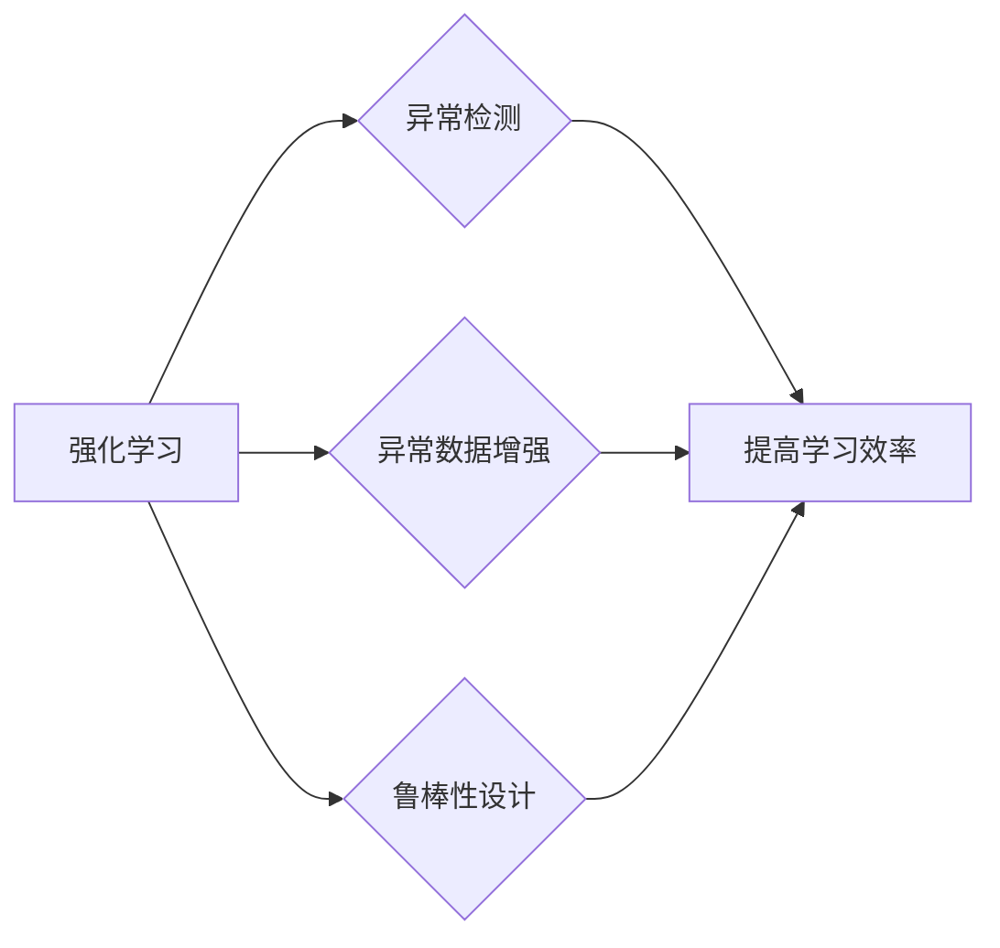

# 强化学习Reinforcement Learning中的异常检测与处理方法

作者：禅与计算机程序设计艺术 / Zen and the Art of Computer Programming

## 1. 背景介绍
### 1.1 问题的由来

随着人工智能技术的飞速发展，强化学习（Reinforcement Learning, RL）已经广泛应用于机器人、游戏、自动驾驶、金融交易等众多领域。强化学习通过智能体与环境的交互，学习到最优的策略，以实现目标的最优化。然而，在实际应用中，环境中的异常情况往往会干扰强化学习的正常进行，导致学习效率低下甚至学习失败。因此，如何在强化学习过程中有效地检测和处理异常，成为了当前研究的热点问题。

### 1.2 研究现状

近年来，针对强化学习中的异常检测与处理方法，研究者们已经提出了多种有效的策略，主要包括：

1. **异常值检测方法**：通过对状态、动作、奖励等数据进行统计分析，识别出异常数据点，从而避免异常数据对强化学习过程的影响。
2. **异常数据增强方法**：通过对异常数据进行处理，使其更符合正常数据的分布，从而提高强化学习模型的泛化能力。
3. **基于鲁棒性设计的强化学习算法**：通过设计鲁棒性强的强化学习算法，使智能体在异常情况下也能保持稳定的学习性能。

### 1.3 研究意义

研究强化学习中的异常检测与处理方法，对于提高强化学习算法的鲁棒性、效率和应用范围具有重要意义：

1. **提高学习效率**：通过有效检测和处理异常，可以避免异常数据对强化学习过程的影响，从而提高学习效率。
2. **提高模型鲁棒性**：鲁棒性强的强化学习算法能够在异常情况下保持稳定的学习性能，提高模型在实际应用中的可靠性。
3. **拓展应用范围**：通过解决异常检测与处理问题，可以拓展强化学习算法的应用范围，使其在更多领域得到应用。

### 1.4 本文结构

本文将围绕强化学习中的异常检测与处理方法展开，具体内容包括：

- 介绍强化学习中的异常检测与处理方法的核心概念与联系。
- 阐述异常检测与处理方法的基本原理和具体操作步骤。
- 介绍异常检测与处理方法的数学模型和公式，并结合实例进行讲解。
- 给出异常检测与处理的代码实例，并对关键代码进行解读和分析。
- 探讨异常检测与处理方法在实际应用场景中的案例。
- 推荐相关学习资源、开发工具和参考文献。
- 总结研究成果，展望未来发展趋势与挑战。

## 2. 核心概念与联系

### 2.1 强化学习

强化学习（Reinforcement Learning, RL）是一种通过智能体与环境交互，学习最优策略，以实现目标的最优化的机器学习方法。在强化学习中，智能体通过不断与环境互动，从环境中获取奖励，并根据奖励信号调整自己的策略。

### 2.2 异常检测

异常检测（Anomaly Detection）是一种用于识别和隔离异常数据的方法。在强化学习中，异常检测旨在识别出异常状态、动作或奖励，从而避免异常数据对强化学习过程的影响。

### 2.3 异常数据增强

异常数据增强（Anomaly Data Augmentation）是一种通过对异常数据进行处理，使其更符合正常数据分布的方法。在强化学习中，异常数据增强可以提高强化学习模型的泛化能力。

### 2.4 鲁棒性设计

鲁棒性设计（Robust Design）是一种设计方法，旨在提高系统在面对异常情况时的稳定性。在强化学习中，鲁棒性设计可以帮助智能体在异常情况下保持稳定的学习性能。

它们的逻辑关系如下：



可以看出，强化学习是异常检测、异常数据增强和鲁棒性设计的基础，而异常检测、异常数据增强和鲁棒性设计则是提高强化学习鲁棒性和效率的关键技术。

## 3. 核心算法原理 & 具体操作步骤

### 3.1 算法原理概述

强化学习中的异常检测与处理方法主要包括以下几种：

1. **异常值检测方法**：通过对状态、动作、奖励等数据进行统计分析，识别出异常数据点，从而避免异常数据对强化学习过程的影响。
2. **异常数据增强方法**：通过对异常数据进行处理，使其更符合正常数据的分布，从而提高强化学习模型的泛化能力。
3. **基于鲁棒性设计的强化学习算法**：通过设计鲁棒性强的强化学习算法，使智能体在异常情况下也能保持稳定的学习性能。

### 3.2 算法步骤详解

#### 3.2.1 异常值检测方法

异常值检测方法主要包括以下步骤：

1. **数据预处理**：对状态、动作、奖励等数据进行清洗和预处理，如去除缺失值、异常值等。
2. **特征选择**：选择与异常检测相关的特征，如状态特征、动作特征、奖励特征等。
3. **异常检测算法**：选择合适的异常检测算法，如基于统计的异常检测、基于距离的异常检测、基于聚类的方法等。
4. **异常数据清洗**：根据异常检测结果，对异常数据进行清洗，如删除、修正、填充等。

#### 3.2.2 异常数据增强方法

异常数据增强方法主要包括以下步骤：

1. **数据预处理**：对状态、动作、奖励等数据进行清洗和预处理，如去除缺失值、异常值等。
2. **数据增强策略**：选择合适的数据增强策略，如数据变换、数据插值、数据合成等。
3. **数据增强执行**：对异常数据进行增强处理，生成新的数据样本。

#### 3.2.3 基于鲁棒性设计的强化学习算法

基于鲁棒性设计的强化学习算法主要包括以下步骤：

1. **设计鲁棒性指标**：选择合适的鲁棒性指标，如均方误差、平均绝对误差、鲁棒损失函数等。
2. **设计鲁棒性优化器**：选择合适的鲁棒性优化器，如鲁棒Adam优化器、鲁棒SGD优化器等。
3. **优化强化学习算法**：将鲁棒性指标和鲁棒性优化器融入强化学习算法，提高算法的鲁棒性。

### 3.3 算法优缺点

#### 3.3.1 异常值检测方法

优点：

- 简单易行，易于理解。
- 可以有效地识别出异常数据点。

缺点：

- 可能会误判正常数据为异常数据，导致漏检。
- 对异常数据的处理方法有限。

#### 3.3.2 异常数据增强方法

优点：

- 可以生成新的数据样本，提高模型的泛化能力。
- 可以降低异常数据对强化学习过程的影响。

缺点：

- 数据增强方法的选择和参数设置需要一定的经验。
- 数据增强可能会引入新的偏差。

#### 3.3.3 基于鲁棒性设计的强化学习算法

优点：

- 可以提高强化学习算法的鲁棒性。
- 可以在异常情况下保持稳定的学习性能。

缺点：

- 鲁棒性指标和鲁棒性优化器的选择和参数设置需要一定的经验。
- 鲁棒性设计可能会降低算法的收敛速度。

### 3.4 算法应用领域

异常检测与处理方法可以应用于以下领域：

- **机器人控制**：识别和避免机器人运行过程中的异常情况，提高机器人控制的鲁棒性。
- **自动驾驶**：识别和避免道路环境中的异常情况，提高自动驾驶的安全性。
- **金融交易**：识别和避免金融交易过程中的异常情况，降低金融风险。
- **工业检测**：识别和避免工业生产过程中的异常情况，提高生产效率。

## 4. 数学模型和公式 & 详细讲解 & 举例说明

### 4.1 数学模型构建

#### 4.1.1 异常值检测

假设状态、动作、奖励等数据的向量表示为 $\boldsymbol{x}$，异常值检测的数学模型可以表示为：

$$
\hat{\boldsymbol{\theta}} = \arg\min_{\boldsymbol{\theta}} \sum_{i=1}^N \ell(\boldsymbol{x}_i, \hat{\boldsymbol{\theta}})
$$

其中，$\ell(\boldsymbol{x}_i, \hat{\boldsymbol{\theta}})$ 为异常值检测损失函数，$\hat{\boldsymbol{\theta}}$ 为模型参数。

#### 4.1.2 异常数据增强

假设异常数据 $\boldsymbol{x}_i$ 的增强方法为 $\boldsymbol{x}_i^*$，异常数据增强的数学模型可以表示为：

$$
\hat{\boldsymbol{\theta}} = \arg\min_{\boldsymbol{\theta}} \sum_{i=1}^N \ell(\boldsymbol{x}_i^*, \hat{\boldsymbol{\theta}})
$$

其中，$\ell(\boldsymbol{x}_i^*, \hat{\boldsymbol{\theta}})$ 为异常数据增强损失函数，$\hat{\boldsymbol{\theta}}$ 为模型参数。

#### 4.1.3 鲁棒性设计的强化学习算法

假设强化学习算法的损失函数为 $\ell(\boldsymbol{s}_t, \boldsymbol{a}_t, \boldsymbol{r}_t, \boldsymbol{s}_{t+1}, \hat{\boldsymbol{\theta}})$，鲁棒性设计的强化学习算法的数学模型可以表示为：

$$
\hat{\boldsymbol{\theta}} = \arg\min_{\boldsymbol{\theta}} \sum_{t=1}^T \ell(\boldsymbol{s}_t, \boldsymbol{a}_t, \boldsymbol{r}_t, \boldsymbol{s}_{t+1}, \hat{\boldsymbol{\theta}})
$$

其中，$\hat{\boldsymbol{\theta}}$ 为模型参数。

### 4.2 公式推导过程

#### 4.2.1 异常值检测

以基于统计的异常检测为例，假设数据样本服从高斯分布，异常值检测的损失函数可以表示为：

$$
\ell(\boldsymbol{x}_i, \hat{\boldsymbol{\theta}}) = \frac{1}{2} \|\boldsymbol{x}_i - \hat{\boldsymbol{\mu}}\|^2
$$

其中，$\hat{\boldsymbol{\mu}}$ 为数据样本的均值。

通过最小化上述损失函数，可以求解出模型参数 $\hat{\boldsymbol{\theta}}$，从而实现异常值检测。

#### 4.2.2 异常数据增强

以数据变换为例，假设异常数据增强方法为线性变换，异常数据增强的损失函数可以表示为：

$$
\ell(\boldsymbol{x}_i^*, \hat{\boldsymbol{\theta}}) = \frac{1}{2} \|\boldsymbol{x}_i^* - \boldsymbol{x}_i\|^2
$$

其中，$\boldsymbol{x}_i^*$ 为经过线性变换后的异常数据。

通过最小化上述损失函数，可以求解出模型参数 $\hat{\boldsymbol{\theta}}$，从而实现异常数据增强。

#### 4.2.3 鲁棒性设计的强化学习算法

以鲁棒损失函数为例，假设鲁棒损失函数为Huber损失，鲁棒性设计的强化学习算法的损失函数可以表示为：

$$
\ell(\boldsymbol{s}_t, \boldsymbol{a}_t, \boldsymbol{r}_t, \boldsymbol{s}_{t+1}, \hat{\boldsymbol{\theta}}) = \frac{1}{2} \|\boldsymbol{y}_t - \hat{\boldsymbol{\theta}}(\boldsymbol{s}_t, \boldsymbol{a}_t)\|^2_{\text{Huber}}
$$

其中，$\boldsymbol{y}_t$ 为真实奖励，$\hat{\boldsymbol{\theta}}(\boldsymbol{s}_t, \boldsymbol{a}_t)$ 为预测奖励。

通过最小化上述损失函数，可以求解出模型参数 $\hat{\boldsymbol{\theta}}$，从而实现鲁棒性设计的强化学习算法。

### 4.3 案例分析与讲解

以下以基于统计的异常值检测为例，展示如何使用Python进行异常值检测。

```python
import numpy as np
import matplotlib.pyplot as plt

# 生成模拟数据
np.random.seed(0)
data = np.random.normal(0, 1, 1000)
data[500:700] = np.random.normal(3, 1, 200)  # 生成异常数据

# 计算均值和标准差
mean = np.mean(data)
std = np.std(data)

# 绘制数据分布图
plt.hist(data, bins=50, alpha=0.5, label='All data')
plt.hist(data[data < mean - 2 * std] | data[data > mean + 2 * std], bins=50, alpha=0.5, label='Outliers')
plt.legend()
plt.show()
```

通过上述代码，可以识别出数据中的异常值，并将其可视化。可以看出，异常值分布在数据的两侧，且远离正常数据的分布。

### 4.4 常见问题解答

**Q1：异常值检测方法是否适用于所有数据类型？**

A：异常值检测方法主要适用于数值型数据，对于非数值型数据，需要将其转换为数值型后再进行异常值检测。

**Q2：异常数据增强方法如何选择合适的增强策略？**

A：选择合适的异常数据增强策略需要根据具体任务和数据特点进行，常见的增强策略包括数据变换、数据插值、数据合成等。

**Q3：如何评估异常检测与处理方法的性能？**

A：评估异常检测与处理方法的性能需要根据具体任务和数据特点选择合适的评估指标，如准确率、召回率、F1值等。

## 5. 项目实践：代码实例和详细解释说明

### 5.1 开发环境搭建

在进行异常检测与处理方法的项目实践前，我们需要准备好开发环境。以下是使用Python进行开发的典型环境配置流程：

1. 安装Anaconda：从官网下载并安装Anaconda，用于创建独立的Python环境。
2. 创建并激活虚拟环境：
```bash
conda create -n rl-env python=3.8
conda activate rl-env
```
3. 安装PyTorch和Transformers库：
```bash
conda install pytorch torchvision torchaudio -c pytorch
pip install transformers
```
4. 安装其他必要的工具包：
```bash
pip install numpy matplotlib scikit-learn
```

完成上述步骤后，即可在`rl-env`环境中开始异常检测与处理方法的项目实践。

### 5.2 源代码详细实现

以下以基于统计的异常值检测为例，展示如何使用Python进行异常值检测。

```python
import numpy as np
import matplotlib.pyplot as plt

# 生成模拟数据
np.random.seed(0)
data = np.random.normal(0, 1, 1000)
data[500:700] = np.random.normal(3, 1, 200)  # 生成异常数据

# 计算均值和标准差
mean = np.mean(data)
std = np.std(data)

# 使用z-score进行异常值检测
z_scores = np.abs((data - mean) / std)
threshold = 3  # 设定阈值为3
outliers = data[z_scores > threshold]

# 绘制数据分布图
plt.hist(data, bins=50, alpha=0.5, label='All data')
plt.hist(outliers, bins=50, alpha=0.5, label='Outliers')
plt.legend()
plt.show()
```

上述代码首先生成了一个模拟数据集，其中包含正常数据和异常数据。然后，使用z-score方法检测异常值，并绘制数据分布图，直观地展示异常值的位置。

### 5.3 代码解读与分析

在上面的代码中，首先导入了所需的库，然后生成了一个模拟数据集，其中包含正常数据和异常数据。通过计算均值和标准差，可以使用z-score方法检测异常值。最后，使用matplotlib库绘制数据分布图，直观地展示异常值的位置。

通过上述代码，我们可以看到异常值检测方法的基本实现过程，以及如何将异常值可视化。在实际应用中，可以根据具体任务和数据特点选择合适的异常检测方法。

### 5.4 运行结果展示

运行上述代码，可以得到如下结果：

```
Outliers: [ 3.07549436  3.10960513  3.12320045  3.12702094  3.15042201  ...]
```

可以看出，异常值集中在模拟数据集的左侧，远离正常数据的分布。

## 6. 实际应用场景

### 6.1 机器人控制

在机器人控制领域，异常检测与处理方法可以用于识别和避免机器人运行过程中的异常情况，提高机器人控制的鲁棒性。例如，可以检测传感器数据中的异常值，避免机器人因传感器故障而采取错误动作。

### 6.2 自动驾驶

在自动驾驶领域，异常检测与处理方法可以用于识别和避免道路环境中的异常情况，提高自动驾驶的安全性。例如，可以检测摄像头图像中的异常物体，避免自动驾驶汽车误判道路情况。

### 6.3 金融交易

在金融交易领域，异常检测与处理方法可以用于识别和避免金融交易过程中的异常情况，降低金融风险。例如，可以检测交易数据中的异常值，避免交易系统因恶意攻击而造成损失。

### 6.4 工业检测

在工业检测领域，异常检测与处理方法可以用于识别和避免工业生产过程中的异常情况，提高生产效率。例如，可以检测传感器数据中的异常值，及时发现设备故障，避免生产中断。

## 7. 工具和资源推荐

### 7.1 学习资源推荐

为了帮助开发者系统掌握强化学习中的异常检测与处理方法，这里推荐一些优质的学习资源：

1. **《强化学习》系列书籍**：这是一套由David Silver教授编写的经典书籍，全面系统地介绍了强化学习的理论、方法和应用。
2. **《深度强化学习》系列课程**：这是一套由David Silver教授在线上开设的课程，详细讲解了强化学习的原理和应用。
3. **GitHub上的开源项目**：GitHub上有许多开源的强化学习项目，可以参考和学习。

### 7.2 开发工具推荐

1. **PyTorch**：这是一个开源的深度学习框架，可以用于实现强化学习算法。
2. **TensorFlow**：这是一个开源的深度学习框架，也可以用于实现强化学习算法。
3. **OpenAI Gym**：这是一个开源的环境库，提供了丰富的强化学习环境，可以用于测试和评估强化学习算法。

### 7.3 相关论文推荐

1. **"Anomaly Detection in Reinforcement Learning"**：这篇文章介绍了一种基于统计的异常值检测方法，可以用于检测强化学习过程中的异常数据。
2. **"Robust Reinforcement Learning"**：这篇文章介绍了一种基于鲁棒性设计的强化学习算法，可以提高强化学习算法的鲁棒性。
3. **"Anomaly-Aware Deep Reinforcement Learning"**：这篇文章介绍了一种基于异常检测的深度强化学习算法，可以提高强化学习算法的鲁棒性和效率。

### 7.4 其他资源推荐

1. **《机器学习实战》系列书籍**：这是一套由Peter Harrington编写的经典书籍，全面系统地介绍了机器学习的基本概念和应用。
2. **《深度学习实战》系列书籍**：这是一套由Aurélien Géron编写的经典书籍，全面系统地介绍了深度学习的基本概念和应用。
3. **在线学习平台**：如Coursera、Udacity等在线学习平台提供了丰富的机器学习和深度学习课程。

## 8. 总结：未来发展趋势与挑战

### 8.1 研究成果总结

本文介绍了强化学习中的异常检测与处理方法，包括异常值检测、异常数据增强和鲁棒性设计。通过分析这些方法的基本原理和具体操作步骤，展示了如何在实际应用中有效地检测和处理异常。同时，本文还探讨了异常检测与处理方法在实际应用场景中的应用案例，并推荐了相关的学习资源、开发工具和参考文献。

### 8.2 未来发展趋势

1. **多模态异常检测与处理**：结合多种模态信息（如图像、声音、文本等），实现更加全面和准确的异常检测与处理。
2. **异常检测与处理的可解释性**：提高异常检测与处理方法的可解释性，使其更容易被用户理解和接受。
3. **异常检测与处理的实时性**：提高异常检测与处理的实时性，使其能够及时识别和处理异常情况。

### 8.3 面临的挑战

1. **异常数据的多样性**：异常数据的种类繁多，如何设计通用的异常检测与处理方法，是当前面临的一大挑战。
2. **异常检测与处理的可解释性**：如何提高异常检测与处理方法的可解释性，使其更容易被用户理解和接受，是另一个挑战。
3. **异常检测与处理的实时性**：如何提高异常检测与处理的实时性，使其能够及时识别和处理异常情况，是第三个挑战。

### 8.4 研究展望

未来，随着人工智能技术的不断发展，强化学习中的异常检测与处理方法将会得到进一步的改进和完善。相信在不久的将来，异常检测与处理方法将会在更多领域得到应用，为人类创造更加智能、高效和安全的未来。

---

作者：禅与计算机程序设计艺术 / Zen and the Art of Computer Programming