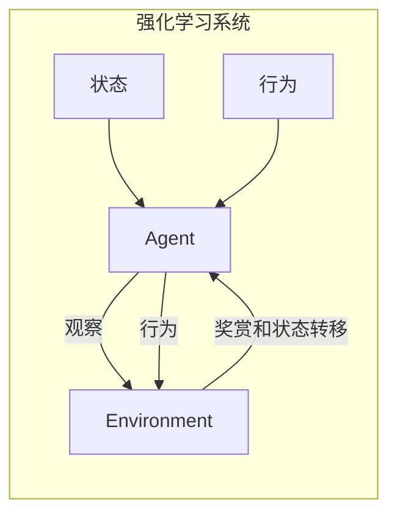
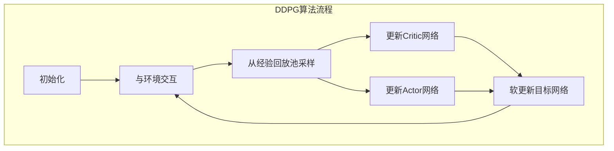

# 强化学习Reinforcement Learning在医疗健康领域的应用探索

## 1. 背景介绍

### 1.1 问题的由来

在医疗健康领域,我们面临着诸多复杂的决策问题,例如如何根据患者的症状和病史制定最佳的治疗方案?如何优化医院的资源分配以提高运营效率?如何设计个性化的健康管理计划以预防疾病?这些问题都涉及到在不确定环境下做出最优决策,传统的规则based或者监督学习方法往往难以很好地解决。

强化学习(Reinforcement Learning, RL)作为一种全新的机器学习范式,通过与环境的交互来学习如何做出最优决策,从而在处理这些复杂决策问题时展现出巨大的潜力。

### 1.2 研究现状

近年来,强化学习在医疗健康领域的应用研究日益受到重视。例如,研究人员尝试使用强化学习来优化放疗剂量分布、个性化药物剂量调整、基因组测序数据分析等。但由于医疗数据的高维性、噪声、异常值等特点,以及强化学习算法在连续状态空间和动作空间下的收敛性和稳定性问题,该领域的研究仍然面临诸多挑战。

### 1.3 研究意义

强化学习在医疗健康领域的应用具有重要的理论和现实意义:

- 理论意义:有助于推动强化学习算法在连续状态空间和动作空间下的发展,解决收敛性和稳定性等问题。
- 现实意义:可以帮助医疗机构提高决策质量,优化资源配置,从而提升医疗服务水平,降低医疗成本,改善患者健康结果。

### 1.4 本文结构

本文将首先介绍强化学习的核心概念,然后详细阐述其在医疗健康领域的应用中所涉及的关键算法原理、数学模型和公式推导。接下来,通过实际项目案例展示代码实现细节。最后,探讨该领域的实际应用场景、未来发展趋势和面临的挑战。

## 2. 核心概念与联系

强化学习是一种基于奖赏最大化的机器学习范式,其核心思想是通过与环境的交互来学习如何做出最优决策。强化学习系统由四个核心要素组成:

1. **Agent(智能体)**: 观察环境状态,并根据策略做出行为决策。
2. **Environment(环境)**: 包含所有外部因素,会根据Agent的行为而发生状态转移并给出奖赏。
3. **State(状态)**: 环境的当前状态,由一组状态特征描述。
4. **Action(行为)**: Agent在当前状态下可采取的行为。

强化学习的目标是找到一个最优策略(Optimal Policy),使Agent可以在任何状态下采取最优行为,从而最大化预期的累积奖赏。



在医疗健康领域中,强化学习可以用于解决诸多决策优化问题:

- **临床决策支持**: 根据患者的症状、病史等状态特征,学习制定最佳治疗方案(行为)。
- **资源分配优化**: 根据医院当前资源状态,优化资源分配策略,提高运营效率。
- **个性化健康管理**: 根据个人的健康状况和生活方式,制定个性化的健康干预计划。

## 3. 核心算法原理 & 具体操作步骤

### 3.1 算法原理概述

强化学习算法主要分为三大类:基于价值的方法(Value-based)、基于策略的方法(Policy-based)和Actor-Critic方法。

1. **基于价值的方法**:通过估计每个状态或状态-行为对的价值函数,从而得到最优策略。常用算法有Q-Learning、SARSA等。

2. **基于策略的方法**:直接对策略进行参数化建模,通过策略梯度下降等方法优化策略参数。常用算法有REINFORCE、PPO等。

3. **Actor-Critic方法**:结合价值函数估计和策略优化,通过Critic评估当前策略并指导Actor优化策略参数。常用算法有A3C、DDPG等。

在医疗健康领域,我们通常面临连续状态空间和连续动作空间的问题,因此Actor-Critic类算法由于其在处理连续空间时的优势而备受关注。

### 3.2 算法步骤详解

以DDPG(Deep Deterministic Policy Gradient)算法为例,其核心步骤如下:

1. **初始化**:初始化Actor网络(确定性策略网络)和Critic网络(价值函数近似网络),以及经验回放池。

2. **与环境交互**:Agent根据当前状态和Actor网络输出的行为与环境交互,获得奖赏和新状态,并将经验(状态、行为、奖赏、新状态)存入经验回放池。

3. **从经验回放池采样**:从经验回放池中随机采样一批经验数据。

4. **更新Critic网络**:使用采样数据,根据时序差分目标计算TD误差,并通过梯度下降更新Critic网络参数,使其能够更好地估计价值函数。

5. **更新Actor网络**:使用采样数据,根据Critic网络输出的价值函数估计,通过确定性策略梯度上升更新Actor网络参数,使其输出的行为可以最大化预期的累积奖赏。

6. **软更新目标网络**:使用软更新策略缓慢地更新Actor目标网络和Critic目标网络的参数。

7. **重复2-6步骤**:持续与环境交互并更新网络参数,直至收敛。



### 3.3 算法优缺点

**优点**:

- 可直接处理连续状态空间和连续动作空间的问题。
- 通过经验回放池和目标网络提高训练稳定性。
- Actor-Critic架构结合价值函数估计和策略优化的优点。

**缺点**:

- 收敛性和稳定性仍是挑战,需要精心设计网络结构和超参数。
- 对于高维状态空间和动作空间,探索效率较低。
- 存在样本效率低下和过度估计等问题。

### 3.4 算法应用领域

DDPG及其变体算法已在多个医疗健康领域展现出良好的应用前景:

- **放疗剂量优化**:根据肿瘤形状和位置,优化放射剂量分布。
- **药物剂量调整**:根据患者的生理特征,个性化调整药物剂量。
- **基因组数据分析**:根据基因组测序数据,预测疾病风险并制定干预措施。
- **机器人手术规划**:根据手术场景,规划最优的机器人手术路径。
- **医院资源调度**:根据医院资源状态,优化医护人员、设备等资源的分配。

## 4. 数学模型和公式 & 详细讲解 & 举例说明

### 4.1 数学模型构建

在强化学习中,我们通常将问题建模为一个马尔可夫决策过程(Markov Decision Process, MDP),由一个五元组 $(S, A, P, R, \gamma)$ 表示:

- $S$: 状态空间集合
- $A$: 行为空间集合
- $P(s'|s,a)$: 状态转移概率,表示在状态 $s$ 下执行行为 $a$ 后转移到状态 $s'$ 的概率
- $R(s,a)$: 奖赏函数,表示在状态 $s$ 执行行为 $a$ 后获得的即时奖赏
- $\gamma \in [0,1)$: 折扣因子,用于权衡即时奖赏和未来奖赏的重要性

在医疗健康领域,我们可以将患者的症状、病史等作为状态特征,将治疗方案等作为可选行为,将患者的健康结果作为奖赏信号,从而将临床决策问题建模为一个MDP。

### 4.2 公式推导过程

在强化学习中,我们的目标是找到一个最优策略 $\pi^*(a|s)$,使得在任意状态 $s$ 下执行该策略输出的行为 $a$,可以最大化预期的累积奖赏,即状态价值函数 $V^*(s)$:

$$V^*(s) = \mathbb{E}_\pi \left[ \sum_{t=0}^\infty \gamma^t R(s_t, a_t) | s_0 = s \right]$$

其中 $\gamma$ 是折扣因子,用于权衡即时奖赏和未来奖赏的重要性。

我们可以通过贝尔曼方程(Bellman Equation)来递推求解状态价值函数:

$$V^*(s) = \max_a \mathbb{E}_{s' \sim P} \left[ R(s,a) + \gamma V^*(s') \right]$$

同理,我们也可以定义状态-行为价值函数 $Q^*(s,a)$,表示在状态 $s$ 下执行行为 $a$,之后按照最优策略 $\pi^*$ 行动所能获得的预期累积奖赏:

$$Q^*(s,a) = \mathbb{E}_{s' \sim P} \left[ R(s,a) + \gamma \max_{a'} Q^*(s',a') \right]$$

我们的目标是找到一个最优策略 $\pi^*$,使得在任意状态 $s$ 下执行该策略输出的行为 $a = \pi^*(s)$,可以最大化状态-行为价值函数 $Q^*(s,a)$。

### 4.3 案例分析与讲解

假设我们要为一位糖尿病患者制定个性化的血糖管理方案。我们可以将患者的年龄、体重指数、血糖水平等作为状态特征,将胰岛素剂量、运动强度等作为可选行为,将患者的血糖控制情况作为奖赏信号,从而将这一问题建模为一个MDP。

我们的目标是找到一个最优策略 $\pi^*$,使得在任何给定的状态 $s$ 下,执行该策略输出的行为 $a = \pi^*(s)$,可以最大化患者的长期健康结果(累积奖赏)。

例如,在状态 $s = (60, 28, 180)$ 下(年龄60岁,体重指数28,血糖180mg/dL),我们可以使用DDPG算法训练出一个Actor网络,该网络将输出一个最优行为 $a = (10, 30)$(胰岛素剂量10单位,运动强度30分钟)。通过持续与环境交互并更新Actor和Critic网络参数,我们最终可以得到一个最优策略,为患者提供个性化的血糖管理方案。

### 4.4 常见问题解答

**1. 如何处理医疗数据的高维性和噪声问题?**

我们可以尝试使用自注意力机制(Self-Attention)来捕获高维状态特征之间的依赖关系,并使用批归一化(Batch Normalization)等技术来提高模型的鲁棒性。

**2. 如何解决探索与利用的权衡问题?**

我们可以采用启发式方法(如$\epsilon$-greedy策略)或基于模型的方法(如PPO、SAC等)来平衡探索与利用,并结合经验回放池提高样本利用效率。

**3. 如何确保强化学习系统的安全性和可解释性?**

我们可以引入约束条件和奖赏塑形技术,将安全性和可解释性作为优化目标;同时,也可以尝试使用可解释的模型结构(如决策树等)来提高可解释性。

## 5. 项目实践:代码实例和详细解释说明

### 5.1 开发环境搭建

本项目使用Python作为开发语言,基于PyTorch框架实现DDPG算法。我们首先需要安装必要的Python包:

```bash
pip install numpy pandas matplotlib pytorch
```

接下来,我们导入所需的Python模块:

```python
import numpy as np
import pandas as pd
import matplotlib.pyplot as