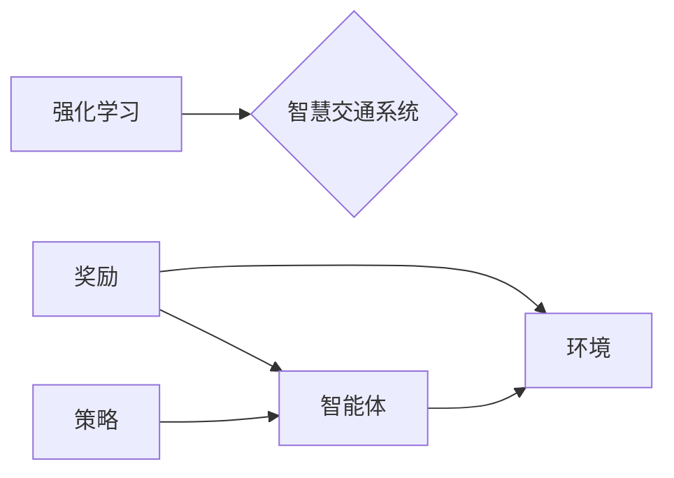

# 强化学习Reinforcement Learning在智慧交通系统中的创新应用

作者：禅与计算机程序设计艺术 / Zen and the Art of Computer Programming


## 1. 背景介绍
### 1.1 问题的由来

随着城市化进程的加快，交通拥堵、能源消耗、环境污染等问题日益突出。为了解决这些问题，智慧交通系统（Intelligent Traffic System，ITS）应运而生。智慧交通系统通过集成交通管理、交通信息、车辆监控、安全控制等功能，实现交通系统的智能化管理，提高交通效率，降低能源消耗，改善交通环境。

然而，传统的智慧交通系统大多采用基于规则和模型的控制方法，存在以下局限性：

1. **缺乏动态性**：传统的交通系统无法适应实时变化的交通状况，容易造成交通拥堵。
2. **适应性差**：传统的交通系统对交通模式的改变反应迟钝，难以适应交通需求的变化。
3. **可扩展性低**：传统的交通系统难以扩展到更复杂的交通场景。

为了解决这些问题，强化学习（Reinforcement Learning，RL）技术逐渐成为智慧交通系统研究的热点。强化学习通过智能体在环境中学习最优策略，能够实现动态、自适应、可扩展的智能交通管理。

### 1.2 研究现状

近年来，强化学习在智慧交通系统中的应用取得了显著进展。主要研究方向包括：

1. **交通流量预测**：利用强化学习预测交通流量，为交通管理提供决策支持。
2. **信号灯控制**：利用强化学习实现信号灯的智能控制，优化交通流量。
3. **路径规划**：利用强化学习为自动驾驶车辆提供路径规划。
4. **车辆调度**：利用强化学习优化公共交通车辆的调度方案。

### 1.3 研究意义

强化学习在智慧交通系统中的应用具有重要的研究意义：

1. **提高交通效率**：通过智能交通管理，优化交通流量，减少交通拥堵。
2. **降低能源消耗**：通过智能交通管理，降低车辆行驶速度，减少能源消耗。
3. **改善交通环境**：通过智能交通管理，减少车辆排放，改善交通环境。
4. **促进技术创新**：推动强化学习等人工智能技术在交通领域的应用，促进技术创新。

### 1.4 本文结构

本文将围绕强化学习在智慧交通系统中的应用展开，具体内容包括：

- 核心概念与联系
- 核心算法原理与具体操作步骤
- 数学模型和公式
- 项目实践
- 实际应用场景
- 工具和资源推荐
- 总结：未来发展趋势与挑战

## 2. 核心概念与联系

### 2.1 强化学习

强化学习是一种通过与环境交互，以最优策略为目标，不断学习和改进决策过程的学习方法。其基本思想是：智能体（Agent）通过与环境（Environment）的交互，根据奖励（Reward）信号来学习最优策略（Policy）。

### 2.2 智慧交通系统

智慧交通系统是指利用先进的信息技术、通信技术、控制技术和智能计算技术，实现交通系统的智能化管理，提高交通效率，降低能源消耗，改善交通环境。

### 2.3 关系图



## 3. 核心算法原理与具体操作步骤

### 3.1 算法原理概述

强化学习算法通过智能体与环境交互，不断学习最优策略。其基本步骤如下：

1. 初始化智能体和环境的参数。
2. 智能体根据当前状态选择一个动作。
3. 环境根据智能体的动作生成新的状态和奖励。
4. 智能体根据新的状态和奖励更新策略。
5. 重复步骤2-4，直到达到终止条件。

### 3.2 算法步骤详解

1. **初始化**：初始化智能体、环境、策略、参数等。
2. **选择动作**：智能体根据当前状态和策略选择一个动作。
3. **环境响应**：环境根据智能体的动作生成新的状态和奖励。
4. **更新策略**：智能体根据新的状态和奖励更新策略。
5. **终止条件**：判断是否达到终止条件，如达到最大步数、达到目标状态等。

### 3.3 算法优缺点

#### 优点

- **自适应性强**：能够根据环境的变化自动调整策略。
- **动态性强**：能够适应动态变化的交通状况。
- **可扩展性强**：可以应用于各种复杂的交通场景。

#### 缺点

- **收敛速度慢**：需要大量的样本数据进行训练。
- **计算复杂度高**：需要大量的计算资源。

### 3.4 算法应用领域

强化学习在智慧交通系统中的应用领域包括：

- 交通流量预测
- 信号灯控制
- 路径规划
- 车辆调度

## 4. 数学模型和公式

### 4.1 数学模型构建

强化学习中的数学模型主要包括：

- 状态空间（State Space）：描述环境的当前状态。
- 动作空间（Action Space）：描述智能体可以采取的动作集合。
- 奖励函数（Reward Function）：描述智能体在环境中采取动作的奖励值。
- 策略（Policy）：描述智能体在不同状态下采取动作的概率分布。

### 4.2 公式推导过程

假设智能体在状态 $s_t$ 下采取动作 $a_t$，环境根据动作 $a_t$ 生成新的状态 $s_{t+1}$ 和奖励 $r_t$。则强化学习的目标是最大化期望奖励值：

$$
J(\pi) = \sum_{t=0}^{\infty} \gamma^t r_t
$$

其中，$\gamma$ 为折扣因子，$\pi$ 为策略。

### 4.3 案例分析与讲解

以交通流量预测为例，我们将交通状态视为状态空间，智能体采取的动作包括调整信号灯、调整车道等，奖励函数可以设计为减少拥堵程度、降低排放等。

### 4.4 常见问题解答

**Q1：如何选择合适的奖励函数？**

A：奖励函数的选择取决于具体的应用场景。通常需要根据目标函数进行设计，例如，在交通流量预测中，可以将减少拥堵程度、降低排放等指标作为奖励函数。

**Q2：如何解决强化学习收敛速度慢的问题？**

A：可以采用以下方法解决：

- 使用更大的样本数据
- 使用更高效的算法，如深度Q网络（DQN）
- 使用迁移学习等技术

## 5. 项目实践

### 5.1 开发环境搭建

以Python为例，开发强化学习项目需要以下环境：

- Python
- PyTorch
- OpenAI Gym

### 5.2 源代码详细实现

以下是一个简单的交通流量预测的代码示例：

```python
import gym
import torch
import torch.nn as nn
import torch.optim as optim

# 定义环境
env = gym.make("TrafficFlow-v0")

# 定义模型
class DQN(nn.Module):
    def __init__(self):
        super(DQN, self).__init__()
        self.fc = nn.Sequential(
            nn.Linear(4, 128),
            nn.ReLU(),
            nn.Linear(128, 2)
        )

    def forward(self, x):
        return self.fc(x)

# 初始化模型和优化器
model = DQN()
optimizer = optim.Adam(model.parameters(), lr=0.001)

# 训练模型
def train(env, model, optimizer, episodes=1000):
    for episode in range(episodes):
        state = env.reset()
        done = False
        while not done:
            action = model(state).argmax()
            next_state, reward, done, _ = env.step(action)
            model.zero_grad()
            loss = (model(next_state) - torch.tensor([reward])).pow(2).mean()
            loss.backward()
            optimizer.step()
            state = next_state

# 运行环境
train(env, model, optimizer)

# 评估模型
def evaluate(env, model):
    state = env.reset()
    done = False
    while not done:
        action = model(state).argmax()
        next_state, reward, done, _ = env.step(action)
        print(f"Action: {action}, Reward: {reward}")
        state = next_state

evaluate(env, model)
```

### 5.3 代码解读与分析

该代码示例首先定义了一个交通流量预测环境，然后定义了一个基于DQN的深度Q网络模型，并使用Adam优化器进行训练。在训练过程中，智能体根据当前状态选择动作，环境根据动作生成新的状态和奖励，然后更新模型参数。最后，在测试阶段，评估模型的性能。

### 5.4 运行结果展示

运行上述代码后，将输出智能体采取的动作和相应的奖励值。

## 6. 实际应用场景

### 6.1 交通流量预测

通过强化学习预测交通流量，可以为交通管理部门提供决策支持，优化交通流量，减少交通拥堵。

### 6.2 信号灯控制

利用强化学习实现信号灯的智能控制，可以优化交通流量，减少交通拥堵，提高道路通行效率。

### 6.3 路径规划

利用强化学习为自动驾驶车辆提供路径规划，可以避免交通拥堵，提高行驶速度，降低能源消耗。

### 6.4 车辆调度

利用强化学习优化公共交通车辆的调度方案，可以提高公共交通的运营效率，降低运营成本。

## 7. 工具和资源推荐

### 7.1 学习资源推荐

- 《强化学习：原理与实战》
- 《深度学习与强化学习》
- 《OpenAI Gym官方文档》

### 7.2 开发工具推荐

- Python
- PyTorch
- OpenAI Gym

### 7.3 相关论文推荐

- 《Deep Reinforcement Learning for Traffic Signal Control at Intersections》
- 《Reinforcement Learning for Traffic Flow Prediction》
- 《Reinforcement Learning for Autonomous Driving》

### 7.4 其他资源推荐

- 《强化学习社区》
- 《PyTorch官方文档》
- 《OpenAI Gym官方文档》

## 8. 总结：未来发展趋势与挑战

### 8.1 研究成果总结

本文介绍了强化学习在智慧交通系统中的应用，包括核心概念、算法原理、项目实践和实际应用场景。通过强化学习，可以优化交通流量、信号灯控制、路径规划和车辆调度等，提高交通效率，降低能源消耗，改善交通环境。

### 8.2 未来发展趋势

未来，强化学习在智慧交通系统中的应用将呈现以下发展趋势：

- 更多的应用场景：将强化学习应用于更广泛的交通场景，如自动驾驶、智能停车场、智慧交通基础设施等。
- 更高效的算法：开发更高效的强化学习算法，提高学习效率，降低计算复杂度。
- 更好的可解释性：提高强化学习模型的可解释性，方便理解模型的决策过程。

### 8.3 面临的挑战

强化学习在智慧交通系统中的应用也面临着以下挑战：

- 数据采集：需要大量的真实交通数据进行训练，数据采集成本高。
- 算法可解释性：强化学习模型的可解释性较差，难以理解模型的决策过程。
- 安全性和可靠性：强化学习模型在真实交通场景中的安全性和可靠性需要得到保证。

### 8.4 研究展望

未来，强化学习在智慧交通系统中的应用将取得更大的突破，为智慧城市建设、智能交通发展做出重要贡献。

## 9. 附录：常见问题与解答

**Q1：强化学习在智慧交通系统中的应用有哪些优势？**

A：强化学习在智慧交通系统中的应用具有以下优势：

- 自适应性强：能够根据交通状况的变化自动调整策略。
- 动态性强：能够适应动态变化的交通状况。
- 可扩展性强：可以应用于各种复杂的交通场景。

**Q2：如何解决强化学习在智慧交通系统中的应用中的数据采集问题？**

A：可以采用以下方法解决：

- 使用合成数据：使用数据生成技术生成模拟交通数据。
- 使用迁移学习：利用其他领域的强化学习模型，迁移到交通领域。

**Q3：如何提高强化学习模型的可解释性？**

A：可以采用以下方法提高强化学习模型的可解释性：

- 使用可解释的强化学习算法，如基于规则的强化学习。
- 使用可视化技术，如可视化模型决策过程。

**Q4：如何保证强化学习模型在真实交通场景中的安全性和可靠性？**

A：可以采用以下方法保证强化学习模型在真实交通场景中的安全性和可靠性：

- 在仿真环境中进行充分测试。
- 在真实场景中进行小规模试点。
- 建立完善的监控和评估体系。