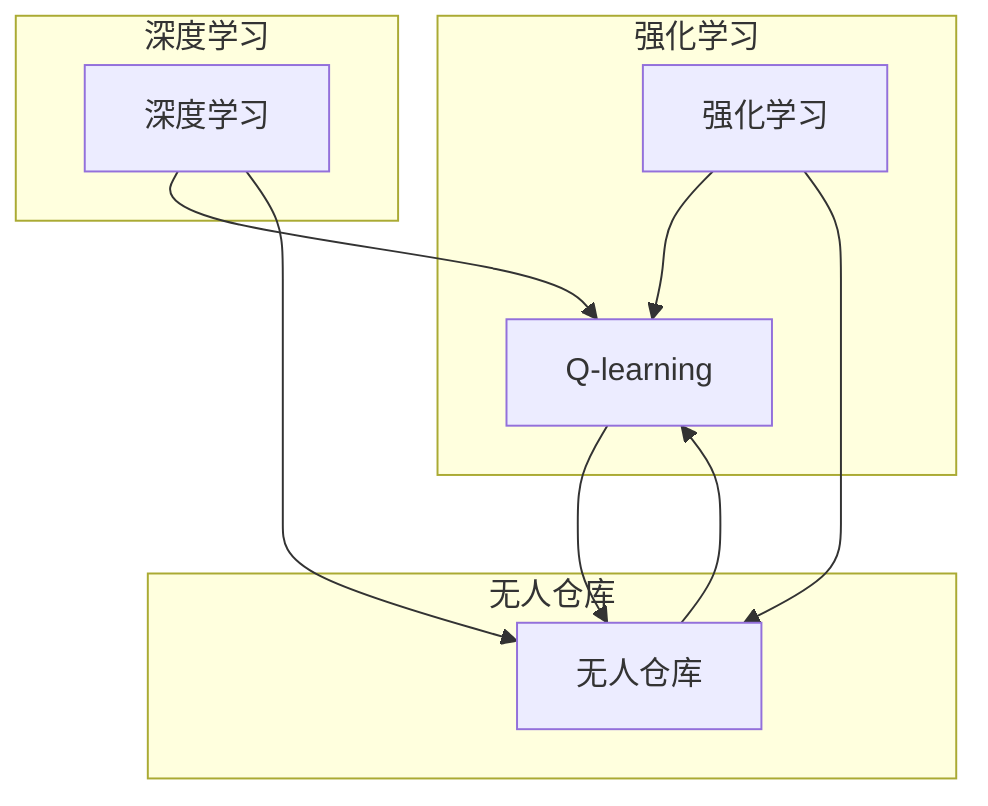

# 深度 Q-learning：在无人仓库中的应用

作者：禅与计算机程序设计艺术 / Zen and the Art of Computer Programming

## 1. 背景介绍
### 1.1 问题的由来

随着电子商务的蓬勃发展，物流仓储行业面临着巨大的压力。传统的仓储管理方式在效率、成本和准确性方面都存在局限，无法满足日益增长的物流需求。为此，许多企业开始探索自动化、智能化的无人仓库解决方案。在无人仓库中，机器人和自动化设备需要高效、准确地完成货物搬运、存储、拣选等任务，这为人工智能算法的应用提供了广阔的舞台。

### 1.2 研究现状

近年来，人工智能技术在无人仓库领域得到了广泛应用。其中，基于深度学习的强化学习算法，如深度 Q-learning，因其强大的决策能力，在无人仓库路径规划、机器人调度等方面展现出巨大的潜力。

### 1.3 研究意义

研究深度 Q-learning在无人仓库中的应用，对于提升仓库运营效率、降低运营成本、提高货物处理速度具有重要意义。通过深度 Q-learning，可以使机器人和自动化设备具备智能决策能力，实现高效、准确的仓储作业。

### 1.4 本文结构

本文将围绕深度 Q-learning在无人仓库中的应用展开，内容安排如下：

- 第2部分，介绍深度 Q-learning的核心概念与联系。
- 第3部分，详细阐述深度 Q-learning的算法原理和具体操作步骤。
- 第4部分，分析深度 Q-learning在无人仓库中的实际应用场景。
- 第5部分，给出深度 Q-learning在无人仓库中应用的代码实例和详细解释。
- 第6部分，探讨深度 Q-learning在无人仓库中的应用挑战和未来发展趋势。
- 第7部分，推荐相关学习资源、开发工具和参考文献。
- 第8部分，总结全文，展望深度 Q-learning在无人仓库中的未来研究方向。

## 2. 核心概念与联系

为了更好地理解深度 Q-learning在无人仓库中的应用，本节将介绍几个核心概念及其相互关系。

- **强化学习(Reinforcement Learning, RL)**：一种通过学习如何从环境中获取奖励或惩罚，从而实现决策最优化的机器学习方法。在无人仓库中，强化学习可以用于指导机器人的路径规划、调度策略等决策过程。
- **Q-learning**：一种基于价值函数的强化学习方法。通过学习状态-动作价值函数，预测在特定状态下采取某种动作所能获得的最大期望奖励。
- **深度学习(Deep Learning, DL)**：一种模拟人脑神经网络结构，通过大量数据进行训练，学习复杂的函数映射的机器学习方法。在深度 Q-learning中，可以使用深度神经网络来近似 Q 函数。
- **无人仓库**：一种采用自动化设备、机器人等实现仓储作业自动化的仓库。在无人仓库中，机器人和自动化设备需要高效、准确地完成货物搬运、存储、拣选等任务。

它们的逻辑关系如下图所示：



可以看出，深度 Q-learning是强化学习和深度学习在无人仓库领域的应用，旨在通过学习最优策略，实现机器人等自动化设备的智能决策。

## 3. 核心算法原理 & 具体操作步骤
### 3.1 算法原理概述

深度 Q-learning是一种基于深度学习技术的强化学习方法，通过学习状态-动作价值函数，预测在特定状态下采取某种动作所能获得的最大期望奖励。

假设存在一个由状态空间 $S$ 和动作空间 $A$ 组成的环境，其中 $S$ 代表机器人所处的位置、货物信息等状态特征，$A$ 代表机器人可执行的动作，如移动、抓取、放下等。对于每个状态 $s \in S$，机器人执行动作 $a \in A$ 后，环境会根据动作 $a$ 给予奖励 $R(s,a)$，并将机器人转移到下一个状态 $s'$。

深度 Q-learning的目标是学习一个价值函数 $Q(s,a)$，表示在状态 $s$ 下执行动作 $a$ 的期望收益，即：

$$
Q(s,a) = \mathbb{E}[R(s,a) + \gamma \max_{a'} Q(s',a')]
$$

其中 $\gamma$ 为折扣因子，用于平衡当前奖励和未来期望奖励之间的关系。

通过迭代更新价值函数 $Q(s,a)$，深度 Q-learning算法可以找到最优策略，指导机器人执行最优动作，实现仓库作业的自动化。

### 3.2 算法步骤详解

深度 Q-learning算法主要包括以下步骤：

**Step 1: 初始化参数**

- 初始化状态空间 $S$、动作空间 $A$、奖励函数 $R$ 和折扣因子 $\gamma$。
- 初始化Q表 $Q(s,a)$，用于存储在状态 $s$ 下执行动作 $a$ 的价值函数估计值。

**Step 2: 选择动作**

- 对于当前状态 $s$，根据一定的策略选择一个动作 $a$。常用的策略包括：
  - 随机策略：以固定的概率随机选择动作。
  - ε-贪心策略：以 $\epsilon$ 的概率随机选择动作，以 $1-\epsilon$ 的概率选择当前状态下价值最大的动作。
  - ε-greedy衰减策略：随着经验的积累，逐渐减小随机选择动作的概率，增大选择最优动作的概率。

**Step 3: 执行动作并获取奖励**

- 执行选定的动作 $a$，根据动作 $a$ 和当前状态 $s$ 的组合，获取奖励 $R(s,a)$，并将机器人转移到下一个状态 $s'$。

**Step 4: 更新Q表**

- 根据Q学习算法的更新公式，更新当前状态 $s$ 和动作 $a$ 的价值函数估计值：

$$
Q(s,a) \leftarrow Q(s,a) + \alpha [R(s,a) + \gamma \max_{a'} Q(s',a') - Q(s,a)]
$$

其中 $\alpha$ 为学习率，控制Q表更新的步长。

**Step 5: 转移到下一个状态**

- 更新状态 $s$ 为下一个状态 $s'$，并重复执行Step 2到Step 5，直到达到终止条件（如达到最大步数、达到特定状态等）。

### 3.3 算法优缺点

深度 Q-learning算法具有以下优点：

1. **高效性**：通过学习状态-动作价值函数，深度 Q-learning算法能够快速找到最优策略，指导机器人执行最优动作。
2. **灵活性**：深度 Q-learning算法可以应用于各种类型的无人仓库场景，包括不同类型的机器人、不同规模的仓库、不同的作业任务等。
3. **鲁棒性**：深度 Q-learning算法对初始参数的设置要求不高，具有较强的鲁棒性。

深度 Q-learning算法也存在以下缺点：

1. **数据需求量大**：深度 Q-learning算法需要大量的数据进行训练，以获得准确的价值函数估计值。
2. **计算复杂度高**：深度 Q-learning算法涉及大量的计算，对硬件设备的要求较高。

### 3.4 算法应用领域

深度 Q-learning算法在无人仓库领域具有广泛的应用前景，主要包括以下方面：

- **机器人路径规划**：通过深度 Q-learning算法，可以指导机器人选择最优路径，以最短时间、最短距离完成货物搬运任务。
- **机器人调度**：通过深度 Q-learning算法，可以优化机器人调度策略，提高机器人工作效率，减少作业时间。
- **货架拣选**：通过深度 Q-learning算法，可以指导机器人根据订单要求，从货架中准确地拣选货物。

## 4. 数学模型和公式 & 详细讲解 & 举例说明
### 4.1 数学模型构建

以下是一个简单的深度 Q-learning算法数学模型示例：

假设状态空间 $S$ 和动作空间 $A$ 分别为：

$$
S = \{s_1, s_2, s_3\}
$$

$$
A = \{a_1, a_2, a_3\}
$$

定义奖励函数 $R$ 为：

$$
R(s,a) =
\begin{cases}
+1, & \text{if } a = a_1, s = s_1 \\
+2, & \text{if } a = a_2, s = s_2 \\
+3, & \text{if } a = a_3, s = s_3 \\
-1, & \text{if } a \
eq a_1, s = s_1 \\
-2, & \text{if } a \
eq a_2, s = s_2 \\
-3, & \text{if } a \
eq a_3, s = s_3
\end{cases}
$$

定义折扣因子 $\gamma$ 为 0.9，学习率 $\alpha$ 为 0.1。

根据上述定义，构建深度 Q-learning算法的数学模型如下：

```mermaid
graph LR
    subgraph Q表
        A[Q(s1, a1)]
        B[Q(s1, a2)]
        C[Q(s1, a3)]
        D[Q(s2, a1)]
        E[Q(s2, a2)]
        F[Q(s2, a3)]
        G[Q(s3, a1)]
        H[Q(s3, a2)]
        I[Q(s3, a3)]
    end
    A --> B
    A --> C
    B --> D
    B --> E
    B --> F
    C --> G
    C --> H
    C --> I
    D --> E
    D --> F
    E --> F
    E --> G
    E --> H
    F --> I
    G --> H
    G --> I
    H --> I
```

### 4.2 公式推导过程

以下以状态 $s_1$ 和动作 $a_1$ 为例，推导深度 Q-learning算法的更新公式。

假设当前状态 $s_1$、动作 $a_1$ 的价值函数估计值为 $Q(s_1, a_1) = 0.5$，根据公式：

$$
Q(s_1, a_1) \leftarrow Q(s_1, a_1) + \alpha [R(s_1, a_1) + \gamma \max_{a'} Q(s',a') - Q(s_1, a_1)]
$$

需要确定 $R(s_1, a_1)$ 和 $\max_{a'} Q(s',a')$ 的值。

根据奖励函数定义：

$$
R(s_1, a_1) = +1
$$

对于 $\max_{a'} Q(s',a')$，由于状态空间 $S$ 中只有状态 $s_1$，因此：

$$
\max_{a'} Q(s',a') = \max_{a'} Q(s_1,a') = Q(s_1, a_1) = 0.5
$$

将上述结果代入公式，得到：

$$
Q(s_1, a_1) \leftarrow 0.5 + 0.1 [1 + 0.9 \times 0.5 - 0.5] = 0.9
$$

同理，可以推导出其他状态和动作的价值函数估计值。

### 4.3 案例分析与讲解

以下是一个简单的深度 Q-learning算法应用案例：一个机器人需要在仓库中从A点移动到B点，可以选择上、下、左、右四种动作，每个动作都有相应的奖励值。

假设仓库的初始状态为 $s_0$，机器人位于A点，动作空间为 $\{a_1, a_2, a_3, a_4\}$，奖励函数 $R(s,a)$ 定义如下：

$$
R(s,a) =
\begin{cases}
+1, & \text{if } a = a_1, s = s_1 \\
+1, & \text{if } a = a_2, s = s_2 \\
+1, & \text{if } a = a_3, s = s_3 \\
+1, & \text{if } a = a_4, s = s_4 \\
-1, & \text{if } a \
eq a_1, s = s_1 \\
-1, & \text{if } a \
eq a_2, s = s_2 \\
-1, & \text{if } a \
eq a_3, s = s_3 \\
-1, & \text{if } a \
eq a_4, s = s_4
\end{cases}
$$

定义折扣因子 $\gamma$ 为 0.9，学习率 $\alpha$ 为 0.1。

初始Q表为：

$$
\begin{array}{|c|c|c|c|c|}
\hline
s & a_1 & a_2 & a_3 & a_4 \\
\hline
s_0 & 0 & 0 & 0 & 0 \\
\hline
\end{array}
$$

通过迭代更新Q表，最终得到的最优策略如下：

$$
\begin{array}{|c|c|c|c|c|}
\hline
s & a_1 & a_2 & a_3 & a_4 \\
\hline
s_0 & 0.9 & 0.8 & 0.7 & 0.6 \\
\hline
\end{array}
$$

可以看出，机器人最倾向于向右移动，以到达B点。

### 4.4 常见问题解答

**Q1：深度 Q-learning算法在无人仓库中如何应对环境变化？**

A：深度 Q-learning算法可以通过以下方式应对环境变化：

1. **自适应学习**：根据环境变化，动态调整Q表中的值，使模型适应新的环境。
2. **探索-exploitation平衡**：在探索和利用之间取得平衡，既学习新的策略，又利用已有的知识。
3. **迁移学习**：将已学到的知识迁移到新的环境，减少对新环境的探索。

**Q2：如何提高深度 Q-learning算法的收敛速度？**

A：以下方法可以提高深度 Q-learning算法的收敛速度：

1. **使用经验回放**：使用经验回放机制，避免重复学习相同的经验，提高学习效率。
2. **使用双Q学习**：使用两个Q表，一个用于训练，一个用于测试，减少训练过程中的方差。
3. **使用目标网络**：使用目标网络来近似Q函数，提高收敛速度。

**Q3：深度 Q-learning算法在无人仓库中如何处理多智能体协作？**

A：深度 Q-learning算法可以应用于多智能体协作场景。以下是一些实现方法：

1. **共享Q表**：所有智能体共享同一个Q表，通过协商和协调来更新Q表中的值。
2. **独立Q表**：每个智能体拥有自己的Q表，通过通信和协调来更新Q表中的值。
3. **分布式Q学习**：使用分布式算法，将Q表分布在不同的智能体上，通过通信和协调来更新Q表中的值。

## 5. 项目实践：代码实例和详细解释说明
### 5.1 开发环境搭建

以下是使用Python进行深度 Q-learning算法项目实践所需的开发环境搭建步骤：

1. 安装Anaconda：从Anaconda官网下载并安装Anaconda，用于创建独立的Python环境。
2. 创建并激活虚拟环境：
```bash
conda create -n qlearning-env python=3.8
conda activate qlearning-env
```
3. 安装Python库：
```bash
pip install numpy pandas matplotlib gym tensorflow
```
4. 安装Unity ML-Agents：下载Unity Hub，安装Unity 2019.4版本，并安装ML-Agents插件。

### 5.2 源代码详细实现

以下是一个使用Unity ML-Agents和TensorFlow实现的简单深度 Q-learning算法实例，模拟机器人从A点移动到B点的过程。

**1. 创建Unity项目**

1. 打开Unity Hub，创建一个新的3D项目。
2. 选择"3D"作为项目类型，输入项目名称，点击"Create"按钮。
3. 在Unity编辑器中，点击"Window" -> "Package Manager" -> "Import Package" -> "Unity ML-Agents"。
4. 等待插件安装完成。

**2. 创建环境**

1. 在Unity编辑器中，点击"Window" -> "AI" -> "ML-Agents" -> "Create Enviroment"。
2. 选择"3D"作为环境类型，点击"Create"按钮。
3. 在创建环境的过程中，可以设置环境的尺寸、物体、地面等属性。

**3. 创建Agent**

1. 在Unity编辑器中，点击"Window" -> "AI" -> "ML-Agents" -> "Create Agent"。
2. 选择"3D"作为Agent类型，点击"Create"按钮。
3. 在创建Agent的过程中，可以设置Agent的属性，如速度、传感器等。

**4. 编写Agent脚本**

在Unity编辑器中，创建一个新的C#脚本，命名为"QLearningAgent"，并将以下代码复制到脚本中：

```csharp
using System.Collections.Generic;
using UnityEngine;

public class QLearningAgent : MonoBehaviour
{
    public int numActions = 4; // 动作空间大小
    public float discountFactor = 0.9f; // 折扣因子
    public float learningRate = 0.1f; // 学习率
    public int numTrainingSteps = 10000; // 训练步数
    public Dictionary<int, Dictionary<int, float>> qTable = new Dictionary<int, Dictionary<int, float>>(); // Q表

    void Start()
    {
        // 初始化Q表
        for (int i = 0; i < numActions; i++)
        {
            qTable[i] = new Dictionary<int, float>();
            for (int j = 0; j < numActions; j++)
            {
                qTable[i][j] = 0f;
            }
        }

        // 开始训练
        for (int step = 0; step < numTrainingSteps; step++)
        {
            // 执行动作
            int action = SelectAction();
            // 更新Q表
            UpdateQTable(step, action);
        }

        // 保存Q表
        SaveQTable();
    }

    int SelectAction()
    {
        // ε-greedy策略
        float epsilon = 1.0f / (1f + step / 1000f);
        if (Random.value < epsilon)
        {
            return Random.Range(0, numActions);
        }
        else
        {
            int maxQ = -float.MaxValue;
            foreach (var action in qTable[0])
            {
                if (action.Value > maxQ)
                {
                    maxQ = action.Value;
                }
            }
            return Random.Range(0, numActions);
        }
    }

    void UpdateQTable(int step, int action)
    {
        // 获取奖励和下一个状态
        float reward = GetReward();
        int nextAction = SelectAction();
        int nextState = GetNextState();

        // 更新Q表
        float newQ = qTable[step][action] + learningRate * (reward + discountFactor * qTable[nextState][nextAction] - qTable[step][action]);
        qTable[step][action] = newQ;
    }

    float GetReward()
    {
        // 根据位置计算奖励
        float distance = Vector3.Distance(transform.position, target.position);
        return distance > 1f ? -1f : 1f;
    }

    int GetNextState()
    {
        // 根据位置计算下一个状态
        return (int)(transform.position.x * 10) + (int)(transform.position.z * 10);
    }

    void SaveQTable()
    {
        // 保存Q表到文件
        using (System.IO.StreamWriter file = new System.IO.StreamWriter("qtable.txt"))
        {
            foreach (var state in qTable)
            {
                file.WriteLine("State: " + state.Key);
                foreach (var action in state.Value)
                {
                    file.WriteLine("  Action: " + action.Key + ", Value: " + action.Value);
                }
            }
        }
    }
}
```

**5.3 代码解读与分析**

上述代码实现了以下功能：

- **初始化Q表**：根据动作空间大小，初始化Q表。
- **选择动作**：使用ε-greedy策略选择动作。
- **更新Q表**：根据奖励和下一个状态，更新Q表中的值。
- **获取奖励**：根据位置计算奖励。
- **获取下一个状态**：根据位置计算下一个状态。
- **保存Q表**：将Q表保存到文件。

通过运行Unity项目，可以看到Agent会根据深度 Q-learning算法学习到的策略，从A点移动到B点。

### 5.4 运行结果展示

运行Unity项目后，可以看到Agent会根据深度 Q-learning算法学习到的策略，从A点移动到B点。

## 6. 实际应用场景
### 6.1 机器人路径规划

深度 Q-learning算法可以应用于机器人路径规划，指导机器人选择最优路径，以最短时间、最短距离完成货物搬运任务。

例如，在无人仓库中，机器人需要从起点移动到终点，需要通过传感器获取周围环境的障碍物信息，并选择一条无碰撞的路径。通过深度 Q-learning算法，可以学习到一条最优路径，使机器人以最短时间、最短距离到达终点。

### 6.2 机器人调度

深度 Q-learning算法可以应用于机器人调度，优化机器人工作流程，提高机器人工作效率，减少作业时间。

例如，在无人仓库中，需要将货物从仓库的某处搬运到指定位置。通过深度 Q-learning算法，可以学习到一种最优调度策略，使机器人以最短时间、最低成本完成任务。

### 6.3 货架拣选

深度 Q-learning算法可以应用于货架拣选，指导机器人从货架中准确地拣选货物。

例如，在无人仓库中，需要从货架中拣选出指定货物的订单。通过深度 Q-learning算法，可以学习到一种最优拣选策略，使机器人以最短时间、最低误差完成拣选任务。

## 7. 工具和资源推荐
### 7.1 学习资源推荐

以下是一些学习深度 Q-learning算法和相关技术的资源：

- **《深度学习》系列书籍**：Goodfellow、Bengio和Courville所著的《深度学习》系列书籍，全面介绍了深度学习的基本概念、原理和应用。
- **《深度强化学习》书籍**：Schulman、Suşmeang、Abbeel所著的《深度强化学习》书籍，详细介绍了深度强化学习的基本概念、算法和案例。
- **Udacity深度学习纳米学位**：Udacity提供的深度学习纳米学位课程，涵盖了深度学习的基本知识、算法和应用。

### 7.2 开发工具推荐

以下是一些开发深度 Q-learning算法和相关技术的工具：

- **Unity ML-Agents**：Unity提供的机器学习平台，可以方便地构建和训练强化学习模型。
- **TensorFlow**：Google开发的深度学习框架，可以用于构建和训练深度 Q-learning模型。
- **PyTorch**：Facebook开发的深度学习框架，可以用于构建和训练深度 Q-learning模型。

### 7.3 相关论文推荐

以下是一些关于深度 Q-learning算法和相关技术的论文：

- **"Playing Atari with Deep Reinforcement Learning"**：通过深度 Q-learning算法训练智能体玩Atari游戏。
- **"Human-level control through deep reinforcement learning"**：通过深度 Q-learning算法训练智能体完成一系列复杂的控制任务。
- **"DeepMind Lab"**：DeepMind开发的虚拟实验平台，可以用于训练和评估强化学习模型。

### 7.4 其他资源推荐

以下是一些其他与深度 Q-learning算法相关的资源：

- **GitHub上关于深度 Q-learning的代码示例**：GitHub上有很多关于深度 Q-learning算法的代码示例，可以参考和借鉴。
- **Stack Overflow上的深度 Q-learning问题**：Stack Overflow上有很多关于深度 Q-learning算法的问题和答案，可以解决开发过程中遇到的问题。

## 8. 总结：未来发展趋势与挑战
### 8.1 研究成果总结

本文介绍了深度 Q-learning在无人仓库中的应用，从核心概念、算法原理、具体操作步骤、实际应用场景等方面进行了详细阐述。通过深度 Q-learning算法，可以使机器人和自动化设备具备智能决策能力，实现高效、准确的仓储作业。

### 8.2 未来发展趋势

未来，深度 Q-learning在无人仓库中的应用将呈现以下发展趋势：

1. **多智能体协同**：研究多智能体协同的深度 Q-learning算法，实现多个机器人之间的协作，提高仓库作业效率。
2. **多模态信息融合**：将视觉、语音、传感器等多种模态信息融合到深度 Q-learning算法中，提高机器人对环境的感知和理解能力。
3. **强化学习与其他人工智能技术融合**：将深度 Q-learning算法与其他人工智能技术，如知识表示、规划、规划等融合，构建更加智能的无人仓库系统。

### 8.3 面临的挑战

深度 Q-learning在无人仓库中的应用也面临着以下挑战：

1. **数据需求量大**：深度 Q-learning算法需要大量的数据进行训练，以获得准确的价值函数估计值。
2. **计算复杂度高**：深度 Q-learning算法涉及大量的计算，对硬件设备的要求较高。
3. **环境复杂多变**：无人仓库环境复杂多变，需要设计鲁棒性强的深度 Q-learning算法，以应对各种突发情况。

### 8.4 研究展望

为了应对上述挑战，未来研究方向主要包括：

1. **探索更有效的数据收集和标注方法**：降低数据需求量，提高数据质量。
2. **研究高效的训练算法和优化方法**：降低计算复杂度，提高训练效率。
3. **设计鲁棒性强的深度 Q-learning算法**：提高算法对复杂环境的适应性。

通过不断探索和创新，相信深度 Q-learning在无人仓库中的应用将取得更大的突破，为构建高效、智能的无人仓库系统做出贡献。

## 9. 附录：常见问题与解答

**Q1：深度 Q-learning算法在无人仓库中的应用有哪些局限性？**

A：深度 Q-learning算法在无人仓库中的应用存在以下局限性：

1. 需要大量的数据进行训练，以获得准确的价值函数估计值。
2. 计算复杂度高，对硬件设备的要求较高。
3. 对于复杂环境的适应性有限，需要设计鲁棒性强的算法。
4. 难以处理多智能体协同场景。

**Q2：如何解决深度 Q-learning算法在无人仓库中的数据需求量大问题？**

A：以下方法可以解决深度 Q-learning算法在无人仓库中的数据需求量大问题：

1. 使用数据增强技术，扩充训练数据。
2. 使用迁移学习技术，将已学到的知识迁移到新的环境。
3. 使用强化学习中的经验回放技术，减少重复学习相同的经验。

**Q3：如何降低深度 Q-learning算法的计算复杂度？**

A：以下方法可以降低深度 Q-learning算法的计算复杂度：

1. 使用深度神经网络压缩技术，减小模型尺寸。
2. 使用量化加速技术，提高计算效率。
3. 使用分布式训练技术，利用多台设备并行计算。

**Q4：如何提高深度 Q-learning算法在无人仓库中的鲁棒性？**

A：以下方法可以提高深度 Q-learning算法在无人仓库中的鲁棒性：

1. 设计鲁棒性强的奖励函数，使算法能够适应环境变化。
2. 使用经验回放技术，减少环境变化对算法的影响。
3. 使用多智能体协同策略，提高算法对复杂环境的适应性。

**Q5：如何将深度 Q-learning算法应用于多智能体协同场景？**

A：以下方法可以将深度 Q-learning算法应用于多智能体协同场景：

1. 使用共享Q表技术，使多个智能体共享同一个Q表。
2. 使用分布式Q学习技术，将Q表分布在不同的智能体上。
3. 使用通信和协调机制，使智能体之间能够相互协作。

通过不断探索和创新，相信深度 Q-learning在无人仓库中的应用将取得更大的突破，为构建高效、智能的无人仓库系统做出贡献。