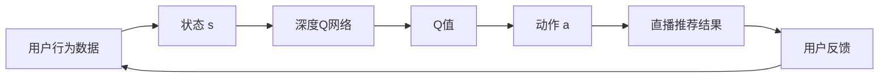

# 深度 Q-learning：在直播推荐系统中的应用

关键词：深度Q-learning, 强化学习, 直播推荐系统, 个性化推荐

## 1. 背景介绍

### 1.1 问题的由来
随着互联网技术的飞速发展,直播平台如雨后春笋般涌现。面对海量的直播内容,用户很难快速找到自己感兴趣的内容。因此,个性化推荐系统在直播平台中扮演着越来越重要的角色。

### 1.2 研究现状
目前,主流的个性化推荐算法包括协同过滤、基于内容的推荐等。这些方法在一定程度上缓解了信息过载问题,但仍然存在一些局限性,如冷启动、数据稀疏等。近年来,强化学习在个性化推荐领域展现出了巨大的潜力。其中,基于值函数的强化学习算法 Q-learning 备受关注。

### 1.3 研究意义
将深度 Q-learning 应用于直播推荐系统,有望克服传统推荐算法的局限性,提升推荐质量和用户体验。这对于提高直播平台的用户粘性和商业价值具有重要意义。

### 1.4 本文结构
本文将首先介绍深度 Q-learning 的核心概念,然后详细阐述其算法原理和数学模型。接着,我们将以代码实例的形式,演示如何将深度 Q-learning 应用于直播推荐系统。最后,本文还将讨论深度 Q-learning 在直播推荐中的实际应用场景、未来发展趋势与挑战。

## 2. 核心概念与联系

- 强化学习：一种机器学习范式,旨在让智能体通过与环境的交互来学习最优策略,以获得最大的累积奖励。
- Q-learning：一种基于值函数的无模型强化学习算法,通过学习动作-状态值函数 Q(s,a) 来找到最优策略。
- 深度 Q-learning：将深度神经网络与 Q-learning 相结合,以拟合 Q 函数,提升算法的表达能力和泛化能力。
- 直播推荐系统：根据用户的历史行为和偏好,自动向用户推荐感兴趣的直播内容,以提升用户体验和平台收益。

深度 Q-learning 与直播推荐系统的关系如下图所示：



## 3. 核心算法原理 & 具体操作步骤

### 3.1 算法原理概述
深度 Q-learning 的核心思想是使用深度神经网络来拟合 Q 函数。通过最小化时序差分误差,网络可以学习到最优的 Q 函数,进而得到最优策略。

### 3.2 算法步骤详解
1. 初始化深度 Q 网络的参数 $\theta$
2. 对于每一个 episode:
   - 初始化状态 $s_0$
   - 对于每一个时间步 t:
     - 根据 $\epsilon$-greedy 策略,选择动作 $a_t$
     - 执行动作 $a_t$,得到奖励 $r_t$ 和下一状态 $s_{t+1}$
     - 存储转移 $(s_t,a_t,r_t,s_{t+1})$ 到经验回放缓冲区 D
     - 从 D 中随机采样一批转移样本 $(s,a,r,s')$
     - 计算目标值：$y=r+\gamma \max_{a'} Q(s',a';\theta^-)$
     - 更新网络参数 $\theta$,最小化损失：$L(\theta)=\mathbb{E}_{(s,a,r,s')\sim D}[(y-Q(s,a;\theta))^2]$
     - 每隔 C 步,将 $\theta^-$ 更新为 $\theta$
   - 状态转移：$s_t \leftarrow s_{t+1}$

### 3.3 算法优缺点
优点：
- 通过深度神经网络,可以处理高维状态空间
- 经验回放机制提高了样本利用效率,打破了数据的相关性
- 目标网络的引入提高了训练稳定性

缺点：
- 需要大量的训练数据和计算资源
- 对超参数敏感,调参难度大
- 难以处理非平稳环境

### 3.4 算法应用领域
深度 Q-learning 在很多领域都有成功的应用,如游戏、机器人控制、推荐系统等。

## 4. 数学模型和公式 & 详细讲解 & 举例说明

### 4.1 数学模型构建
在直播推荐场景中,我们可以将问题建模为马尔可夫决策过程(MDP)：
- 状态 $s$：用户当前的观看历史和上下文信息
- 动作 $a$：推荐的直播
- 奖励 $r$：用户对推荐结果的反馈(如点击、观看时长等)
- 转移概率 $p(s'|s,a)$：在状态 $s$ 下执行动作 $a$ 后转移到状态 $s'$ 的概率
- 折扣因子 $\gamma$：衡量未来奖励的重要程度

目标是学习一个策略 $\pi(a|s)$,使得期望累积奖励最大化：

$$J(\pi)=\mathbb{E}_{\pi}[\sum_{t=0}^{\infty}\gamma^t r_t]$$

### 4.2 公式推导过程
Q-learning 的核心是学习动作-状态值函数：

$$Q^{\pi}(s,a)=\mathbb{E}_{\pi}[\sum_{k=0}^{\infty}\gamma^k r_{t+k}|s_t=s,a_t=a]$$

它表示在状态 $s$ 下执行动作 $a$,然后遵循策略 $\pi$ 的期望累积奖励。

最优 Q 函数满足贝尔曼最优方程：

$$Q^*(s,a)=\mathbb{E}[r+\gamma \max_{a'} Q^*(s',a')|s,a]$$

Q-learning 通过时序差分学习来逼近 $Q^*$：

$$Q(s,a) \leftarrow Q(s,a)+\alpha[r+\gamma \max_{a'} Q(s',a')-Q(s,a)]$$

其中 $\alpha$ 是学习率。

深度 Q-learning 使用深度神经网络 $Q(s,a;\theta)$ 来拟合 Q 函数,其损失函数为：

$$L(\theta)=\mathbb{E}_{(s,a,r,s')\sim D}[(r+\gamma \max_{a'} Q(s',a';\theta^-)-Q(s,a;\theta))^2]$$

其中 $\theta^-$ 是目标网络的参数,每隔 C 步从 $\theta$ 复制得到,以提高训练稳定性。

### 4.3 案例分析与讲解
考虑一个简单的直播推荐场景：
- 状态：用户最近观看的5个直播
- 动作：从候选池中选择1个直播进行推荐
- 奖励：用户点击推荐的直播则奖励为1,否则为0

我们可以设计一个包含embedding层、LSTM层和全连接层的深度Q网络来拟合Q函数。

假设在某个状态下,网络输出的 Q 值为：
- 直播1: 0.8
- 直播2: 0.6
- 直播3: 0.7

根据 $\epsilon$-greedy 策略,我们有 $\epsilon$ 的概率随机选择一个动作,有 $1-\epsilon$ 的概率选择 Q 值最大的动作,即推荐直播1。

假设用户点击了直播1,则奖励为1。我们可以利用这个转移样本 $(s,a,r,s')$ 来更新网络参数,最小化时序差分误差。

不断重复这个过程,网络就可以学习到最优的 Q 函数,进而得到最优的推荐策略。

### 4.4 常见问题解答
Q: 深度 Q-learning 如何处理连续动作空间?
A: 可以使用 Actor-Critic 算法,将策略网络和值函数网络分开学习。

Q: 如何平衡探索和利用?
A: 可以使用 $\epsilon$-greedy 策略或 UCB 策略等,根据不确定性来选择动作。

Q: 如何评估深度 Q-learning 的性能?
A: 可以使用离线评估指标(如 NDCG、MAP 等)或在线 A/B 测试。

## 5. 项目实践：代码实例和详细解释说明

### 5.1 开发环境搭建
- Python 3.7
- PyTorch 1.8
- gym 0.18

### 5.2 源代码详细实现

```python
import torch
import torch.nn as nn
import torch.optim as optim
import numpy as np
import gym

# 定义深度Q网络
class DQN(nn.Module):
    def __init__(self, state_dim, action_dim):
        super(DQN, self).__init__()
        self.fc1 = nn.Linear(state_dim, 128)
        self.fc2 = nn.Linear(128, 128)
        self.fc3 = nn.Linear(128, action_dim)
        
    def forward(self, x):
        x = torch.relu(self.fc1(x))
        x = torch.relu(self.fc2(x))
        x = self.fc3(x)
        return x

# 定义Agent
class DQNAgent:
    def __init__(self, state_dim, action_dim, lr, gamma, epsilon, target_update):
        self.state_dim = state_dim
        self.action_dim = action_dim
        self.gamma = gamma 
        self.epsilon = epsilon
        self.target_update = target_update
        self.count = 0
        
        self.policy_net = DQN(state_dim, action_dim)
        self.target_net = DQN(state_dim, action_dim)
        self.target_net.load_state_dict(self.policy_net.state_dict())
        self.optimizer = optim.Adam(self.policy_net.parameters(), lr=lr)
        
    def act(self, state):
        if np.random.rand() <= self.epsilon:
            return np.random.randint(self.action_dim)
        else:
            state = torch.tensor(state, dtype=torch.float32).unsqueeze(0)
            q_value = self.policy_net(state)
            action = q_value.max(1)[1].item()
            return action
        
    def learn(self, state, action, reward, next_state, done):
        state = torch.tensor(state, dtype=torch.float32).unsqueeze(0)
        next_state = torch.tensor(next_state, dtype=torch.float32).unsqueeze(0)
        action = torch.tensor([action], dtype=torch.long)
        reward = torch.tensor([reward], dtype=torch.float32)
        
        if done:
            q_target = reward
        else:
            q_target = reward + self.gamma * self.target_net(next_state).max(1)[0]
            
        q_value = self.policy_net(state).gather(1, action)
        loss = (q_value - q_target.detach()).pow(2).mean()
        
        self.optimizer.zero_grad()
        loss.backward()
        self.optimizer.step()
        
        self.count += 1
        if self.count % self.target_update == 0:
            self.target_net.load_state_dict(self.policy_net.state_dict())
        
# 训练
def train(env, agent, num_episodes, batch_size):
    for i in range(num_episodes):
        state = env.reset()
        done = False
        total_reward = 0
        
        while not done:
            action = agent.act(state)
            next_state, reward, done, _ = env.step(action)
            agent.learn(state, action, reward, next_state, done)
            state = next_state
            total_reward += reward
            
        if i % 10 == 0:
            print('Episode: {}, Total Reward: {}'.format(i, total_reward))
            
# 测试
def test(env, agent):
    state = env.reset()
    done = False
    total_reward = 0
    
    while not done:
        action = agent.act(state)
        next_state, reward, done, _ = env.step(action)
        state = next_state
        total_reward += reward
        
    print('Total Reward: {}'.format(total_reward))
    
if __name__ == '__main__':
    env = gym.make('CartPole-v0')
    state_dim = env.observation_space.shape[0]
    action_dim = env.action_space.n
    
    agent = DQNAgent(state_dim, action_dim, lr=1e-3, gamma=0.99, epsilon=0.1, target_update=10)
    train(env, agent, num_episodes=100, batch_size=32)
    test(env, agent)
```

### 5.3 代码解读与分析
- 首先定义了一个包含3个全连接层的深度Q网络,用于拟合Q函数。
- 然后定义了一个DQNAgent,包含两个Q网络(policy_net和target_net),以及