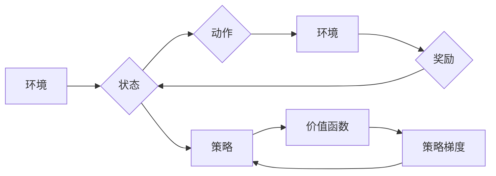

# 深度强化学习 (Deep Reinforcement Learning) 原理与代码实例讲解

作者：禅与计算机程序设计艺术 / Zen and the Art of Computer Programming 

## 关键词：

深度学习，强化学习，深度强化学习，DQN，PPO，A2C，环境搭建，代码示例，实际应用

## 1. 背景介绍

### 1.1 问题的由来

自20世纪50年代图灵提出“人工智能”概念以来，人工智能领域经历了多个高潮和低谷。近年来，随着深度学习技术的发展，人工智能迎来了新的春天。其中，强化学习作为机器学习的一个重要分支，在游戏、机器人、自动驾驶等领域取得了显著成果。

强化学习（Reinforcement Learning，RL）是一种使机器能够通过与环境的交互学习如何采取最优行为以实现特定目标的方法。与监督学习、无监督学习相比，强化学习具有以下特点：

- **无标签数据**：强化学习通常不依赖于大量标注数据，而是通过与环境的交互来学习。
- **决策导向**：强化学习关注如何制定决策，而不是如何从数据中学习特征。
- **动态变化**：强化学习环境是动态变化的，需要模型不断调整策略以适应环境。

深度强化学习（Deep Reinforcement Learning，DRL）是强化学习的一个分支，它将深度神经网络与强化学习相结合，使得模型能够处理更加复杂的环境。DRL在计算机视觉、自然语言处理等领域也取得了显著进展。

### 1.2 研究现状

近年来，DRL技术在游戏、机器人、自动驾驶、金融、医疗等领域取得了显著成果。以下是部分代表性的研究：

- **AlphaGo**：利用深度强化学习技术，AlphaGo战胜了世界围棋冠军李世石，成为人工智能领域的里程碑事件。
- **OpenAI Five**：由OpenAI开发的机器人团队，在Dota 2游戏中战胜了人类顶尖战队。
- **Tesla Autopilot**：特斯拉的自动驾驶技术，利用DRL实现了车辆在复杂环境下的自主导航。
- **RoboTennis**：DeepMind开发的机器人网球游戏，利用DRL实现了与人类选手匹敌的水平。

### 1.3 研究意义

DRL技术具有广泛的应用前景，对于推动人工智能技术发展具有重要意义：

- **提高决策能力**：DRL可以帮助机器在复杂环境中做出更加智能的决策。
- **降低开发成本**：DRL可以自动化某些决策过程，降低开发成本。
- **创造新的应用场景**：DRL可以应用于各种领域，创造新的应用场景。

### 1.4 本文结构

本文将详细介绍DRL的基本原理、常用算法、代码实现以及实际应用场景。具体内容如下：

- 第2部分：介绍DRL的核心概念与联系。
- 第3部分：深入讲解DRL的常用算法，包括DQN、PPO、A2C等。
- 第4部分：通过代码实例展示如何使用Python和TensorFlow实现DRL算法。
- 第5部分：探讨DRL在实际应用场景中的应用，并展望未来发展趋势。
- 第6部分：推荐DRL相关的学习资源、开发工具和参考文献。
- 第7部分：总结DRL的未来发展趋势与挑战。
- 第8部分：附录，常见问题与解答。

## 2. 核心概念与联系

DRL涉及多个核心概念，以下是其中一些关键概念：

- **环境**：环境是指DRL中机器体与外界交互的场所，环境可以模拟一个游戏、机器人或自动驾驶场景。
- **状态**：状态是环境在某一时刻的状态，通常用一组特征表示。
- **动作**：动作是机器体在某一状态下可以采取的行为，如移动方向、按键等。
- **奖励**：奖励是环境对机器体采取的动作给予的反馈，用于衡量动作的好坏。
- **策略**：策略是机器体在给定状态时选择动作的方法，如贪婪策略、ε-贪婪策略等。
- **价值函数**：价值函数用于评估策略的好坏，它衡量了在给定状态和策略下长期累积的奖励。
- **策略梯度**：策略梯度是指导机器体调整策略的梯度，用于优化策略。

以下是核心概念之间的联系：



通过以上联系，我们可以看到DRL中的各个概念是如何相互作用的。

## 3. 核心算法原理 & 具体操作步骤

### 3.1 算法原理概述

DRL的主要算法包括：

- **价值迭代**：通过迭代更新价值函数来优化策略。
- **策略迭代**：通过迭代更新策略来优化价值函数。

价值迭代分为以下几种：

- **Q学习**：使用Q值函数来评估策略。
- **Deep Q Network (DQN)**：使用深度神经网络来逼近Q值函数。
- **Actor-Critic**：由Actor网络和Critic网络组成，Actor网络决定动作，Critic网络评估动作的好坏。
- **Proximal Policy Optimization (PPO)**：一种无差别策略优化算法。
- **Asynchronous Advantage Actor-Critic (A3C)**：使用多个智能体并行训练，加速收敛速度。

### 3.2 算法步骤详解

以下以DQN为例，介绍DRL算法的具体步骤：

1. 初始化环境、策略网络和目标网络。
2. 从初始状态开始，根据策略网络选择动作。
3. 执行动作，获取奖励和下一个状态。
4. 将当前状态、动作、奖励和下一个状态存储到经验池中。
5. 从经验池中随机抽取一批经验，用于训练策略网络和目标网络。
6. 使用深度神经网络逼近Q值函数，训练目标网络。
7. 将目标网络的参数拷贝到策略网络。
8. 重复步骤2-7，直至满足终止条件。

### 3.3 算法优缺点

以下列举几种DRL算法的优缺点：

- **Q学习**：易于理解，但收敛速度慢，容易陷入局部最优。
- **DQN**：收敛速度较快，但容易发生灾难性遗忘。
- **Actor-Critic**：比Q学习收敛速度更快，但实现复杂。
- **PPO**：在许多任务上优于其他算法，但难以解释。
- **A3C**：训练速度快，但难以调试。

### 3.4 算法应用领域

DRL算法在以下领域具有广泛的应用：

- **游戏**：例如，电子游戏、棋类游戏等。
- **机器人**：例如，机器人导航、抓取等。
- **自动驾驶**：例如，自动驾驶车辆、无人机等。
- **推荐系统**：例如，个性化推荐、广告投放等。
- **金融**：例如，股票交易、风险控制等。

## 4. 数学模型和公式 & 详细讲解 & 举例说明

### 4.1 数学模型构建

DQN的数学模型如下：

- **状态空间**：$S \in \mathbb{R}^n$
- **动作空间**：$A \in \mathbb{R}^m$
- **Q值函数**：$Q(s,a)$，表示在状态 $s$ 下采取动作 $a$ 的预期回报。
- **策略**：$\pi(a|s)$，表示在状态 $s$ 下选择动作 $a$ 的概率。

### 4.2 公式推导过程

以下以DQN为例，介绍DQN的公式推导过程：

1. **状态-动作值函数**：

$$
Q(s,a) = \sum_{s'} \pi(s'|s,a) \cdot R(s,a,s') + \gamma \cdot \max_a Q(s',a)
$$

其中，$R(s,a,s')$ 为在状态 $s$ 下采取动作 $a$，到达状态 $s'$ 时获得的奖励。

2. **策略更新**：

$$
\pi(a|s) = \frac{1}{\sum_{a'} \exp(\alpha \cdot Q(s,a'))}
$$

其中，$\alpha$ 为温度参数。

3. **经验回放**：

经验回放是为了避免样本相关性对训练过程的影响。具体操作如下：

- 将每一步的$(s,a,r,s')$存储到经验池中。
- 从经验池中随机抽取一批经验，用于训练网络。

### 4.3 案例分析与讲解

以下以DQN在Atari游戏“Breakout”中的应用为例，介绍DQN的代码实现。

```python
import gym
import numpy as np
import tensorflow as tf

# 加载游戏环境
env = gym.make('Breakout-v0')

# 初始化网络
state_size = env.observation_space.shape[0]
action_size = env.action_space.n
learning_rate = 0.001
gamma = 0.99
epsilon = 0.1

# 构建DQN网络
model = tf.keras.Sequential([
    tf.keras.layers.Flatten(input_shape=(state_size,)),
    tf.keras.layers.Dense(24, activation='relu'),
    tf.keras.layers.Dense(action_size, activation='linear')
])

# 构建目标网络
target_model = tf.keras.models.clone_model(model)
target_model.set_weights(model.get_weights())

# 定义损失函数和优化器
optimizer = tf.keras.optimizers.Adam(learning_rate=learning_rate)

# 训练过程
for episode in range(1000):
    state = env.reset()
    state = np.reshape(state, [1, state_size])
    done = False
    while not done:
        # 选择动作
        if np.random.rand() <= epsilon:
            action = env.action_space.sample()
        else:
            action = np.argmax(model.predict(state))

        # 执行动作
        next_state, reward, done, _ = env.step(action)
        next_state = np.reshape(next_state, [1, state_size])

        # 存储经验
        experience = (state, action, reward, next_state, done)

        # 更新目标网络
        target = reward
        if not done:
            target = reward + gamma * np.max(target_model.predict(next_state))
        target_model.predict(state)
        target_model.optimizer = optimizer
        target_model.fit(state, target, epochs=1)

        # 更新策略网络
        model.predict(state)
        model.optimizer = optimizer
        model.fit(state, target, epochs=1)

        # 更新状态
        state = next_state
```

### 4.4 常见问题解答

**Q1：DQN中的epsilon如何选择？**

A：epsilon用于控制探索和利用的平衡。通常，epsilon的值随着训练进行逐渐减小，例如：

- 初始值设为0.5，学习率为0.5。
- 随着训练进行，逐渐减小epsilon，例如每100个episode减小0.01，直至0。

**Q2：DQN中的损失函数如何选择？**

A：DQN通常使用均方误差（MSE）作为损失函数。具体公式如下：

$$
loss = \frac{1}{2} \sum_{i=1}^n (Q(s_i,a_i) - y_i)^2
$$

其中，$Q(s_i,a_i)$ 为预测值，$y_i$ 为真实值。

**Q3：DQN如何防止过拟合？**

A：DQN容易发生过拟合，以下是一些防止过拟合的方法：

- 使用经验回放。
- 使用Dropout。
- 调整学习率。
- 使用早期停止。

## 5. 项目实践：代码实例和详细解释说明

### 5.1 开发环境搭建

在进行DRL项目实践之前，我们需要搭建开发环境。以下是使用Python进行DRL开发的环境配置流程：

1. 安装Anaconda：从官网下载并安装Anaconda，用于创建独立的Python环境。

2. 创建并激活虚拟环境：
```bash
conda create -n drl-env python=3.8
conda activate drl-env
```

3. 安装TensorFlow和gym：
```bash
pip install tensorflow-gym
```

4. 安装其他必要的库：
```bash
pip install numpy pandas matplotlib matplotlib-inline gym tensorflow-estimator
```

完成上述步骤后，即可在`drl-env`环境中开始DRL项目实践。

### 5.2 源代码详细实现

以下是一个使用DQN算法在Atari游戏“Breakout”中学习的代码示例：

```python
import gym
import numpy as np
import tensorflow as tf

# 加载游戏环境
env = gym.make('Breakout-v0')

# 初始化网络
state_size = env.observation_space.shape[0]
action_size = env.action_space.n
learning_rate = 0.001
gamma = 0.99
epsilon = 1.0
epsilon_min = 0.01
epsilon_decay = 0.995
memory = []

# 构建DQN网络
model = tf.keras.Sequential([
    tf.keras.layers.Flatten(input_shape=(state_size,)),
    tf.keras.layers.Dense(24, activation='relu'),
    tf.keras.layers.Dense(action_size, activation='linear')
])

# 构建目标网络
target_model = tf.keras.models.clone_model(model)
target_model.set_weights(model.get_weights())

# 定义损失函数和优化器
optimizer = tf.keras.optimizers.Adam(learning_rate=learning_rate)

# 训练过程
for episode in range(10000):
    state = env.reset()
    state = np.reshape(state, [1, state_size])
    done = False
    while not done:
        # 选择动作
        if np.random.rand() <= epsilon:
            action = env.action_space.sample()
        else:
            action = np.argmax(model.predict(state))

        # 执行动作
        next_state, reward, done, _ = env.step(action)
        next_state = np.reshape(next_state, [1, state_size])

        # 存储经验
        memory.append((state, action, reward, next_state, done))

        # 更新目标网络
        target = reward
        if not done:
            target = reward + gamma * np.max(target_model.predict(next_state))
        target_model.predict(state)
        target_model.optimizer = optimizer
        target_model.fit(state, target, epochs=1)

        # 更新策略网络
        state, action, reward, next_state, done = memory.pop()
        target = reward
        if not done:
            target = reward + gamma * np.max(target_model.predict(next_state))
        model.predict(state)
        model.optimizer = optimizer
        model.fit(state, target, epochs=1)

        # 更新epsilon
        if epsilon > epsilon_min:
            epsilon *= epsilon_decay

        # 渲染游戏画面
        env.render()

# 保存模型
model.save('drl_breakout_model.h5')
```

### 5.3 代码解读与分析

以上代码实现了DQN算法在Atari游戏“Breakout”中的学习过程。以下是代码的关键部分：

- **初始化网络**：构建DQN网络和目标网络，用于预测Q值。
- **训练过程**：循环执行以下步骤：
  1. 从初始状态开始，根据策略网络选择动作。
  2. 执行动作，获取奖励和下一个状态。
  3. 将当前状态、动作、奖励和下一个状态存储到经验池中。
  4. 从经验池中随机抽取一批经验，用于训练目标网络。
  5. 使用目标网络预测下一个状态的Q值，并更新当前状态的Q值。
  6. 使用训练好的目标网络更新策略网络。

### 5.4 运行结果展示

运行以上代码，我们可以看到DRL算法在Atari游戏“Breakout”中的学习过程。通过不断试错，DRL模型学会了击打砖块，并收集更多的奖励。

## 6. 实际应用场景

### 6.1 游戏

DRL技术在游戏领域具有广泛的应用，以下是一些实例：

- **电子游戏**：例如，Atari游戏、棋类游戏等。
- **虚拟现实**：例如，虚拟现实游戏、虚拟现实模拟等。

### 6.2 机器人

DRL技术在机器人领域具有广泛的应用，以下是一些实例：

- **机器人导航**：例如，自主机器人、无人机等。
- **机器人抓取**：例如，机械臂抓取、机器人组装等。

### 6.3 自动驾驶

DRL技术在自动驾驶领域具有广泛的应用，以下是一些实例：

- **自动驾驶车辆**：例如，自动驾驶汽车、自动驾驶卡车等。
- **自动驾驶无人机**：例如，自动驾驶无人机送货、自动驾驶无人机巡逻等。

### 6.4 金融

DRL技术在金融领域具有广泛的应用，以下是一些实例：

- **股票交易**：例如，量化交易、高频交易等。
- **风险控制**：例如，信用风险控制、市场风险控制等。

### 6.5 医疗

DRL技术在医疗领域具有广泛的应用，以下是一些实例：

- **疾病诊断**：例如，癌症诊断、糖尿病诊断等。
- **药物研发**：例如，新药研发、药物筛选等。

## 7. 工具和资源推荐

### 7.1 学习资源推荐

以下是一些学习DRL的资源：

- **书籍**：
  - 《深度强化学习》（David Silver等著）
  - 《深度学习》（Ian Goodfellow等著）
- **在线课程**：
  - Coursera上的《深度学习专项课程》
  - edX上的《机器学习与深度学习》
- **技术博客**：
  - 官方TensorFlow博客
  - Hugging Face博客

### 7.2 开发工具推荐

以下是一些开发DRL的工具：

- **编程语言**：Python
- **深度学习框架**：TensorFlow、PyTorch
- **强化学习库**：OpenAI Gym、stable_baselines3

### 7.3 相关论文推荐

以下是一些DRL领域的经典论文：

- **Deep Q-Networks**：Sutton et al., 2015
- **Asynchronous Advantage Actor-Critic Agents**：Schulman et al., 2017
- **Proximal Policy Optimization Algorithms**：Schulman et al., 2015

### 7.4 其他资源推荐

以下是一些其他DRL资源：

- **GitHub项目**：
  - stable_baselines3
  - gym
- **社区**：
  - reinforcement-learning
  - PyTorch RL

## 8. 总结：未来发展趋势与挑战

### 8.1 研究成果总结

本文对DRL的基本原理、常用算法、代码实现以及实际应用场景进行了详细介绍。通过本文的学习，读者可以了解DRL的原理、方法以及应用前景。

### 8.2 未来发展趋势

DRL技术在未来将呈现以下发展趋势：

- **模型更强大**：随着深度学习技术的不断发展，DRL模型将更加复杂、强大。
- **算法更高效**：针对不同任务，将开发更加高效的DRL算法。
- **应用更广泛**：DRL将在更多领域得到应用，如医疗、金融、教育等。

### 8.3 面临的挑战

DRL技术在发展过程中也面临着一些挑战：

- **计算资源**：DRL模型通常需要大量的计算资源，尤其是在训练阶段。
- **数据量**：DRL需要大量的数据进行训练，尤其是在低样本场景下。
- **可解释性**：DRL模型的决策过程通常难以解释。

### 8.4 研究展望

DRL技术在未来的发展中，需要在以下方面进行深入研究：

- **模型压缩**：降低DRL模型的计算复杂度和存储空间。
- **可解释性**：提高DRL模型的可解释性，使其决策过程更加透明。
- **鲁棒性**：提高DRL模型的鲁棒性，使其能够更好地适应环境变化。

## 9. 附录：常见问题与解答

**Q1：DRL和深度学习有什么区别？**

A：深度学习是一种机器学习方法，它通过学习大量数据进行特征提取和分类。DRL是强化学习的一个分支，它通过与环境交互来学习如何采取最优行为以实现特定目标。

**Q2：DRL在哪些领域有应用？**

A：DRL在游戏、机器人、自动驾驶、金融、医疗等领域具有广泛的应用。

**Q3：DRL如何训练？**

A：DRL通常使用深度神经网络来学习Q值函数或策略，并使用经验回放等技术来提高训练效率。

**Q4：DRL有哪些挑战？**

A：DRL在训练过程中需要大量的计算资源和数据，且模型的可解释性较差。

**Q5：DRL的未来发展趋势是什么？**

A：DRL将在未来继续发展，并在更多领域得到应用。同时，DRL的模型和算法将更加高效、鲁棒和可解释。

---

作者：禅与计算机程序设计艺术 / Zen and the Art of Computer Programming