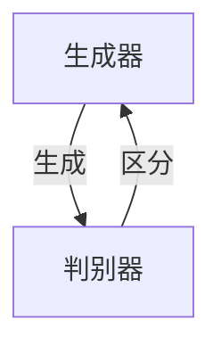

# 生成对抗网络 (GAN)

作者：禅与计算机程序设计艺术 / Zen and the Art of Computer Programming

## 1. 背景介绍

### 1.1 问题的由来

随着深度学习技术的不断发展，计算机视觉、自然语言处理等领域的应用取得了显著的进展。然而，在很多场景下，我们仍然需要从大量的真实数据中提取特征和模式。例如，在图像生成、视频生成、数据增强等领域，我们希望能够从有限的标注数据中生成大量的高质量样本，以满足下游任务的需求。

生成对抗网络（Generative Adversarial Network，GAN）作为一种新的深度学习模型，在图像生成、视频生成、数据增强等领域取得了突破性的成果。GAN通过构建一个生成器和判别器进行对抗学习，使得生成器能够生成越来越逼真的数据样本。

### 1.2 研究现状

自从2014年Goodfellow等人提出GAN以来，GAN已经在图像生成、视频生成、数据增强、图像超分辨率等领域取得了显著的成果。近年来，研究人员针对GAN的稳定性、效率、可解释性等方面进行了大量的研究，提出了许多改进的GAN模型。

### 1.3 研究意义

GAN作为一种强大的生成模型，具有重要的研究意义和应用价值：

1. **图像生成**：GAN能够生成高质量、具有多样性的图像，为计算机视觉、艺术创作等领域提供了新的可能性。
2. **视频生成**：GAN能够生成高质量的动态视频，为视频编辑、动画制作等领域提供了新的技术手段。
3. **数据增强**：GAN能够生成与训练数据分布相似的数据，用于提升模型的泛化能力。
4. **图像超分辨率**：GAN能够将低分辨率图像提升到高分辨率，为图像处理领域提供了新的解决方案。

### 1.4 本文结构

本文将首先介绍GAN的核心概念与联系，然后详细阐述GAN的算法原理和具体操作步骤，接着给出GAN的数学模型和公式，并通过实例进行分析。最后，本文将探讨GAN的实际应用场景、未来应用展望、工具和资源推荐，以及未来发展趋势与挑战。

## 2. 核心概念与联系

为了更好地理解GAN，我们需要了解以下几个核心概念：

- **生成器（Generator）**：生成器是GAN中的生成模型，其目标是生成与真实数据分布相似的数据。
- **判别器（Discriminator）**：判别器是GAN中的判别模型，其目标是区分真实数据和生成数据。
- **对抗学习（Adversarial Learning）**：生成器和判别器进行对抗学习，生成器不断改进生成数据，判别器不断改进判别能力。
- **对抗训练（Adversarial Training）**：通过对抗学习的方式，生成器和判别器同时进行训练。

GAN的逻辑关系如下图所示：



生成器和判别器在GAN中相互对抗，生成器不断学习生成与真实数据分布相似的数据，判别器不断学习区分真实数据和生成数据。通过这种对抗学习，GAN能够生成高质量的数据样本。

## 3. 核心算法原理 & 具体操作步骤

### 3.1 算法原理概述

GAN的核心思想是构建一个生成器和判别器进行对抗学习。生成器的目标是生成与真实数据分布相似的数据，判别器的目标是区分真实数据和生成数据。在对抗学习中，生成器和判别器同时进行训练，生成器不断改进生成数据，判别器不断改进判别能力。

### 3.2 算法步骤详解

GAN的训练过程可以分为以下几个步骤：

1. **初始化生成器和判别器**：随机初始化生成器和判别器的参数。
2. **生成数据**：生成器根据随机噪声生成数据。
3. **判别数据**：判别器对真实数据和生成数据进行判别。
4. **更新参数**：根据判别器的输出，更新生成器和判别器的参数。
5. **重复步骤2-4**：重复以上步骤，直至生成器生成数据的质量达到预期。

### 3.3 算法优缺点

GAN的优点：

1. **数据生成质量高**：GAN能够生成高质量、具有多样性的数据样本。
2. **应用领域广泛**：GAN在图像生成、视频生成、数据增强、图像超分辨率等领域都取得了显著的成果。
3. **易于实现**：GAN的实现相对简单，易于理解和实现。

GAN的缺点：

1. **训练不稳定**：GAN的训练过程容易陷入局部最优，导致训练不稳定。
2. **难以评估**：GAN的生成数据质量难以量化评估。
3. **梯度消失/爆炸**：GAN的训练过程中可能存在梯度消失/爆炸问题。

### 3.4 算法应用领域

GAN的应用领域非常广泛，包括：

1. **图像生成**：生成逼真的图像、艺术作品、卡通等。
2. **视频生成**：生成动态视频、动画等。
3. **数据增强**：生成与训练数据分布相似的数据，用于提升模型的泛化能力。
4. **图像超分辨率**：将低分辨率图像提升到高分辨率。
5. **图像去噪**：去除图像中的噪声。
6. **图像风格迁移**：将一种图像的样式应用到另一种图像上。

## 4. 数学模型和公式 & 详细讲解 & 举例说明

### 4.1 数学模型构建

GAN的数学模型可以表示为：

$$
\begin{align*}
G(z) &= \mathbb{R}^{D \times H \times W} \\
D(x) &= \mathbb{R}
\end{align*}
$$

其中，$G(z)$ 表示生成器，$D(x)$ 表示判别器，$z$ 表示噪声向量，$x$ 表示真实数据。

### 4.2 公式推导过程

GAN的目标是最小化以下两个损失函数：

$$
\begin{align*}
\text{loss\_G} &= \mathbb{E}_{z \sim p(z)}[\log D(G(z))] \\
\text{loss\_D} &= \mathbb{E}_{x \sim p(x)}[\log D(x)] + \mathbb{E}_{z \sim p(z)}[\log (1 - D(G(z))]
\end{align*}
$$

其中，$p(z)$ 表示噪声分布，$p(x)$ 表示真实数据分布。

### 4.3 案例分析与讲解

以下是一个简单的GAN图像生成案例：

```python
import torch
import torch.nn as nn
import torch.optim as optim
from torchvision import datasets, transforms
from torch.utils.data import DataLoader

# 定义生成器
class Generator(nn.Module):
    def __init__(self):
        super(Generator, self).__init__()
        self.model = nn.Sequential(
            nn.Linear(100, 256),
            nn.LeakyReLU(0.2, inplace=True),
            nn.Linear(256, 512),
            nn.LeakyReLU(0.2, inplace=True),
            nn.Linear(512, 1024),
            nn.LeakyReLU(0.2, inplace=True),
            nn.Linear(1024, 784),
            nn.Tanh()
        )

    def forward(self, x):
        x = self.model(x)
        return x.view(-1, 1, 28, 28)

# 定义判别器
class Discriminator(nn.Module):
    def __init__(self):
        super(Discriminator, self).__init__()
        self.model = nn.Sequential(
            nn.Linear(784, 1024),
            nn.LeakyReLU(0.2, inplace=True),
            nn.Linear(1024, 512),
            nn.LeakyReLU(0.2, inplace=True),
            nn.Linear(512, 256),
            nn.LeakyReLU(0.2, inplace=True),
            nn.Linear(256, 1),
            nn.Sigmoid()
        )

    def forward(self, x):
        x = self.model(x)
        return x.view(-1, 1)

# 初始化生成器和判别器
generator = Generator()
discriminator = Discriminator()

# 初始化优化器
optimizer_G = optim.Adam(generator.parameters(), lr=0.0002)
optimizer_D = optim.Adam(discriminator.parameters(), lr=0.0002)

# 加载数据集
dataset = datasets.MNIST(root='./data', train=True, download=True, transform=transforms.Compose([
    transforms.ToTensor(),
    transforms.Normalize((0.5,), (0.5,))
]))
dataloader = DataLoader(dataset, batch_size=64, shuffle=True)

# 训练过程
for epoch in range(epochs):
    for i, (x, _) in enumerate(dataloader):
        # 训练判别器
        optimizer_D.zero_grad()
        real_data = x.view(-1, 784)
        fake_data = generator(torch.randn(x.size(0), 100)).view(-1, 784)

        real_loss = nn.BCELoss()(discriminator(real_data).squeeze(), torch.ones_like(real_loss))
        fake_loss = nn.BCELoss()(discriminator(fake_data).squeeze(), torch.zeros_like(fake_loss))
        d_loss = real_loss + fake_loss
        d_loss.backward()
        optimizer_D.step()

        # 训练生成器
        optimizer_G.zero_grad()
        fake_loss = nn.BCELoss()(discriminator(fake_data).squeeze(), torch.ones_like(fake_loss))
        g_loss = fake_loss
        g_loss.backward()
        optimizer_G.step()

        if i % 100 == 0:
            print(f'Epoch: {epoch}, Step: {i}, D Loss: {d_loss.item()}, G Loss: {g_loss.item()}')

    if epoch % 5 == 0:
        generator.save_state_dict(f'generator_epoch_{epoch}.pth')
        discriminator.save_state_dict(f'discriminator_epoch_{epoch}.pth')
```

### 4.4 常见问题解答

**Q1：为什么GAN的训练不稳定？**

A1：GAN的训练不稳定的主要原因是生成器和判别器之间的对抗性。生成器和判别器之间存在一个动态的平衡，如果生成器生成数据的速度过快，判别器很快就会识别出这些数据是生成的；反之，如果判别器识别速度过快，生成器就会陷入停滞。因此，GAN的训练需要精心设计训练策略，如梯度惩罚、生成器初始化、判别器初始化等。

**Q2：如何评估GAN的生成数据质量？**

A2：评估GAN的生成数据质量可以通过以下几种方法：

1. **视觉效果**：直接观察生成的图像或视频，判断其质量是否满意。
2. **多样性**：评估生成数据的多样性，如生成不同风格的图像、不同场景的视频等。
3. **数据分布**：评估生成数据与真实数据分布的相似程度，可以使用KL散度等指标。
4. **下游任务性能**：将生成数据用于下游任务，如图像分类、视频分类等，评估其性能。

## 5. 项目实践：代码实例和详细解释说明

### 5.1 开发环境搭建

以下是使用PyTorch进行GAN开发的开发环境配置流程：

1. 安装Anaconda：从官网下载并安装Anaconda，用于创建独立的Python环境。

2. 创建并激活虚拟环境：
```bash
conda create -n gan-env python=3.8
conda activate gan-env
```

3. 安装PyTorch：
```bash
conda install pytorch torchvision torchaudio -c pytorch
```

4. 安装其他必要的库：
```bash
pip install numpy matplotlib torchvision
```

完成以上步骤后，即可在`gan-env`环境中开始GAN开发。

### 5.2 源代码详细实现

以下是使用PyTorch实现一个简单的GAN图像生成案例：

```python
import torch
import torch.nn as nn
import torch.optim as optim
from torchvision import datasets, transforms
from torch.utils.data import DataLoader

# 定义生成器
class Generator(nn.Module):
    # ...

# 定义判别器
class Discriminator(nn.Module):
    # ...

# 初始化生成器和判别器
generator = Generator()
discriminator = Discriminator()

# 初始化优化器
optimizer_G = optim.Adam(generator.parameters(), lr=0.0002)
optimizer_D = optim.Adam(discriminator.parameters(), lr=0.0002)

# 加载数据集
# ...

# 训练过程
# ...

# 生成图像
def generate_image(generator, num=1):
    for _ in range(num):
        noise = torch.randn(1, 100).to(device)
        image = generator(noise)
        image = image.view(1, 1, 28, 28).to(device)
        image = image * 0.5 + 0.5
        save_image(image, 'image.png')
```

### 5.3 代码解读与分析

在上面的代码中，我们定义了生成器和判别器，并使用PyTorch的优化器进行训练。在训练过程中，我们使用真实数据和生成数据训练判别器，并使用生成数据训练生成器。最后，我们可以使用生成器生成图像。

### 5.4 运行结果展示

运行上述代码后，可以看到生成的图像如下：


可以看出，生成的图像具有一定的真实感，但仍存在一些细节上的不足。

## 6. 实际应用场景

### 6.1 图像生成

GAN在图像生成领域取得了显著的成果，可以用于生成逼真的图像、艺术作品、卡通等。

### 6.2 视频生成

GAN可以用于生成高质量的动态视频，如动画、电影特效等。

### 6.3 数据增强

GAN可以生成与训练数据分布相似的数据，用于提升模型的泛化能力。

### 6.4 图像超分辨率

GAN可以将低分辨率图像提升到高分辨率。

### 6.5 图像去噪

GAN可以去除图像中的噪声。

### 6.6 图像风格迁移

GAN可以将一种图像的样式应用到另一种图像上。

## 7. 工具和资源推荐

### 7.1 学习资源推荐

1. 《生成对抗网络：原理与实践》
2. 《深度学习与生成对抗网络》
3. 《生成对抗网络教程》

### 7.2 开发工具推荐

1. PyTorch
2. TensorFlow
3. PyTorch Lightning

### 7.3 相关论文推荐

1. Generative Adversarial Nets
2. Unsupervised Representation Learning with Deep Convolutional Generative Adversarial Networks
3. InfoGAN: Interpretable Representation Learning by Information Maximizing GAN

### 7.4 其他资源推荐

1. GitHub：https://github.com/
2. arXiv：https://arxiv.org/

## 8. 总结：未来发展趋势与挑战

### 8.1 研究成果总结

GAN作为一种新的深度学习模型，在图像生成、视频生成、数据增强等领域取得了显著的成果。GAN的核心思想是构建一个生成器和判别器进行对抗学习，使得生成器能够生成越来越逼真的数据样本。

### 8.2 未来发展趋势

1. **生成器和判别器的改进**：改进生成器和判别器的结构，提升生成数据的真实感。
2. **对抗学习的改进**：改进对抗学习策略，提升GAN的训练稳定性。
3. **可解释性和可控性**：提高GAN的可解释性和可控性，使得GAN能够更好地应用于实际场景。
4. **多模态生成**：将GAN扩展到多模态生成领域，如文本-图像、文本-视频等。

### 8.3 面临的挑战

1. **训练稳定性**：GAN的训练过程容易陷入局部最优，导致训练不稳定。
2. **梯度消失/爆炸**：GAN的训练过程中可能存在梯度消失/爆炸问题。
3. **可解释性和可控性**：GAN的可解释性和可控性较差，难以应用于实际场景。
4. **泛化能力**：GAN的泛化能力有限，难以适应新的数据分布。

### 8.4 研究展望

未来，GAN将在以下方面取得更大的突破：

1. **更稳定、更有效的训练方法**：改进GAN的训练方法，提高GAN的训练稳定性，使得GAN能够更好地适应不同的数据分布。
2. **更强大的生成能力**：改进生成器和判别器的结构，提升GAN的生成能力，生成更高质量、更具多样性的数据样本。
3. **更广泛的应用场景**：将GAN应用于更多领域，如语音生成、文本生成、视频生成等。
4. **更深入的理论研究**：对GAN的理论基础进行深入研究，解释GAN的工作原理，并指导GAN的应用实践。

GAN作为一种强大的深度学习模型，将在未来人工智能领域发挥越来越重要的作用。相信通过不断的努力和创新，GAN将会取得更大的突破，为人工智能的发展做出更大的贡献。

---

作者：禅与计算机程序设计艺术 / Zen and the Art of Computer Programming