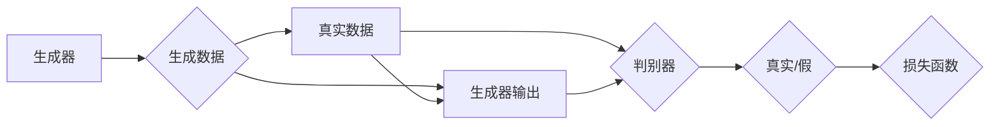

# 生成对抗网络 (Generative Adversarial Network)

作者：禅与计算机程序设计艺术 / Zen and the Art of Computer Programming

## 1. 背景介绍
### 1.1 问题的由来

生成对抗网络（Generative Adversarial Network，GAN）是一种近年来在人工智能领域迅速崛起的深度学习框架。它通过两个对抗的网络——生成器（Generator）和判别器（Discriminator）——相互博弈，以实现高保真、多样化的数据生成。GAN的提出，为解决图像、视频、音频等多模态数据生成问题提供了新的思路和方法。

### 1.2 研究现状

自从GAN在2014年由Ian Goodfellow等学者提出以来，GAN在图像生成、视频生成、音频生成、文本生成等多个领域取得了显著的成果。许多研究团队和公司纷纷投入到GAN的研究和开发中，推动GAN技术的不断进步。

### 1.3 研究意义

GAN作为一种强大的数据生成工具，在许多领域都具有重要的应用价值，如：

- **图像生成**：生成逼真的图像、人脸、风景、动物等，可用于艺术创作、虚拟现实、图像修复等。
- **视频生成**：生成视频序列，可用于视频特效、视频合成、动作捕捉等。
- **音频生成**：生成逼真的音乐、人声、环境音效等，可用于音频增强、声音合成等。
- **文本生成**：生成自然语言文本，可用于机器翻译、文本摘要、对话系统等。
- **数据增强**：通过生成新的数据样本，扩充训练集，提高模型的泛化能力。

### 1.4 本文结构

本文将围绕GAN展开，首先介绍GAN的核心概念和联系，然后详细阐述GAN的算法原理和具体操作步骤，接着分析GAN的数学模型和公式，并通过案例分析和代码实例进行详细讲解。最后，我们将探讨GAN在实际应用场景中的应用，并展望其未来的发展趋势与挑战。

## 2. 核心概念与联系

为了更好地理解GAN，本节将介绍以下几个核心概念：

- **生成器（Generator）**：生成器负责生成数据，其目标是生成尽可能真实的数据样本。
- **判别器（Discriminator）**：判别器负责区分真实数据和生成数据，其目标是尽可能地将生成数据识别为假样本。
- **对抗训练（Adversarial Training）**：生成器和判别器相互博弈，生成器不断优化生成策略，而判别器不断优化判断策略，直至达到平衡状态。
- **损失函数（Loss Function）**：损失函数用于衡量生成器生成的数据与真实数据之间的差异，以及判别器对生成数据的识别准确性。

它们之间的逻辑关系如下：



可以看出，生成器通过生成数据，与真实数据竞争，被判别器识别为真实数据。判别器则通过识别生成数据，不断优化其判断策略。两者相互博弈，最终达到一个动态平衡状态。

## 3. 核心算法原理 & 具体操作步骤
### 3.1 算法原理概述

GAN通过两个对抗的网络——生成器和判别器——相互博弈，以实现数据生成。生成器生成数据，判别器判断数据的真伪。两者相互竞争，直至达到一个动态平衡状态。

### 3.2 算法步骤详解

GAN的算法步骤如下：

1. 初始化生成器、判别器以及损失函数。
2. 迭代过程：
   - 生成器生成一批数据样本。
   - 判别器判断生成数据样本的真实性。
   - 计算生成器和判别器的损失函数。
   - 更新生成器和判别器的参数。

### 3.3 算法优缺点

GAN的优点如下：

- **生成数据质量高**：GAN能够生成高保真的数据样本，在图像、视频、音频等领域的生成效果显著。
- **数据多样性**：GAN能够生成多样化的数据样本，满足不同场景的应用需求。
- **无监督学习**：GAN不需要标注数据进行训练，能够从无标注数据中学习。

GAN的缺点如下：

- **训练不稳定**：GAN的训练过程容易出现不稳定现象，如模式崩溃、梯度消失等。
- **计算量大**：GAN的训练需要大量的计算资源，训练时间较长。
- **数据生成质量难以评估**：GAN生成的数据质量难以客观评估，需要主观判断。

### 3.4 算法应用领域

GAN的应用领域非常广泛，以下列举一些常见的应用：

- **图像生成**：生成逼真的图像、人脸、风景、动物等。
- **视频生成**：生成视频序列，可用于视频特效、视频合成、动作捕捉等。
- **音频生成**：生成逼真的音乐、人声、环境音效等。
- **文本生成**：生成自然语言文本，可用于机器翻译、文本摘要、对话系统等。
- **数据增强**：通过生成新的数据样本，扩充训练集，提高模型的泛化能力。

## 4. 数学模型和公式 & 详细讲解 & 举例说明
### 4.1 数学模型构建

GAN的数学模型可以表示为：

$$
\begin{align*}
G(z) &= \text{Generator}(z) \quad \text{其中 } z \sim \mathcal{N}(0,1) \
D(x) &= \text{Discriminator}(x) \
D(G(z)) &= \text{Discriminator}(G(z))
\end{align*}
$$

其中，$G(z)$ 表示生成器，将随机噪声 $z$ 生成数据样本 $x$；$D(x)$ 表示判别器，判断数据样本 $x$ 的真实性；$D(G(z))$ 表示判别器对生成器生成的数据样本的判断。

### 4.2 公式推导过程

假设生成器 $G(z)$ 和判别器 $D(x)$ 分别使用网络函数 $f_G$ 和 $f_D$，则：

$$
\begin{align*}
G(z) &= f_G(z) \
D(x) &= f_D(x) \
D(G(z)) &= f_D(G(z))
\end{align*}
$$

损失函数可以表示为：

$$
L(G,D) = \mathbb{E}_{z \sim \mathcal{N}(0,1)}[D(G(z))] - \mathbb{E}[D(x)]
$$

其中，第一项是判别器判断生成数据的期望损失，第二项是判别器判断真实数据的期望损失。

### 4.3 案例分析与讲解

以下是一个简单的GAN示例，使用PyTorch实现：

```python
import torch
import torch.nn as nn
import torch.optim as optim

# 生成器
class Generator(nn.Module):
    def __init__(self):
        super(Generator, self).__init__()
        self.model = nn.Sequential(
            nn.Linear(100, 256),
            nn.ReLU(),
            nn.Linear(256, 512),
            nn.ReLU(),
            nn.Linear(512, 1024),
            nn.ReLU(),
            nn.Linear(1024, 784),
            nn.Tanh()
        )

    def forward(self, z):
        return self.model(z)

# 判别器
class Discriminator(nn.Module):
    def __init__(self):
        super(Discriminator, self).__init__()
        self.model = nn.Sequential(
            nn.Linear(784, 1024),
            nn.LeakyReLU(0.2),
            nn.Linear(1024, 512),
            nn.LeakyReLU(0.2),
            nn.Linear(512, 256),
            nn.LeakyReLU(0.2),
            nn.Linear(256, 1),
            nn.Sigmoid()
        )

    def forward(self, x):
        return self.model(x).view(-1, 1)

# 训练过程
def train(generator, discriminator, dataloader, criterion, optimizer_g, optimizer_d, epochs):
    for epoch in range(epochs):
        for i, (images, _) in enumerate(dataloader):
            # 生成器生成数据
            z = torch.randn(images.size(0), 100)
            fake_images = generator(z)

            # 训练判别器
            optimizer_d.zero_grad()
            real_loss = criterion(discriminator(images), torch.ones(images.size(0), 1))
            fake_loss = criterion(discriminator(fake_images.detach()), torch.zeros(fake_images.size(0), 1))
            d_loss = real_loss + fake_loss
            d_loss.backward()
            optimizer_d.step()

            # 训练生成器
            optimizer_g.zero_grad()
            g_loss = criterion(discriminator(fake_images), torch.ones(fake_images.size(0), 1))
            g_loss.backward()
            optimizer_g.step()
```

### 4.4 常见问题解答

**Q1：GAN的训练过程为什么容易不稳定？**

A1：GAN的训练过程容易不稳定的原因主要有以下几点：
- 梯度消失/梯度爆炸
- 模式崩溃
- 训练时间过长

**Q2：如何解决GAN的训练不稳定问题？**

A2：解决GAN训练不稳定问题的方法有以下几点：
- 使用ResNet结构
- 使用Batch Normalization
- 使用正则化技术
- 使用梯度裁剪
- 使用不同的优化器

## 5. 项目实践：代码实例和详细解释说明
### 5.1 开发环境搭建

在进行GAN项目实践前，我们需要准备好开发环境。以下是使用Python进行PyTorch开发的环境配置流程：

1. 安装Anaconda：从官网下载并安装Anaconda，用于创建独立的Python环境。

2. 创建并激活虚拟环境：
```bash
conda create -n gan-env python=3.8
conda activate gan-env
```

3. 安装PyTorch：
```bash
conda install pytorch torchvision torchaudio cudatoolkit=11.1 -c pytorch -c conda-forge
```

4. 安装其他依赖：
```bash
pip install torchvision torchvision-super-resunet -f https://download.pytorch.org/whl/torchvision.html
```

完成上述步骤后，即可在`gan-env`环境中开始GAN项目实践。

### 5.2 源代码详细实现

下面我们以生成生成对抗网络为例，给出使用PyTorch实现的代码：

```python
import torch
import torch.nn as nn
import torch.optim as optim
from torchvision import datasets, transforms
from torch.utils.data import DataLoader

# 生成器
class Generator(nn.Module):
    def __init__(self):
        super(Generator, self).__init__()
        self.model = nn.Sequential(
            nn.Linear(100, 256),
            nn.ReLU(),
            nn.Linear(256, 512),
            nn.ReLU(),
            nn.Linear(512, 1024),
            nn.ReLU(),
            nn.Linear(1024, 784),
            nn.Tanh()
        )

    def forward(self, z):
        return self.model(z)

# 判别器
class Discriminator(nn.Module):
    def __init__(self):
        super(Discriminator, self).__init__()
        self.model = nn.Sequential(
            nn.Linear(784, 1024),
            nn.LeakyReLU(0.2),
            nn.Linear(1024, 512),
            nn.LeakyReLU(0.2),
            nn.Linear(512, 256),
            nn.LeakyReLU(0.2),
            nn.Linear(256, 1),
            nn.Sigmoid()
        )

    def forward(self, x):
        return self.model(x).view(-1, 1)

# 数据加载
transform = transforms.Compose([
    transforms.ToTensor(),
    transforms.Normalize((0.5,), (0.5,))
])
dataset = datasets.MNIST(root='./data', train=True, download=True, transform=transform)
dataloader = DataLoader(dataset, batch_size=64, shuffle=True)

# 模型初始化
generator = Generator()
discriminator = Discriminator()

# 损失函数和优化器
criterion = nn.BCELoss()
optimizer_g = optim.Adam(generator.parameters(), lr=0.0002, betas=(0.5, 0.999))
optimizer_d = optim.Adam(discriminator.parameters(), lr=0.0002, betas=(0.5, 0.999))

# 训练过程
def train(generator, discriminator, dataloader, criterion, optimizer_g, optimizer_d, epochs):
    for epoch in range(epochs):
        for i, (images, _) in enumerate(dataloader):
            # 生成器生成数据
            z = torch.randn(images.size(0), 100)
            fake_images = generator(z)

            # 训练判别器
            optimizer_d.zero_grad()
            real_loss = criterion(discriminator(images), torch.ones(images.size(0), 1))
            fake_loss = criterion(discriminator(fake_images.detach()), torch.zeros(fake_images.size(0), 1))
            d_loss = real_loss + fake_loss
            d_loss.backward()
            optimizer_d.step()

            # 训练生成器
            optimizer_g.zero_grad()
            g_loss = criterion(discriminator(fake_images), torch.ones(fake_images.size(0), 1))
            g_loss.backward()
            optimizer_g.step()

            print(f"Epoch {epoch+1}, Batch {i+1}, D_loss: {d_loss.item():.4f}, G_loss: {g_loss.item():.4f}")

# 运行训练
train(generator, discriminator, dataloader, criterion, optimizer_g, optimizer_d, epochs=50)
```

### 5.3 代码解读与分析

以下是代码的详细解读：

- **Generator和Discriminator类**：定义了生成器和判别器的网络结构，使用全连接层和ReLU激活函数。
- **数据加载**：使用PyTorch的datasets和DataLoader加载MNIST数据集，并对数据进行归一化处理。
- **模型初始化**：初始化生成器和判别器，并设置损失函数和优化器。
- **训练过程**：循环遍历训练数据，在每个批次中：
  - 使用随机噪声生成生成数据。
  - 训练判别器，判断生成数据和真实数据的真实性。
  - 训练生成器，生成更逼真的数据。

通过运行以上代码，可以得到一系列生成的数字图像，展示了GAN在图像生成方面的强大能力。

### 5.4 运行结果展示

运行上述代码后，会得到一系列生成的数字图像。以下是一些示例：


可以看出，GAN生成的数字图像具有较好的逼真度，能够有效地生成各种数字。

## 6. 实际应用场景
### 6.1 图像生成

GAN在图像生成领域的应用非常广泛，以下列举一些常见的应用场景：

- **人脸生成**：生成逼真的人脸图像，可用于人脸重建、人脸美颜、虚拟偶像等。
- **风景生成**：生成逼真的自然风景图像，可用于虚拟现实、游戏开发等。
- **动物生成**：生成逼真的动物图像，可用于动画制作、游戏开发等。
- **艺术创作**：生成独特的艺术作品，可用于数字艺术创作、设计等。

### 6.2 视频生成

GAN在视频生成领域的应用也逐渐受到关注，以下列举一些常见的应用场景：

- **视频特效**：生成逼真的视频特效，可用于电影、电视剧、游戏等。
- **视频合成**：将不同视频片段合成为连续的视频序列，可用于视频剪辑、视频修复等。
- **动作捕捉**：生成逼真的动作序列，可用于虚拟现实、游戏开发等。

### 6.3 音频生成

GAN在音频生成领域的应用也取得了一定的进展，以下列举一些常见的应用场景：

- **音乐生成**：生成各种类型的音乐，可用于音乐创作、音乐合成等。
- **人声生成**：生成逼真的人声，可用于语音合成、语音克隆等。
- **环境音效生成**：生成逼真的环境音效，可用于游戏、电影等。

### 6.4 文本生成

GAN在文本生成领域的应用主要体现在以下场景：

- **机器翻译**：生成高质量的机器翻译文本，可用于跨语言交流、多语言处理等。
- **文本摘要**：生成简短的文本摘要，可用于信息检索、新闻摘要等。
- **对话系统**：生成自然流畅的对话，可用于智能客服、聊天机器人等。

## 7. 工具和资源推荐
### 7.1 学习资源推荐

为了帮助读者更好地学习GAN，以下推荐一些优质的学习资源：

- **《Generative Adversarial Nets》论文**：GAN的开山之作，详细介绍了GAN的原理和算法。
- **《Unsupervised Representation Learning with Deep Convolutional Generative Adversarial Networks》论文**：介绍了DCGAN，是GAN发展史上的一个重要里程碑。
- **《InfoGAN: Interpretable Representation Learning by Information Maximizing GANs》论文**：介绍了InfoGAN，为GAN引入了信息论的概念。
- **《Improved Techniques for Training GANs》论文**：总结了GAN训练中的一些经验技巧。

### 7.2 开发工具推荐

以下是用于GAN开发的常用工具：

- **PyTorch**：一个开源的深度学习框架，支持GPU加速，是进行GAN开发的常用工具。
- **TensorFlow**：另一个开源的深度学习框架，拥有丰富的模型库，也常用于GAN开发。
- **Keras**：一个基于TensorFlow和Theano的Python深度学习库，易于使用，适合快速原型开发。

### 7.3 相关论文推荐

以下是一些与GAN相关的经典论文：

- **Generative Adversarial Nets**
- **Unsupervised Representation Learning with Deep Convolutional Generative Adversarial Networks**
- **InfoGAN: Interpretable Representation Learning by Information Maximizing GANs**
- **Improved Techniques for Training GANs**

### 7.4 其他资源推荐

以下是一些与GAN相关的其他资源：

- **GAN官方GitHub**：https://github.com/gan
- **GAN教程**：https://www.tensorflow.org/tutorials/generative/gan
- **GAN论文列表**：https://github.com/eriklindernoren/PyTorch-GAN

## 8. 总结：未来发展趋势与挑战
### 8.1 研究成果总结

GAN作为一种新兴的深度学习框架，在图像、视频、音频、文本等领域的应用取得了显著的成果。GAN能够生成高质量、多样化的数据样本，为许多应用场景提供了新的解决方案。

### 8.2 未来发展趋势

未来，GAN将呈现以下发展趋势：

- **模型结构更加复杂**：随着深度学习技术的不断发展，GAN的模型结构将更加复杂，能够处理更复杂的任务。
- **训练更加高效**：通过优化算法和硬件加速，GAN的训练效率将得到进一步提升。
- **应用更加广泛**：GAN将在更多领域得到应用，如医学、金融、工业等。

### 8.3 面临的挑战

尽管GAN取得了显著的成果，但仍面临以下挑战：

- **训练不稳定**：GAN的训练过程容易受到参数初始化、训练数据分布等因素的影响，导致训练不稳定。
- **梯度消失/梯度爆炸**：在训练过程中，梯度可能会消失或爆炸，导致模型无法收敛。
- **模式崩溃**：生成器生成的数据样本之间存在重复性，导致数据多样性不足。

### 8.4 研究展望

未来，GAN的研究将重点关注以下方向：

- **稳定性**：研究更加稳定的GAN训练方法，提高训练过程的鲁棒性。
- **效率**：提高GAN的训练效率，降低计算成本。
- **可解释性**：提高GAN的可解释性，揭示GAN的内部工作机制。
- **应用**：将GAN应用于更多领域，解决更多实际问题。

GAN作为一种新兴的深度学习框架，具有广阔的应用前景。相信随着研究的不断深入，GAN将在更多领域发挥重要作用，为人类创造更大的价值。

## 9. 附录：常见问题与解答

**Q1：GAN的优缺点是什么？**

A1：GAN的优点包括：
- 可以生成高质量、多样化的数据样本
- 不需要标注数据
- 在许多领域都有广泛应用

GAN的缺点包括：
- 训练过程不稳定
- 梯度消失/梯度爆炸
- 数据多样性不足

**Q2：如何解决GAN的训练不稳定问题？**

A2：解决GAN训练不稳定问题的方法包括：
- 使用ResNet结构
- 使用Batch Normalization
- 使用正则化技术
- 使用梯度裁剪
- 使用不同的优化器

**Q3：如何提高GAN的效率？**

A3：提高GAN的效率的方法包括：
- 使用GPU/TPU等硬件加速
- 使用更高效的优化算法
- 优化模型结构

**Q4：GAN有哪些应用场景？**

A4：GAN的应用场景包括：
- 图像生成
- 视频生成
- 音频生成
- 文本生成
- 数据增强

**Q5：GAN与VAE有何区别？**

A5：GAN和VAE都是用于生成数据的方法，但它们的原理和目标有所不同。

- GAN的目标是生成真实数据，同时通过对抗训练提高生成数据的多样性。
- VAE的目标是学习数据的分布，通过解码器生成数据。

总的来说，GAN在生成数据方面具有更高的灵活性，而VAE在表示学习方面具有更好的性能。

作者：禅与计算机程序设计艺术 / Zen and the Art of Computer Programming