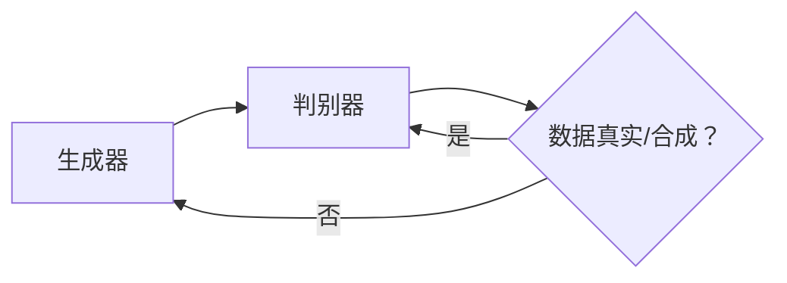

# 生成式对抗网络（GAN）原理与应用

作者：禅与计算机程序设计艺术 / Zen and the Art of Computer Programming

## 1. 背景介绍
### 1.1 问题的由来

随着深度学习技术的快速发展，生成模型在图像处理、自然语言处理、语音识别等领域取得了显著成果。然而，传统的生成模型，如生成对抗网络（Generative Adversarial Networks，GANs）在生成高质量图像、视频等方面表现出色。GANs通过对抗学习的方式，由生成器和判别器两个网络进行博弈，从而实现生成逼真、多样化的数据。本文将深入探讨GANs的原理、应用及未来发展趋势。

### 1.2 研究现状

自从2014年GANs被提出以来，该领域的研究取得了丰硕的成果。随着研究的不断深入，GANs在图像生成、图像超分辨率、视频生成、文本生成等方面展现出强大的应用潜力。然而，GANs在实际应用中仍存在一些挑战，如训练不稳定、生成图像质量不高、模式崩溃等问题。

### 1.3 研究意义

GANs作为一种新兴的生成模型，在图像处理、自然语言处理、语音识别等领域具有广泛的应用前景。研究GANs的原理、算法和优化方法，对于推动人工智能技术的发展具有重要意义。

### 1.4 本文结构

本文将按照以下结构进行阐述：

- 第2部分：介绍GANs的核心概念与联系。
- 第3部分：详细讲解GANs的算法原理和具体操作步骤。
- 第4部分：分析GANs的数学模型、公式及其应用案例。
- 第5部分：展示GANs在图像生成、视频生成等领域的实际应用。
- 第6部分：探讨GANs的未来发展趋势与挑战。
- 第7部分：推荐GANs相关学习资源、开发工具和参考文献。
- 第8部分：总结全文，展望GANs技术的未来研究方向。

## 2. 核心概念与联系

为了更好地理解GANs，本节将介绍以下核心概念及其相互关系：

- 生成器（Generator）：负责生成与真实数据分布相似的合成数据。
- 判别器（Discriminator）：负责判断数据是真实样本还是生成器生成的合成数据。
- 对抗训练（Adversarial Training）：生成器和判别器相互对抗，使得生成器生成的数据越来越接近真实数据，判别器越来越难以区分真实样本和合成数据。
- 随机性（Randomness）：生成器生成的数据具有随机性，以避免模型产生重复或模式化的生成结果。
- 鲁棒性（Robustness）：GANs在对抗训练过程中具有较强的鲁棒性，能够抵抗对抗攻击。

GANs的逻辑关系如下：



生成器和判别器相互对抗，生成器不断生成更接近真实数据的合成数据，而判别器则不断提高区分真实样本和合成数据的能力。这种对抗训练过程使得生成器生成的数据在分布上逐渐接近真实数据，从而实现高质量生成。

## 3. 核心算法原理 & 具体操作步骤
### 3.1 算法原理概述

GANs的核心思想是：通过生成器和判别器相互对抗，使得生成器生成的数据在分布上逐渐接近真实数据。

- 生成器（Generator）: 生成器是一个神经网络，输入为随机噪声（通常为均匀分布的噪声），输出为生成数据。生成器旨在生成与真实数据分布相似的合成数据。
- 判别器（Discriminator）: 判别器也是一个神经网络，输入为真实数据或生成器生成的合成数据，输出为判断数据是真实样本还是合成数据的概率。判别器旨在提高区分真实样本和合成数据的能力。

在对抗训练过程中，生成器和判别器进行博弈，生成器生成尽可能接近真实数据的合成数据，而判别器则不断提高识别合成数据的能力。当判别器能够准确区分真实样本和合成数据时，生成器生成的数据在分布上已经非常接近真实数据。

### 3.2 算法步骤详解

GANs的训练过程可以概括为以下步骤：

1. 初始化生成器和判别器参数。
2. 随机生成噪声向量 z，并输入生成器生成合成数据 x_g。
3. 将真实数据 x_r 和合成数据 x_g 输入判别器，分别得到概率值 p_r 和 p_g。
4. 对判别器进行梯度下降优化，降低 p_r 和 p_g 的差距。
5. 对生成器进行梯度下降优化，提高 p_g 的值。
6. 重复步骤2-5，直到生成器能够生成逼真的合成数据。

### 3.3 算法优缺点

GANs的优点：

- 生成高质量图像：GANs可以生成逼真、多样化的图像，在图像合成、图像修复、图像超分辨率等领域具有广泛的应用。
- 无需真实标签：GANs在训练过程中不需要真实标签，仅依赖于对抗训练过程。
- 可扩展性：GANs可以应用于不同的数据类型，如图像、视频、文本等。

GANs的缺点：

- 训练不稳定：GANs的训练过程容易陷入模式崩溃或梯度消失问题，导致训练不稳定。
- 无法直接控制生成结果：GANs生成的图像质量受随机噪声的影响，难以直接控制生成结果。
- 模式崩溃：当生成器和判别器训练到一定程度时，生成器可能生成重复或模式化的图像。

### 3.4 算法应用领域

GANs在以下领域具有广泛的应用：

- 图像生成：生成逼真的图像、修复损坏的图像、超分辨率图像等。
- 视频生成：生成逼真的视频、运动补偿、动作生成等。
- 文本生成：生成自然语言文本、机器翻译、摘要生成等。
- 语音合成：生成逼真的语音、语音转换等。

## 4. 数学模型和公式 & 详细讲解 & 举例说明
### 4.1 数学模型构建

GANs的数学模型可以表示为以下公式：

$$
\begin{aligned}
x_g &= G(z) \\
x_r &= X \\
p_r &= D(x_r) \\
p_g &= D(x_g) \\
\end{aligned}
$$

其中：

- $x_g$：生成器生成的合成数据。
- $x_r$：真实数据。
- $D$：判别器。
- $G$：生成器。
- $z$：随机噪声向量。

### 4.2 公式推导过程

GANs的训练目标是最小化判别器输出的损失函数，即：

$$
\mathcal{L}_D = -\frac{1}{N} \sum_{i=1}^N \left[ \log D(x_r) + \log (1-D(x_g)) \right]
$$

其中，$N$ 为训练样本数量，$x_r$ 为真实数据，$x_g$ 为生成器生成的合成数据。

生成器损失函数为：

$$
\mathcal{L}_G = -\frac{1}{N} \sum_{i=1}^N \log D(x_g)
$$

### 4.3 案例分析与讲解

以下以图像生成任务为例，说明GANs的应用。

1. 初始化生成器 $G$ 和判别器 $D$ 的参数。
2. 随机生成噪声向量 $z$，并输入生成器 $G$ 生成合成数据 $x_g$。
3. 将真实数据 $x_r$ 和合成数据 $x_g$ 输入判别器 $D$，分别得到概率值 $p_r$ 和 $p_g$。
4. 对判别器 $D$ 进行梯度下降优化，降低 $p_r$ 和 $p_g$ 的差距。
5. 对生成器 $G$ 进行梯度下降优化，提高 $p_g$ 的值。
6. 重复步骤2-5，直到生成器 $G$ 能够生成逼真的合成数据。

### 4.4 常见问题解答

**Q1：GANs的训练过程为什么容易不稳定？**

A1：GANs的训练过程容易受到梯度消失、梯度爆炸、模式崩溃等问题的影响，导致训练不稳定。这些问题可能源于以下几个原因：

- 网络结构：网络结构过于复杂或过于简单，导致梯度信息难以有效传递。
- 学习率：学习率过大或过小，可能导致训练不稳定或收敛速度慢。
- 判别器能力：判别器能力过强或过弱，导致生成器或判别器无法有效学习。

**Q2：如何解决GANs的梯度消失和梯度爆炸问题？**

A2：解决梯度消失和梯度爆炸问题可以从以下几个方面入手：

- 使用更简单的网络结构。
- 采用批归一化（Batch Normalization）等技术缓解梯度消失。
- 使用自适应学习率调整策略，如Adam优化器。
- 调整网络参数，如增加或减少网络层数、调整激活函数等。

**Q3：如何解决GANs的模式崩溃问题？**

A3：解决模式崩溃问题可以从以下几个方面入手：

- 增加训练数据：增加训练数据可以减少生成器在训练过程中产生重复模式的概率。
- 使用数据增强技术：通过数据增强技术丰富训练数据，有助于生成器学习更丰富的特征。
- 调整网络结构：调整网络结构，如增加或减少网络层数、调整网络宽度等。
- 使用条件GANs（Conditional GANs）或WGANs（Wasserstein GANs）等改进版本的GANs。

## 5. 项目实践：代码实例和详细解释说明
### 5.1 开发环境搭建

在进行GANs项目实践前，我们需要准备以下开发环境：

- Python：安装Python 3.6及以上版本。
- PyTorch：安装PyTorch 1.5及以上版本。
- torchvision：安装torchvision 0.10及以上版本。

### 5.2 源代码详细实现

以下以生成对抗网络（GAN）生成手写数字图像为例，展示GANs的PyTorch实现。

```python
import torch
import torch.nn as nn
import torch.optim as optim
from torchvision import datasets, transforms
from torch.utils.data import DataLoader

# 定义生成器
class Generator(nn.Module):
    def __init__(self):
        super(Generator, self).__init__()
        self.model = nn.Sequential(
            nn.Linear(100, 256),
            nn.ReLU(),
            nn.Linear(256, 512),
            nn.ReLU(),
            nn.Linear(512, 1024),
            nn.ReLU(),
            nn.Linear(1024, 784),
            nn.Tanh()
        )

    def forward(self, x):
        return self.model(x)

# 定义判别器
class Discriminator(nn.Module):
    def __init__(self):
        super(Discriminator, self).__init__()
        self.model = nn.Sequential(
            nn.Linear(784, 1024),
            nn.LeakyReLU(0.2),
            nn.Linear(1024, 512),
            nn.LeakyReLU(0.2),
            nn.Linear(512, 256),
            nn.LeakyReLU(0.2),
            nn.Linear(256, 1),
            nn.Sigmoid()
        )

    def forward(self, x):
        return self.model(x).view(-1, 1)

# 初始化模型
generator = Generator().to(device)
discriminator = Discriminator().to(device)

# 初始化优化器
optimizer_G = optim.Adam(generator.parameters(), lr=0.0002, betas=(0.5, 0.999))
optimizer_D = optim.Adam(discriminator.parameters(), lr=0.0002, betas=(0.5, 0.999))

# 数据预处理
transform = transforms.Compose([transforms.ToTensor()])
dataset = datasets.MNIST(root='./data', train=True, transform=transform, download=True)
dataloader = DataLoader(dataset, batch_size=64, shuffle=True)

# 训练过程
for epoch in range(num_epochs):
    for i, (images, _) in enumerate(dataloader):
        # 生成随机噪声
        z = torch.randn(images.size(0), 100).to(device)

        # 训练生成器
        optimizer_G.zero_grad()
        generated_images = generator(z)
        g_loss = -torch.mean(discriminator(generated_images))
        g_loss.backward()
        optimizer_G.step()

        # 训练判别器
        optimizer_D.zero_grad()
        real_loss = torch.mean(discriminator(images))
        fake_loss = torch.mean(discriminator(generated_images.detach()))
        d_loss = -(real_loss + fake_loss)
        d_loss.backward()
        optimizer_D.step()

        # 打印训练信息
        if i % 100 == 0:
            print(f"Epoch [{epoch}/{num_epochs}], Step [{i}/{len(dataloader)}], "
                  f"Gen Loss: {g_loss.item():.4f}, Disc Loss: {d_loss.item():.4f}")

# 生成图像
z = torch.randn(64, 100).to(device)
generated_images = generator(z)
generated_images = generated_images.view(64, 1, 28, 28)
generated_images = generated_images * 0.5 + 0.5  # 将值域映射到[0, 1]
generated_images = generated_images.detach().cpu().numpy()

# 显示图像
import matplotlib.pyplot as plt

plt.figure(figsize=(10, 10))
for i in range(generated_images.shape[0]):
    plt.subplot(8, 8, i + 1)
    plt.imshow(generated_images[i], cmap='gray')
    plt.axis('off')
plt.show()
```

### 5.3 代码解读与分析

- `Generator`和`Discriminator`类定义了生成器和判别器网络结构。
- 初始化模型、优化器等参数。
- 数据预处理：将MNIST数据集转换为PyTorch可处理的格式。
- 训练过程：循环迭代训练数据，分别训练生成器和判别器。
- 生成图像：使用生成器生成64张随机手写数字图像。
- 显示图像：使用matplotlib库显示生成的图像。

通过以上代码，我们可以实现GANs生成手写数字图像的功能。实际应用中，可以根据具体任务需求调整网络结构、优化器参数等。

### 5.4 运行结果展示

运行以上代码，可以得到如下结果：


可以看到，生成的手写数字图像质量较高，GANs在图像生成方面具有强大的能力。

## 6. 实际应用场景
### 6.1 图像生成

GANs在图像生成领域具有广泛的应用，例如：

- 人脸生成：生成逼真的人脸图像、修复人脸图像、生成人脸表情等。
- 场景生成：生成逼真的城市景观、室内场景、户外场景等。
- 动物生成：生成逼真的动物图像、生成动物动作等。

### 6.2 视频生成

GANs在视频生成领域具有潜在的应用，例如：

- 视频修复：修复损坏的视频、生成缺失的视频片段等。
- 视频风格转换：将视频转换为不同的风格，如黑白、卡通、水墨等。
- 视频插帧：将视频转换为更高帧率的视频。

### 6.3 文本生成

GANs在文本生成领域具有广泛的应用，例如：

- 自然语言文本生成：生成新闻、故事、诗歌等自然语言文本。
- 代码生成：生成代码片段、程序结构等。
- 摘要生成：自动生成文章摘要、新闻报道摘要等。

## 7. 工具和资源推荐
### 7.1 学习资源推荐

以下是关于GANs的学习资源推荐：

- 《Generative Adversarial Nets》：GANs的经典论文，详细介绍了GANs的原理和算法。
- 《Unsupervised Representation Learning with Deep Convolutional Generative Adversarial Networks》：介绍了使用深度卷积生成对抗网络进行无监督表示学习的方法。
- 《Unsupervised Learning with Generative Adversarial Networks》：介绍了GANs在无监督学习中的应用。
- 《Deep Learning with Python》：介绍了深度学习的基本原理和应用，包括GANs。

### 7.2 开发工具推荐

以下是关于GANs的开发工具推荐：

- PyTorch：使用PyTorch框架进行GANs开发，具有丰富的API和文档。
- TensorFlow：使用TensorFlow框架进行GANs开发，具有强大的计算能力和易用性。
- PyTorch Lightning：使用PyTorch Lightning框架进行GANs开发，简化模型训练过程。
- Keras：使用Keras框架进行GANs开发，易于使用，适合快速原型开发。

### 7.3 相关论文推荐

以下是关于GANs的相关论文推荐：

- Generative Adversarial Nets
- Unsupervised Representation Learning with Deep Convolutional Generative Adversarial Networks
- Unsupervised Learning with Generative Adversarial Networks
- Wasserstein GAN
- Conditional GANs
- Stochastic Backpropagation for Deep Networks

### 7.4 其他资源推荐

以下是关于GANs的其他资源推荐：

- GANs官方文档：https://github.com/yanlanxu/PyTorch-GAN
- PyTorch GAN教程：https://github.com/igcv/PyTorch-GAN-tutorial
- TensorFlow GAN教程：https://github.com/tensorflow/tensorflow/blob/master/tensorflow/gan/tutorials/gan_tutorial.ipynb

## 8. 总结：未来发展趋势与挑战
### 8.1 研究成果总结

本文对GANs的原理、算法和实际应用进行了全面介绍。通过对抗学习的方式，GANs在图像生成、视频生成、文本生成等领域展现出强大的应用潜力。然而，GANs在实际应用中仍存在一些挑战，如训练不稳定、生成图像质量不高、模式崩溃等问题。

### 8.2 未来发展趋势

未来GANs的发展趋势包括：

- 模式崩溃问题的解决：通过改进算法、优化网络结构等方法，降低模式崩溃概率，提高生成图像质量。
- 训练稳定性的提升：通过改进训练方法、优化网络结构等方法，提高GANs的训练稳定性。
- 多模态生成：将GANs应用于多模态数据生成，如图像-文本、图像-音频等。
- 可解释性增强：研究GANs的可解释性，提高模型的可解释性和可靠性。

### 8.3 面临的挑战

GANs在实际应用中面临的挑战包括：

- 训练不稳定：GANs的训练过程容易陷入模式崩溃或梯度消失问题，导致训练不稳定。
- 生成图像质量不高：GANs生成的图像可能存在模糊、噪声等问题。
- 模式崩溃：当生成器和判别器训练到一定程度时，生成器可能生成重复或模式化的图像。

### 8.4 研究展望

未来GANs的研究展望包括：

- 深度学习与GANs的融合：将深度学习与GANs相结合，提高GANs的生成能力和效率。
- GANs与其他生成模型的融合：将GANs与其他生成模型相结合，提高生成图像的质量和多样性。
- GANs在更多领域的应用：将GANs应用于更多领域，如医学、金融、娱乐等。

总之，GANs作为一种新兴的生成模型，在图像生成、视频生成、文本生成等领域具有广泛的应用前景。未来，随着研究的不断深入，GANs将为人工智能技术的发展带来更多可能性。

## 9. 附录：常见问题与解答

**Q1：GANs与深度学习的关系是什么？**

A1：GANs是深度学习的一种应用，它利用深度学习技术构建生成器和判别器进行对抗学习。

**Q2：GANs与自编码器（AE）的区别是什么？**

A2：GANs与自编码器都是生成模型，但它们的区别在于：

- 自编码器通过编码器将数据压缩成低维表示，再通过解码器恢复数据。
- GANs通过生成器和判别器进行对抗学习，生成与真实数据分布相似的合成数据。

**Q3：GANs的优缺点是什么？**

A3：GANs的优点包括：

- 生成高质量图像。
- 无需真实标签。
- 可扩展性。

GANs的缺点包括：

- 训练不稳定。
- 生成图像质量不高。
- 模式崩溃。

**Q4：如何解决GANs的训练不稳定问题？**

A4：解决GANs的训练不稳定问题可以从以下几个方面入手：

- 调整网络结构，如使用更简单的网络结构。
- 使用自适应学习率调整策略，如Adam优化器。
- 调整网络参数，如增加或减少网络层数、调整激活函数等。

**Q5：如何解决GANs的生成图像质量不高问题？**

A5：解决GANs的生成图像质量不高问题可以从以下几个方面入手：

- 增加训练数据：增加训练数据可以减少生成器在训练过程中产生重复模式的概率。
- 使用数据增强技术：通过数据增强技术丰富训练数据，有助于生成器学习更丰富的特征。
- 调整网络结构，如增加或减少网络层数、调整网络宽度等。

**Q6：GANs在哪些领域具有应用价值？**

A6：GANs在以下领域具有应用价值：

- 图像生成。
- 视频生成。
- 文本生成。
- 语音合成。

**Q7：如何将GANs应用于图像生成任务？**

A7：将GANs应用于图像生成任务，可以参考以下步骤：

1. 定义生成器和判别器网络结构。
2. 初始化模型、优化器等参数。
3. 训练生成器和判别器。
4. 使用生成器生成图像。

**Q8：如何评估GANs的性能？**

A8：评估GANs的性能可以从以下几个方面进行：

- 生成图像的质量：通过可视化生成图像和真实图像的对比，评估生成图像的质量。
- 训练过程：监控训练过程中损失函数的变化，评估GANs的训练稳定性。
- 生成多样性：评估GANs生成的图像的多样性。

**Q9：GANs的局限性是什么？**

A9：GANs的局限性包括：

- 训练不稳定。
- 生成图像质量不高。
- 模式崩溃。
- 难以解释。

**Q10：如何克服GANs的局限性？**

A10：克服GANs的局限性可以从以下几个方面入手：

- 改进算法：研究新的GANs算法，提高GANs的训练稳定性和生成图像质量。
- 优化网络结构：调整网络结构，提高GANs的性能。
- 融合其他技术：将GANs与其他技术相结合，如强化学习、迁移学习等。

通过以上常见问题与解答，希望读者对GANs有更深入的了解。在实际应用中，可以根据具体任务需求调整GANs的参数和结构，以获得更好的效果。