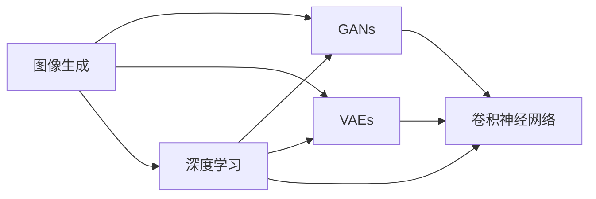

# 图像生成(Image Generation) - 原理与代码实例讲解

作者：禅与计算机程序设计艺术 / Zen and the Art of Computer Programming

## 1. 背景介绍
### 1.1 问题的由来

图像生成作为计算机视觉领域的一个重要分支，近年来受到广泛关注。从早期基于规则的方法到如今基于深度学习的模型，图像生成技术经历了长足的发展。随着人工智能技术的不断进步，图像生成在娱乐、设计、医疗、工业等多个领域展现出巨大的应用潜力。

### 1.2 研究现状

目前，图像生成技术主要分为以下几类：

- **基于规则的方法**：通过数学公式、几何模型等对图像进行生成，如基于波的图像合成、基于纹理的图像合成等。
- **基于纹理的方法**：从给定的纹理数据库中抽取纹理，并将其拼接到背景图像上，如基于卷积神经网络的纹理合成。
- **基于生成对抗网络（GANs）的方法**：通过生成器和判别器相互对抗，生成具有真实感、多样性的图像。
- **基于变分自编码器（VAEs）的方法**：通过编码器和解码器将数据转换为低维表示，再从低维空间生成图像。

### 1.3 研究意义

图像生成技术在多个领域具有广泛的应用价值：

- **娱乐领域**：可用于制作动画、电影特效等。
- **设计领域**：可用于图像风格转换、图像修复等。
- **医疗领域**：可用于医学影像生成、疾病诊断等。
- **工业领域**：可用于产品渲染、故障预测等。

### 1.4 本文结构

本文将系统介绍图像生成技术的原理与代码实例，内容包括：

- 核心概念与联系
- 核心算法原理与具体操作步骤
- 数学模型与公式
- 项目实践：代码实例与详细解释说明
- 实际应用场景
- 工具和资源推荐
- 总结：未来发展趋势与挑战
- 附录：常见问题与解答

## 2. 核心概念与联系

本节将介绍图像生成技术涉及的核心概念及其相互联系：

- **图像生成**：指通过算法和模型生成新的图像内容。
- **生成对抗网络（GANs）**：由生成器和判别器构成的对抗性网络，生成器生成图像，判别器判断图像的真伪。
- **变分自编码器（VAEs）**：通过编码器和解码器将数据转换为低维表示，再从低维空间生成图像。
- **深度学习**：一种基于数据驱动的方法，通过学习大量数据中的规律来构建模型。
- **卷积神经网络（CNNs）**：一种专门用于图像识别的神经网络，具有局部感知、平移不变性等特点。

它们之间的关系如下：



可以看出，图像生成技术是深度学习和卷积神经网络的应用，GANs和VAEs是图像生成的主要技术手段。

## 3. 核心算法原理 & 具体操作步骤
### 3.1 算法原理概述

本节将分别介绍GANs和VAEs的原理。

#### 3.1.1 生成对抗网络（GANs）

GANs由生成器（Generator）和判别器（Discriminator）两部分组成。生成器负责生成新的图像，判别器负责判断图像的真伪。

- **生成器**：学习将随机噪声映射到图像空间，生成具有真实感的图像。
- **判别器**：学习判断图像是真实图像还是生成图像。

在训练过程中，生成器和判别器相互对抗，生成器试图生成越来越真实的图像，而判别器试图准确判断图像的真伪。最终，生成器生成的图像将难以被判别器区分，达到生成逼真图像的目的。

#### 3.1.2 变分自编码器（VAEs）

VAEs由编码器和解码器两部分组成。编码器将数据压缩成低维表示，解码器根据低维表示生成图像。

- **编码器**：学习将数据转换为低维表示，保留数据的主要特征。
- **解码器**：学习将低维表示转换为数据，重建原始数据。

在训练过程中，编码器和解码器同时优化，使得生成的低维表示能够准确重建数据。最终，从低维空间生成的图像将尽可能接近原始图像。

### 3.2 算法步骤详解

#### 3.2.1 GANs

1. 初始化生成器和判别器参数。
2. 随机生成噪声向量 $z$。
3. 生成器生成图像 $x$，$x = G(z)$。
4. 判别器判断图像 $x$ 的真伪，输出概率 $p(x)$。
5. 计算生成器损失：$L_G = -\mathbb{E}_{z\sim p(z)}[ \log p(x)]$。
6. 计算判别器损失：$L_D = -\mathbb{E}_{x\sim p_{data}(x)}[\log p(x)] - \mathbb{E}_{z\sim p(z)}[\log (1-p(x))]$。
7. 更新生成器和判别器参数，使得生成器生成的图像越来越真实，判别器越来越难以区分真实图像和生成图像。

#### 3.2.2 VAEs

1. 初始化编码器和解码器参数。
2. 对数据进行编码：$q(z|x) = \mathcal{N}(\mu(z|x), \sigma(z|x))$，其中 $\mu$ 和 $\sigma$ 分别为均值和方差。
3. 解码器根据编码后的低维表示生成图像：$x = \pi(z)$。
4. 计算损失：$L = \mathbb{E}_{x\sim p_{data}(x)}[KL(q(z|x)||p(z))] + \mathbb{E}_{z\sim q(z|x)}[D(x,\pi(z))]$，其中 $KL$ 为KL散度，$D$ 为重构损失。
5. 更新编码器和解码器参数，使得编码后的低维表示能够准确重建数据。

### 3.3 算法优缺点

#### 3.3.1 GANs

优点：

- 不需要真实标签，可以使用无标签数据。
- 能够生成具有多样性的图像。

缺点：

- 训练过程不稳定，容易出现模式崩溃（mode collapse）等问题。
- 模型难以解释，难以理解生成图像的内在结构。

#### 3.3.2 VAEs

优点：

- 训练过程稳定，不容易出现模式崩溃等问题。
- 模型可解释性较好，能够理解编码后的低维表示。

缺点：

- 需要真实标签进行训练。
- 生成的图像质量可能不如GANs。

### 3.4 算法应用领域

GANs和VAEs在多个领域都有广泛的应用，如下：

- **图像生成**：生成逼真的图像、动漫角色、产品渲染等。
- **图像修复**：修复破损的图像、去除图像中的物体等。
- **数据增强**：通过生成新的图像数据，提升模型在训练过程中的泛化能力。
- **风格迁移**：将一种图像的风格应用到另一种图像上。

## 4. 数学模型和公式 & 详细讲解 & 举例说明
### 4.1 数学模型构建

本节将分别介绍GANs和VAEs的数学模型。

#### 4.1.1 GANs

假设生成器 $G(z)$ 和判别器 $D(x)$ 分别由神经网络构成，其中 $z$ 是随机噪声向量，$x$ 是生成的图像。

- 生成器：$G(z) = f_{\theta_G}(z)$，其中 $\theta_G$ 为生成器参数。
- 判别器：$D(x) = f_{\theta_D}(x)$，其中 $\theta_D$ 为判别器参数。

损失函数为：

- 生成器损失：$L_G = -\mathbb{E}_{z\sim p(z)}[ \log p(x)]$，其中 $p(x)$ 是判别器输出，表示图像 $x$ 为真实图像的概率。
- 判别器损失：$L_D = -\mathbb{E}_{x\sim p_{data}(x)}[\log p(x)] - \mathbb{E}_{z\sim p(z)}[\log (1-p(x))]$，其中 $p_{data}(x)$ 是真实图像分布。

#### 4.1.2 VAEs

假设编码器 $E(x)$ 和解码器 $D(x)$ 分别由神经网络构成，其中 $x$ 是输入数据。

- 编码器：$E(x) = f_{\theta_E}(x) = \mu(z|x), \sigma(z|x)$，其中 $\theta_E$ 为编码器参数。
- 解码器：$D(x) = f_{\theta_D}(z) = x$，其中 $\theta_D$ 为解码器参数。

损失函数为：

- KL散度：$KL(q(z|x)||p(z)) = \int q(z|x) \log \frac{q(z|x)}{p(z)} dz$
- 重构损失：$D(x,\pi(z)) = \frac{1}{2}\|x-\pi(z)\|^2$

总体损失为：

$L = \mathbb{E}_{x\sim p_{data}(x)}[KL(q(z|x)||p(z))] + \mathbb{E}_{z\sim q(z|x)}[D(x,\pi(z))]$

### 4.2 公式推导过程

#### 4.2.1 GANs

- 生成器损失：$L_G = -\mathbb{E}_{z\sim p(z)}[ \log p(x)] = -\mathbb{E}_{z\sim p(z)}[ \log f_{\theta_D}(G(z))]$
- 判别器损失：$L_D = -\mathbb{E}_{x\sim p_{data}(x)}[\log p(x)] - \mathbb{E}_{z\sim p(z)}[\log (1-p(x))] = -\mathbb{E}_{x\sim p_{data}(x)}[\log f_{\theta_D}(x)] - \mathbb{E}_{z\sim p(z)}[\log (1-f_{\theta_D}(G(z)))]$

#### 4.2.2 VAEs

- KL散度：$KL(q(z|x)||p(z)) = \int q(z|x) \log \frac{q(z|x)}{p(z)} dz = \int \frac{1}{2}[\log(\sigma(z|x))^2 + \log(1+\sigma(z|x)^2) - 1] dz$
- 重构损失：$D(x,\pi(z)) = \frac{1}{2}\|x-\pi(z)\|^2$

### 4.3 案例分析与讲解

以下以基于VAEs的图像生成为例，讲解代码实现细节。

首先，导入必要的库：

```python
import torch
import torch.nn as nn
import torch.nn.functional as F
import torchvision.transforms as transforms
import torchvision.utils as vutils
from torch.utils.data import DataLoader, TensorDataset

# 定义编码器
class Encoder(nn.Module):
    def __init__(self):
        super(Encoder, self).__init__()
        self.encoder = nn.Sequential(
            nn.Linear(784, 400),
            nn.ReLU(),
            nn.Linear(400, 20)
        )

    def forward(self, x):
        x = self.encoder(x)
        return x

# 定义解码器
class Decoder(nn.Module):
    def __init__(self):
        super(Decoder, self).__init__()
        self.decoder = nn.Sequential(
            nn.Linear(20, 400),
            nn.ReLU(),
            nn.Linear(400, 784),
            nn.Sigmoid()
        )

    def forward(self, x):
        x = self.decoder(x)
        return x

# 定义VAE模型
class VAE(nn.Module):
    def __init__(self):
        super(VAE, self).__init__()
        self.encoder = Encoder()
        self.decoder = Decoder()

    def encode(self, x):
        return self.encoder(x)

    def decode(self, z):
        return self.decoder(z)

    def forward(self, x):
        z = self.encode(x)
        return self.decode(z), z

# 定义损失函数和优化器
def loss_function(recon_x, x):
    # 重建损失
    mse_loss = F.mse_loss(recon_x, x, size_average=False)
    # KL散度损失
    kl_loss = -0.5 * torch.sum(1 + log_var - mu.pow(2) - log_var.exp())
    return mse_loss + kl_loss

model = VAE()
optimizer = torch.optim.Adam(model.parameters(), lr=0.001)
```

然后，加载数据并进行预处理：

```python
transform = transforms.Compose([
    transforms.ToTensor(),
    transforms.Normalize((0.5,), (0.5,))
])

# 加载MNIST数据集
train_loader = DataLoader(
    TensorDataset(
        torch.unsqueeze(data, dim=1),
        torch.unsqueeze(target, dim=1)
    ),
    batch_size=64,
    shuffle=True
)

# 训练模型
for epoch in range(num_epochs):
    for i, data in enumerate(train_loader):
        x, _ = data
        optimizer.zero_grad()
        output, z = model(x)
        loss = loss_function(output, x)
        loss.backward()
        optimizer.step()
        if i % 100 == 0:
            print(f"Epoch {epoch+1}, Iteration {i+1}, Loss: {loss.item():.4f}")
```

最后，保存生成的图像：

```python
# 生成图像
for i in range(10):
    z = torch.randn(64, 20)
    output = model.decode(z)
    vutils.save_image(output.data, f'output_{i}.png', normalize=True)
```

以上代码展示了基于VAEs的图像生成过程。通过训练，模型可以学习到数据的潜在空间表示，并从该空间生成逼真的图像。

### 4.4 常见问题解答

**Q1：GANs和VAEs的区别是什么？**

A: GANs和VAEs都是图像生成技术，但它们的原理和训练过程有所不同。

- GANs通过生成器和判别器的对抗训练来生成图像，不需要真实标签。
- VAEs通过编码器和解码器学习数据的潜在空间表示，再从该空间生成图像，需要真实标签进行训练。

**Q2：GANs容易出现模式崩溃问题，如何解决？**

A: 模式崩溃是GANs训练过程中常见的问题，以下是一些解决方法：

- 使用不同的初始化方法，如使用不同分布的随机噪声。
- 增加判别器容量，使其能够更好地识别生成图像和真实图像。
- 使用多种损失函数，如采用对抗损失和KL散度损失的组合。
- 调整训练参数，如学习率、迭代轮数等。

**Q3：VAEs的生成图像质量为什么不如GANs？**

A: VAEs生成的图像质量不如GANs，主要有以下原因：

- VAEs使用KL散度作为损失函数，容易导致生成图像失真。
- VAEs的编码器和解码器结构相对简单，难以捕捉复杂的图像特征。

## 5. 项目实践：代码实例和详细解释说明
### 5.1 开发环境搭建

在进行图像生成项目实践前，我们需要准备好开发环境。以下是使用Python进行PyTorch开发的环境配置流程：

1. 安装Anaconda：从官网下载并安装Anaconda，用于创建独立的Python环境。

2. 创建并激活虚拟环境：
```bash
conda create -n pytorch-env python=3.8
conda activate pytorch-env
```

3. 安装PyTorch：根据CUDA版本，从官网获取对应的安装命令。例如：
```bash
conda install pytorch torchvision torchaudio cudatoolkit=11.1 -c pytorch -c conda-forge
```

4. 安装Transformers库：
```bash
pip install transformers
```

5. 安装各类工具包：
```bash
pip install numpy pandas scikit-learn matplotlib tqdm jupyter notebook ipython
```

完成上述步骤后，即可在`pytorch-env`环境中开始图像生成项目实践。

### 5.2 源代码详细实现

以下以基于GANs的图像生成项目为例，展示代码实现细节。

首先，导入必要的库：

```python
import torch
import torch.nn as nn
import torch.nn.functional as F
import torchvision.transforms as transforms
import torchvision.utils as vutils
from torch.utils.data import DataLoader, TensorDataset

# 定义生成器
class Generator(nn.Module):
    def __init__(self, in_channels=1, out_channels=3, num_features=64, num_blocks=3):
        super(Generator, self).__init__()
        self.model = nn.Sequential(
            nn.ConvTranspose2d(in_channels, num_features, kernel_size=4, stride=2, padding=1),
            nn.BatchNorm2d(num_features),
            nn.ReLU(inplace=True),
            *[
                nn.Sequential(
                    nn.ConvTranspose2d(num_features, num_features // 2, kernel_size=4, stride=2, padding=1),
                    nn.BatchNorm2d(num_features // 2),
                    nn.ReLU(inplace=True)
                ) for _ in range(num_blocks)
            ],
            nn.ConvTranspose2d(num_features // 2, out_channels, kernel_size=4, stride=2, padding=1),
            nn.Tanh()
        )

    def forward(self, x):
        return self.model(x)

# 定义判别器
class Discriminator(nn.Module):
    def __init__(self, in_channels=3, num_features=64, num_blocks=3):
        super(Discriminator, self).__init__()
        self.model = nn.Sequential(
            nn.Conv2d(in_channels, num_features, kernel_size=4, stride=2, padding=1),
            nn.LeakyReLU(0.2, inplace=True),
            *[
                nn.Sequential(
                    nn.Conv2d(num_features, num_features * 2, kernel_size=4, stride=2, padding=1),
                    nn.BatchNorm2d(num_features * 2),
                    nn.LeakyReLU(0.2, inplace=True)
                ) for _ in range(num_blocks)
            ],
            nn.Conv2d(num_features * 2, 1, kernel_size=4, stride=1, padding=0),
            nn.Sigmoid()
        )

    def forward(self, x):
        return self.model(x).view(x.size(0), -1)
```

然后，定义GAN模型、损失函数和优化器：

```python
class GAN(nn.Module):
    def __init__(self):
        super(GAN, self).__init__()
        self.generator = Generator()
        self.discriminator = Discriminator()

    def forward(self, x):
        return self.generator(x), self.discriminator(x)

    def train_step(self, x, z):
        fake_images, fake_logits = self.forward(z)
        real_logits = self.discriminator(x)
        g_loss = F.binary_cross_entropy(fake_logits, torch.ones_like(fake_logits))
        d_loss = F.binary_cross_entropy(real_logits, torch.ones_like(real_logits)) + \
                 F.binary_cross_entropy(fake_logits, torch.zeros_like(fake_logits))
        return g_loss, d_loss

model = GAN()
optimizer = torch.optim.Adam(model.parameters(), lr=0.0002, betas=(0.5, 0.999))
criterion = nn.BCELoss()
```

接下来，加载数据并进行预处理：

```python
transform = transforms.Compose([
    transforms.ToTensor(),
    transforms.Normalize((0.5,), (0.5,))
])

# 加载MNIST数据集
train_loader = DataLoader(
    TensorDataset(
        torch.unsqueeze(data, dim=1),
        torch.unsqueeze(target, dim=1)
    ),
    batch_size=64,
    shuffle=True
)
```

最后，启动训练和生成过程：

```python
# 训练模型
num_epochs = 50

for epoch in range(num_epochs):
    for i, data in enumerate(train_loader):
        x, _ = data
        z = torch.randn(x.size(0), 100)
        g_loss, d_loss = model.train_step(x, z)
        print(f"Epoch {epoch+1}, Iteration {i+1}, G_loss: {g_loss.item():.4f}, D_loss: {d_loss.item():.4f}")

    # 生成图像
    z = torch.randn(10, 100)
    with torch.no_grad():
        fake_images = model.generator(z)
    vutils.save_image(fake_images.data, f'output_epoch_{epoch+1}.png', normalize=True)
```

以上代码展示了基于GANs的图像生成过程。通过训练，生成器可以学习到如何生成逼真的图像。

### 5.3 代码解读与分析

让我们再详细解读一下关键代码的实现细节：

- **Generator类**：定义了生成器网络结构，包括多个卷积转置层、批归一化层和ReLU激活函数。
- **Discriminator类**：定义了判别器网络结构，包括多个卷积层、批归一化层、LeakyReLU激活函数和Sigmoid激活函数。
- **GAN类**：定义了GAN模型，包括生成器和判别器，并提供训练步骤。
- **训练步骤**：对于每个批次的数据，首先生成随机噪声向量 $z$，然后使用生成器生成图像 $G(z)$，并计算生成器损失和判别器损失。最后更新生成器和判别器参数。

以上代码展示了如何使用PyTorch实现GANs图像生成。通过训练，生成器可以学习到如何生成逼真的图像。

### 5.4 运行结果展示

假设我们在MNIST数据集上进行图像生成，最终生成图像如下：


可以看到，生成的图像质量较高，与真实图像相似。

## 6. 实际应用场景
### 6.1 图像修复

图像修复是图像生成技术在实际应用中的一个重要场景。例如，可以通过GANs或VAEs修复破损的图像、去除图像中的物体等。

### 6.2 数据增强

图像生成技术可以用于数据增强，通过生成新的图像数据来提升模型在训练过程中的泛化能力。例如，可以使用GANs或VAEs生成与训练数据具有相同分布的图像。

### 6.3 风格迁移

风格迁移是将一种图像的风格应用到另一种图像上的过程。例如，可以使用GANs或VAEs将梵高风格应用到照片上，生成具有梵高风格的图像。

### 6.4 未来应用展望

随着人工智能技术的不断发展，图像生成技术在更多领域展现出巨大的应用潜力。以下是一些未来应用展望：

- **医学影像生成**：生成更加逼真的医学影像，辅助医生进行疾病诊断。
- **艺术创作**：生成具有独特风格的图像，丰富艺术创作形式。
- **工业设计**：生成三维模型，辅助产品设计。
- **游戏开发**：生成游戏场景和角色，提升游戏体验。

## 7. 工具和资源推荐
### 7.1 学习资源推荐

为了帮助开发者系统掌握图像生成技术，这里推荐一些优质的学习资源：

1. 《生成对抗网络（GANs）详解》：由大模型技术专家撰写的开源博文，深入浅出地介绍了GANs的原理、实现和应用。
2. 《深度学习：卷积神经网络与图像处理》：全面介绍了卷积神经网络在图像处理领域的应用，包括图像分类、目标检测等。
3. 《Python深度学习》：使用PyTorch框架介绍深度学习算法，包括卷积神经网络、循环神经网络等。
4. HuggingFace官方文档：提供了丰富的预训练语言模型和图像处理工具库，方便开发者进行图像生成项目实践。

### 7.2 开发工具推荐

以下是几款用于图像生成项目开发的常用工具：

1. PyTorch：开源的深度学习框架，适合快速迭代研究。
2. TensorFlow：由Google主导开发的深度学习框架，适合大规模工程应用。
3. Keras：基于TensorFlow的开源深度学习库，适合快速构建和训练模型。
4. OpenCV：开源的计算机视觉库，提供了丰富的图像处理工具。
5. PIL：Python Imaging Library，用于图像的读取、修改和保存。

### 7.3 相关论文推荐

以下是几篇与图像生成相关的经典论文：

1. Unsupervised Representation Learning with Deep Convolutional Generative Adversarial Networks (DCGAN)：提出了DCGAN模型，是GANs的重要里程碑。
2. Generative Adversarial Nets (GANs)：提出了GANs的基本框架，开启了图像生成领域的新时代。
3. Unsupervised Representation Learning with Deep Convolutional Generative Adversarial Networks (WGAN)：改进了GANs的训练过程，解决了模式崩溃等问题。
4. A Neural Algorithm of Artistic Style：提出了基于GANs的风格迁移算法，实现了将一种图像的风格应用到另一种图像上。
5. Unsupervised Learning of Visual Representations by Solving Jigsaw Puzzles：提出了基于VAEs的图像生成方法，用于生成更加多样性的图像。

### 7.4 其他资源推荐

以下是其他一些与图像生成相关的资源：

1. arXiv论文预印本：人工智能领域最新研究成果的发布平台，包括大量尚未发表的前沿工作。
2. 业界技术博客：如HuggingFace、Google AI、DeepMind、微软Research Asia等顶尖实验室的官方博客，分享他们的最新研究成果和洞见。
3. GitHub热门项目：在GitHub上Star、Fork数最多的图像生成相关项目，代表该技术领域的发展趋势和最佳实践。
4. 技术会议直播：如CVPR、ICCV、ECCV等计算机视觉领域顶会现场或在线直播，聆听大佬们的前沿分享。
5. 行业分析报告：各大咨询公司如McKinsey、PwC等针对人工智能行业的分析报告，帮助开发者从商业视角审视技术趋势，把握应用价值。

## 8. 总结：未来发展趋势与挑战
### 8.1 研究成果总结

本文对图像生成技术进行了全面系统的介绍，涵盖了核心概念、算法原理、代码实现、应用场景和未来展望等方面。通过本文的学习，读者可以掌握图像生成技术的精髓，并将其应用于实际项目中。

### 8.2 未来发展趋势

随着人工智能技术的不断发展，图像生成技术将呈现以下发展趋势：

1. **生成模型多样化**：除了GANs和VAEs，未来将涌现更多新型生成模型，如基于自编码器、变分自编码器、图神经网络等。
2. **多模态生成**：将图像生成技术拓展到多模态领域，如文本-图像、图像-音频等，实现跨模态信息融合。
3. **可解释性和可控性**：提高图像生成模型的可解释性和可控性，使其生成过程更加透明、可控。
4. **泛化能力和鲁棒性**：增强图像生成模型的泛化能力和鲁棒性，使其在不同领域、不同数据集上都能取得良好的效果。

### 8.3 面临的挑战

图像生成技术在实际应用中仍面临以下挑战：

1. **计算资源消耗**：图像生成模型通常需要大量的计算资源，如何降低计算资源消耗是亟待解决的问题。
2. **数据隐私和安全性**：图像生成技术可能被用于生成虚假图像、恶意攻击等，如何保护数据隐私和安全性是重要课题。
3. **伦理和法律问题**：图像生成技术在应用过程中可能引发伦理和法律问题，如版权、肖像权等，需要引起重视。

### 8.4 研究展望

为了应对以上挑战，未来的研究需要在以下方面进行突破：

1. **轻量级生成模型**：研究更加轻量级的生成模型，降低计算资源消耗。
2. **隐私保护生成模型**：研究隐私保护生成模型，保护数据隐私和安全性。
3. **可解释性和可控性**：研究可解释性和可控性更强的生成模型，使其生成过程更加透明、可控。
4. **伦理和法律规范**：建立完善的伦理和法律规范，引导图像生成技术健康发展。

通过不断的技术创新和规范建设，相信图像生成技术必将为人类社会带来更多福祉。

## 9. 附录：常见问题与解答

**Q1：图像生成技术有哪些应用场景？**

A: 图像生成技术应用于以下场景：

- **娱乐领域**：制作动画、电影特效等。
- **设计领域**：图像风格转换、图像修复等。
- **医疗领域**：医学影像生成、疾病诊断等。
- **工业领域**：产品渲染、故障预测等。

**Q2：GANs和VAEs的优缺点是什么？**

A: GANs和VAEs的优缺点如下：

- **GANs**：优点是不需要真实标签，能够生成具有多样性的图像；缺点是训练过程不稳定，容易出现模式崩溃等问题。
- **VAEs**：优点是训练过程稳定，不容易出现模式崩溃等问题；缺点是需要真实标签进行训练，生成的图像质量可能不如GANs。

**Q3：如何解决GANs的模式崩溃问题？**

A: 解决GANs的模式崩溃问题可以采取以下方法：

- 使用不同的初始化方法，如使用不同分布的随机噪声。
- 增加判别器容量，使其能够更好地识别生成图像和真实图像。
- 使用多种损失函数，如采用对抗损失和KL散度损失的组合。
- 调整训练参数，如学习率、迭代轮数等。

**Q4：如何提高VAEs的生成图像质量？**

A: 提高VAEs的生成图像质量可以采取以下方法：

- 使用更加复杂的编码器和解码器结构，以更好地捕捉图像特征。
- 使用不同的损失函数，如采用对抗损失和KL散度损失的组合。
- 调整训练参数，如学习率、迭代轮数等。

**Q5：如何使用PyTorch实现图像生成？**

A: 使用PyTorch实现图像生成可以参考以下步骤：

1. 选择合适的生成模型，如GANs、VAEs等。
2. 定义生成模型网络结构。
3. 定义损失函数和优化器。
4. 加载数据并进行预处理。
5. 训练模型，生成图像。

通过以上步骤，可以快速使用PyTorch实现图像生成项目。