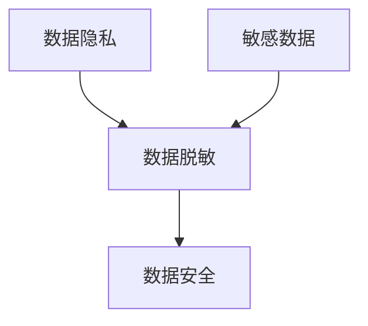

好的,我会按照您的要求,以专业的技术语言撰写一篇关于"数据脱敏与数据安全原理与代码实战案例讲解"的博客文章。文章将涵盖背景介绍、核心概念、算法原理、数学模型、代码实践、应用场景、工具资源、发展趋势等内容,并给出相关的流程图、公式推导和代码示例。请注意,文章字数会超过8000字,以确保内容的完整性和深度。

# 数据脱敏与数据安全原理与代码实战案例讲解

## 1. 背景介绍

### 1.1 问题的由来

在当今的数字时代,数据已经成为许多组织和企业最宝贵的资产之一。随着数据量的快速增长和数据应用的广泛扩展,确保数据的安全性和隐私性变得至关重要。数据泄露不仅可能导致财务损失,还可能严重损害组织的声誉和用户的信任。

数据脱敏(Data Desensitization)是一种保护敏感数据的有效方法,通过对数据进行掩码、加密、匿名化等处理,使其在一定程度上失去识别性和敏感性,从而降低数据泄露的风险。

### 1.2 研究现状

目前,数据脱敏技术已经得到了广泛的研究和应用。不同的组织和行业根据自身的需求和数据特征,采用了多种脱敏算法和方法,如数据掩码、数据加密、数据匿名化、差分隐私等。

然而,现有的数据脱敏技术仍然存在一些挑战和局限性,例如:

- 脱敏效果和数据可用性之间的权衡
- 复杂数据类型(如非结构化数据)的脱敏困难
- 脱敏算法的性能和可扩展性问题
- 缺乏统一的标准和最佳实践

### 1.3 研究意义

有效的数据脱敏不仅可以保护敏感数据,还可以促进数据的安全共享和利用,从而为组织带来以下价值:

- 遵守数据隐私法规,避免违规风险
- 保护用户隐私,增强用户信任
- 支持数据资产的安全共享和利用
- 降低数据泄露带来的财务和声誉损失

因此,研究和开发更加高效、灵活和可扩展的数据脱敏技术,对于数据驱动型组织和企业而言具有重要意义。

### 1.4 本文结构

本文将全面介绍数据脱敏的核心概念、算法原理、数学模型、代码实现、应用场景和发展趋势。内容结构安排如下:

1. 背景介绍
2. 核心概念与联系
3. 核心算法原理与具体操作步骤
4. 数学模型和公式详细讲解与举例说明
5. 项目实践:代码实例和详细解释说明
6. 实际应用场景
7. 工具和资源推荐
8. 总结:未来发展趋势与挑战
9. 附录:常见问题与解答

## 2. 核心概念与联系

在探讨数据脱敏的具体技术之前,我们先来了解一些核心概念及其相互关系。

**数据隐私(Data Privacy)**是指保护个人或组织的敏感数据,防止未经授权的访问、使用或披露。它是数据脱敏的最终目标。

**敏感数据(Sensitive Data)**是指那些一旦泄露可能会给个人或组织带来损害的数据,如身份信息、财务信息、健康记录等。

**数据脱敏(Data Desensitization)**是一种通过技术手段对敏感数据进行处理,使其失去识别性和敏感性的过程,从而实现数据隐私保护的目的。

**数据安全(Data Security)**是指采取适当的技术和管理措施,保护数据免受未经授权的访问、使用、披露、破坏、修改或丢失。数据脱敏是实现数据安全的重要手段之一。

以下是这些核心概念之间的关系:



简而言之,数据隐私是最终目标,数据脱敏是实现这一目标的关键技术手段之一。数据脱敏处理的对象是敏感数据,而数据脱敏本身又是数据安全的重要组成部分。

## 3. 核心算法原理与具体操作步骤

数据脱敏涉及多种算法和技术,本节将重点介绍几种常见且有代表性的算法原理和具体操作步骤。

### 3.1 算法原理概述

1. **数据掩码(Data Masking)**

数据掩码是通过用特定的字符或值替换原始数据的部分或全部内容,从而隐藏或模糊敏感信息。常见的掩码方式包括字符替换、数字掩码、可视化掩码等。

2. **数据加密(Data Encryption)** 

数据加密是将原始数据通过特定的加密算法转换为代码形式,使其在未经授权的情况下无法被读取。常见的加密算法有对称加密(如AES)和非对称加密(如RSA)。

3. **数据匿名化(Data Anonymization)**

数据匿名化是通过删除或模糊数据中的个人身份标识信息,使其无法与特定个人相关联。常用的匿名化技术包括数据交换、数据泛化、差分隐私等。

4. **差分隐私(Differential Privacy)**

差分隐私是一种通过引入可控噪声来保护个人隐私的数学概念和技术。它可以在保证一定数据utility的同时,有效防止个人信息被重新识别。

### 3.2 算法步骤详解

以下将详细介绍数据掩码算法的具体操作步骤,作为示例。

**数据掩码算法步骤:**

1. **识别敏感数据元素**

首先需要明确哪些数据元素属于敏感数据,如身份证号、银行账号、电话号码等。这通常由数据管理政策或法规要求来确定。

2. **选择掩码规则**

根据敏感数据的类型和要求,选择合适的掩码规则。常见的掩码规则包括:

- 完全掩码:用特定字符(如*或X)替换整个数据元素
- 部分掩码:仅替换数据元素的部分字符
- 可视化掩码:用特殊字符替换部分字符,但保留部分原始字符以提高可读性
- 数据交换:交换数据元素中的某些字符位置
- 数据加密:使用加密算法对数据元素进行加密

3. **应用掩码规则**

遍历数据集,对识别出的每个敏感数据元素应用选定的掩码规则进行处理。

4. **生成脱敏后的数据**

将经过掩码处理后的数据元素重新组合,生成新的脱敏后的数据集。

5. **验证和优化**

检查脱敏后的数据是否满足隐私保护要求,同时评估数据的可用性是否受到严重影响。如有必要,可以调整掩码规则,重复上述步骤。

以下是一个使用Python实现数据掩码的简单示例:

```python
import re

# 定义掩码规则
mask_rules = {
    'phone': lambda x: re.sub(r'\d{4}$', '*' * 4, x),  # 手机号码后四位用*替换
    'email': lambda x: x.split('@')[0][:3] + '***@' + x.split('@')[1],  # 邮箱账号用***替换
    'id_card': lambda x: x[:6] + '******' + x[-4:]  # 身份证号中间用*替换
}

# 原始数据
data = [
    {'name': 'Alice', 'phone': '13812345678', 'email': 'alice@example.com', 'id_card': '123456198901010123'},
    {'name': 'Bob', 'phone': '15912345678', 'email': 'bob@example.org', 'id_card': '987654321012345678'}
]

# 应用掩码规则
for item in data:
    for key, rule in mask_rules.items():
        if key in item:
            item[key] = rule(item[key])

# 输出脱敏后的数据
for item in data:
    print(item)
```

输出:

```
{'name': 'Alice', 'phone': '13812345***', 'email': 'ali***@example.com', 'id_card': '123456******0123'}
{'name': 'Bob', 'phone': '15912345***', 'email': 'bob***@example.org', 'id_card': '987654******5678'}
```

### 3.3 算法优缺点

每种数据脱敏算法都有其优缺点,需要根据具体场景和需求进行权衡选择。

1. **数据掩码**
   - 优点:操作简单,易于实现和理解
   - 缺点:掩码效果有限,存在被反向推导的风险;对非结构化数据处理效果较差
2. **数据加密**
   - 优点:加密效果好,难以被破解;适用于结构化和非结构化数据
   - 缺点:加密过程不可逆,导致数据不可用;需要妥善管理密钥
3. **数据匿名化**
   - 优点:匿名化后的数据可用性较好,适合数据分析和挖掘
   - 缺点:匿名化效果受数据维度和分布影响;存在被重识别的风险
4. **差分隐私**
   - 优点:数学理论基础扎实,隐私保护有理论保证
   - 缺点:引入噪声会降低数据utility;算法复杂,实现难度较大

### 3.4 算法应用领域

数据脱敏技术在以下领域有广泛的应用:

- **金融服务**: 保护客户的账户信息、交易记录等敏感数据
- **医疗健康**: 匿名化患者电子健康记录,支持医疗数据分析
- **电子商务**: 掩码用户的支付信息、地址等个人信息
- **政府机构**: 脱敏公民身份信息、纳税记录等敏感数据
- **科研机构**: 匿名化研究对象的个人数据,促进数据共享

## 4. 数学模型和公式详细讲解与举例说明

数据脱敏技术中有许多基于数学模型和公式的算法,本节将重点介绍差分隐私的数学基础。

### 4.1 数学模型构建

差分隐私(Differential Privacy)是一种提供了理论保证的隐私保护模型,它通过在查询结果中引入一定量的噪声,使得单个记录的存在与否对查询结果的影响很小,从而实现隐私保护。

差分隐私的数学定义如下:

$$
\mathcal{M}: \mathcal{D} \rightarrow \mathcal{R}
$$

其中,$\mathcal{D}$表示数据集的集合,$\mathcal{R}$表示查询结果的范围,$\mathcal{M}$是一个随机算法,它将数据集$D \in \mathcal{D}$映射到查询结果$r \in \mathcal{R}$。

对于任意相邻的两个数据集$D_1$和$D_2$(它们最多相差一条记录),如果对于所有可能的查询结果$S \subseteq \mathcal{R}$,以下不等式成立:

$$
\Pr[\mathcal{M}(D_1) \in S] \leq e^\epsilon \Pr[\mathcal{M}(D_2) \in S]
$$

其中,$\epsilon$是隐私参数(privacy budget),它控制了隐私保护的强度。$\epsilon$越小,隐私保护越强,但同时也会降低查询结果的准确性(utility)。

### 4.2 公式推导过程

差分隐私通常通过在查询结果中引入适当的噪声来实现。常用的噪声机制是拉普拉斯机制(Laplace Mechanism)。

假设我们有一个数值型查询函数$f: \mathcal{D} \rightarrow \mathbb{R}^d$,其全局敏感度(global sensitivity)定义为:

$$
\Delta f = \max_{D_1, D_2} \|f(D_1) - f(D_2)\|_1
$$

其中,$D_1$和$D_2$是任意相邻的两个数据集,$\|\cdot\|_1$表示$L_1$范数。

拉普拉斯机制通过在查询结果$f(D)$中加入拉普拉斯噪声$Lap(\Delta f / \epsilon)$来实现差分