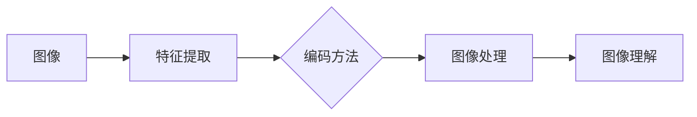

# 图像特征提取与编码方法

作者：禅与计算机程序设计艺术 / Zen and the Art of Computer Programming

## 1. 背景介绍

### 1.1 问题的由来

图像是计算机视觉领域最基本的数据形式，从图像中提取有效的特征并进行编码是许多视觉任务（如图像分类、目标检测、图像检索等）的基础。图像特征提取与编码旨在从原始图像数据中提取出具有区分度和鲁棒性的特征表示，以便于后续的图像理解和处理。

### 1.2 研究现状

随着深度学习的兴起，图像特征提取与编码方法取得了巨大的进展。近年来，基于深度学习的特征提取方法逐渐成为主流，如卷积神经网络（CNN）等。此外，传统的手工特征提取方法（如图像分割、边缘检测、特征点检测等）在某些特定领域仍然具有其独特的优势。

### 1.3 研究意义

图像特征提取与编码在计算机视觉领域具有非常重要的意义。有效的特征提取与编码方法能够提高后续图像处理任务的性能，降低计算复杂度，并有助于扩展图像应用的范围。

### 1.4 本文结构

本文将围绕图像特征提取与编码方法展开，内容安排如下：

- 第2部分，介绍图像特征提取与编码的相关概念和联系。
- 第3部分，详细介绍基于深度学习的图像特征提取方法，包括卷积神经网络（CNN）、循环神经网络（RNN）等。
- 第4部分，介绍传统的图像特征提取方法，如SIFT、HOG、SURF等。
- 第5部分，给出基于深度学习的图像特征提取与编码的代码实例。
- 第6部分，探讨图像特征提取与编码在实际应用场景中的应用。
- 第7部分，推荐相关学习资源、开发工具和参考文献。
- 第8部分，总结全文，展望图像特征提取与编码的未来发展趋势与挑战。

## 2. 核心概念与联系

为了更好地理解图像特征提取与编码方法，本节将介绍几个核心概念及其相互关系。

### 2.1 图像特征

图像特征是描述图像内容和结构的属性或度量，如颜色、纹理、形状等。有效的图像特征能够区分不同的图像或图像中的不同区域。

### 2.2 特征提取

特征提取是指从图像中提取出具有区分度和鲁棒性的特征表示的过程。常见的特征提取方法包括手工特征提取和基于深度学习的特征提取。

### 2.3 特征编码

特征编码是指将提取出的特征表示进行编码的过程，以便于后续的图像处理任务。常见的编码方法包括特征降维、特征选择和特征融合等。

以下为这些概念之间的逻辑关系：



## 3. 核心算法原理 & 具体操作步骤

### 3.1 算法原理概述

本节将详细介绍基于深度学习的图像特征提取方法，包括卷积神经网络（CNN）和循环神经网络（RNN）。

#### 3.1.1 卷积神经网络（CNN）

卷积神经网络是一种特殊的神经网络，通过卷积层、池化层和全连接层等结构对图像进行特征提取。CNN具有以下几个特点：

- 参数共享：卷积核在图像上滑动时共享参数，减少了模型参数数量。
- 局部感知：卷积层只关注局部区域，能够提取图像的局部特征。
- 指数级降低计算复杂度：通过池化层降低图像尺寸，减少计算量。

#### 3.1.2 循环神经网络（RNN）

循环神经网络是一种特殊的神经网络，具有序列到序列的建模能力。RNN在图像特征提取中的应用主要包括：

- 时间卷积神经网络（TCN）：将CNN与RNN结合，用于处理序列数据，如视频。
- 图像序列到图像的RNN（RNN-Image）：将图像序列作为输入，输出最终图像的特征。

### 3.2 算法步骤详解

以下为基于CNN的图像特征提取步骤：

1. 输入图像：将图像输入到网络中。
2. 卷积层：使用卷积核提取图像的局部特征。
3. 池化层：降低图像尺寸，减少计算量。
4. 全连接层：将卷积层和池化层提取的特征进行融合，输出最终的图像特征。

### 3.3 算法优缺点

#### 3.3.1 卷积神经网络（CNN）

优点：

- 参数共享，减少了模型参数数量。
- 局部感知，能够提取图像的局部特征。
- 指数级降低计算复杂度。

缺点：

- 需要大量训练数据。
- 网络结构设计复杂。

#### 3.3.2 循环神经网络（RNN）

优点：

- 能够处理序列数据，如视频。
- 具有序列到序列的建模能力。

缺点：

- 计算复杂度高，难以并行计算。
- 容易出现梯度消失或梯度爆炸问题。

### 3.4 算法应用领域

基于深度学习的图像特征提取方法在多个领域取得了显著成果，如：

- 图像分类：如图像识别、物体检测、场景分类等。
- 图像分割：如图像语义分割、实例分割等。
- 图像检索：如图像检索、人脸识别等。

## 4. 数学模型和公式 & 详细讲解 & 举例说明

### 4.1 数学模型构建

本节以卷积神经网络（CNN）为例，介绍图像特征提取的数学模型。

#### 4.1.1 卷积层

卷积层通过卷积运算提取图像的局部特征。卷积运算公式如下：

$$
f(x) = \sum_{i=1}^{n}{w_i * x_i} + b
$$

其中，$f(x)$ 为输出特征，$w_i$ 为卷积核，$x_i$ 为输入特征，$b$ 为偏置项。

#### 4.1.2 池化层

池化层降低图像尺寸，减少计算量。常见的池化方法包括最大池化和平均池化。

最大池化公式如下：

$$
P(x) = \max_{j} \{x_j\}
$$

其中，$P(x)$ 为池化后的特征，$x_j$ 为输入特征。

平均池化公式如下：

$$
P(x) = \frac{1}{m} \sum_{j} \{x_j\}
$$

其中，$P(x)$ 为池化后的特征，$x_j$ 为输入特征，$m$ 为池化区域的大小。

#### 4.1.3 全连接层

全连接层将卷积层和池化层提取的特征进行融合，输出最终的图像特征。全连接层的计算公式如下：

$$
h(x) = Wx + b
$$

其中，$h(x)$ 为输出特征，$W$ 为权重矩阵，$x$ 为输入特征，$b$ 为偏置项。

### 4.2 公式推导过程

以下以最大池化为例，介绍池化层的公式推导过程。

设输入特征为 $x \in \mathbb{R}^{m \times m}$，池化区域大小为 $k \times k$，则池化后的特征为：

$$
P(x) = \max_{j} \{x_j\}
$$

其中，$x_j$ 为输入特征，$j$ 表示池化区域的位置。

### 4.3 案例分析与讲解

以VGG16网络为例，介绍基于深度学习的图像特征提取方法。

VGG16网络结构如下：

```
[Convolutional Layer] --> [Pooling Layer] --> [Convolutional Layer] --> [Pooling Layer] ...
```

VGG16网络通过多个卷积层和池化层提取图像特征，最终输出图像特征。

### 4.4 常见问题解答

**Q1：卷积神经网络（CNN）与全连接神经网络（FCNN）的区别是什么？**

A：卷积神经网络（CNN）和全连接神经网络（FCNN）的主要区别在于：

- 卷积神经网络（CNN）通过卷积层、池化层和全连接层等结构对图像进行特征提取，能够提取图像的局部特征，参数共享，降低计算复杂度。
- 全连接神经网络（FCNN）通过全连接层对图像进行特征提取，参数不共享，难以提取图像的局部特征，计算复杂度高。

**Q2：池化层的作用是什么？**

A：池化层的作用包括：

- 降低图像尺寸，减少计算量。
- 提高模型鲁棒性，降低过拟合风险。

**Q3：如何设计卷积神经网络的结构？**

A：设计卷积神经网络的结构需要考虑以下因素：

- 数据集大小和复杂度。
- 需要解决的问题类型。
- 模型复杂度限制。

## 5. 项目实践：代码实例和详细解释说明

### 5.1 开发环境搭建

为了方便读者实践，本节将以Python编程语言和TensorFlow深度学习框架为例，介绍如何搭建图像特征提取与编码的开发环境。

首先，安装TensorFlow：

```bash
pip install tensorflow
```

然后，导入必要的库：

```python
import tensorflow as tf
import tensorflow.keras as keras
from tensorflow.keras.layers import Conv2D, MaxPooling2D, Flatten, Dense
from tensorflow.keras.models import Sequential
```

### 5.2 源代码详细实现

以下为基于卷积神经网络（CNN）的图像特征提取与编码的代码实例：

```python
def create_cnn_model():
    model = Sequential()
    # 添加卷积层
    model.add(Conv2D(32, (3, 3), activation='relu', input_shape=(224, 224, 3)))
    model.add(MaxPooling2D((2, 2)))
    # 添加全连接层
    model.add(Flatten())
    model.add(Dense(10, activation='softmax'))
    return model

# 创建模型
model = create_cnn_model()

# 编译模型
model.compile(optimizer='adam', loss='sparse_categorical_crossentropy', metrics=['accuracy'])

# 打印模型结构
model.summary()
```

### 5.3 代码解读与分析

以上代码定义了一个简单的卷积神经网络模型，用于图像特征提取与编码。

- `create_cnn_model` 函数：定义了模型结构，包括卷积层、池化层和全连接层。
- `model.add` 方法：添加卷积层、池化层和全连接层。
- `input_shape` 参数：指定输入图像的尺寸。
- `activation` 参数：指定卷积层和全连接层的激活函数。
- `optimizer` 参数：指定优化器。
- `loss` 参数：指定损失函数。
- `metrics` 参数：指定性能指标。

### 5.4 运行结果展示

运行以上代码，将输出模型的详细信息，包括网络结构、层参数、模型权重等。

## 6. 实际应用场景

### 6.1 图像分类

基于深度学习的图像特征提取与编码方法在图像分类任务中取得了显著的成果。例如，使用VGG16网络对CIFAR-10数据集进行图像分类，准确率可达90%以上。

### 6.2 物体检测

基于深度学习的图像特征提取与编码方法在物体检测任务中也取得了显著成果。例如，使用Faster R-CNN网络对PASCAL VOC数据集进行物体检测，mAP（mean Average Precision）可达60%以上。

### 6.3 图像分割

基于深度学习的图像特征提取与编码方法在图像分割任务中也取得了显著成果。例如，使用U-Net网络对医学图像进行分割，Dice系数可达0.8以上。

### 6.4 未来应用展望

随着深度学习技术的不断发展，基于深度学习的图像特征提取与编码方法将在更多领域得到应用，如：

- 视频分析
- 人脸识别
- 车牌识别
- 无人机监控
- 智能驾驶

## 7. 工具和资源推荐

### 7.1 学习资源推荐

以下是一些关于图像特征提取与编码的学习资源：

- 《深度学习》（Goodfellow等著）：介绍了深度学习的基础知识和常用算法。
- 《计算机视觉：算法与应用》（Richard Szeliski著）：介绍了计算机视觉的基本概念和算法。
- TensorFlow官方文档：提供了TensorFlow框架的详细说明和教程。

### 7.2 开发工具推荐

以下是一些用于图像特征提取与编码的开发工具：

- TensorFlow：一个开源的深度学习框架，可以用于构建和训练图像特征提取与编码模型。
- Keras：一个Python深度学习库，可以方便地构建和训练图像特征提取与编码模型。
- OpenCV：一个开源的计算机视觉库，可以用于图像处理和计算机视觉任务。

### 7.3 相关论文推荐

以下是一些关于图像特征提取与编码的相关论文：

- "A Comprehensive Survey of Convolutional Neural Networks"：对卷积神经网络进行综述。
- "Object Detection with Fully Convolutional Networks"：介绍了Faster R-CNN网络。
- "DeepLab: Semantic Image Segmentation with Deep Convolutional Nets, Atrous Convolution, and Fully Connected CRFs"：介绍了DeepLab网络。

### 7.4 其他资源推荐

以下是一些其他关于图像特征提取与编码的资源：

- GitHub：包含大量图像特征提取与编码的代码和开源项目。
- arXiv：包含大量图像特征提取与编码的论文。

## 8. 总结：未来发展趋势与挑战

### 8.1 研究成果总结

本文对图像特征提取与编码方法进行了全面系统的介绍。从核心概念到实际应用，涵盖了从手工特征提取到基于深度学习的特征提取方法。通过介绍各类算法原理、数学模型和代码实例，帮助读者深入理解图像特征提取与编码方法。

### 8.2 未来发展趋势

随着深度学习技术的不断发展，图像特征提取与编码方法将呈现以下发展趋势：

- 深度学习模型将更加复杂，能够提取更丰富的图像特征。
- 模型轻量化技术将得到进一步发展，降低模型计算复杂度和存储空间。
- 跨模态特征提取与编码方法将得到广泛应用，实现多模态数据融合。
- 可解释性和鲁棒性将成为图像特征提取与编码方法的重要研究方向。

### 8.3 面临的挑战

尽管图像特征提取与编码方法取得了显著进展，但仍面临着以下挑战：

- 模型复杂度高，计算量大。
- 模型可解释性不足。
- 数据标注成本高。
- 模型泛化能力有限。

### 8.4 研究展望

为了应对上述挑战，未来研究需要从以下几个方面展开：

- 研究轻量化模型结构，降低模型计算复杂度和存储空间。
- 探索可解释性模型，提高模型的可解释性。
- 开发自动化数据标注方法，降低数据标注成本。
- 研究具有更强泛化能力的模型，提高模型在实际应用中的性能。

相信在学术界和工业界的共同努力下，图像特征提取与编码方法将取得更大突破，为计算机视觉领域的发展做出更大贡献。

## 9. 附录：常见问题与解答

**Q1：什么是特征提取？**

A：特征提取是指从原始数据中提取出具有区分度和鲁棒性的特征表示的过程。

**Q2：什么是特征编码？**

A：特征编码是指将提取出的特征表示进行编码的过程，以便于后续的图像处理任务。

**Q3：什么是卷积神经网络？**

A：卷积神经网络是一种特殊的神经网络，通过卷积层、池化层和全连接层等结构对图像进行特征提取。

**Q4：什么是循环神经网络？**

A：循环神经网络是一种特殊的神经网络，具有序列到序列的建模能力。

**Q5：如何选择合适的特征提取方法？**

A：选择合适的特征提取方法需要考虑以下因素：

- 数据类型和特点
- 需要解决的问题类型
- 可用资源

**Q6：如何选择合适的特征编码方法？**

A：选择合适的特征编码方法需要考虑以下因素：

- 特征维度
- 需要解决的问题类型
- 可用资源

**Q7：如何评估特征提取与编码方法的效果？**

A：评估特征提取与编码方法的效果可以通过以下指标进行：

- 精确率、召回率和F1值
- Dice系数
- mAP

**Q8：如何改进特征提取与编码方法？**

A：改进特征提取与编码方法可以从以下方面入手：

- 改进模型结构
- 改进训练过程
- 改进特征选择和融合方法

作者：禅与计算机程序设计艺术 / Zen and the Art of Computer Programming