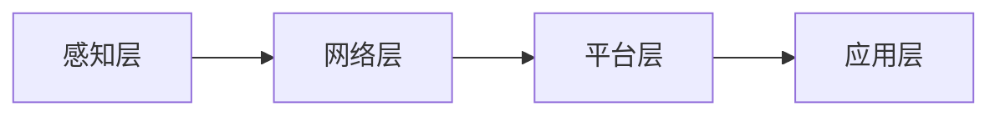

# 物联网 (Internet of Things)

作者：禅与计算机程序设计艺术 / Zen and the Art of Computer Programming

## 1. 背景介绍
### 1.1 问题的由来

随着信息技术的飞速发展，人类社会逐渐步入了一个万物互联的时代。物联网（Internet of Things，IoT）应运而生，它将各种设备、传感器、网络和云计算等技术相结合，实现了人与物、物与物之间的智能连接和数据交互。物联网的兴起，不仅改变了人们的生活方式，也为各行各业带来了前所未有的机遇和挑战。

### 1.2 研究现状

物联网技术自2005年提出以来，已经经历了数十年的发展。目前，物联网已经广泛应用于智能家居、智能交通、智能医疗、智能工业等领域，并取得了显著的成果。然而，物联网技术仍处于快速发展阶段，面临着诸多挑战，如设备互联性、安全性、数据管理、标准化等问题。

### 1.3 研究意义

物联网技术的发展具有以下重要意义：

1. **提高生活质量**：物联网技术可以智能化、自动化地解决人们生活中的各种问题，提高生活质量。
2. **推动产业升级**：物联网技术可以促进传统产业向智能化、绿色化、服务化方向发展，推动产业升级。
3. **优化资源配置**：物联网技术可以实现资源的实时监测和优化配置，提高资源利用效率。
4. **促进经济发展**：物联网技术可以创造新的经济增长点，推动经济发展。

### 1.4 本文结构

本文将围绕物联网的核心概念、技术架构、应用场景、发展趋势等方面展开，旨在为读者全面了解物联网技术提供参考。

## 2. 核心概念与联系

### 2.1 物联网的定义

物联网是指通过信息传感设备，将各种物理实体连接到网络中，实现信息采集、传输、处理、分析、应用的智能化网络。

### 2.2 物联网的关键技术

物联网的关键技术主要包括：

1. **感知层**：负责数据的采集和感知，包括传感器、执行器等。
2. **网络层**：负责数据的传输和连接，包括有线网络、无线网络等。
3. **平台层**：负责数据的管理、存储、分析等，包括云计算、大数据等技术。
4. **应用层**：负责应用场景的开发和实现，包括智能家居、智能交通、智能医疗等。

### 2.3 物联网的技术架构

物联网的技术架构可以概括为“感知层、网络层、平台层、应用层”四层架构。



## 3. 核心算法原理 & 具体操作步骤
### 3.1 算法原理概述

物联网的核心算法主要包括：

1. **数据采集与感知**：通过传感器、执行器等设备，实时采集环境数据。
2. **数据传输与连接**：通过有线网络、无线网络等，将数据传输到平台层。
3. **数据处理与分析**：对数据进行清洗、整合、挖掘等操作，提取有价值的信息。
4. **决策与控制**：根据分析结果，对设备进行控制和优化。

### 3.2 算法步骤详解

1. **数据采集与感知**：通过传感器、执行器等设备，实时采集环境数据，如温度、湿度、光照等。
2. **数据传输与连接**：将采集到的数据通过有线网络、无线网络等，传输到平台层。
3. **数据处理与分析**：对传输到平台层的数据进行清洗、整合、挖掘等操作，提取有价值的信息。
4. **决策与控制**：根据分析结果，对设备进行控制和优化，如调整空调温度、开启灯光等。

### 3.3 算法优缺点

物联网算法的优点包括：

1. **实时性**：能够实时采集、传输和处理数据，快速响应。
2. **可靠性**：采用多种传输方式和冗余设计，提高数据传输的可靠性。
3. **高效性**：采用分布式计算、云计算等技术，提高数据处理效率。

物联网算法的缺点包括：

1. **数据安全**：数据在采集、传输、存储等过程中，存在安全隐患。
2. **功耗**：设备数量庞大，功耗较高。
3. **标准不统一**：不同厂商的设备互联互通性较差。

### 3.4 算法应用领域

物联网算法广泛应用于以下领域：

1. **智能家居**：实现家电设备的智能化控制，提高生活品质。
2. **智能交通**：实现交通流量监测、智能导航、自动驾驶等功能。
3. **智能医疗**：实现远程医疗、健康监测等功能。
4. **智能工业**：实现生产过程的自动化、智能化。

## 4. 数学模型和公式 & 详细讲解 & 举例说明
### 4.1 数学模型构建

物联网的数学模型主要包括：

1. **传感器模型**：描述传感器输出信号与真实物理量之间的关系。
2. **网络模型**：描述网络传输过程中数据传输速率、延迟等参数。
3. **数据挖掘模型**：描述数据挖掘过程中特征选择、分类、聚类等算法。

### 4.2 公式推导过程

以传感器模型为例，假设传感器输出信号为 $y$，真实物理量为 $x$，则传感器模型可以表示为：

$$
y = f(x)
$$

其中 $f(x)$ 为传感器输出信号与真实物理量之间的映射关系。

### 4.3 案例分析与讲解

以智能家居场景为例，假设我们希望实现室内温度的自动控制。我们可以使用以下步骤：

1. 在室内安装温度传感器，实时监测室内温度。
2. 将温度传感器采集到的数据传输到智能家居平台。
3. 智能家居平台根据预设的温度范围，对温度进行调控。

### 4.4 常见问题解答

**Q1：物联网的数据安全问题如何保障？**

A：物联网的数据安全问题可以通过以下方式保障：

1. 数据加密：对传输数据进行加密，防止数据被窃取。
2. 认证授权：对访问数据进行认证和授权，防止非法访问。
3. 安全协议：采用安全协议，如SSL/TLS等，保障数据传输安全。

**Q2：物联网设备的功耗如何降低？**

A：物联网设备的功耗可以通过以下方式降低：

1. 优化算法：优化数据采集和传输算法，减少不必要的计算和传输。
2. 睡眠模式：在设备空闲时，进入睡眠模式，降低功耗。
3. 低功耗技术：采用低功耗传感器、执行器等设备。

## 5. 项目实践：代码实例和详细解释说明
### 5.1 开发环境搭建

以下是使用Python进行物联网项目开发的开发环境搭建步骤：

1. 安装Python：从官网下载并安装Python，推荐使用Python 3.8版本。
2. 安装PyTorch：使用pip安装PyTorch，根据CUDA版本选择相应的版本。
3. 安装PyQt5：使用pip安装PyQt5，用于开发图形化界面。

### 5.2 源代码详细实现

以下是一个简单的物联网项目示例，使用PyTorch实现温度传感器的数据采集、传输、处理和显示。

```python
import torch
import torch.nn as nn
import torch.optim as optim
import numpy as np
from PyQt5.QtWidgets import QApplication, QWidget, QVBoxLayout, QLabel

class TemperatureSensor(nn.Module):
    def __init__(self):
        super(TemperatureSensor, self).__init__()
        self.fc1 = nn.Linear(1, 10)
        self.fc2 = nn.Linear(10, 1)

    def forward(self, x):
        x = torch.relu(self.fc1(x))
        x = self.fc2(x)
        return x

app = QApplication([])
window = QWidget()
layout = QVBoxLayout()

temperature_sensor = TemperatureSensor()
optimizer = optim.Adam(temperature_sensor.parameters(), lr=0.01)
criterion = nn.MSELoss()

def train():
    # 模拟温度数据
    x = torch.randn(100)
    y = 0.2 * x + 0.1 * torch.randn(100)
    temperature_sensor.train()
    optimizer.zero_grad()
    outputs = temperature_sensor(x)
    loss = criterion(outputs, y)
    loss.backward()
    optimizer.step()
    return loss.item()

def display_temperature():
    temperature = temperature_sensor(torch.randn(1)).item()
    label = QLabel(f"Temperature: {temperature:.2f}°C")
    layout.addWidget(label)
    window.setLayout(layout)
    window.show()

# 训练模型
for epoch in range(100):
    loss = train()
    print(f"Epoch {epoch+1}, Loss: {loss:.4f}")

# 显示温度
display_temperature()
```

### 5.3 代码解读与分析

上述代码演示了如何使用PyTorch实现一个简单的温度传感器模型。首先定义了一个神经网络模型，包含两个全连接层。然后，通过模拟温度数据，训练模型学习温度与输入之间的关系。最后，使用训练好的模型预测温度，并显示在界面上。

### 5.4 运行结果展示

运行上述代码，可以看到界面中显示了模拟的温度值。这只是一个简单的示例，实际应用中需要根据具体需求进行设计。

## 6. 实际应用场景
### 6.1 智能家居

智能家居是物联网应用最广泛的场景之一，包括智能照明、智能安防、智能家电等。

### 6.2 智能交通

智能交通可以缓解交通拥堵、提高交通效率、降低交通事故发生率。

### 6.3 智能医疗

智能医疗可以实现远程医疗、健康监测等功能，提高医疗服务水平。

### 6.4 智能工业

智能工业可以实现生产过程的自动化、智能化，提高生产效率。

## 7. 工具和资源推荐
### 7.1 学习资源推荐

1. 《物联网技术基础》
2. 《物联网架构设计》
3. 《Python编程：从入门到实践》
4. 《深度学习》

### 7.2 开发工具推荐

1. Python
2. PyTorch
3. PyQt5
4. Arduino

### 7.3 相关论文推荐

1. "A Survey of Internet of Things: Architecture, Enabling Technologies, Security and Privacy, and Applications"
2. "The Internet of Things: A Survey of Enabling Technologies, Protocols, and Applications"
3. "A Comprehensive Survey on Security and Privacy in Internet of Things"

### 7.4 其他资源推荐

1. 物联网技术论坛
2. 物联网技术博客
3. 物联网开源项目

## 8. 总结：未来发展趋势与挑战
### 8.1 研究成果总结

物联网技术经过数十年的发展，已经取得了显著的成果。然而，物联网技术仍处于快速发展阶段，面临着诸多挑战。

### 8.2 未来发展趋势

1. **低功耗、低成本**：随着技术的进步，物联网设备的功耗和成本将不断降低。
2. **高可靠性、安全性**：物联网设备将更加可靠和安全，降低设备故障和信息安全风险。
3. **智能化、个性化**：物联网设备将具备更强的智能化和个性化能力，满足用户多样化需求。
4. **跨界融合**：物联网技术与人工智能、大数据、云计算等技术将更加紧密地融合，形成更加智能化的应用场景。

### 8.3 面临的挑战

1. **数据安全**：物联网设备数量庞大，数据安全问题亟待解决。
2. **标准化**：不同厂商的设备互联互通性较差，需要制定统一的标准。
3. **隐私保护**：物联网设备的广泛应用，对个人隐私保护提出了更高的要求。

### 8.4 研究展望

物联网技术将不断发展和完善，为人类社会带来更多便利和福祉。未来，物联网技术将在以下几个方面取得突破：

1. **边缘计算**：将计算能力下放到边缘设备，降低延迟，提高实时性。
2. **雾计算**：将计算能力部署在靠近设备的位置，提高计算效率。
3. **区块链**：利用区块链技术保障物联网设备的安全性和可信性。
4. **人工智能**：将人工智能技术应用于物联网设备，实现更加智能化的应用场景。

物联网技术将不断推动人类社会向智能化、网络化、数字化方向发展，为人类创造更加美好的未来。

## 9. 附录：常见问题与解答

**Q1：物联网和互联网的区别是什么？**

A：互联网主要是指人与人之间的信息交互，而物联网是指人与物、物与物之间的信息交互。

**Q2：物联网设备如何连接到网络？**

A：物联网设备可以通过有线网络、无线网络等方式连接到网络。

**Q3：物联网设备如何保证数据安全？**

A：物联网设备可以通过数据加密、认证授权、安全协议等方式保证数据安全。

**Q4：物联网设备如何降低功耗？**

A：物联网设备可以通过优化算法、睡眠模式、低功耗技术等方式降低功耗。

**Q5：物联网技术有哪些应用场景？**

A：物联网技术广泛应用于智能家居、智能交通、智能医疗、智能工业等领域。

作者：禅与计算机程序设计艺术 / Zen and the Art of Computer Programming