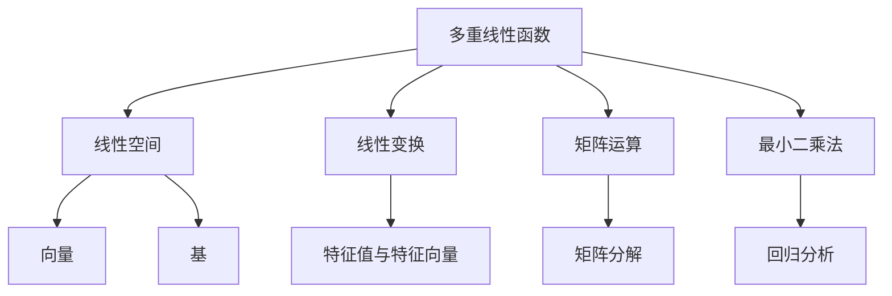

# 线性代数导引：多重线性函数

## 1. 背景介绍

### 1.1 问题的由来

在现代数据科学和机器学习领域中,线性代数扮演着至关重要的角色。作为数学的一个基础分支,线性代数为我们提供了研究和分析多元数据的强大工具。其中,多重线性函数(Multiple Linear Functions)是线性代数中一个核心概念,广泛应用于回归分析、优化理论、信号处理等诸多领域。

多重线性函数可以看作是一个将多个自变量映射到一个因变量的数学模型。它是单变量线性函数的自然推广,能够捕捉多个自变量对因变量的综合影响。在实际应用中,我们经常需要研究多个自变量对某一目标变量的影响,这就需要利用多重线性函数来建模和分析。

### 1.2 研究现状

多重线性函数的研究可以追溯到19世纪初,当时科学家们开始尝试用线性方程组来描述和解释一些自然现象。随着时间的推移,线性代数理论不断发展和完善,多重线性函数的概念也日益成熟。

在20世纪初,多重线性函数开始被广泛应用于统计学领域,用于回归分析和数据拟合。随后,它在优化理论、信号处理、机器学习等领域也获得了广泛的应用。近年来,随着大数据时代的到来,多重线性函数在数据挖掘、模式识别等领域也扮演着越来越重要的角色。

### 1.3 研究意义

研究多重线性函数具有重要的理论意义和实际应用价值:

1. **理论意义**:多重线性函数是线性代数的核心概念之一,深入研究它有助于我们更好地理解线性空间、线性变换等抽象概念,丰富和完善线性代数理论体系。

2. **实际应用价值**:多重线性函数在许多领域都有广泛的应用,如回归分析、优化理论、信号处理、机器学习等。掌握多重线性函数有助于我们更好地建模和分析复杂的实际问题。

3. **交叉学科意义**:多重线性函数是数学、统计学、计算机科学等多个学科交叉的纽带,研究它有助于促进不同学科之间的交流和融合,推动学科发展。

### 1.4 本文结构

本文将全面介绍多重线性函数的相关理论和应用。我们将从以下几个方面展开讨论:

1. 核心概念与联系
2. 核心算法原理与具体操作步骤
3. 数学模型和公式的详细讲解与案例分析
4. 项目实践:代码实例和详细解释说明
5. 实际应用场景
6. 工具和资源推荐
7. 未来发展趋势与挑战
8. 常见问题与解答

接下来,我们将逐一深入探讨上述内容。

## 2. 核心概念与联系

多重线性函数是线性代数中的一个核心概念,它与线性空间、线性变换、矩阵运算、最小二乘法等概念密切相关。

1. **线性空间**:多重线性函数定义在线性空间上,它将一个线性空间映射到另一个线性空间。线性空间是由向量和标量组成的集合,满足一些代数运算规则。

2. **线性变换**:多重线性函数实际上是一种特殊的线性变换。线性变换是一种将一个线性空间映射到另一个线性空间的函数,它保持线性运算的性质。

3. **矩阵运算**:多重线性函数可以用矩阵乘法来表示,因此与矩阵运算密切相关。矩阵运算为我们提供了一种紧凑和高效的方式来表示和计算多重线性函数。

4. **最小二乘法**:在实际应用中,我们经常需要根据观测数据来拟合多重线性函数,这就需要利用最小二乘法来求解参数。最小二乘法是一种常用的参数估计方法,它可以找到使残差平方和最小的参数估计值。

5. **回归分析**:多重线性函数在回归分析中扮演着核心角色。回归分析旨在研究一个或多个自变量对因变量的影响,多重线性函数可以用来建立自变量和因变量之间的数学模型。

综上所述,多重线性函数与线性代数的许多核心概念密切相关,理解这些概念之间的联系有助于我们更好地掌握和应用多重线性函数。

## 3. 核心算法原理与具体操作步骤

### 3.1 算法原理概述

多重线性函数的核心算法原理是基于最小二乘法(Least Squares Method)。最小二乘法是一种数学优化技术,它通过最小化预测值和观测值之间的残差平方和,来寻找最佳拟合的函数参数。

对于一个多重线性函数:

$$y = \beta_0 + \beta_1x_1 + \beta_2x_2 + \cdots + \beta_nx_n$$

其中$y$是因变量,$(x_1, x_2, \cdots, x_n)$是自变量,而$(\beta_0, \beta_1, \cdots, \beta_n)$是待估计的参数。

我们有一组观测数据$(x_1^{(i)}, x_2^{(i)}, \cdots, x_n^{(i)}, y^{(i)})$,其中$i=1,2,\cdots,m$表示第$i$个观测样本。目标是找到一组参数$(\beta_0, \beta_1, \cdots, \beta_n)$,使得预测值$\hat{y}^{(i)}$和观测值$y^{(i)}$之间的残差平方和最小,即:

$$\min_{\beta_0,\beta_1,\cdots,\beta_n} \sum_{i=1}^{m}(y^{(i)} - \hat{y}^{(i)})^2 = \min_{\beta_0,\beta_1,\cdots,\beta_n} \sum_{i=1}^{m}(y^{(i)} - (\beta_0 + \beta_1x_1^{(i)} + \cdots + \beta_nx_n^{(i)}))^2$$

这就是最小二乘法的核心思想。通过求解这个优化问题,我们可以获得最佳拟合的参数估计值$(\hat{\beta}_0, \hat{\beta}_1, \cdots, \hat{\beta}_n)$。

### 3.2 算法步骤详解

求解多重线性函数的参数估计值可以分为以下几个步骤:

1. **构建设计矩阵**:首先,我们需要构建一个设计矩阵$X$,它是一个$m \times (n+1)$的矩阵,其中每一行对应一个观测样本,列分别对应常数项和各个自变量。具体来说,设计矩阵$X$的结构如下:

$$X = \begin{bmatrix}
1 & x_1^{(1)} & x_2^{(1)} & \cdots & x_n^{(1)}\\
1 & x_1^{(2)} & x_2^{(2)} & \cdots & x_n^{(2)}\\
\vdots & \vdots & \vdots & \ddots & \vdots\\
1 & x_1^{(m)} & x_2^{(m)} & \cdots & x_n^{(m)}
\end{bmatrix}$$

2. **构建观测向量**:我们还需要构建一个观测向量$y$,它是一个$m \times 1$的列向量,每一个元素对应一个观测样本的因变量值,即:

$$y = \begin{bmatrix}
y^{(1)}\\
y^{(2)}\\
\vdots\\
y^{(m)}
\end{bmatrix}$$

3. **求解正规方程**:接下来,我们需要求解以下正规方程(Normal Equations):

$$X^TXβ = X^Ty$$

其中$β$是一个$(n+1) \times 1$的列向量,表示待估计的参数:

$$β = \begin{bmatrix}
\beta_0\\
\beta_1\\
\vdots\\
\beta_n
\end{bmatrix}$$

这个正规方程可以通过线性代数的方法解出$β$的解析解。

4. **获取参数估计值**:解出$β$之后,我们就获得了多重线性函数的参数估计值$(\hat{\beta}_0, \hat{\beta}_1, \cdots, \hat{\beta}_n)$。

5. **构建拟合函数**:最后,我们可以使用这些参数估计值构建出最终的多重线性函数:

$$\hat{y} = \hat{\beta}_0 + \hat{\beta}_1x_1 + \hat{\beta}_2x_2 + \cdots + \hat{\beta}_nx_n$$

这个函数就是最佳拟合的多重线性函数模型。

需要注意的是,在实际应用中,我们还需要进行一些额外的步骤,如特征缩放、正则化等,以提高模型的鲁棒性和泛化能力。此外,我们还需要对模型进行评估和诊断,以检验其有效性和可靠性。

### 3.3 算法优缺点

多重线性函数算法具有以下优点:

1. **简单易懂**:算法原理基于最小二乘法,思路清晰,易于理解和实现。
2. **计算高效**:通过线性代数的方法,我们可以直接求解正规方程,获得解析解,计算效率较高。
3. **广泛应用**:多重线性函数在许多领域都有广泛的应用,如回归分析、优化理论、信号处理等。

但是,该算法也存在一些缺点:

1. **线性假设**:多重线性函数假设自变量和因变量之间存在线性关系,但在实际情况中,这种假设可能不总是成立。
2. **多重共线性**:如果自变量之间存在较强的相关性(多重共线性),会导致参数估计值不稳定,甚至无法求解。
3. **异常值敏感**:最小二乘法对异常值非常敏感,存在异常值会严重影响参数估计的准确性。
4. **维数灾难**:当自变量的数量较大时,模型的复杂度会急剧增加,导致过拟合和计算效率降低。

因此,在实际应用中,我们需要根据具体问题的特点,合理选择和调整算法参数,并结合其他技术(如正则化、特征选择等)来提高模型的性能和鲁棒性。

### 3.4 算法应用领域

多重线性函数算法在以下领域有广泛的应用:

1. **回归分析**:多重线性函数是回归分析中最常用的模型之一,可以用于研究多个自变量对因变量的影响。
2. **优化理论**:在优化理论中,多重线性函数可以用于建立目标函数,并通过求解参数来寻找最优解。
3. **信号处理**:在信号处理领域,多重线性函数可以用于滤波、去噪、特征提取等任务。
4. **机器学习**:多重线性函数是机器学习中最基础的模型之一,常作为基线模型或者作为更复杂模型的一部分。
5. **金融分析**:在金融领域,多重线性函数可以用于建模股票价格、利率等金融指标,并进行预测和分析。
6. **生物统计学**:在生物统计学中,多重线性函数可以用于分析基因表达数据、蛋白质数据等,探索不同因素对生物过程的影响。

总的来说,多重线性函数算法由于其简单性和通用性,在许多领域都有广泛的应用前景。

## 4. 数学模型和公式详细讲解与举例说明

### 4.1 数学模型构建

多重线性函数的数学模型可以表示为:

$$y = \beta_0 + \beta_1x_1 + \beta_2x_2 + \cdots + \beta_nx_n + \epsilon$$

其中:

- $y$是因变量(响应变量)
- $x_1, x_2, \cdots, x_n$是自变量(预测变量)
- $\beta_0, \beta_1, \cdots, \beta_n$是待估计的参数
- $\epsilon$是随机误差项,服从均值为0、方差为$\sigma