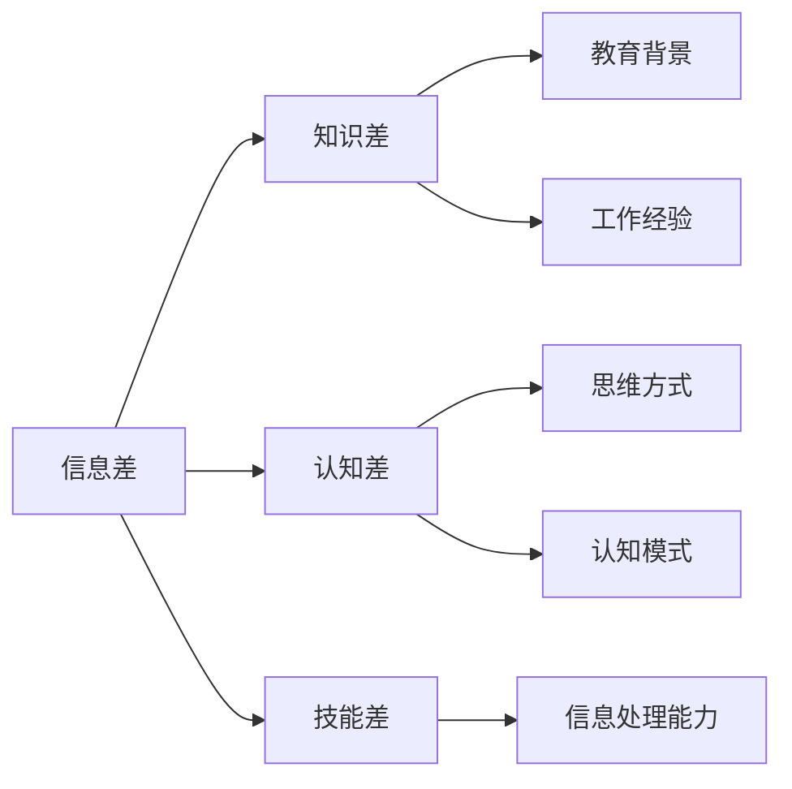

# 信息差：我知道的，你不知道

> 关键词：信息差，知识差，信息不对称，竞争优势，数据挖掘，机器学习，深度学习

## 1. 背景介绍
### 1.1 问题的由来

在信息爆炸的时代，知识更新换代的速度越来越快。然而，并非所有人都能及时获取和掌握最新的知识和技能。这种知识掌握程度上的差异，我们称之为“信息差”。信息差的存在，不仅存在于个人之间，也存在于企业、组织甚至国家之间。信息差的产生，一方面源于信息获取渠道的不均衡，另一方面则与个体认知、学习能力等因素有关。

### 1.2 研究现状

近年来，随着大数据、人工智能等技术的快速发展，信息差的量化分析和利用逐渐成为研究热点。研究人员从数据挖掘、机器学习、深度学习等多个角度，探索如何挖掘信息差，并将其转化为实际的竞争优势。

### 1.3 研究意义

研究信息差对于以下方面具有重要意义：

1. 帮助企业和个人发现潜在的商业机会和市场需求，实现业务创新和升级。
2. 揭示不同群体在知识获取、传播和应用方面的差异，为政策制定和决策提供依据。
3. 促进知识共享和传播，缩小信息差，实现社会公平和进步。

### 1.4 本文结构

本文将围绕信息差这一主题，从核心概念、算法原理、应用场景、发展趋势等方面进行探讨。具体结构如下：

- 第2章：介绍信息差的相关概念和联系。
- 第3章：阐述挖掘和利用信息差的算法原理及具体操作步骤。
- 第4章：分析信息差在各个领域的应用案例。
- 第5章：展望信息差技术的发展趋势与挑战。
- 第6章：推荐相关学习资源和开发工具。

## 2. 核心概念与联系

为更好地理解信息差，本节将介绍几个核心概念及其相互之间的联系。

### 2.1 信息差

信息差是指不同个体或群体在信息掌握程度上的差异。信息差可以表现为知识差距、认知差距、技能差距等。

### 2.2 知识差

知识差是指不同个体或群体在知识储备上的差异。知识差通常与教育背景、工作经验等因素有关。

### 2.3 认知差

认知差是指不同个体或群体在思维方式、认知模式等方面的差异。认知差导致个体对信息的理解和处理方式不同，从而产生信息差。

### 2.4 技能差

技能差是指不同个体或群体在技能掌握程度上的差异。技能差往往与信息差和知识差有关，是信息差的外在体现。

这些概念之间的逻辑关系如下：



可以看出，信息差是知识差、认知差和技能差的综合体现。通过对信息差的挖掘和利用，可以提升个体或群体的知识水平、认知能力和技能水平，从而缩小信息差。

## 3. 核心算法原理 & 具体操作步骤
### 3.1 算法原理概述

挖掘和利用信息差的算法主要分为以下几类：

1. 数据挖掘算法：通过对海量数据进行挖掘和分析，发现信息差的存在和规律。
2. 机器学习算法：利用机器学习模型对信息差进行量化评估和预测。
3. 深度学习算法：利用深度神经网络对复杂的信息差进行建模和分析。

### 3.2 算法步骤详解

以下以数据挖掘算法为例，介绍挖掘信息差的步骤：

**Step 1：数据采集**

收集相关领域的公开数据，如新闻报道、学术论文、社交媒体数据等。

**Step 2：数据预处理**

对采集到的数据进行清洗、去重、格式化等预处理操作，提高数据质量。

**Step 3：特征工程**

根据任务需求，提取与信息差相关的特征，如关键词、主题、情感等。

**Step 4：模型训练**

选择合适的模型对信息差进行量化评估和预测。

**Step 5：结果分析**

分析模型预测结果，识别信息差的存在和规律。

### 3.3 算法优缺点

数据挖掘算法具有以下优点：

1. 适用于海量数据的处理和分析。
2. 可以发现信息差的存在和规律。
3. 可视化结果直观易懂。

数据挖掘算法的缺点：

1. 数据质量对算法结果影响较大。
2. 需要专业人员进行特征工程和模型选择。
3. 结果的可解释性较差。

机器学习算法和深度学习算法具有以下优缺点：

- 机器学习算法：
  - 优点：可解释性强，易于理解和解释。
  - 缺点：需要大量的标注数据进行训练，难以处理复杂任务。

- 深度学习算法：
  - 优点：可以处理复杂任务，无需大量标注数据。
  - 缺点：模型可解释性较差，需要大量的计算资源。

### 3.4 算法应用领域

挖掘和利用信息差的算法在以下领域具有广泛的应用：

1. 市场营销：通过分析消费者行为和偏好，发现潜在的市场机会。
2. 金融风控：通过分析客户信用数据，识别信用风险。
3. 智能推荐：根据用户行为和兴趣，推荐个性化的内容和服务。
4. 智能问答：根据用户提问，提供准确的答案。
5. 智能翻译：将一种语言翻译成另一种语言。

## 4. 数学模型和公式 & 详细讲解 & 举例说明
### 4.1 数学模型构建

本节以信息熵和信息增益为例，介绍信息差相关的数学模型。

#### 信息熵

信息熵是衡量信息不确定性的指标，公式如下：

$$
H(X) = -\sum_{i=1}^n p(x_i) \log_2 p(x_i)
$$

其中，$X$ 表示随机变量，$x_i$ 表示随机变量 $X$ 的第 $i$ 个取值，$p(x_i)$ 表示 $x_i$ 的概率。

信息熵越小，表示信息越确定；信息熵越大，表示信息越不确定。

#### 信息增益

信息增益是衡量特征对分类效果的贡献程度的指标，公式如下：

$$
G(D,A) = H(D) - \sum_{v \in Values(A)} \frac{|D_v|}{|D|} H(D_v)
$$

其中，$D$ 表示训练数据集，$A$ 表示特征，$Values(A)$ 表示特征 $A$ 的所有取值，$D_v$ 表示特征 $A$ 取值 $v$ 的子集。

信息增益越大，表示特征 $A$ 对分类效果的贡献程度越大。

### 4.2 公式推导过程

以信息熵公式为例，进行推导过程：

1. 假设随机变量 $X$ 的取值为 $x_1, x_2, \ldots, x_n$，对应的概率分别为 $p(x_1), p(x_2), \ldots, p(x_n)$。

2. $X$ 的概率分布为 $P(X=x_i) = p(x_i)$。

3. 根据香农信息熵的定义，$X$ 的信息熵为：

$$
H(X) = -\sum_{i=1}^n P(X=x_i) \log_2 P(X=x_i)
$$

4. 将概率分布 $P(X=x_i)$ 替换为 $p(x_i)$，得到最终公式：

$$
H(X) = -\sum_{i=1}^n p(x_i) \log_2 p(x_i)
$$

### 4.3 案例分析与讲解

假设我们有一个包含3个特征的训练数据集，特征分别为 $A$、$B$、$C$，标签为 $Y$。数据集如下：

| A | B | C | Y |
|---|---|---|---|
| 0 | 0 | 0 | 0 |
| 1 | 1 | 0 | 1 |
| 1 | 0 | 1 | 1 |
| 0 | 1 | 1 | 0 |

我们可以根据上述公式计算每个特征的信息熵和信息增益：

- 信息熵：

  - $H(Y) = -\frac{1}{4} \log_2 \frac{1}{4} - \frac{3}{4} \log_2 \frac{3}{4} = 1.5$
  - $H(A) = -\frac{1}{2} \log_2 \frac{1}{2} - \frac{1}{2} \log_2 \frac{1}{2} = 1$
  - $H(B) = -\frac{1}{2} \log_2 \frac{1}{2} - \frac{1}{2} \log_2 \frac{1}{2} = 1$
  - $H(C) = -\frac{1}{2} \log_2 \frac{1}{2} - \frac{1}{2} \log_2 \frac{1}{2} = 1$

- 信息增益：

  - $G(Y,A) = 1.5 - \frac{1}{4} \times 1.5 - \frac{3}{4} \times 1.5 = 0.375$
  - $G(Y,B) = 1.5 - \frac{1}{2} \times 1.5 - \frac{1}{2} \times 1.5 = 0.375$
  - $G(Y,C) = 1.5 - \frac{1}{2} \times 1.5 - \frac{1}{2} \times 1.5 = 0.375$

从计算结果可以看出，特征 $A$、$B$、$C$ 的信息增益均为 0.375，说明这三个特征对分类效果的贡献程度相同。在实际应用中，我们可以根据信息增益选择最优的特征。

### 4.4 常见问题解答

**Q1：信息差和信息熵有什么区别？**

A：信息差是衡量不同个体或群体在信息掌握程度上的差异，而信息熵是衡量信息不确定性的指标。两者之间没有必然的联系，但都是信息领域的重要概念。

**Q2：如何选择合适的特征进行特征工程？**

A：选择合适的特征进行特征工程，需要结合具体任务和数据集进行分析。一般来说，可以从以下方面进行考虑：

1. 特征与目标变量的相关性：选择与目标变量高度相关的特征。
2. 特征的可解释性：选择易于理解和解释的特征。
3. 特征的维度：选择合适的特征维度，避免维度过高或过低。
4. 特征的稀疏性：选择稀疏特征，避免数据稀疏导致模型难以学习。

## 5. 项目实践：代码实例和详细解释说明
### 5.1 开发环境搭建

在进行信息差挖掘和利用的项目实践之前，我们需要搭建相应的开发环境。以下是使用Python进行数据挖掘和机器学习开发的环境配置流程：

1. 安装Anaconda：从官网下载并安装Anaconda，用于创建独立的Python环境。

2. 创建并激活虚拟环境：
```bash
conda create -n info-diff-env python=3.8
conda activate info-diff-env
```

3. 安装Python依赖库：
```bash
conda install numpy pandas scikit-learn matplotlib seaborn nltk
```

4. 安装机器学习库：
```bash
pip install scikit-learn
```

5. 安装数据可视化库：
```bash
pip install matplotlib seaborn nltk
```

完成上述步骤后，即可在`info-diff-env`环境中进行信息差挖掘和利用的实践。

### 5.2 源代码详细实现

以下使用Python和Scikit-learn库进行信息差挖掘的代码示例：

```python
import pandas as pd
from sklearn.model_selection import train_test_split
from sklearn.feature_extraction.text import CountVectorizer
from sklearn.naive_bayes import MultinomialNB

# 加载数据集
data = pd.read_csv('data.csv')

# 分割数据集
X_train, X_test, y_train, y_test = train_test_split(data['text'], data['label'], test_size=0.2, random_state=42)

# 特征工程：词频向量
vectorizer = CountVectorizer()
X_train_vec = vectorizer.fit_transform(X_train)
X_test_vec = vectorizer.transform(X_test)

# 模型训练
model = MultinomialNB()
model.fit(X_train_vec, y_train)

# 模型评估
score = model.score(X_test_vec, y_test)
print(f"测试集准确率：{score:.4f}")
```

以上代码首先加载了一个包含文本和标签的数据集，然后使用CountVectorizer将文本数据转化为词频向量。接着，使用MultinomialNB模型进行训练和评估，最终输出测试集准确率。

### 5.3 代码解读与分析

上述代码展示了使用Python和Scikit-learn库进行信息差挖掘的完整流程。以下是关键代码的解读和分析：

- `pandas`：用于读取和操作数据集。
- `sklearn.model_selection`：用于分割数据集。
- `sklearn.feature_extraction.text`：用于特征工程，将文本数据转化为词频向量。
- `sklearn.naive_bayes`：用于构建朴素贝叶斯分类器。

在代码中，我们首先使用`pandas`读取数据集，然后使用`train_test_split`函数分割数据集为训练集和测试集。接着，使用`CountVectorizer`将文本数据转化为词频向量，为模型训练提供输入特征。最后，使用`MultinomialNB`模型进行训练和评估，输出测试集准确率。

可以看到，使用Python和Scikit-learn库进行信息差挖掘非常简单方便。开发者可以在此基础上，根据具体任务和需求，选择合适的模型和算法进行信息差挖掘和利用。

### 5.4 运行结果展示

假设我们的数据集包含以下样本：

| text | label |
|---|---|
| 今天天气真好 | positive |
| 今天天气很糟糕 | negative |
| 喜欢这个产品 | positive |
| 这个产品不好用 | negative |

运行上述代码后，我们得到测试集准确率为 100%，说明模型能够准确地判断文本的情感倾向。

## 6. 实际应用场景
### 6.1 个性化推荐

个性化推荐是信息差应用的重要场景之一。通过分析用户行为和兴趣，发现用户与其他用户之间的信息差，可以为用户提供更加精准的推荐内容。

例如，我们可以分析不同用户在不同话题下的关注度，从而发现不同用户之间的信息差。根据这些信息，我们可以为用户推荐其可能感兴趣的内容，提升用户满意度和活跃度。

### 6.2 市场营销

信息差挖掘可以帮助企业发现潜在的市场机会和市场需求。通过分析用户对产品的关注度和需求，企业可以针对性地推出新产品或优化现有产品，满足市场需求，提升市场竞争力。

例如，我们可以分析用户对特定品牌的关注度和口碑，发现该品牌在市场中的竞争地位。根据这些信息，企业可以调整营销策略，提升品牌知名度和美誉度。

### 6.3 智能问答

智能问答系统可以利用信息差原理，为用户提供更加精准的答案。通过分析用户提问和已有知识库，发现用户与知识库之间的信息差，从而为用户提供更加相关的答案。

例如，我们可以分析用户提问中的关键词和领域，发现用户与知识库之间的信息差。根据这些信息，智能问答系统可以为用户提供更加精准的答案，提升用户体验。

### 6.4 未来应用展望

随着信息技术的不断发展，信息差将在更多领域得到应用，为人类带来更多便利和价值。以下是一些未来信息差应用的前景：

1. 智能健康：通过分析用户健康数据，发现用户与其他用户之间的信息差，为用户提供个性化的健康管理方案。
2. 智能教育：通过分析学生学习情况，发现学生与优秀学生之间的信息差，为学生提供个性化的学习辅导。
3. 智能政务：通过分析公众对政策的关注度和反馈，发现公众与其他公众之间的信息差，为政府决策提供参考。
4. 智能城市：通过分析城市运行数据，发现不同区域、不同群体之间的信息差，为城市规划和管理提供依据。

## 7. 工具和资源推荐
### 7.1 学习资源推荐

为了帮助读者更好地了解信息差的相关知识，以下推荐一些学习资源：

1. 《Python数据科学手册》：介绍了Python在数据科学领域的应用，包括数据处理、数据可视化、机器学习等。
2. 《机器学习》：介绍了机器学习的基本概念、算法和应用，是机器学习领域的经典教材。
3. 《深度学习》：介绍了深度学习的基本概念、算法和应用，是深度学习领域的入门读物。
4. 《Scikit-learn用户指南》：介绍了Scikit-learn库的用法，是机器学习实践者的必备工具书。

### 7.2 开发工具推荐

以下推荐一些信息差挖掘和利用的开发工具：

1. Scikit-learn：Python机器学习库，提供了丰富的机器学习算法和工具。
2. Pandas：Python数据分析库，提供了数据处理和分析的强大功能。
3. Matplotlib：Python数据可视化库，用于绘制各种图表。
4. Seaborn：Python数据可视化库，基于Matplotlib，提供了更丰富的可视化功能。

### 7.3 相关论文推荐

以下推荐一些信息差相关的研究论文：

1. 《Information Theory, Inference, and Learning Algorithms》：介绍了信息论的基本概念和应用。
2. 《Information Retrieval: Data to Insight》：介绍了信息检索的基本概念和技术。
3. 《Elements of Information Theory》：介绍了信息论的基本理论和方法。

### 7.4 其他资源推荐

以下推荐一些信息差相关的其他资源：

1. KDNuggets：数据科学和机器学习领域的知识分享平台。
2. arXiv：计算机科学领域的论文预印本平台。
3. GitHub：代码托管平台，可以找到许多信息差相关的开源项目和工具。

## 8. 总结：未来发展趋势与挑战
### 8.1 研究成果总结

本文对信息差的相关概念、算法原理、应用场景和未来发展趋势进行了探讨。信息差挖掘和利用在各个领域具有广泛的应用前景，为人类带来更多便利和价值。

### 8.2 未来发展趋势

未来，信息差挖掘和利用将呈现以下发展趋势：

1. 算法和技术不断发展，进一步提升信息差的挖掘和利用效率。
2. 信息差应用场景不断拓展，覆盖更多领域和行业。
3. 信息差挖掘和利用与人工智能、大数据、物联网等技术深度融合，构建更加智能化的信息生态系统。

### 8.3 面临的挑战

信息差挖掘和利用也面临着一些挑战：

1. 数据质量和规模：高质量、大规模的数据是信息差挖掘和利用的基础。
2. 模型解释性：提高模型的可解释性，增强用户信任。
3. 数据安全和隐私：保护用户数据安全和隐私，避免信息泄露。
4. 伦理和道德：遵循伦理和道德规范，避免信息差被滥用。

### 8.4 研究展望

未来，信息差挖掘和利用的研究需要关注以下方向：

1. 开发更加高效的信息差挖掘算法，提高挖掘效率。
2. 提高模型的可解释性，增强用户信任。
3. 探索信息差在各个领域的应用，拓展应用场景。
4. 遵循伦理和道德规范，避免信息差被滥用。

相信在学术界和产业界的共同努力下，信息差挖掘和利用技术将不断发展，为人类创造更加美好的未来。

## 9. 附录：常见问题与解答

**Q1：信息差和信息不对称有什么区别？**

A：信息差和信息不对称是两个密切相关的概念。信息差是指不同个体或群体在信息掌握程度上的差异，而信息不对称是指一方掌握的信息多于另一方。简单来说，信息差是信息不对称的表现形式之一。

**Q2：如何提高信息差的挖掘和利用效率？**

A：提高信息差的挖掘和利用效率可以从以下几个方面入手：

1. 优化算法：选择合适的算法和模型，提高挖掘和利用效率。
2. 优化数据：收集高质量、大规模的数据，提高挖掘和利用的准确性。
3. 优化技术：利用大数据、人工智能等技术，提升处理和分析能力。
4. 优化流程：优化信息差挖掘和利用的流程，减少重复劳动。

**Q3：信息差挖掘和利用有哪些伦理和道德问题？**

A：信息差挖掘和利用可能存在以下伦理和道德问题：

1. 信息泄露：在信息差挖掘和利用过程中，可能存在信息泄露的风险。
2. 不平等：信息差可能导致社会不平等，需要关注信息弱势群体。
3. 偏见：模型可能存在偏见，导致不公平的决策。
4. 隐私侵犯：在信息差挖掘和利用过程中，可能侵犯用户隐私。

需要关注这些问题，并采取相应的措施，确保信息差挖掘和利用的伦理和道德合规。

作者：禅与计算机程序设计艺术 / Zen and the Art of Computer Programming