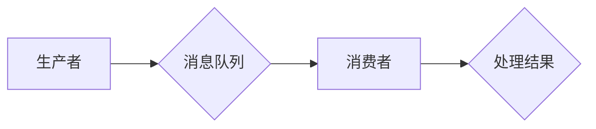

# 消息队列 原理与代码实例讲解

作者：禅与计算机程序设计艺术 / Zen and the Art of Computer Programming

## 1. 背景介绍
### 1.1 问题的由来

随着互联网技术的飞速发展，分布式系统和微服务架构逐渐成为主流。在分布式系统中，消息队列作为一种异步通信机制，发挥着至关重要的作用。它能够解耦系统组件，提高系统的可扩展性、可用性和可靠性。本篇文章将深入探讨消息队列的原理、架构和代码实例，帮助读者全面了解并掌握这一关键技术。

### 1.2 研究现状

目前，消息队列技术已经发展得相当成熟，国内外涌现出了许多优秀的消息队列产品，如RabbitMQ、Kafka、ActiveMQ等。这些产品在性能、功能、可扩展性等方面各有特点，广泛应用于金融、电商、物流、社交等各个领域。

### 1.3 研究意义

学习消息队列技术对于开发者和架构师来说具有重要意义。它能够帮助开发者：

1. **解耦系统组件**：通过异步通信，降低系统组件间的耦合度，提高系统的可维护性和可扩展性。
2. **提高系统性能**：利用消息队列异步处理消息，减轻系统压力，提高系统吞吐量。
3. **提高系统可靠性**：消息队列提供消息持久化、消息重试等功能，保证消息可靠传输。
4. **实现分布式事务**：结合分布式事务框架，实现跨服务的事务一致性。

### 1.4 本文结构

本文将从以下几个方面展开：

1. **核心概念与联系**：介绍消息队列的基本概念，如消息、队列、消费者等，并阐述它们之间的关系。
2. **核心算法原理 & 具体操作步骤**：深入分析消息队列的内部工作原理，包括消息的发送、存储、消费等过程。
3. **数学模型和公式 & 详细讲解 & 举例说明**：从数学角度分析消息队列的性能指标，并给出相关公式和实例。
4. **项目实践：代码实例和详细解释说明**：以Kafka为例，展示如何使用Python进行消息队列的开发和应用。
5. **实际应用场景**：探讨消息队列在不同领域的应用案例，如分布式事务、异步处理、负载均衡等。
6. **工具和资源推荐**：推荐学习资源、开发工具和相关论文，帮助读者进一步深入学习。
7. **总结：未来发展趋势与挑战**：总结全文内容，展望消息队列技术的未来发展趋势和面临的挑战。

## 2. 核心概念与联系
### 2.1 消息

消息是消息队列的基本单元，包含数据内容和相关元信息。消息通常由以下几个部分组成：

1. **消息体**：存储实际数据内容，可以是文本、图片、JSON对象等。
2. **消息头**：存储消息的元信息，如消息ID、发送时间、优先级等。
3. **属性**：存储消息的扩展信息，如消息过期时间、死信队列等。

### 2.2 队列

队列是一种先进先出（FIFO）的数据结构，用于存储消息。消息队列中的队列通常具有以下特点：

1. **有序性**：队列中消息的排列顺序与入队顺序相同。
2. **可靠性**：保证消息不会丢失，支持消息持久化存储。
3. **可扩展性**：支持水平扩展，适应不同的业务需求。

### 2.3 消费者

消费者是消息队列的使用者，负责从队列中消费消息并处理。消费者通常具有以下特点：

1. **异步处理**：消费者可以异步处理消息，提高系统吞吐量。
2. **可靠性**：支持消息确认，保证消息处理成功。
3. **负载均衡**：支持多消费者并行消费消息，提高资源利用率。

消息、队列、消费者之间的关系可以用以下Mermaid流程图表示：



## 3. 核心算法原理 & 具体操作步骤
### 3.1 算法原理概述

消息队列的内部工作原理主要包括以下几个方面：

1. **消息发送**：生产者将消息发送到消息队列中，消息队列将消息存储在队列中。
2. **消息存储**：消息队列将消息持久化存储，保证消息不会丢失。
3. **消息消费**：消费者从队列中消费消息，处理消息并执行相关操作。

### 3.2 算法步骤详解

下面以Kafka为例，介绍消息队列的具体操作步骤：

**Step 1：创建Kafka集群**

```shell
# 下载Kafka安装包
wget https://www.apache.org/dyn/closer.cgi?path=/kafka/2.8.0/kafka_2.13-2.8.0.tgz

# 解压安装包
tar -xzf kafka_2.13-2.8.0.tgz

# 启动Zookeeper服务
bin/zookeeper-server-start.sh config/zookeeper.properties

# 启动Kafka服务
bin/kafka-server-start.sh config/server.properties
```

**Step 2：创建主题**

```shell
# 创建名为test的主题，分区数为1，副本数为1
bin/kafka-topics.sh --create --topic test --bootstrap-server localhost:9092 --partitions 1 --replication-factor 1
```

**Step 3：生产消息**

```shell
# 创建生产者实例
producer = KafkaProducer(bootstrap_servers=['localhost:9092'])

# 发送消息到test主题
producer.send('test', b'Hello, Kafka!')
producer.flush()
```

**Step 4：消费消息**

```shell
# 创建消费者实例
consumer = KafkaConsumer('test', bootstrap_servers=['localhost:9092'])

# 消费消息
for message in consumer:
    print(message.value.decode('utf-8'))
```

### 3.3 算法优缺点

消息队列具有以下优点：

1. **异步通信**：降低系统组件间的耦合度，提高系统可扩展性。
2. **消息持久化**：保证消息不会丢失，提高系统可靠性。
3. **负载均衡**：支持多消费者并行消费消息，提高资源利用率。
4. **分布式事务**：结合分布式事务框架，实现跨服务的事务一致性。

同时，消息队列也存在一些缺点：

1. **系统复杂度**：消息队列需要维护多个组件，系统复杂度较高。
2. **网络延迟**：消息在队列中传输可能会产生一定的网络延迟。
3. **性能瓶颈**：消息队列的性能瓶颈通常出现在网络带宽、存储容量等方面。

### 3.4 算法应用领域

消息队列在以下领域得到了广泛应用：

1. **分布式事务**：如分布式数据库、分布式缓存等，实现跨服务的事务一致性。
2. **异步处理**：如日志收集、邮件发送等，提高系统吞吐量。
3. **负载均衡**：如负载均衡器、分布式缓存等，提高资源利用率。
4. **消息驱动架构**：如事件总线、任务队列等，提高系统可扩展性和可维护性。

## 4. 数学模型和公式 & 详细讲解 & 举例说明
### 4.1 数学模型构建

消息队列的性能指标主要包括以下几个：

1. **吞吐量**：单位时间内处理的请求数量，表示系统的处理能力。
2. **延迟**：消息从发送到消费的时间，表示系统的响应速度。
3. **并发度**：同时处理的请求数量，表示系统的资源利用率。
4. **可靠性**：消息正确传输的概率，表示系统的稳定性。

以下是一些常见的数学模型和公式：

1. **吞吐量**：

$$
\text{吞吐量} = \frac{\text{请求数量}}{\text{处理时间}}
$$

2. **延迟**：

$$
\text{延迟} = \text{处理时间} + \text{传输时间}
$$

3. **并发度**：

$$
\text{并发度} = \frac{\text{系统资源}}{\text{资源消耗/请求}}
$$

4. **可靠性**：

$$
\text{可靠性} = 1 - \text{错误率}
$$

### 4.2 公式推导过程

这里以吞吐量公式为例，介绍其推导过程：

假设系统在单位时间内处理了 $N$ 个请求，每个请求的处理时间为 $T$，则处理时间为 $N \times T$。将处理时间代入吞吐量公式，得：

$$
\text{吞吐量} = \frac{\text{请求数量}}{\text{处理时间}} = \frac{N}{N \times T} = \frac{1}{T}
$$

### 4.3 案例分析与讲解

以下以Kafka为例，分析其性能指标：

1. **吞吐量**：Kafka的吞吐量取决于多个因素，如硬件配置、网络带宽、分区数等。一般而言，Kafka的吞吐量可以达到每秒百万级消息。
2. **延迟**：Kafka的延迟取决于网络带宽、存储性能等因素。一般而言，Kafka的延迟在毫秒级别。
3. **并发度**：Kafka的并发度取决于分区数和消费者数。一般而言，Kafka可以支持数千个消费者并行消费消息。
4. **可靠性**：Kafka支持消息持久化存储，可靠性较高。一般而言，Kafka的可靠性可以达到99.999%。

### 4.4 常见问题解答

**Q1：消息队列如何保证消息的顺序性？**

A：消息队列可以通过以下几种方式保证消息的顺序性：

1. **顺序队列**：将消息按照入队顺序存储在队列中，保证消息顺序。
2. **全局顺序**：使用全局顺序ID或时间戳作为消息的唯一标识，保证消息顺序。
3. **有序分区**：将消息分配到同一个分区，保证消息顺序。

**Q2：消息队列如何保证消息的可靠性？**

A：消息队列可以通过以下几种方式保证消息的可靠性：

1. **消息持久化**：将消息存储在磁盘或SSD上，保证消息不会丢失。
2. **消息确认**：消费者在处理完消息后，向消息队列发送确认，保证消息已消费。
3. **死信队列**：将无法消费的消息存储在死信队列中，便于后续处理。

**Q3：消息队列如何实现负载均衡？**

A：消息队列可以通过以下几种方式实现负载均衡：

1. **轮询分配**：将消息按照轮询方式分配给消费者。
2. **一致性哈希**：使用一致性哈希算法将消息分配给消费者。
3. **权重分配**：根据消费者的资源消耗情况，动态调整消息分配权重。

## 5. 项目实践：代码实例和详细解释说明
### 5.1 开发环境搭建

以下是使用Python进行消息队列开发的开发环境搭建步骤：

1. 安装Python：从官网下载并安装Python 3.x版本。
2. 安装Kafka-Python库：使用pip安装kafka-python库。

```shell
pip install kafka-python
```

### 5.2 源代码详细实现

以下是一个简单的Kafka消息生产者和消费者示例：

**生产者示例**：

```python
from kafka import KafkaProducer

# 创建生产者实例
producer = KafkaProducer(bootstrap_servers=['localhost:9092'])

# 发送消息到test主题
producer.send('test', b'Hello, Kafka!')
producer.flush()
```

**消费者示例**：

```python
from kafka import KafkaConsumer

# 创建消费者实例
consumer = KafkaConsumer('test', bootstrap_servers=['localhost:9092'])

# 消费消息
for message in consumer:
    print(message.value.decode('utf-8'))
```

### 5.3 代码解读与分析

**生产者示例**：

- `KafkaProducer`类：创建Kafka生产者实例。
- `send`方法：发送消息到指定的主题。
- `flush`方法：等待所有消息发送成功。

**消费者示例**：

- `KafkaConsumer`类：创建Kafka消费者实例。
- `KafkaConsumer`构造函数：指定主题、服务器地址等信息。
- `for`循环：遍历消息队列中的消息并打印。

### 5.4 运行结果展示

运行上述代码，生产者将发送一条消息到test主题，消费者将消费这条消息并打印输出。

## 6. 实际应用场景
### 6.1 分布式事务

分布式事务是指在分布式系统中，保证多个操作要么全部成功，要么全部失败的事务。消息队列可以帮助实现分布式事务：

1. **两阶段提交**：使用消息队列作为两阶段提交的协调者，保证分布式事务的一致性。
2. **分布式锁**：使用消息队列实现分布式锁，保证分布式系统中资源的唯一访问。

### 6.2 异步处理

异步处理是指将耗时的操作异步执行，以提高系统性能。消息队列可以帮助实现异步处理：

1. **日志收集**：使用消息队列收集系统日志，异步存储到日志存储系统中。
2. **邮件发送**：使用消息队列发送邮件，异步处理发送过程，提高邮件发送效率。

### 6.3 负载均衡

负载均衡是指将请求分配到多个服务器上，以提高系统吞吐量和可靠性。消息队列可以帮助实现负载均衡：

1. **负载均衡器**：使用消息队列作为负载均衡器，将请求分配到不同的服务器上。
2. **分布式缓存**：使用消息队列作为分布式缓存的同步机制，实现缓存数据的同步更新。

### 6.4 未来应用展望

随着云计算和物联网的快速发展，消息队列的应用场景将更加广泛。以下是一些未来应用展望：

1. **边缘计算**：将消息队列应用于边缘计算场景，实现边缘设备的协同工作。
2. **区块链**：将消息队列与区块链技术结合，实现区块链交易的高效处理。
3. **人工智能**：将消息队列应用于人工智能场景，实现智能设备的协同工作。

## 7. 工具和资源推荐
### 7.1 学习资源推荐

1. 《Kafka权威指南》：全面介绍了Kafka的原理、架构和应用场景。
2. 《消息队列实战》：详细讲解了消息队列的原理、架构和应用案例。
3. 《分布式系统原理与范型》：介绍了分布式系统的基本原理和常用范型。

### 7.2 开发工具推荐

1. **Kafka-Python库**：Python语言编写的Kafka客户端库。
2. **RabbitMQ-Python库**：Python语言编写的RabbitMQ客户端库。
3. **ActiveMQ-Python库**：Python语言编写的ActiveMQ客户端库。

### 7.3 相关论文推荐

1. “The Design of the Apache Kafka System” by Neha Narkhede, Jay Kreps, and Neha Narkhede。
2. “Kafka: A Distributed Streaming Platform” by Neha Narkhede, Gwen Shapira, and Todd Palino。
3. “A Survey of Message Queuing Systems” by Alvaro Lattuada, Alexey Tchernov, and Iliyan Stoyanov。

### 7.4 其他资源推荐

1. **Apache Kafka官网**：https://kafka.apache.org/
2. **RabbitMQ官网**：https://www.rabbitmq.com/
3. **ActiveMQ官网**：https://activemq.apache.org/

## 8. 总结：未来发展趋势与挑战
### 8.1 研究成果总结

本文对消息队列的原理、架构和代码实例进行了详细讲解，帮助读者全面了解这一关键技术。通过学习本文，读者可以：

1. 掌握消息队列的基本概念和原理。
2. 理解消息队列的内部工作原理和操作步骤。
3. 掌握使用Python进行消息队列开发的技巧。
4. 了解消息队列在实际应用场景中的案例。
5. 了解消息队列的未来发展趋势和挑战。

### 8.2 未来发展趋势

随着互联网技术的不断发展，消息队列技术将呈现以下发展趋势：

1. **更高效的存储和传输机制**：如基于磁盘存储的Kafka存储引擎，以及更高效的传输协议。
2. **更丰富的功能**：如消息事务、消息过滤、消息加密等。
3. **更便捷的使用方式**：如可视化界面、API接口等。
4. **与人工智能技术的结合**：如消息内容分析、消息推荐等。

### 8.3 面临的挑战

消息队列技术在实际应用中仍面临以下挑战：

1. **消息丢失**：如何保证消息不丢失，是消息队列需要解决的重要问题。
2. **消息积压**：如何处理消息积压，保证系统稳定运行。
3. **消息顺序**：如何保证消息的顺序性，满足业务需求。
4. **安全性和可靠性**：如何提高消息队列的安全性和可靠性。

### 8.4 研究展望

针对上述挑战，未来研究方向包括：

1. **改进消息存储和传输机制**：提高消息队列的性能和可靠性。
2. **开发智能消息队列**：利用人工智能技术实现消息过滤、消息推荐等功能。
3. **探索新的消息队列架构**：如基于区块链的消息队列等。
4. **加强消息队列的安全性和可靠性**：提高消息队列的可靠性和安全性，满足不同场景的需求。

相信通过不断探索和突破，消息队列技术将在未来发挥更加重要的作用，为构建高效、可靠、可扩展的分布式系统提供有力支持。

## 9. 附录：常见问题与解答

**Q1：消息队列和消息中间件有什么区别？**

A：消息队列是消息中间件的一种实现方式。消息中间件是一个抽象的概念，包括消息队列、发布-订阅、事件总线等多种技术。消息队列是消息中间件中最常用的一种技术。

**Q2：消息队列如何保证消息的顺序性？**

A：消息队列可以通过以下几种方式保证消息的顺序性：

1. **顺序队列**：将消息按照入队顺序存储在队列中，保证消息顺序。
2. **全局顺序**：使用全局顺序ID或时间戳作为消息的唯一标识，保证消息顺序。
3. **有序分区**：将消息分配到同一个分区，保证消息顺序。

**Q3：消息队列如何保证消息的可靠性？**

A：消息队列可以通过以下几种方式保证消息的可靠性：

1. **消息持久化**：将消息存储在磁盘或SSD上，保证消息不会丢失。
2. **消息确认**：消费者在处理完消息后，向消息队列发送确认，保证消息已消费。
3. **死信队列**：将无法消费的消息存储在死信队列中，便于后续处理。

**Q4：消息队列如何实现负载均衡？**

A：消息队列可以通过以下几种方式实现负载均衡：

1. **轮询分配**：将消息按照轮询方式分配给消费者。
2. **一致性哈希**：使用一致性哈希算法将消息分配给消费者。
3. **权重分配**：根据消费者的资源消耗情况，动态调整消息分配权重。

**Q5：消息队列适用于哪些场景？**

A：消息队列适用于以下场景：

1. **分布式事务**：如分布式数据库、分布式缓存等，实现跨服务的事务一致性。
2. **异步处理**：如日志收集、邮件发送等，提高系统吞吐量。
3. **负载均衡**：如负载均衡器、分布式缓存等，提高资源利用率。
4. **消息驱动架构**：如事件总线、任务队列等，提高系统可扩展性和可维护性。

通过以上常见问题的解答，相信读者对消息队列技术有了更加深入的了解。希望本文能够帮助读者在分布式系统开发中更好地应用消息队列技术。