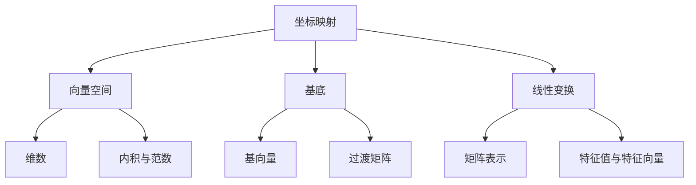

# 线性代数导引：坐标映射

## 1. 背景介绍

### 1.1 问题的由来

在现代数学和计算机科学中,线性代数扮演着至关重要的角色。它为我们提供了一种强大的工具,用于描述和操作各种向量空间,并解决广泛的应用问题。其中,坐标映射是线性代数中一个核心概念,它将向量从一个坐标系统映射到另一个坐标系统,使得我们能够在不同的表示形式之间自由切换,从而简化计算和分析过程。

坐标映射的概念源于对向量空间基底变换的需求。在许多实际应用中,我们经常需要在不同的坐标系统之间转换数据,以适应特定的问题场景或计算需求。例如,在计算机图形学中,我们需要在笛卡尔坐标系和齐次坐标系之间切换,以便执行各种几何变换和投影操作。在信号处理领域,我们需要在时域和频域之间转换信号,以便进行滤波和频谱分析。在机器学习中,我们需要将高维数据映射到低维空间,以降低计算复杂度和提高可解释性。

### 1.2 研究现状

坐标映射的理论基础可以追溯到19世纪,当时数学家们开始系统地研究线性变换和矩阵的性质。随着线性代数的发展,坐标映射的概念逐渐成熟,并被广泛应用于各个领域。目前,坐标映射已经成为线性代数课程的核心内容,也是计算机科学、物理学、工程学等领域的基础知识。

在理论方面,坐标映射的研究主要集中在以下几个方面:

1. 基底变换和过渡矩阵的性质
2. 特征值和特征向量在坐标映射中的应用
3. 正交基和正交矩阵在坐标映射中的作用
4. 坐标映射在不同向量空间之间的推广

在应用方面,坐标映射被广泛应用于各个领域,包括但不限于:

1. 计算机图形学中的几何变换和投影
2. 信号处理中的时域和频域转换
3. 机器学习中的降维和特征提取
4. 控制理论中的状态空间表示
5. 量子计算中的量子态表示

### 1.3 研究意义

坐标映射的研究对于数学和计算机科学具有重要意义:

1. **理论基础**: 坐标映射为线性代数奠定了坚实的理论基础,是理解和操作向量空间的关键工具。
2. **计算简化**: 通过适当选择坐标系统,我们可以极大简化计算过程,提高效率和精度。
3. **问题建模**: 坐标映射使我们能够将实际问题映射到适当的数学模型,从而利用线性代数的强大工具进行分析和求解。
4. **跨学科应用**: 坐标映射在多个学科领域都有广泛的应用,促进了不同领域之间的交叉融合和创新。

### 1.4 本文结构

本文将全面介绍坐标映射的理论基础、核心算法、数学模型、实际应用和未来发展趋势。文章结构如下:

1. 背景介绍
2. 核心概念与联系
3. 核心算法原理与具体操作步骤
4. 数学模型和公式详细讲解与举例说明
5. 项目实践:代码实例和详细解释说明
6. 实际应用场景
7. 工具和资源推荐
8. 总结:未来发展趋势与挑战
9. 附录:常见问题与解答

## 2. 核心概念与联系

坐标映射是线性代数中的一个核心概念,它紧密地与向量空间、基底、线性变换等概念相关联。下面我们将介绍这些核心概念及它们之间的联系。

1. **向量空间**: 坐标映射发生在向量空间中。向量空间是一个代数结构,由一组向量及其加法和数乘运算组成。它具有维数、内积和范数等重要性质。

2. **基底**: 每个向量空间都有一组基底,它是一组线性无关的向量,可以唯一表示该空间中的任意向量。基底的选择直接影响坐标映射的表示形式。

3. **线性变换**: 坐标映射实际上是一种特殊的线性变换,它将一个向量空间中的向量映射到另一个向量空间中。线性变换可以用矩阵表示,并具有特征值和特征向量等重要性质。

4. **基向量**: 基底中的每个向量称为基向量。在给定的基底下,任意向量都可以用基向量的线性组合来表示,其系数就是该向量在该基底下的坐标。

5. **过渡矩阵**: 当基底发生变换时,向量在新旧基底下的坐标会发生改变。过渡矩阵描述了这种基底变换,它将向量从一个基底下的坐标映射到另一个基底下的坐标。

6. **矩阵表示**: 线性变换可以用矩阵来表示。在给定的基底下,线性变换的矩阵表示就是该线性变换对应的过渡矩阵。

7. **特征值与特征向量**: 特征值和特征向量是线性变换的重要性质,它们描述了线性变换对某些特殊向量的不变性。在坐标映射中,特征值和特征向量可以用于简化计算和分析。

通过上述核心概念及其联系,我们可以全面理解坐标映射的本质和作用。下一节,我们将深入探讨坐标映射的核心算法原理和具体操作步骤。

## 3. 核心算法原理与具体操作步骤

### 3.1 算法原理概述

坐标映射的核心算法原理可以概括为:给定一个向量空间 $V$ 及其两组基底 $\mathcal{B}_1$ 和 $\mathcal{B}_2$,对于 $V$ 中的任意向量 $\vec{v}$,我们需要找到一种方法,将 $\vec{v}$ 在基底 $\mathcal{B}_1$ 下的坐标表示映射到基底 $\mathcal{B}_2$ 下的坐标表示,或者反过来。

这种映射可以通过过渡矩阵 $P$ 来实现,其中 $P$ 是一个可逆矩阵,它将基底 $\mathcal{B}_1$ 映射到基底 $\mathcal{B}_2$。具体来说,如果 $\vec{v}$ 在基底 $\mathcal{B}_1$ 下的坐标表示为 $[v_1, v_2, \ldots, v_n]^T$,那么它在基底 $\mathcal{B}_2$ 下的坐标表示 $[u_1, u_2, \ldots, u_n]^T$ 可以通过以下公式计算:

$$
\begin{bmatrix}
u_1 \
u_2 \
\vdots \
u_n
\end{bmatrix}
= P
\begin{bmatrix}
v_1 \
v_2 \
\vdots \
v_n
\end{bmatrix}
$$

其中 $P$ 就是从基底 $\mathcal{B}_1$ 到基底 $\mathcal{B}_2$ 的过渡矩阵。反过来,如果我们知道 $\vec{v}$ 在基底 $\mathcal{B}_2$ 下的坐标表示,那么它在基底 $\mathcal{B}_1$ 下的坐标表示可以通过求解以下方程得到:

$$
\begin{bmatrix}
v_1 \
v_2 \
\vdots \
v_n
\end{bmatrix}
= P^{-1}
\begin{bmatrix}
u_1 \
u_2 \
\vdots \
u_n
\end{bmatrix}
$$

其中 $P^{-1}$ 是过渡矩阵 $P$ 的逆矩阵。

因此,坐标映射算法的核心就是计算过渡矩阵 $P$ 及其逆矩阵 $P^{-1}$。一旦获得了这两个矩阵,我们就可以在不同的基底下自由地转换向量的坐标表示。

### 3.2 算法步骤详解

现在,我们将详细介绍计算过渡矩阵的具体步骤。假设向量空间 $V$ 的维数为 $n$,基底 $\mathcal{B}_1 = \{\vec{b}_1, \vec{b}_2, \ldots, \vec{b}_n\}$,基底 $\mathcal{B}_2 = \{\vec{c}_1, \vec{c}_2, \ldots, \vec{c}_n\}$。我们的目标是找到一个 $n \times n$ 矩阵 $P$,使得对于任意向量 $\vec{v} \in V$,如果它在基底 $\mathcal{B}_1$ 下的坐标表示为 $[v_1, v_2, \ldots, v_n]^T$,那么它在基底 $\mathcal{B}_2$ 下的坐标表示就是 $P[v_1, v_2, \ldots, v_n]^T$。

步骤如下:

1. 构造基底 $\mathcal{B}_1$ 和 $\mathcal{B}_2$ 的基向量矩阵:

   $$
   B_1 =
   \begin{bmatrix}
   | & | & & | \
   \vec{b}_1 & \vec{b}_2 & \cdots & \vec{b}_n \
   | & | & & |
   \end{bmatrix}
   \quad
   B_2 =
   \begin{bmatrix}
   | & | & & | \
   \vec{c}_1 & \vec{c}_2 & \cdots & \vec{c}_n \
   | & | & & |
   \end{bmatrix}
   $$

2. 计算过渡矩阵 $P$:

   $$
   P = B_2 B_1^{-1}
   $$

   其中 $B_1^{-1}$ 是基向量矩阵 $B_1$ 的逆矩阵。

3. 验证过渡矩阵 $P$ 是否可逆。如果 $P$ 可逆,那么它就是我们所需的过渡矩阵;否则,我们需要重新选择基底。

4. 计算过渡矩阵 $P$ 的逆矩阵 $P^{-1}$。

现在,我们已经获得了过渡矩阵 $P$ 和它的逆矩阵 $P^{-1}$。对于任意向量 $\vec{v} \in V$,如果它在基底 $\mathcal{B}_1$ 下的坐标表示为 $[v_1, v_2, \ldots, v_n]^T$,那么它在基底 $\mathcal{B}_2$ 下的坐标表示就是:

$$
\begin{bmatrix}
u_1 \
u_2 \
\vdots \
u_n
\end{bmatrix}
= P
\begin{bmatrix}
v_1 \
v_2 \
\vdots \
v_n
\end{bmatrix}
$$

反之,如果我们知道 $\vec{v}$ 在基底 $\mathcal{B}_2$ 下的坐标表示 $[u_1, u_2, \ldots, u_n]^T$,那么它在基底 $\mathcal{B}_1$ 下的坐标表示就是:

$$
\begin{bmatrix}
v_1 \
v_2 \
\vdots \
v_n
\end{bmatrix}
= P^{-1}
\begin{bmatrix}
u_1 \
u_2 \
\vdots \
u_n
\end{bmatrix}
$$

通过这种方式,我们就实现了坐标映射的核心算法。

### 3.3 算法优缺点

坐标映射算法具有以下优点:

1. **理论基础坚实**: 该算法直接源自线性代数的基本原理,具有坚实的数学理论支撑。

2. **通用性强**: 该算法适用于任意有限维向量空间,并且可以在不同的基底之间进行映射。

3. **计算高效**: 只需计算一次过渡矩阵及其逆矩阵,就可以实现任意向