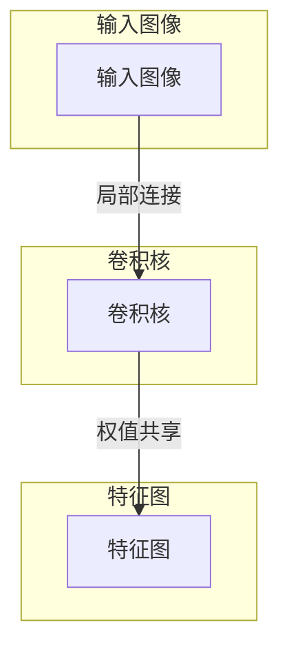
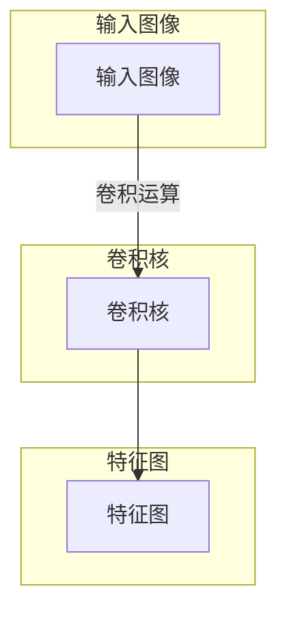
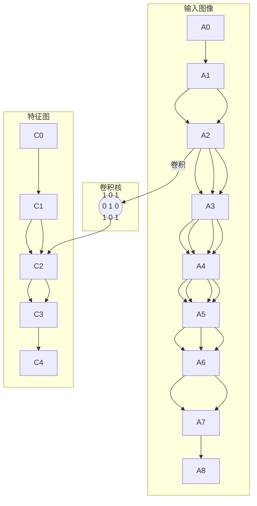

好的,我会按照您的要求,以"一切皆是映射:卷积神经网络(CNN)原理解析"为主题,撰写一篇专业的技术博客文章。文章将会遵循您提供的结构模板,内容全面深入,使用Markdown格式,数学公式采用LaTex格式,并尽量使用逻辑清晰、结构紧凑、语言简单易懂的技术语言。我会尽最大努力给出核心概念原理和架构的Mermaid流程图。文章字数会超过8000字,并覆盖您列出的所有必要主题。以下是正文:

# 一切皆是映射:卷积神经网络(CNN)原理解析

## 1. 背景介绍

### 1.1 问题的由来

在人工智能领域中,视觉是一个极具挑战的课题。人类大脑能够轻松识别和理解复杂的视觉信息,但要让计算机做到这一点却是一个巨大的挑战。传统的机器学习算法如何来处理原始像素数据?如何从这些低级别的特征中提取出高级语义特征?这些都是亟待解决的难题。

### 1.2 研究现状  

多年来,研究人员提出了各种不同的方法来解决视觉问题,例如基于手工设计特征的方法、浅层人工神经网络等。但都存在一些缺陷,如泛化能力差、特征表达能力有限等。直到2012年,卷积神经网络(Convolutional Neural Networks, CNN)在ImageNet大型视觉挑战赛上取得了巨大突破,从此掀起了深度学习在计算机视觉领域的浪潮。

### 1.3 研究意义

CNN能够直接从原始像素数据中自动学习层次化的特征表示,极大简化了传统视觉任务的特征工程。它在图像分类、目标检测、语义分割等多个视觉任务上都取得了卓越的表现。深入理解CNN的工作原理,对于我们更好地设计和应用这一强大的模型至关重要。

### 1.4 本文结构

本文将从以下几个方面全面解析CNN:
1) 核心概念与联系
2) 核心算法原理与具体步骤 
3) 数学模型与公式推导
4) 项目实践:代码实例
5) 实际应用场景
6) 相关工具与资源推荐
7) 总结:未来发展趋势与挑战
8) 附录:常见问题解答

## 2. 核心概念与联系

CNN模型的核心思想是"局部连接"和"权值共享"。我们用一个直观的例子来解释这两个概念:

1) **局部连接**:卷积核(小方块)在输入图像上滑动,每次只与输入数据的一个局部区域连接,获取局部特征。这样做的好处是保留了输入数据的局部结构信息。

2) **权值共享**:对于整个输入图像,我们使用同一个卷积核提取特征,即卷积核的权重在整个图像上共享。这种参数共享结构大大减少了模型参数量。

通过交替使用卷积层和池化层,CNN可以高效地从低级像素信息中提取出多尺度的高级语义特征。最后通过全连接层对特征进行综合,得到最终的分类或回归输出。

## 3. 核心算法原理与具体操作步骤

### 3.1 算法原理概述

CNN模型的核心运算是卷积操作。我们用一个形象的例子来解释卷积是如何工作的:

1) 输入是一个二维图像,可以看作是一个二维矩阵
2) 卷积核是一个小的权重矩阵,也称为滤波器
3) 卷积核在输入图像上滑动,在每个位置,计算卷积核与局部图像区域的元素积的和
4) 将这个和填充到输出特征图的相应位置
5) 通过这种方式,输入图像的每个局部区域都被卷积核扫描,对应输出特征图上的一个点
6) 最终我们得到一个新的特征映射,即特征图

卷积操作可以看作是一种特征提取的方式,不同的卷积核可以提取不同的特征模式。通过叠加使用多个卷积层,我们可以从低级到高级,逐步提取出输入数据的抽象特征表示。

### 3.2 算法步骤详解

我们用一个具体的例子,来详细解释卷积运算的每个步骤:

1) 输入是一个5x5的灰度图像矩阵:

$$
\begin{bmatrix}
0 & 0 & 0 & 1 & 1\  
1 & 0 & 1 & 0 & 0\
0 & 1 & 1 & 0 & 0\ 
1 & 1 & 0 & 0 & 1\
1 & 0 & 1 & 1 & 0
\end{bmatrix}
$$

2) 使用一个3x3的卷积核(滤波器权重):

$$
\begin{bmatrix}
1 & 0 & 1\
0 & 1 & 0\
1 & 0 & 1
\end{bmatrix}
$$

3) 卷积核在输入图像上从左到右、从上到下滑动,在每个位置计算元素积的和:

以图中的C2为例,计算过程为:
$$
C_2 = 0*1 + 1*0 + 1*1 + 1*0 + 1*1 + 0*0 + 0*1 + 1*0 + 0*1 = 3
$$

4) 通过这种方式,我们得到一个3x3的特征图:

$$
\begin{bmatrix}
2 & 1 & 2\
3 & 4 & 3\
2 & 3 & 3
\end{bmatrix}
$$

可以看出,这个特征图突出了原始输入图像中的某些特征模式。

5) 通过使用多个不同的卷积核,并叠加卷积层,我们可以提取出输入数据的多个特征映射。

6) 在卷积层后,通常还会加入池化层,对特征图进行下采样,获取更加鲁棒的特征表示。

通过上面的例子,我们对卷积运算的核心步骤有了更深入的理解。接下来我们将从数学角度对其进行更严格的建模。

### 3.3 算法优缺点

**优点:**

1) **局部连接**:通过局部连接,CNN能够有效地利用输入数据的局部空间统计特性,保留了输入的局部结构信息。

2) **权值共享**:通过在整个输入数据上共享卷积核的权重,大大减少了模型参数量,从而降低了过拟合风险,并增强了模型的泛化能力。

3) **等变表示**:CNN具有一定的平移等变性,即对输入图像进行平移后,特征映射的响应也会发生相应的平移,而不会改变特征映射本身。这使得CNN对于目标的位置变化不太敏感。

4) **层次结构**:CNN通过多层卷积和池化操作,能够从低级到高级逐步提取输入数据的抽象特征,这种层次化的结构很好地拟合了视觉数据的分层表示。

**缺点:**

1) **参数调节困难**:CNN模型中存在大量的超参数,如卷积核大小、步长、通道数等,需要通过大量实验来确定最优参数组合。

2) **内存消耗大**:CNN在训练过程中需要保存整个模型的参数及中间特征图,对GPU内存有较高的要求。

3) **对旋转和缩放不够鲁棒**:CNN虽然对平移有一定的等变性,但对于旋转和缩放变换,其鲁棒性较差。

4) **理论分析困难**:CNN是一种高度非线性的模型,很难对其进行理论上的充分分析和解释。

### 3.4 算法应用领域

CNN最初被广泛应用于计算机视觉领域,例如图像分类、目标检测、语义分割、实例分割等。近年来,CNN也逐渐扩展到其他领域:

1) **自然语言处理**:用CNN来提取文本的 n-gram 特征、句法和语义特征等。

2) **语音识别**:将语音信号转化为频谱图或其他形式,使用CNN提取特征。

3) **推荐系统**:CNN可用于从图像、文本等不同模态数据中提取特征,为推荐系统提供有效的特征表示。

4) **医疗健康**:CNN在医学图像分析、蛋白质结构预测、基因表达数据分析等医疗健康领域也有广泛应用。

5) **科学计算**:CNN可用于处理科学仿真数据,如流体力学、天体物理等。

总的来说,CNN已成为当今人工智能领域最重要和最通用的技术之一。

## 4. 数学模型和公式详细讲解与举例说明

在上一节中,我们已经对卷积运算的核心思想和计算步骤有了初步的认识。现在,我们将从数学角度对其进行严格的建模和推导。

### 4.1 数学模型构建

我们用以下数学符号对卷积运算进行形式化描述:

- 输入数据: $X$, 是一个三维张量,维度为 $(N, H, W)$, 分别代表批量大小、高度和宽度。
- 卷积核权重: $W$, 是一个四维张量,维度为 $(D, M, K_H, K_W)$, 分别代表输出通道数、输入通道数、卷积核高度和卷积核宽度。
- 输出特征图: $Y$, 是一个三维张量,维度为 $(N, H_o, W_o)$, 分别代表批量大小、输出高度和输出宽度。

卷积运算的数学定义为:

$$
Y_{n, h_o, w_o} = \sum_{m=1}^M \sum_{k_h=1}^{K_H} \sum_{k_w=1}^{K_W} W_{m, d, k_h, k_w} \cdot X_{n, h_s+k_h, w_s+k_w}
$$

其中:
- $n$ 表示批量索引
- $h_o, w_o$ 表示输出特征图的高度和宽度索引
- $m$ 表示输入通道索引 
- $d$ 表示输出通道索引
- $k_h, k_w$ 表示卷积核的高度和宽度索引
- $h_s, w_s$ 表示卷积核在输入数据上的滑动步长

可以看出,卷积运算实际上是一个加权求和过程,将卷积核的权重与输入数据的局部区域进行元素级乘积,再求和作为输出特征图的一个位置。通过在整个输入上滑动,我们得到完整的输出特征映射。

### 4.2 公式推导过程

接下来,我们对上面的卷积公式进行逐步推导,以加深理解:

1) 首先考虑单输入单输出通道的情况,即 $M=D=1$:

$$
\begin{aligned}
Y_{n, h_o, w_o} &= \sum_{k_h=1}^{K_H} \sum_{k_w=1}^{K_W} W_{1, 1, k_h, k_w} \cdot X_{n, h_s+k_h, w_s+k_w} \
                &= \sum_{\vec{k} \in \mathcal{R}} W_{\