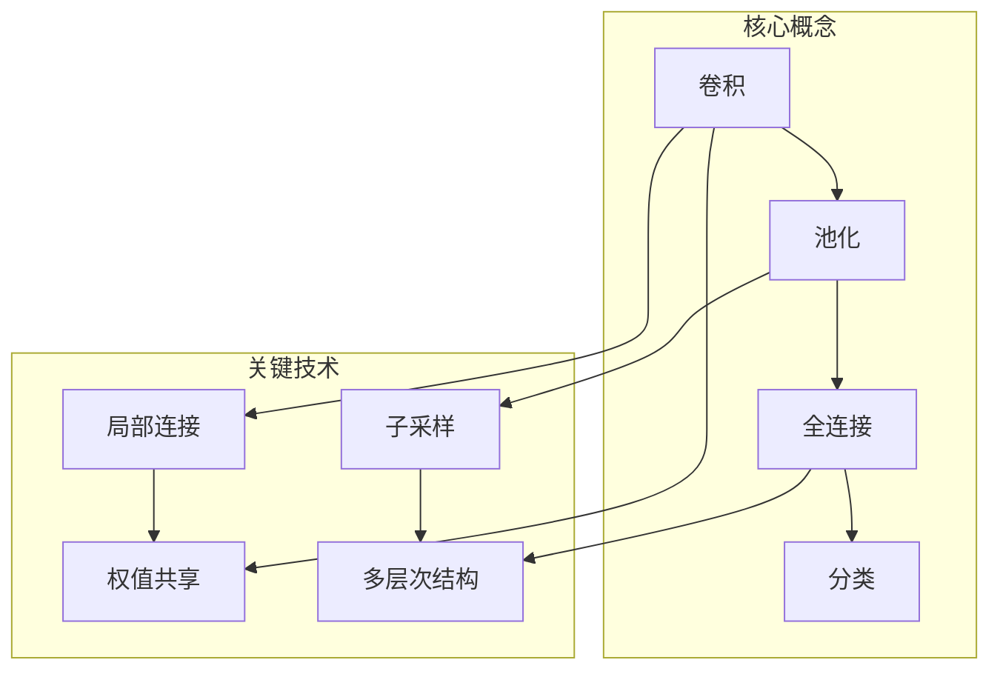
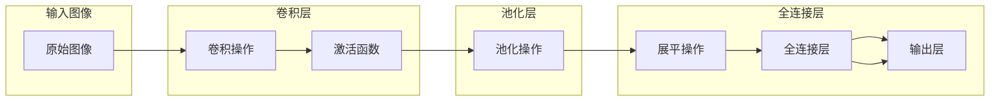

以下是对《一切皆是映射：卷积神经网络(CNN)解密》这一主题的技术博客文章正文部分的撰写。

# 一切皆是映射：卷积神经网络(CNN)解密

## 1. 背景介绍

### 1.1 问题的由来

在计算机视觉和图像处理领域,如何让机器能够像人类一样理解和识别图像一直是一个巨大的挑战。传统的机器学习算法依赖于手工设计的特征提取,这种方法存在两个主要问题:一是特征提取过程复杂且容易受到噪声的影响;二是手工设计的特征往往难以概括复杂的视觉模式。

为了解决这一问题,卷积神经网络(Convolutional Neural Network, CNN)应运而生。CNN是一种前馈神经网络,它的灵感来源于生物学上视觉皮层的组织结构,能够对输入的图像进行有效的模式识别和机器学习,从而实现图像分类、目标检测等计算机视觉任务。

### 1.2 研究现状

自从AlexNet在2012年ImageNet大赛上取得巨大成功后,CNN在计算机视觉领域掀起了一场深度学习革命。随后,VGGNet、GoogLeNet、ResNet等新型CNN模型不断涌现,在图像分类、目标检测、语义分割等任务中展现出卓越的性能。

与此同时,CNN在自然语言处理、语音识别、推荐系统等领域也取得了广泛应用。CNN的成功主要归功于其独特的网络结构设计,能够自动从原始数据中学习出高效的特征表示。

### 1.3 研究意义

深入理解CNN的原理和工作机制对于进一步提高CNN的性能、促进其在更多领域的应用都具有重要意义。本文将从CNN的基本概念出发,逐步剖析其核心算法原理、数学模型以及实现细节,旨在帮助读者全面把握CNN的本质,并为未来的研究和创新奠定基础。

### 1.4 本文结构

本文共分为9个部分:

1. 背景介绍
2. 核心概念与联系
3. 核心算法原理与具体操作步骤
4. 数学模型和公式详细讲解与举例说明  
5. 项目实践:代码实例和详细解释说明
6. 实际应用场景
7. 工具和资源推荐
8. 总结:未来发展趋势与挑战
9. 附录:常见问题与解答

## 2. 核心概念与联系

卷积神经网络(CNN)由多个卷积层、池化层和全连接层组成。其核心思想是通过卷积和池化操作在局部区域内提取特征,并在多个层次上组合形成更高层次的模式表示,最终将学习到的分布式特征表示映射到样本标记空间进行分类或回归。

CNN的关键技术包括:

- **局部连接(Local Connection)**: 卷积层的神经元只与输入数据的局部区域连接,从而减少了网络的参数量并保留了输入数据的空间结构信息。
- **权值共享(Weight Sharing)**: 在同一卷积层内,所有神经元共享相同的权值,大大降低了网络参数的存储需求。
- **子采样(Subsampling)**: 池化层通过降采样操作缩小特征图的尺寸,从而提高了网络的鲁棒性和不变性。
- **多层次结构(Multi-layer Structure)**: CNN由多个卷积层和池化层交替堆叠而成,能够逐层提取更高层次的抽象特征表示。

CNN的核心创新在于引入了卷积和池化操作,使得网络能够自动学习视觉数据的层次特征表示,从而避免了传统机器学习算法中手工设计特征的复杂过程。

## 3. 核心算法原理与具体操作步骤  

### 3.1 算法原理概述

CNN的核心算法原理可概括为以下几个关键步骤:

1. **卷积操作(Convolution Operation)**: 在卷积层中,通过一个可学习的卷积核(也称滤波器)在输入特征图上滑动,对局部区域进行特征提取。卷积核的参数在训练过程中不断优化,从而自动学习出有效的特征检测器。

2. **激活函数(Activation Function)**: 卷积后的特征图通过非线性激活函数(如ReLU)进行处理,增强网络的表达能力。

3. **池化操作(Pooling Operation)**: 池化层对卷积层的输出进行空间下采样,缩小特征图的尺寸,从而提高网络的鲁棒性和不变性。常用的池化方法包括最大池化和平均池化。

4. **全连接层(Fully Connected Layer)**: 将池化层输出的特征图展平为一维向量后,送入全连接层进行高层次的模式分析。全连接层类似于传统的人工神经网络,对展平后的特征向量进行线性变换和非线性映射。

5. **输出层(Output Layer)**: 根据任务的不同,输出层可以是Softmax层(用于分类任务)或线性层(用于回归任务)。

通过上述层次操作,CNN能够自动从原始图像数据中学习出多尺度、多层次的特征表示,并将其映射到目标输出空间,实现端到端的图像识别和分析。

### 3.2 算法步骤详解

1. **卷积操作步骤**:

   - 选择卷积核(滤波器)的大小,如3x3或5x5
   - 在输入特征图上滑动卷积核,对每个局部区域进行元素级乘积和操作
   - 将乘积和结果填充到输出特征图的相应位置
   - 通过设置步长(stride)控制卷积核在输入上滑动的步幅
   - 可以使用零填充(padding)来控制输出特征图的空间维度

2. **激活函数步骤**:

   - 常用的激活函数有ReLU、Sigmoid、Tanh等
   - ReLU函数: $f(x)=max(0,x)$,能够增加网络的非线性表达能力
   - 将卷积层输出的特征图逐元素通过激活函数进行非线性映射

3. **池化操作步骤**:

   - 选择池化窗口的大小,如2x2
   - 在输入特征图上滑动池化窗口,对每个窗口区域的元素进行池化操作
   - 常用的池化方法有最大池化(Max Pooling)和平均池化(Average Pooling)
   - 最大池化取窗口内的最大值,平均池化取窗口内的平均值
   - 通过设置步长控制池化窗口在输入上滑动的步幅

4. **全连接层步骤**:

   - 将池化层输出的特征图展平(flatten)为一维向量
   - 将展平后的向量输入到全连接层,进行线性变换: $y=Wx+b$
   - 对线性变换的结果通过激活函数(如ReLU)进行非线性映射
   - 可以堆叠多个全连接层以提取更高层次的特征

5. **输出层步骤**:

   - 对于分类任务,输出层通常使用Softmax激活函数将全连接层的输出映射到(0,1)范围内,将其解释为每个类别的概率分数
   - 对于回归任务,输出层可以使用线性激活函数或其他合适的函数

通过以上步骤,CNN能够在训练过程中不断优化网络参数,从而学习出高效的特征表示和映射,实现端到端的图像理解和分析任务。

### 3.3 算法优缺点

**优点**:

1. **自动特征提取**: CNN能够自动从原始数据中学习出多层次的特征表示,避免了手工设计特征的复杂过程。

2. **局部连接与权值共享**: 这两种设计大大减少了网络参数的数量,降低了模型的存储需求和计算复杂度。

3. **平移不变性**: 由于卷积操作和池化操作的特性,CNN对输入图像的平移、缩放和旋转具有一定的不变性。

4. **可并行计算**: 卷积操作和池化操作都可以高效地并行计算,从而加速了CNN的训练和推理过程。

**缺点**:

1. **对旋转和形变敏感**: 尽管CNN具有一定的平移不变性,但对于较大角度的旋转和形变,其性能仍然会受到影响。

2. **需要大量数据**: CNN通常需要大量的标注数据进行有效训练,否则容易出现过拟合的情况。

3. **计算资源需求高**:尤其是在训练阶段,CNN对GPU等硬件资源的需求较高,可能会增加部署成本。

4. **可解释性较差**: CNN作为一种端到端的黑盒模型,其内部特征表示和决策过程往往难以解释和理解。

### 3.4 算法应用领域

CNN已被广泛应用于计算机视觉、自然语言处理、语音识别、推荐系统等多个领域,展现出强大的数据处理能力。

1. **图像分类**: 将图像分类到预定义的类别中,如物体识别、场景分类等。

2. **目标检测**: 在图像中定位并识别出感兴趣的目标物体。

3. **语义分割**: 对图像中的每个像素进行分类,将图像分割成语义相关的多个区域。

4. **超分辨率重建**: 从低分辨率图像中重建出高分辨率图像。

5. **图像生成**: 生成逼真的图像数据,如人脸合成、风格迁移等。

6. **自然语言处理**: 将一维序列数据(如文本)转换为高维度向量表示,用于文本分类、机器翻译等任务。

7. **语音识别**: 将语音信号转换为文本,实现语音转文字的功能。

8. **推荐系统**: 从用户的历史行为数据中提取特征,为用户推荐感兴趣的商品或内容。

总的来说,CNN已成为深度学习领域中应用最广泛、最成功的网络模型之一,并在不断推动着人工智能技术的发展和创新。

## 4. 数学模型和公式详细讲解与举例说明

### 4.1 数学模型构建

卷积神经网络的数学模型可以概括为一个复合函数:

$$
y = f(x; \theta) = f_L \circ f_{L-1} \circ ... \circ f_2 \circ f_1(x; \theta_1, \theta_2, ..., \theta_L)
$$

其中:

- $x$是输入数据(如图像)
- $y$是网络的输出(如分类概率或回归值)
- $\theta = \{\theta_1, \theta_2, ..., \theta_L\}$是网络的可学习参数
- $f_l$是第$l$层的变换函数,包括卷积、激活、池化等操作
- $\circ$表示函数复合操作

在训练过程中,我们需要通过优化算法(如梯度下降)来学习模型参数$\theta$,使得在训练数据集上网络的输出$y$能够很好地拟合期望的目标值。

### 4.2 公式推导过程

我们以**卷积操作**为例,推导其数学表达式。

设输入特征图为$X \in \mathbb{R}^{H \times W \times C_\text{in}}$,卷积核的权重为$K \in \mathbb{R}^{k_h \times k_w \times C_\text{in} \times C_\text{out}}$,偏置为$b \in \mathbb{R}^{C_\text{out}}$,步长为$s$,则卷积操作可表示为:

$$
Y_{i,j,k} =