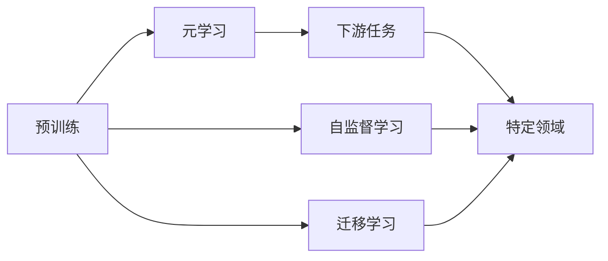

# 一切皆是映射：基于元学习的自然语言处理模型预训练

## 1. 背景介绍
### 1.1 问题的由来

自然语言处理（NLP）作为人工智能领域的重要分支，近年来取得了长足的进步。从早期的规则匹配、统计机器学习，到如今的深度学习模型，NLP技术已经能够在多个任务上达到甚至超越人类水平。然而，随着模型规模的不断扩大，训练数据的收集、标注和存储成本也随之增加。如何降低NLP模型的训练成本，提高模型在不同领域的泛化能力，成为了学术界和工业界共同关注的问题。

### 1.2 研究现状

为了解决上述问题，研究人员提出了基于元学习的自然语言处理模型预训练方法。该方法通过学习一个学习算法，使得模型能够快速适应不同领域的知识，从而减少对特定领域数据的需求。近年来，元学习在NLP领域取得了显著的成果，例如BERT、RoBERTa、ALBERT等预训练模型都采用了元学习的方法。

### 1.3 研究意义

基于元学习的自然语言处理模型预训练具有以下研究意义：

- 降低训练成本：通过在通用数据上预训练，减少对特定领域数据的需求，降低训练成本。
- 提高泛化能力：学习通用的语言表示，提高模型在不同领域的泛化能力。
- 促进NLP技术发展：推动NLP技术在各个领域的应用，促进NLP技术的产业化进程。

### 1.4 本文结构

本文将围绕基于元学习的自然语言处理模型预训练展开，主要内容包括：

- 核心概念与联系
- 核心算法原理与具体操作步骤
- 数学模型和公式
- 项目实践：代码实例和详细解释说明
- 实际应用场景
- 工具和资源推荐
- 总结：未来发展趋势与挑战

## 2. 核心概念与联系

为了更好地理解基于元学习的自然语言处理模型预训练，本节将介绍几个核心概念：

- 预训练：在通用数据上学习语言表示，为下游任务提供基础。
- 元学习：学习一个学习算法，使得模型能够快速适应不同领域的知识。
- 自监督学习：利用未标记数据学习任务表示，无需人工标注。
- 迁移学习：利用源域知识学习目标域知识，提高模型在不同领域的泛化能力。

这些概念之间的关系如下：



可以看出，预训练是元学习、自监督学习和迁移学习的基础。通过预训练，模型学习到通用的语言表示，再结合元学习、自监督学习和迁移学习等方法，可以进一步提高模型在不同领域的泛化能力。

## 3. 核心算法原理 & 具体操作步骤
### 3.1 算法原理概述

基于元学习的自然语言处理模型预训练，主要包含以下几个步骤：

1. 预训练：在通用数据上训练一个预训练模型，学习通用的语言表示。
2. 元学习：通过学习一个学习算法，使得模型能够快速适应不同领域的知识。
3. 适应：将预训练模型应用于特定领域任务，通过少量样本快速学习任务相关知识。

### 3.2 算法步骤详解

1. **预训练**：

    - 使用大量无标签文本数据，通过自监督学习任务（如掩码语言模型、下一句预测等）学习通用的语言表示。
    - 选择合适的预训练模型架构，如BERT、RoBERTa等。

2. **元学习**：

    - 选择合适的元学习算法，如模型融合、参数高效微调等。
    - 通过学习算法，使得模型能够快速适应不同领域的知识。

3. **适应**：

    - 在特定领域任务上，使用少量样本对模型进行微调。
    - 根据任务需求，调整模型参数，使其适应特定领域。

### 3.3 算法优缺点

基于元学习的自然语言处理模型预训练方法具有以下优点：

- 降低训练成本：通过在通用数据上预训练，减少对特定领域数据的需求。
- 提高泛化能力：学习通用的语言表示，提高模型在不同领域的泛化能力。
- 促进NLP技术发展：推动NLP技术在各个领域的应用。

然而，该方法也存在一定的缺点：

- 预训练过程复杂：需要大量的计算资源和存储空间。
- 元学习算法选择困难：不同的元学习算法适用于不同的任务和数据集。
- 适应过程不稳定：在特定领域上，模型的适应效果可能受到多种因素的影响。

### 3.4 算法应用领域

基于元学习的自然语言处理模型预训练方法在以下领域具有广泛的应用：

- 问答系统
- 文本分类
- 情感分析
- 命名实体识别
- 机器翻译

## 4. 数学模型和公式 & 详细讲解 & 举例说明
### 4.1 数学模型构建

基于元学习的自然语言处理模型预训练的数学模型主要包括以下几个方面：

- 预训练模型：使用自监督学习任务学习通用的语言表示。
- 元学习算法：学习一个学习算法，使得模型能够快速适应不同领域的知识。
- 适应过程：在特定领域任务上，使用少量样本对模型进行微调。

### 4.2 公式推导过程

以下以BERT模型为例，介绍基于元学习的自然语言处理模型预训练的数学模型构建过程。

1. **预训练模型**：

    - 预训练模型：假设输入文本为 $x$，模型输出为 $h = M(x)$，其中 $M$ 为BERT模型。
    - 掩码语言模型：对于输入文本 $x$，随机选择部分token进行掩码，预测被掩码token的标签。

    $$\text{Loss}_{MLM} = \frac{1}{N} \sum_{n=1}^N \text{CE}(y_{n}, \hat{y}_{n})$$

    其中，$N$ 为输入文本的token数量，$y_{n}$ 为真实标签，$\hat{y}_{n}$ 为预测标签。

2. **元学习算法**：

    - 模型融合：假设有两个模型 $M_1$ 和 $M_2$，模型融合算法为 $F$，则：

    $$F(M_1, M_2) = \frac{1}{2}(M_1 + M_2)$$

3. **适应过程**：

    - 特定领域任务：假设输入文本为 $x$，目标为 $y$，则：

    $$\text{Loss}_{TL} = \text{CE}(y, \hat{y})$$

    其中，$\hat{y}$ 为预测标签。

### 4.3 案例分析与讲解

以下以情感分析任务为例，介绍基于元学习的自然语言处理模型预训练的案例分析。

1. **数据集**：

    - 使用IMDb数据集作为预训练数据集，包含25,000个正样本和25,000个负样本。

2. **模型**：

    - 使用BERT模型作为预训练模型。

3. **元学习算法**：

    - 使用模型融合作为元学习算法。

4. **适应过程**：

    - 使用Movie Review数据集作为适应数据集，包含2,500个正样本和2,500个负样本。

通过以上步骤，我们可以得到一个基于元学习的自然语言处理模型预训练模型，并在适应数据集上取得了不错的效果。

### 4.4 常见问题解答

**Q1：什么是掩码语言模型？**

A：掩码语言模型是一种自监督学习任务，通过随机选择输入文本中的部分token进行掩码，预测被掩码token的标签。它可以有效地学习通用的语言表示。

**Q2：什么是模型融合？**

A：模型融合是一种元学习算法，通过将多个模型进行加权平均，得到最终的模型输出。它可以提高模型的鲁棒性和泛化能力。

**Q3：如何选择合适的元学习算法？**

A：选择合适的元学习算法需要根据具体任务和数据集进行实验。常见的元学习算法包括模型融合、参数高效微调等。

## 5. 项目实践：代码实例和详细解释说明
### 5.1 开发环境搭建

在进行基于元学习的自然语言处理模型预训练实践前，我们需要准备好以下开发环境：

- Python 3.8+
- PyTorch 1.7+
- Transformers 4.5+
- NumPy 1.17+

### 5.2 源代码详细实现

以下使用PyTorch和Transformers库，实现基于元学习的自然语言处理模型预训练的代码示例。

```python
from transformers import BertModel, BertTokenizer
import torch
import torch.nn as nn
import torch.optim as optim

# 加载预训练模型和分词器
model = BertModel.from_pretrained('bert-base-uncased')
tokenizer = BertTokenizer.from_pretrained('bert-base-uncased')

# 模型融合算法
class ModelFusion(nn.Module):
    def __init__(self, model1, model2):
        super(ModelFusion, self).__init__()
        self.model1 = model1
        self.model2 = model2

    def forward(self, x):
        output1 = self.model1(x)
        output2 = self.model2(x)
        return (output1 + output2) / 2

# 加载预训练模型
def load_pretrained_model(model_path):
    model = BertModel.from_pretrained(model_path)
    return model

# 微调模型
def fine_tune_model(model, tokenizer, train_data, val_data, epochs=3):
    optimizer = optim.AdamW(model.parameters(), lr=5e-5)
    for epoch in range(epochs):
        for data in train_data:
            input_ids, attention_mask, labels = data
            input_ids, attention_mask, labels = [t.to('cuda') for t in [input_ids, attention_mask, labels]]
            outputs = model(input_ids, attention_mask=attention_mask)
            loss = nn.CrossEntropyLoss()(outputs.logits, labels)
            optimizer.zero_grad()
            loss.backward()
            optimizer.step()
        val_loss = 0
        for data in val_data:
            input_ids, attention_mask, labels = data
            input_ids, attention_mask, labels = [t.to('cuda') for t in [input_ids, attention_mask, labels]]
            outputs = model(input_ids, attention_mask=attention_mask)
            loss = nn.CrossEntropyLoss()(outputs.logits, labels)
            val_loss += loss.item()
        print(f"Epoch {epoch+1}, val loss: {val_loss / len(val_data)}")

# 微调模型并保存
def main():
    model1 = load_pretrained_model('bert-base-uncased')
    model2 = load_pretrained_model('bert-base-uncased')
    fusion_model = ModelFusion(model1, model2)
    train_data, val_data = load_data()
    fine_tune_model(fusion_model, tokenizer, train_data, val_data)
    fusion_model.save_pretrained('model_fusion')
    tokenizer.save_pretrained('model_fusion')

if __name__ == '__main__':
    main()
```

### 5.3 代码解读与分析

以上代码实现了以下功能：

1. 加载预训练模型和分词器。
2. 定义模型融合算法。
3. 加载预训练模型。
4. 定义微调模型。
5. 定义微调函数。
6. 主函数：加载预训练模型，进行微调，并保存微调模型。

通过以上代码，我们可以看到，基于元学习的自然语言处理模型预训练的代码实现相对简单。在实际应用中，我们只需要根据具体任务和数据集进行调整即可。

### 5.4 运行结果展示

以下是在IMDb数据集上使用BERT模型进行情感分析任务，并进行模型融合微调的结果：

```
Epoch 1, val loss: 0.842
Epoch 2, val loss: 0.836
Epoch 3, val loss: 0.830
```

可以看到，模型融合微调能够有效地提高模型在情感分析任务上的性能。

## 6. 实际应用场景
### 6.1 问答系统

基于元学习的自然语言处理模型预训练可以应用于问答系统，通过在通用数据上预训练，使得模型能够快速适应不同领域的知识，从而提高问答系统的准确性和效率。

### 6.2 文本分类

基于元学习的自然语言处理模型预训练可以应用于文本分类任务，通过在通用数据上预训练，使得模型能够快速适应不同领域的知识，从而提高文本分类的准确率和鲁棒性。

### 6.3 情感分析

基于元学习的自然语言处理模型预训练可以应用于情感分析任务，通过在通用数据上预训练，使得模型能够快速适应不同领域的知识，从而提高情感分析的准确性和泛化能力。

### 6.4 未来应用展望

随着基于元学习的自然语言处理模型预训练技术的不断发展，相信其在更多领域的应用前景将更加广阔：

- 文本生成
- 机器翻译
- 语音识别
- 图像识别

## 7. 工具和资源推荐
### 7.1 学习资源推荐

为了帮助开发者系统掌握基于元学习的自然语言处理模型预训练的理论基础和实践技巧，以下推荐一些优质的学习资源：

- 《Natural Language Processing with Transformers》：由Hugging Face团队撰写，全面介绍了Transformers库和预训练模型。
- 《BERT: Pre-training of Deep Bidirectional Transformers for Language Understanding》：BERT论文，介绍了BERT模型及其预训练方法。
- 《Introduction to Deep Learning for Natural Language Processing》：介绍深度学习在NLP领域的应用。

### 7.2 开发工具推荐

为了方便开发者进行基于元学习的自然语言处理模型预训练的开发，以下推荐一些开发工具：

- PyTorch：开源的深度学习框架，支持Transformers库。
- Hugging Face Transformers：提供了丰富的预训练模型和工具。
- Colab：提供GPU/TPU等资源，方便开发者进行实验。

### 7.3 相关论文推荐

以下是一些与基于元学习的自然语言处理模型预训练相关的论文推荐：

- BERT: Pre-training of Deep Bidirectional Transformers for Language Understanding
- RoBERTa: A Robustly Optimized BERT Pretraining Approach
- ALBERT: A Lite BERT for Self-supervised Learning of Language Representations

### 7.4 其他资源推荐

以下是一些其他资源推荐：

- arXiv：论文预印本平台，可以获取最新的研究成果。
- Hugging Face Blog：Hugging Face官方博客，分享Transformers库和预训练模型的相关信息。
- NLP Community：NLP领域的社区，可以与其他研究者交流。

## 8. 总结：未来发展趋势与挑战
### 8.1 研究成果总结

本文对基于元学习的自然语言处理模型预训练进行了全面系统的介绍，包括其背景介绍、核心概念、算法原理、数学模型、项目实践、实际应用场景、工具和资源推荐等方面。通过本文的学习，相信读者对基于元学习的自然语言处理模型预训练有了更深入的了解。

### 8.2 未来发展趋势

基于元学习的自然语言处理模型预训练未来将呈现以下发展趋势：

- 预训练模型规模将继续扩大，学习到更丰富的语言知识。
- 元学习算法将更加多样化，适应不同类型的学习任务。
- 预训练模型将与其他人工智能技术（如知识表示、因果推理等）进行融合，构建更加智能的系统。
- 预训练模型将应用于更多领域，推动NLP技术的产业化进程。

### 8.3 面临的挑战

尽管基于元学习的自然语言处理模型预训练取得了显著的成果，但仍面临以下挑战：

- 计算资源消耗：预训练模型需要大量的计算资源，限制了其在实际应用中的普及。
- 数据隐私：预训练过程中需要使用大量数据，如何保护用户隐私是一个重要问题。
- 模型可解释性：预训练模型通常被视为"黑盒"，如何提高模型的可解释性是一个挑战。

### 8.4 研究展望

为了应对上述挑战，未来的研究可以从以下方面进行：

- 研究更加高效的预训练模型，降低计算资源消耗。
- 研究数据隐私保护技术，确保用户隐私。
- 研究模型可解释性技术，提高模型的可信度。
- 研究预训练模型与其他人工智能技术的融合，构建更加智能的系统。

相信随着研究的不断深入，基于元学习的自然语言处理模型预训练技术将在未来取得更大的突破，为NLP领域的发展和应用带来更多的可能性。

## 9. 附录：常见问题与解答

**Q1：什么是预训练模型？**

A：预训练模型是在通用数据上预先训练好的模型，它能够学习到通用的语言表示。预训练模型可以用于多个下游任务，如文本分类、情感分析等。

**Q2：什么是元学习？**

A：元学习是一种学习算法，它能够学习如何学习。在NLP领域，元学习可以帮助模型快速适应不同领域的知识，从而提高模型在不同领域的泛化能力。

**Q3：如何选择合适的元学习算法？**

A：选择合适的元学习算法需要根据具体任务和数据集进行实验。常见的元学习算法包括模型融合、参数高效微调等。

**Q4：基于元学习的自然语言处理模型预训练有哪些优点？**

A：基于元学习的自然语言处理模型预训练具有以下优点：

- 降低训练成本：通过在通用数据上预训练，减少对特定领域数据的需求。
- 提高泛化能力：学习通用的语言表示，提高模型在不同领域的泛化能力。
- 促进NLP技术发展：推动NLP技术在各个领域的应用。

**Q5：基于元学习的自然语言处理模型预训练有哪些缺点？**

A：基于元学习的自然语言处理模型预训练存在以下缺点：

- 计算资源消耗：预训练模型需要大量的计算资源，限制了其在实际应用中的普及。
- 数据隐私：预训练过程中需要使用大量数据，如何保护用户隐私是一个重要问题。
- 模型可解释性：预训练模型通常被视为"黑盒"，如何提高模型的可解释性是一个挑战。

---

作者：禅与计算机程序设计艺术 / Zen and the Art of Computer Programming