我非常荣幸能为您撰写这篇关于大数据与人工智能处理大规模数据集的技术博客。作为一名资深的人工智能专家、程序员和软件架构师,我将尽我所能为您呈现一篇内容丰富、视角独到的专业文章。让我们一起探索这个充满挑战和机遇的领域吧!

# 一切皆是映射:大数据与AI:如何处理大规模数据集

## 1. 背景介绍

### 1.1 问题的由来

在当今的数字时代,数据已经成为了推动科技创新的核心动力。无论是个人还是企业,都在不断产生海量的结构化和非结构化数据。这些数据蕴藏着宝贵的见解和价值,但要充分发掘其中的潜力,就需要有效地处理和分析大规模数据集。

随着数据量的持续增长,传统的数据处理方法已经不堪重负。我们需要新的技术和方法来应对这一挑战,而大数据和人工智能(AI)技术正是解决这一问题的关键。

### 1.2 研究现状

近年来,大数据和人工智能技术的发展日新月异。从Apache Hadoop和Spark等大数据框架,到深度学习、自然语言处理等人工智能算法,都在不断推进着这一领域的进步。

然而,要真正发挥大数据和人工智能的威力,需要将它们有机结合,共同应对大规模数据集的处理挑战。这需要我们深入理解两者的核心概念、算法原理和实践应用,才能充分发挥它们的协同作用。

### 1.3 研究意义

掌握大数据与人工智能处理大规模数据集的技术,对于个人、企业乃至整个社会都有着重大意义:

- 个人层面:提高数据分析和决策能力,发现新的见解和机会。
- 企业层面:优化业务流程,提高运营效率,发现新的商业模式。
- 社会层面:推动科技创新,促进经济发展,解决复杂的社会问题。

总之,大数据与人工智能的结合将为我们打开一扇通往更智能、更高效的数字世界的大门。

### 1.4 本文结构

本文将全面探讨大数据与人工智能在处理大规模数据集方面的核心概念、算法原理、数学模型、实践应用等多个方面。文章结构如下:

```mermaid
graph TD
    A[一切皆是映射:大数据与AI:如何处理大规模数据集] --> B[背景介绍]
    B --> C[问题的由来]
    B --> D[研究现状]
    B --> E[研究意义]
    B --> F[本文结构]
    A --> G[核心概念与联系]
    A --> H[核心算法原理&具体操作步骤]
    H --> I[算法原理概述]
    H --> J[算法步骤详解]
    H --> K[算法优缺点]
    H --> L[算法应用领域]
    A --> M[数学模型和公式&详细讲解&举例说明]
    M --> N[数学模型构建]
    M --> O[公式推导过程]
    M --> P[案例分析与讲解]
    M --> Q[常见问题解答]
    A --> R[项目实践:代码实例和详细解释说明]
    R --> S[开发环境搭建]
    R --> T[源代码详细实现]
    R --> U[代码解读与分析]
    R --> V[运行结果展示]
    A --> W[实际应用场景]
    W --> X[未来应用展望]
    A --> Y[工具和资源推荐]
    Y --> Z1[学习资源推荐]
    Y --> Z2[开发工具推荐]
    Y --> Z3[相关论文推荐]
    Y --> Z4[其他资源推荐]
    A --> A1[总结:未来发展趋势与挑战]
    A1 --> A2[研究成果总结]
    A1 --> A3[未来发展趋势]
    A1 --> A4[面临的挑战]
    A1 --> A5[研究展望]
    A --> A6[附录:常见问题与解答]
```

## 2. 核心概念与联系

在深入探讨大数据与人工智能处理大规模数据集的细节之前,我们有必要先了解一些核心概念及它们之间的联系。

### 2.1 大数据(Big Data)

所谓大数据,指的是规模庞大、种类繁多、处理速度快的数据集。大数据具有4V特征:

- 体量大(Volume)
- 种类多(Variety)
- 获取速度快(Velocity)
- 价值密度低(Value Density)

处理大数据需要特殊的技术架构,如分布式计算框架、NoSQL数据库等。

### 2.2 人工智能(AI)

人工智能是一门研究如何使机器模拟人类智能行为的科学。它包括诸多分支,如机器学习、深度学习、自然语言处理、计算机视觉等。

人工智能算法能够从大量数据中自动发现模式和规律,从而进行预测、决策和优化。它在处理大规模数据集时发挥着关键作用。

### 2.3 大数据与人工智能的关系

大数据和人工智能密不可分,相辅相成:

- 人工智能需要大数据作为训练资料,才能学习出有价值的模型
- 大数据需要人工智能算法进行处理和分析,才能发掘其中的见解

二者的结合,催生了一系列创新应用,如推荐系统、智能语音助手、无人驾驶等,正在深刻改变着我们的生活和工作方式。

### 2.4 处理大规模数据集的关键技术

要高效处理大规模数据集,需要综合运用多种技术:

- 分布式计算框架(如Hadoop、Spark)
- 大数据存储(如HDFS、HBase)
- 数据预处理(如清洗、转换、降维)
- 机器学习与深度学习算法
- 数据可视化与交互式分析

这些技术的融合应用,将为我们提供强大的工具,去挖掘大规模数据集中蕴藏的宝贵资源。

## 3. 核心算法原理与具体操作步骤

### 3.1 算法原理概述

在处理大规模数据集时,常用的核心算法有:

1. **分布式计算算法**
   - 原理:将大规模数据集分割成多个小数据块,并行处理
   - 代表算法:MapReduce、Spark等

2. **降维算法**
   - 原理:将高维数据映射到低维空间,降低数据复杂度
   - 代表算法:PCA、t-SNE等

3. **聚类算法**
   - 原理:根据数据特征的相似性,将数据划分为多个簇
   - 代表算法:K-Means、DBSCAN等

4. **分类算法**
   - 原理:基于已知数据训练模型,对新数据进行分类预测
   - 代表算法:逻辑回归、决策树、支持向量机等

5. **深度学习算法**
   - 原理:通过多层神经网络自动提取数据特征,进行建模
   - 代表算法:卷积神经网络、递归神经网络等

这些算法各有特点,需要根据具体问题和数据特征进行选择和组合使用。

### 3.2 算法步骤详解

以K-Means聚类算法为例,其处理大规模数据集的步骤如下:

1. **数据预处理**
   - 清洗异常值、缺失值
   - 对数值型数据进行标准化
   - 对类别型数据进行One-Hot编码

2. **初始化簇中心**
   - 从数据集中随机选择K个数据点作为初始簇中心

3. **迭代聚类**
   - 计算每个数据点到各个簇中心的距离
   - 将每个数据点分配到最近的簇
   - 重新计算每个簇的新中心点

4. **终止条件**
   - 当簇中心点不再发生变化时,算法收敛

5. **输出结果**
   - 输出每个数据点的簇标号
   - 可视化展示各簇的分布

该算法的优点是简单、高效,但对初始簇中心的选择较为敏感,存在收敛于局部最优解的风险。

### 3.3 算法优缺点

每种算法都有其优缺点,我们需要全面权衡:

- **优点**
  - 高效处理大规模数据
  - 自动发现数据模式和规律
  - 可解释性和可解释性权衡

- **缺点**
  - 对数据质量要求较高
  - 参数调优复杂,需要领域知识
  - 存在算法偏差和过拟合风险

总的来说,选择合适的算法并进行正确的调参,是获得可靠分析结果的关键。

### 3.4 算法应用领域

大数据与人工智能算法在诸多领域发挥着重要作用:

- 金融: 风险管理、欺诈检测
- 医疗: 辅助诊断、药物研发
- 制造: 预测性维护、质量控制
- 零售: 个性化推荐、供应链优化
- 交通: 路径规划、拥堵预测
- 安防: 人脸识别、视频监控

未来,随着算法的不断改进和新兴应用的涌现,大数据与人工智能的应用前景将更加广阔。

## 4. 数学模型和公式详细讲解与举例说明

### 4.1 数学模型构建

在处理大规模数据集时,我们常常需要构建数学模型来描述和解释数据,并对未来进行预测。以线性回归为例:

$$y = \beta_0 + \beta_1 x_1 + \beta_2 x_2 + ... + \beta_n x_n + \epsilon$$

其中:

- $y$是因变量(目标变量)
- $x_1, x_2, ..., x_n$是自变量(特征变量)
- $\beta_0, \beta_1, ..., \beta_n$是模型参数(权重)
- $\epsilon$是随机误差项

该模型的目标是找到最优参数$\beta$,使得预测值$\hat{y}$与实际值$y$之间的差异最小。

### 4.2 公式推导过程

如何找到最优参数$\beta$?我们可以使用最小二乘法,将损失函数$L$最小化:

$$L(\beta) = \sum_{i=1}^{m}(y_i - \hat{y_i})^2 = \sum_{i=1}^{m}(y_i - \beta_0 - \sum_{j=1}^{n}\beta_j x_{ij})^2$$

对$\beta_0, \beta_1, ..., \beta_n$分别求偏导数并令其等于0,可以得到Normal方程组:

$$
\begin{cases}
\sum_{i=1}^{m}(y_i - \beta_0 - \sum_{j=1}^{n}\beta_j x_{ij}) = 0\\
\sum_{i=1}^{m}x_{ik}(y_i - \beta_0 - \sum_{j=1}^{n}\beta_j x_{ij}) = 0, \quad k=1,2,...,n
\end{cases}
$$

将Normal方程组写成矩阵形式,就可以解出模型参数$\beta$的值了。

### 4.3 案例分析与讲解

现在我们来看一个实际案例。假设我们有一个包含1000万条房价数据的数据集,每条数据包含10个特征变量,如房屋面积、卧室数量、地理位置等。我们的目标是构建线性回归模型,对房价进行预测。

首先,我们需要对这些特征变量进行标准化处理,使它们具有相同的量级和方差。然后将数据集分割为训练集和测试集,比如按8:2的比例划分。

在训练集上,我们可以使用梯度下降等优化算法来求解模型参数$\beta$。具体地,我们定义损失函数(如均方误差),然后沿着损失函数的负梯度方向,不断迭代更新参数值,直到收敛。

在测试集上,我们将预测的房价值与真实值进行对比,计算模型的均方根误差(RMSE)等评估指标,从而评估模型的性能。

### 4.4 常见问题解答

**Q:** 线性回归只能处理数值型变量,如何处理类别型变量?

**A:** 可以使用One-Hot编码,将类别型变量转换为多个0/1二值变量。

**Q:** 如何避免模型过拟合?

**A:** 可以使用正则