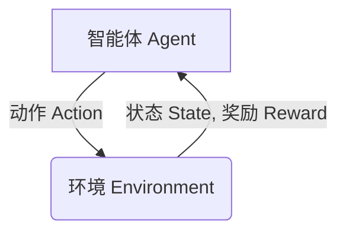

# 一切皆是映射：强化学习在交通规划中的应用：智能交通的挑战与机遇

## 1. 背景介绍

### 1.1 问题的由来

随着城市化进程的加快和汽车保有量的不断增长,交通拥堵已经成为一个全球性难题。交通拥堵不仅严重影响着人们的出行效率,也给城市的环境和经济发展带来了巨大压力。传统的交通规划方法往往依赖于人工经验和固定的规则,难以适应复杂多变的实际交通情况。因此,亟需一种智能化、自适应的交通规划和控制系统来优化交通流量,提高道路利用率,缓解拥堵状况。

### 1.2 研究现状

近年来,随着人工智能技术的飞速发展,强化学习(Reinforcement Learning)作为一种全新的机器学习范式,在交通规划领域展现出了巨大的潜力。强化学习能够通过与环境的互动,自主学习最优策略,并根据实时交通数据动态调整决策。相比于传统的规则库方法,强化学习具有更强的自适应性和鲁棒性,能够更好地应对复杂的交通场景。

目前,已有多个研究团队在交通信号控制、路网优化、车辆路径规划等领域应用了强化学习算法,取得了令人鼓舞的成果。但是,将强化学习应用于实际的城市交通系统仍然面临着诸多挑战,例如高维状态空间、部分可观测性、多智能体协作等,需要进一步的研究和探索。

### 1.3 研究意义

交通规划是一个涉及多个领域、多重目标的复杂系统问题。通过将强化学习引入交通规划,可以实现以下目标:

1. 提高交通系统的整体效率,减少拥堵时间和燃料消耗。
2. 增强交通系统的自适应性和鲁棒性,更好地应对突发事件和不确定因素。
3. 实现多目标优化,平衡交通效率、环境影响和公平性等多重目标。
4. 为智能交通系统的发展提供新的技术手段和理论基础。

总的来说,强化学习在交通规划领域的应用具有重要的理论意义和现实意义,值得深入研究和探索。

### 1.4 本文结构

本文将全面介绍强化学习在交通规划中的应用。首先阐述强化学习的核心概念和基本原理,然后详细讨论在交通规划中的建模方法和算法实现,并通过案例分析说明其实际应用。最后,探讨了该领域的未来发展趋势和面临的挑战。全文共分为以下几个部分:

- 核心概念与联系
- 核心算法原理与具体操作步骤
- 数学模型和公式详细讲解与举例说明
- 项目实践:代码实例和详细解释说明
- 实际应用场景
- 工具和资源推荐
- 总结:未来发展趋势与挑战
- 附录:常见问题与解答

## 2. 核心概念与联系

强化学习(Reinforcement Learning)是一种基于环境互动的机器学习范式,其核心思想是让智能体(Agent)通过与环境(Environment)的交互,自主学习获取最大累积奖励的最优策略(Policy)。

在强化学习系统中,智能体根据当前状态选择一个动作,环境接收该动作并转移到下一个状态,同时返回一个奖励值给智能体。智能体的目标是通过不断尝试和学习,找到一个能够最大化预期累积奖励的最优策略。这个过程可以建模为一个马尔可夫决策过程(Markov Decision Process, MDP)。

强化学习与监督学习和无监督学习有着本质的区别。它不需要给定正确答案的标签数据,而是通过与环境的互动来获取反馈信号(奖励),从而逐步改进策略。这使得强化学习在没有明确目标函数的复杂问题中具有独特的优势。

在交通规划中,我们可以将交通网络视为环境,交通信号控制器或路径规划算法作为智能体。通过合理设计状态、动作和奖励函数,智能体可以学习到优化交通流量、减少拥堵的最优策略。

强化学习在交通规划中的应用涉及以下几个关键概念:

- **马尔可夫决策过程(MDP)**: 用于建模交通系统的状态转移和决策过程。
- **策略(Policy)**: 智能体在各个状态下选择动作的策略,是强化学习的最终目标。
- **价值函数(Value Function)**: 评估一个状态或状态-动作对在遵循某策略时的预期累积奖励。
- **Q-Learning**: 一种常用的强化学习算法,通过估计Q值函数来近似最优策略。
- **深度强化学习(Deep Reinforcement Learning)**: 将深度神经网络应用于强化学习,用于处理高维状态和动作空间。
- **多智能体系统(Multi-Agent System)**: 多个智能体在同一环境中互相影响和协作的系统,适用于复杂的交通场景。

通过将这些概念有机结合,强化学习为交通规划问题提供了一种全新的解决思路和技术手段。

## 3. 核心算法原理与具体操作步骤

### 3.1 算法原理概述

强化学习算法的核心思想是通过与环境的互动,不断更新策略或价值函数,逐步获得最优策略。根据是否需要建模环境的转移概率,强化学习算法可分为基于模型(Model-Based)和无模型(Model-Free)两大类。

**基于模型算法**首先需要估计环境的状态转移概率和奖励函数,然后利用动态规划或其他优化方法求解最优策略。这类算法具有较高的样本效率,但需要已知环境模型或能够精确估计环境模型。

**无模型算法**则直接通过与环境交互获取的经验数据,使用时序差分(Temporal Difference)或蒙特卡罗方法来更新价值函数或策略,无需建模环境。这类算法更加通用,但样本效率较低。

在交通规划中,由于环境模型的复杂性和不确定性,无模型算法(如Q-Learning和策略梯度算法)被更广泛地应用。近年来,结合深度神经网络的深度强化学习算法也展现出了巨大的潜力。

### 3.2 算法步骤详解

以Q-Learning算法为例,其核心步骤如下:

1. **初始化**: 初始化Q值函数,可以使用任意合理的初始值。
2. **选择动作**: 根据当前状态和Q值函数,选择一个动作。通常采用$\epsilon$-贪婪策略,即以$1-\epsilon$的概率选择当前Q值最大的动作,以$\epsilon$的概率随机选择一个动作(探索)。
3. **执行动作并观测结果**: 执行所选动作,观测环境的反馈(下一个状态和奖励)。
4. **更新Q值函数**: 根据观测到的结果,使用下式更新Q值函数:

$$Q(s_t, a_t) \leftarrow Q(s_t, a_t) + \alpha \left[ r_t + \gamma \max_{a}Q(s_{t+1}, a) - Q(s_t, a_t) \right]$$

其中:
- $\alpha$是学习率,控制更新幅度。
- $\gamma$是折现因子,表示对未来奖励的衰减程度。
- $r_t$是在状态$s_t$执行动作$a_t$后获得的即时奖励。
- $\max_{a}Q(s_{t+1}, a)$是在下一状态$s_{t+1}$下可获得的最大Q值,表示预期的未来奖励。

5. **重复步骤2-4**: 不断与环境交互,更新Q值函数,直至收敛。

通过上述过程,Q-Learning算法可以逐步找到最优的Q值函数,从而得到最优策略:在每个状态下,选择Q值最大的动作即为最优动作。

### 3.3 算法优缺点

Q-Learning算法的主要优点是:

- 无需建模环境,通用性强。
- 离线学习,可以利用历史数据。
- 收敛性理论保证,能够找到最优策略。

但也存在一些缺点:

- 状态空间和动作空间较大时,Q表难以存储和更新。
- 探索和利用两个目标之间需要平衡。
- 部分可观测环境下,学习效率较低。

为了克服这些缺点,研究人员提出了多种改进方法,如深度Q网络(DQN)、双重Q学习、优先经验回放等。这些方法通过引入深度神经网络、改进探索策略、提高样本利用效率等手段,显著提升了Q-Learning在高维、部分可观测环境下的性能。

### 3.4 算法应用领域

强化学习算法在交通规划中的应用领域主要包括:

1. **交通信号控制**: 将交通信号控制器视为智能体,通过调整信号周期和相位,优化车流通行效率。
2. **路网优化**: 在城市路网层面,优化道路网络结构、车道分配和交通管制措施,提高整体通行能力。
3. **车辆路径规划**: 为单个车辆规划出最优路径,避开拥堵路段,缩短行驶时间和燃料消耗。
4. **智能交通调度**: 协调多个交通参与者(车辆、行人等)的行为,实现整体的交通流畅和安全。

除交通规划外,强化学习在机器人控制、游戏AI、自动驾驶、资源调度等领域也有广泛的应用。

## 4. 数学模型和公式详细讲解与举例说明

### 4.1 数学模型构建

在交通规划中应用强化学习算法之前,需要首先构建问题的数学模型。通常可以将交通系统建模为一个马尔可夫决策过程(MDP),由一个五元组$(S, A, P, R, \gamma)$表示:

- $S$是状态空间集合,描述交通系统的当前状态。
- $A$是动作空间集合,表示智能体可执行的动作。
- $P(s' | s, a)$是状态转移概率,即在状态$s$执行动作$a$后,转移到状态$s'$的概率。
- $R(s, a, s')$是奖励函数,定义在状态$s$执行动作$a$后转移到状态$s'$时获得的即时奖励。
- $\gamma \in [0, 1)$是折现因子,表示对未来奖励的衰减程度。

在具体问题中,状态空间、动作空间、转移概率和奖励函数的设计是关键。一个好的设计应该能够准确反映实际问题,同时保持一定的简洁性,以提高算法的计算效率。

### 4.2 公式推导过程

在Q-Learning算法中,我们希望找到一个最优的Q值函数$Q^*(s, a)$,它表示在状态$s$执行动作$a$后,按照最优策略$\pi^*$可获得的预期累积奖励。根据贝尔曼最优性方程,最优Q值函数应该满足:

$$Q^*(s, a) = \mathbb{E}_{s' \sim P(\cdot | s, a)} \left[ R(s, a, s') + \gamma \max_{a'} Q^*(s', a') \right]$$

其中$\mathbb{E}_{s' \sim P(\cdot | s, a)}[\cdot]$表示对下一状态$s'$按照转移概率$P(s' | s, a)$进行期望计算。

我们可以将上式视为一个函数逼近问题,使用时序差分(Temporal Difference)方法来迭代更新Q值函数,从而逐步逼近最优解。具体的Q-Learning更新规则为:

$$Q(s_t, a_t) \leftarrow Q(s_t, a_t) + \alpha \left[ r_t + \gamma \max_{a}Q(s_{t+1}, a) - Q(s_t, a_t) \right]$$

其中$\alpha$是学习率,控制更新幅度。可以证明,在满足适当条件下,Q-Learning算法将收敛到最优Q值函数。

### 4.3 案例分析与讲解

以交通信号控制为例,我们可以构建