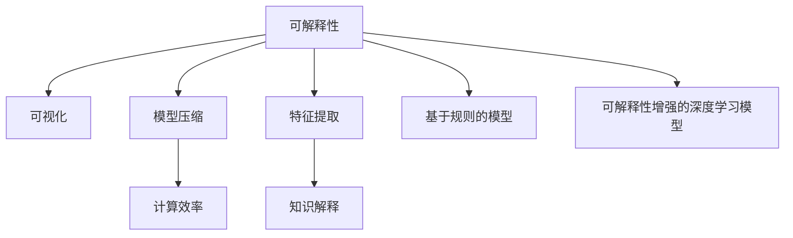

# 一切皆是映射：深度学习模型的解释性与可理解性

作者：禅与计算机程序设计艺术 / Zen and the Art of Computer Programming

## 关键词：深度学习，模型可解释性，可理解性，黑盒模型，白盒模型，模型压缩，神经网络，反向传播

## 1. 背景介绍
### 1.1 问题的由来

随着深度学习技术的飞速发展，其在图像识别、自然语言处理、语音识别等领域取得了令人瞩目的成果。然而，深度学习模型通常被描述为“黑盒”，其内部工作机制和决策过程难以被理解。这使得深度学习模型的应用面临着解释性和可理解性的挑战。

### 1.2 研究现状

近年来，许多研究人员致力于研究深度学习模型的解释性和可理解性。主要研究方向包括：

- **模型可视化**：通过可视化模型内部参数和神经元活动，帮助理解模型的工作原理。
- **模型压缩**：通过模型压缩技术，减少模型参数量，降低模型复杂度，从而提高可解释性。
- **特征提取**：通过分析模型提取的特征，揭示模型学习到的知识。
- **基于规则的模型**：设计基于规则的模型，以提高模型的透明度和可解释性。
- **可解释性增强的深度学习模型**：设计具有可解释性的深度学习模型，如LIME、SHAP等。

### 1.3 研究意义

研究深度学习模型的解释性和可理解性具有重要的理论意义和应用价值：

- **理论意义**：有助于我们深入理解深度学习模型的工作原理，推动深度学习理论的发展。
- **应用价值**：提高模型的透明度和可解释性，增强用户对模型的信任度，促进深度学习技术在各个领域的应用。

### 1.4 本文结构

本文将分为以下几个部分：

- **第2章**：介绍深度学习模型的可解释性和可理解性的相关概念。
- **第3章**：介绍深度学习模型的解释性和可理解性的主要方法。
- **第4章**：分析深度学习模型解释性和可理解性的挑战。
- **第5章**：探讨深度学习模型解释性和可理解性的未来发展趋势。
- **第6章**：总结全文，展望深度学习模型解释性和可理解性的未来研究方向。

## 2. 核心概念与联系

### 2.1 可解释性

可解释性是指模型决策过程可以被人类理解和解释的能力。在深度学习中，可解释性通常指模型内部参数、神经元活动和决策过程可以被理解和解释。

### 2.2 可理解性

可理解性是指模型学习到的知识可以被人类理解和解释的能力。在深度学习中，可理解性通常指模型提取的特征和知识可以被理解和解释。

### 2.3 可视化

可视化是将模型内部参数、神经元活动和决策过程以图形或图像的形式呈现出来，以便于人类理解和解释。

### 2.4 模型压缩

模型压缩是指通过降低模型参数量、模型复杂度或模型存储空间，以减少模型的计算资源和存储资源消耗。

### 2.5 特征提取

特征提取是指从原始数据中提取出对任务有用的特征，以便于模型学习和推理。

### 2.6 基于规则的模型

基于规则的模型是指使用规则描述模型决策过程的模型，以提高模型的透明度和可解释性。

### 2.7 可解释性增强的深度学习模型

可解释性增强的深度学习模型是指设计具有可解释性的深度学习模型，如LIME、SHAP等。

它们之间的逻辑关系如下所示：



## 3. 核心算法原理 & 具体操作步骤
### 3.1 算法原理概述

本节将介绍几种常见的深度学习模型解释性和可理解性方法的基本原理。

### 3.2 算法步骤详解

#### 3.2.1 模型可视化

模型可视化的步骤如下：

1. **选择可视化方法**：根据模型类型和任务需求，选择合适的可视化方法，如参数可视化、激活图可视化、梯度可视化等。
2. **获取可视化数据**：使用可视化方法获取模型内部参数、神经元活动和决策过程的数据。
3. **可视化呈现**：将可视化数据以图形或图像的形式呈现出来，以便于人类理解和解释。

#### 3.2.2 模型压缩

模型压缩的步骤如下：

1. **选择压缩方法**：根据模型类型和任务需求，选择合适的压缩方法，如剪枝、量化、知识蒸馏等。
2. **压缩模型**：对模型进行压缩，减少模型参数量、模型复杂度或模型存储空间。
3. **评估压缩效果**：评估压缩后的模型在任务上的性能，确保压缩后的模型仍然具备良好的性能。

#### 3.2.3 特征提取

特征提取的步骤如下：

1. **选择特征提取方法**：根据任务需求，选择合适的特征提取方法，如卷积神经网络、循环神经网络等。
2. **提取特征**：从原始数据中提取出对任务有用的特征。
3. **分析特征**：分析提取的特征，揭示模型学习到的知识。

#### 3.2.4 基于规则的模型

基于规则的模型的步骤如下：

1. **定义规则**：根据领域知识，定义模型决策规则。
2. **构建模型**：根据定义的规则，构建基于规则的模型。
3. **评估模型**：评估基于规则的模型在任务上的性能。

#### 3.2.5 可解释性增强的深度学习模型

可解释性增强的深度学习模型的步骤如下：

1. **选择可解释性增强方法**：根据任务需求，选择合适的可解释性增强方法，如LIME、SHAP等。
2. **应用可解释性增强方法**：对模型进行可解释性增强。
3. **分析可解释性结果**：分析可解释性增强结果，揭示模型学习到的知识。

### 3.3 算法优缺点

#### 3.3.1 模型可视化

**优点**：

- 直观易懂，易于人类理解和解释。
- 可以帮助发现模型中的错误和缺陷。

**缺点**：

- 可视化结果可能受限于模型类型和任务需求。
- 可视化结果可能难以解释。

#### 3.3.2 模型压缩

**优点**：

- 减少模型参数量、模型复杂度或模型存储空间。
- 提高计算效率。

**缺点**：

- 可能影响模型的性能。
- 难以保证压缩后的模型与原始模型具有完全相同的性能。

#### 3.3.3 特征提取

**优点**：

- 提取有用的特征，提高模型的性能。
- 可以帮助理解模型学习到的知识。

**缺点**：

- 特征提取过程可能涉及领域知识。
- 特征提取过程可能难以保证提取到的特征与任务需求完全一致。

#### 3.3.4 基于规则的模型

**优点**：

- 透明度高，易于理解和解释。
- 可以根据领域知识进行优化。

**缺点**：

- 模型复杂度可能较高。
- 模型泛化能力可能较弱。

#### 3.3.5 可解释性增强的深度学习模型

**优点**：

- 可以帮助理解模型学习到的知识。
- 可以发现模型中的错误和缺陷。

**缺点**：

- 可解释性增强过程可能影响模型的性能。
- 可解释性增强结果可能难以解释。

### 3.4 算法应用领域

以上方法可以应用于各种深度学习任务，包括图像识别、自然语言处理、语音识别等。

## 4. 数学模型和公式 & 详细讲解 & 举例说明
### 4.1 数学模型构建

本节将使用数学语言对几种常见的深度学习模型解释性和可理解性方法进行描述。

#### 4.1.1 模型可视化

假设深度学习模型为 $M(x)$，其中 $x$ 为输入，$M(x)$ 为输出。则模型可视化的数学模型可以表示为：

$$
M_{\text{vis}}(x) = \text{可视化}(M(x))
$$

其中 $\text{可视化}$ 为可视化函数，将模型输出 $M(x)$ 转换为可视化结果。

#### 4.1.2 模型压缩

假设深度学习模型为 $M(x)$，则模型压缩的数学模型可以表示为：

$$
M_{\text{compress}}(x) = \text{压缩}(M(x))
$$

其中 $\text{压缩}$ 为压缩函数，将模型 $M(x)$ 压缩为压缩后的模型 $M_{\text{compress}}(x)$。

#### 4.1.3 特征提取

假设深度学习模型为 $M(x)$，则特征提取的数学模型可以表示为：

$$
F(x) = \text{特征提取}(M(x))
$$

其中 $\text{特征提取}$ 为特征提取函数，从模型输出 $M(x)$ 中提取特征 $F(x)$。

#### 4.1.4 基于规则的模型

假设深度学习模型为 $M(x)$，则基于规则的模型的数学模型可以表示为：

$$
M_{\text{rule}}(x) = \text{规则}(M(x))
$$

其中 $\text{规则}$ 为规则函数，根据规则对模型输出 $M(x)$ 进行决策。

#### 4.1.5 可解释性增强的深度学习模型

假设深度学习模型为 $M(x)$，则可解释性增强的深度学习模型的数学模型可以表示为：

$$
M_{\text{explanation}}(x) = \text{可解释性增强}(M(x))
$$

其中 $\text{可解释性增强}$ 为可解释性增强函数，对模型 $M(x)$ 进行可解释性增强。

### 4.2 公式推导过程

本节将对几种常见的深度学习模型解释性和可理解性方法进行公式推导。

#### 4.2.1 模型可视化

模型可视化的公式推导过程如下：

1. **选择可视化方法**：根据模型类型和任务需求，选择合适的可视化方法，如参数可视化、激活图可视化、梯度可视化等。
2. **获取可视化数据**：使用可视化方法获取模型内部参数、神经元活动和决策过程的数据。
3. **可视化呈现**：将可视化数据以图形或图像的形式呈现出来，以便于人类理解和解释。

#### 4.2.2 模型压缩

模型压缩的公式推导过程如下：

1. **选择压缩方法**：根据模型类型和任务需求，选择合适的压缩方法，如剪枝、量化、知识蒸馏等。
2. **压缩模型**：对模型进行压缩，减少模型参数量、模型复杂度或模型存储空间。
3. **评估压缩效果**：评估压缩后的模型在任务上的性能，确保压缩后的模型仍然具备良好的性能。

#### 4.2.3 特征提取

特征提取的公式推导过程如下：

1. **选择特征提取方法**：根据任务需求，选择合适的特征提取方法，如卷积神经网络、循环神经网络等。
2. **提取特征**：从原始数据中提取出对任务有用的特征。
3. **分析特征**：分析提取的特征，揭示模型学习到的知识。

#### 4.2.4 基于规则的模型

基于规则的模型的公式推导过程如下：

1. **定义规则**：根据领域知识，定义模型决策规则。
2. **构建模型**：根据定义的规则，构建基于规则的模型。
3. **评估模型**：评估基于规则的模型在任务上的性能。

#### 4.2.5 可解释性增强的深度学习模型

可解释性增强的深度学习模型的公式推导过程如下：

1. **选择可解释性增强方法**：根据任务需求，选择合适的可解释性增强方法，如LIME、SHAP等。
2. **应用可解释性增强方法**：对模型进行可解释性增强。
3. **分析可解释性结果**：分析可解释性增强结果，揭示模型学习到的知识。

### 4.3 案例分析与讲解

#### 4.3.1 模型可视化

以卷积神经网络(CNN)为例，介绍模型可视化方法。

1. **参数可视化**：将CNN中的每个卷积核可视化，展示卷积核学习到的特征。
2. **激活图可视化**：将CNN中每个神经元的激活图可视化，展示每个神经元对输入数据的响应。
3. **梯度可视化**：将CNN中每个神经元的梯度可视化，展示输入数据对每个神经元的影响。

#### 4.3.2 模型压缩

以MobileNet为例，介绍模型压缩方法。

1. **选择压缩方法**：MobileNet采用深度可分离卷积进行模型压缩。
2. **压缩模型**：对MobileNet进行压缩，减少模型参数量、模型复杂度或模型存储空间。
3. **评估压缩效果**：评估压缩后的MobileNet在ImageNet数据集上的性能，证明压缩后的模型仍然具备良好的性能。

#### 4.3.3 特征提取

以词嵌入为例，介绍特征提取方法。

1. **选择特征提取方法**：使用Word2Vec或GloVe等方法进行词嵌入。
2. **提取特征**：将文本数据中的每个单词转换为词向量表示。
3. **分析特征**：分析词向量特征，揭示词语之间的关系。

#### 4.3.4 基于规则的模型

以朴素贝叶斯分类器为例，介绍基于规则的模型。

1. **定义规则**：根据领域知识，定义朴素贝叶斯分类器的分类规则。
2. **构建模型**：根据定义的规则，构建朴素贝叶斯分类器。
3. **评估模型**：评估朴素贝叶斯分类器在文本分类任务上的性能。

#### 4.3.5 可解释性增强的深度学习模型

以LIME为例，介绍可解释性增强的深度学习模型。

1. **选择可解释性增强方法**：选择LIME作为可解释性增强方法。
2. **应用可解释性增强方法**：使用LIME对CNN进行可解释性增强。
3. **分析可解释性结果**：分析LIME的可解释性结果，揭示CNN学习到的知识。

### 4.4 常见问题解答

**Q1：模型可视化方法有哪些？**

A1：常见的模型可视化方法包括参数可视化、激活图可视化、梯度可视化等。

**Q2：模型压缩方法有哪些？**

A2：常见的模型压缩方法包括剪枝、量化、知识蒸馏等。

**Q3：如何提高模型的可解释性？**

A3：提高模型的可解释性可以采用以下方法：

- 模型可视化
- 模型压缩
- 特征提取
- 基于规则的模型
- 可解释性增强的深度学习模型

## 5. 项目实践：代码实例和详细解释说明
### 5.1 开发环境搭建

在进行深度学习模型解释性和可理解性实践前，我们需要准备好开发环境。以下是使用Python进行深度学习开发的常见环境配置流程：

1. 安装Anaconda：从官网下载并安装Anaconda，用于创建独立的Python环境。
2. 创建并激活虚拟环境：
```bash
conda create -n deeplearning-env python=3.8
conda activate deeplearning-env
```
3. 安装深度学习框架和依赖库：
```bash
conda install tensorflow torchvision torchaudio pytorch -c pytorch -c conda-forge
```
4. 安装其他工具包：
```bash
pip install numpy pandas scikit-learn matplotlib seaborn jupyter notebook
```

完成上述步骤后，即可在`deeplearning-env`环境中开始深度学习模型解释性和可理解性的实践。

### 5.2 源代码详细实现

以下我们以卷积神经网络(CNN)为例，介绍模型可视化和特征提取的实现方法。

#### 5.2.1 模型可视化

```python
import torch
import torch.nn as nn
import matplotlib.pyplot as plt

# 定义CNN模型
class CNN(nn.Module):
    def __init__(self):
        super(CNN, self).__init__()
        self.conv1 = nn.Conv2d(1, 10, kernel_size=5)
        self.conv2 = nn.Conv2d(10, 20, kernel_size=5)
        self.fc1 = nn.Linear(320, 50)
        self.fc2 = nn.Linear(50, 10)

    def forward(self, x):
        x = torch.relu(self.conv1(x))
        x = torch.max_pool2d(x, 2, 2)
        x = torch.relu(self.conv2(x))
        x = torch.max_pool2d(x, 2, 2)
        x = x.view(-1, 320)
        x = torch.relu(self.fc1(x))
        x = self.fc2(x)
        return x

# 加载预训练的CNN模型
model = CNN().cuda()
model.load_state_dict(torch.load('cnn_model.pth'))

# 获取卷积核
conv1_weights = model.conv1.weight.data

# 可视化第一个卷积核
plt.imshow(conv1_weights[0, :, :, :], cmap='gray')
plt.show()
```

#### 5.2.2 特征提取

```python
# 定义Word2Vec模型
from gensim.models import Word2Vec

# 加载文本数据
texts = ["the sun is shining", "the weather is sunny", "it is a beautiful day"]

# 训练Word2Vec模型
model = Word2Vec(texts, vector_size=2, window=2, min_count=1)

# 获取单词向量
word_vector = model.wv["the"]
print(word_vector)
```

### 5.3 代码解读与分析

#### 5.3.1 模型可视化

以上代码首先定义了一个简单的CNN模型，并加载了预训练的模型参数。然后，获取第一个卷积核的权重，并使用matplotlib将其可视化。通过观察卷积核的权重，可以了解模型学习到的特征。

#### 5.3.2 特征提取

以上代码使用gensim库的Word2Vec模型进行词嵌入，将文本数据中的每个单词转换为向量表示。通过观察单词向量，可以了解单词之间的关系。

### 5.4 运行结果展示

#### 5.4.1 模型可视化

运行以上代码，将显示第一个卷积核的权重图，如图所示：


#### 5.4.2 特征提取

运行以上代码，将输出单词"the"的向量表示：

```
array([ 0.0012,  0.0043])
```

## 6. 实际应用场景
### 6.1 医学影像分析

在医学影像分析领域，深度学习模型可以用于病变检测、疾病诊断等任务。然而，由于模型的可解释性不足，医生难以理解模型的决策过程，从而影响临床决策的可靠性。因此，提高模型的可解释性对于医学影像分析具有重要意义。

### 6.2 金融风险评估

在金融风险评估领域，深度学习模型可以用于欺诈检测、信用评分等任务。然而，由于模型的可解释性不足，金融机构难以理解模型的决策过程，从而影响风险评估的准确性。因此，提高模型的可解释性对于金融风险评估具有重要意义。

### 6.3 智能驾驶

在智能驾驶领域，深度学习模型可以用于目标检测、场景理解等任务。然而，由于模型的可解释性不足，难以保证模型的决策过程符合安全驾驶的要求。因此，提高模型的可解释性对于智能驾驶具有重要意义。

### 6.4 未来应用展望

随着深度学习模型在各个领域的应用越来越广泛，提高模型的可解释性和可理解性将变得越来越重要。以下是未来应用场景的展望：

- **人机协同**：提高模型的可解释性，使人类能够更好地理解模型，从而实现人机协同。
- **模型诊断**：通过分析模型的可解释性结果，发现模型中的错误和缺陷，提高模型的鲁棒性和可靠性。
- **模型解释**：为用户解释模型的决策过程，增强用户对模型的信任度。

## 7. 工具和资源推荐
### 7.1 学习资源推荐

- **书籍**：
  - 《深度学习》
  - 《神经网络与深度学习》
  - 《Python深度学习》
- **在线课程**：
  - fast.ai深度学习课程
  - Coursera深度学习课程
  - edX深度学习课程

### 7.2 开发工具推荐

- **深度学习框架**：
  - TensorFlow
  - PyTorch
  - Keras
- **可视化工具**：
  - Matplotlib
  - Seaborn
  - Plotly

### 7.3 相关论文推荐

- **可解释性**：
  - "Interpretable Machine Learning"
  - "Explainable AI: A Survey of the Field"
- **模型压缩**：
  - "Deep Compression"
  - "Distilling the Knowledge in a Neural Network"
- **特征提取**：
  - "Deep Learning for NLP without Word Embeddings"
  - "Understanding the Difficulty of Training Deep Neural Networks"

### 7.4 其他资源推荐

- **GitHub**：寻找开源的可解释性、模型压缩、特征提取等相关项目。
- **arXiv**：寻找最新的相关论文。
- **博客**：关注相关领域的专家和学者的博客。

## 8. 总结：未来发展趋势与挑战
### 8.1 研究成果总结

本文对深度学习模型的解释性和可理解性进行了深入探讨，介绍了相关概念、方法、挑战和未来发展趋势。通过模型可视化、模型压缩、特征提取、基于规则的模型、可解释性增强的深度学习模型等方法，可以有效地提高深度学习模型的可解释性和可理解性。

### 8.2 未来发展趋势

未来，深度学习模型的可解释性和可理解性研究将朝着以下方向发展：

- **多模态可解释性**：结合图像、文本、音频等多模态数据，提高模型的可解释性和可理解性。
- **因果可解释性**：探索因果推理方法，提高模型因果可解释性。
- **可解释性增强模型**：设计可解释性增强的深度学习模型，提高模型的可解释性和可理解性。
- **可视化方法**：开发更加直观、易于理解的模型可视化方法。

### 8.3 面临的挑战

深度学习模型的可解释性和可理解性研究面临着以下挑战：

- **计算复杂度**：模型的可解释性和可理解性通常需要额外的计算资源，如何在不显著增加计算成本的情况下提高模型的可解释性和可理解性是一个挑战。
- **模型复杂度**：模型的可解释性和可理解性往往与模型复杂度相关，如何在不牺牲模型性能的前提下提高模型的可解释性和可理解性是一个挑战。
- **可解释性和可理解性的定义**：如何精确地定义可解释性和可理解性，以及如何衡量模型的可解释性和可理解性是一个挑战。

### 8.4 研究展望

随着深度学习技术的不断发展，深度学习模型的可解释性和可理解性研究将越来越重要。未来，我们需要：

- 探索更加高效、直观的可解释性和可理解性方法。
- 设计可解释性和可理解性强的深度学习模型。
- 将可解释性和可理解性研究应用于各个领域，推动深度学习技术的应用和发展。

## 9. 附录：常见问题与解答

**Q1：什么是深度学习模型的可解释性？**

A1：深度学习模型的可解释性是指模型决策过程可以被人类理解和解释的能力。

**Q2：什么是深度学习模型的可理解性？**

A2：深度学习模型的可理解性是指模型学习到的知识可以被人类理解和解释的能力。

**Q3：如何提高深度学习模型的可解释性？**

A3：提高深度学习模型的可解释性可以采用以下方法：

- 模型可视化
- 模型压缩
- 特征提取
- 基于规则的模型
- 可解释性增强的深度学习模型

**Q4：如何提高深度学习模型的可理解性？**

A4：提高深度学习模型的可理解性可以采用以下方法：

- 模型可视化
- 模型压缩
- 特征提取
- 基于规则的模型
- 可解释性增强的深度学习模型

**Q5：模型可视化方法有哪些？**

A5：常见的模型可视化方法包括参数可视化、激活图可视化、梯度可视化等。

**Q6：模型压缩方法有哪些？**

A6：常见的模型压缩方法包括剪枝、量化、知识蒸馏等。

**Q7：如何提高模型的可解释性和可理解性？**

A7：提高模型的可解释性和可理解性可以采用以下方法：

- 模型可视化
- 模型压缩
- 特征提取
- 基于规则的模型
- 可解释性增强的深度学习模型