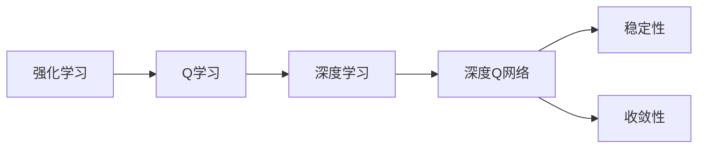

# 一切皆是映射：理解DQN的稳定性与收敛性问题

作者：禅与计算机程序设计艺术 / Zen and the Art of Computer Programming


## 1. 背景介绍
### 1.1 问题的由来

随着深度学习在人工智能领域的蓬勃发展，深度强化学习（Deep Reinforcement Learning, DRL）成为了一个备受关注的研究方向。DRL结合了深度学习强大的特征提取能力和强化学习的动态决策机制，在游戏、机器人、自动驾驶等领域展现出巨大的潜力。

然而，DRL算法在实际应用中往往面临两个核心问题：稳定性和收敛性。其中，深度Q网络（Deep Q-Network，DQN）作为DRL领域的一个里程碑，其稳定性与收敛性问题更是备受关注。本文将深入探讨DQN的稳定性与收敛性原理，并提出相应的解决方案。

### 1.2 研究现状

近年来，针对DQN的稳定性与收敛性问题，学术界和工业界提出了许多改进方法。以下是一些主要的研究方向：

1. **探索-利用平衡（Exploration-Exploitation Balance）**：通过调整探索率（ε）和利用率（1-ε），在探索未知状态和利用已学习到的知识之间取得平衡。

2. **目标网络（Target Network）**：使用一个单独的网络作为目标网络，定期同步与主网络，降低价值函数的方差。

3. **经验回放（Experience Replay）**：将历史经验存储到经验回放池中，随机抽取样本进行训练，提高训练样本的多样性。

4. **优先级采样（Priority Sampling）**：根据样本的重要程度进行采样，将更多注意力放在重要样本上。

5. **双Q学习（Double Q-Learning）**：使用两个网络分别评估动作价值，避免过估计或低估。

6. **异步优势演员评论家（Asynchronous Advantage Actor-Critic，A3C）**：并行训练多个智能体，提高训练效率。

### 1.3 研究意义

深入理解DQN的稳定性与收敛性问题，对于推动DRL算法在实际应用中的发展具有重要意义：

1. 提高DQN算法在复杂环境中的鲁棒性，使其能够更好地适应未知环境。
2. 加快DQN算法的收敛速度，缩短训练周期。
3. 降低DQN算法对超参数的敏感性，提高算法的泛化能力。
4. 促进DRL技术在更多领域的应用，如机器人、自动驾驶、金融等。

### 1.4 本文结构

本文将围绕DQN的稳定性与收敛性问题展开讨论，具体内容如下：

- 第2部分，介绍DQN算法的核心概念与联系。
- 第3部分，详细阐述DQN算法的原理和具体操作步骤。
- 第4部分，分析DQN算法的稳定性与收敛性问题，并给出相应的解决方案。
- 第5部分，给出DQN算法的代码实现示例，并对关键代码进行解读。
- 第6部分，探讨DQN算法的实际应用场景及案例。
- 第7部分，推荐DQN算法相关的学习资源、开发工具和参考文献。
- 第8部分，总结全文，展望DQN算法的未来发展趋势与挑战。
- 第9部分，提供DQN算法的常见问题与解答。

## 2. 核心概念与联系

为了更好地理解DQN算法的稳定性与收敛性问题，本节将介绍以下几个核心概念：

- **强化学习（Reinforcement Learning）**：通过与环境交互，学习如何获取最大累计奖励的机器学习方法。
- **Q学习（Q-Learning）**：一种无模型强化学习方法，通过学习动作-状态价值函数来决策。
- **深度学习（Deep Learning）**：利用深层神经网络对数据进行特征提取和学习的机器学习方法。
- **深度Q网络（Deep Q-Network，DQN）**：结合Q学习和深度学习，通过神经网络逼近动作-状态价值函数的DRL算法。
- **稳定性（Stability）**：指DQN算法在训练过程中，输出结果的波动程度。
- **收敛性（Convergence）**：指DQN算法在训练过程中，价值函数逐渐收敛到最优解的程度。

这些概念之间的逻辑关系如下图所示：



可以看出，深度Q网络是结合了强化学习、Q学习和深度学习的DRL算法。稳定性与收敛性是DQN算法在实际应用中需要重点关注的两个核心指标。

## 3. 核心算法原理 & 具体操作步骤
### 3.1 算法原理概述

深度Q网络（DQN）是一种基于深度学习的强化学习方法，它通过神经网络逼近动作-状态价值函数，从而实现智能体的决策。

DQN算法的核心思想是：对于每个状态，智能体根据当前的状态和动作值函数选择动作，并执行该动作。然后根据执行动作后的状态和奖励，更新动作值函数。这个过程不断重复，直至满足停止条件。

### 3.2 算法步骤详解

DQN算法的主要步骤如下：

**Step 1: 初始化**

1. 初始化一个深度神经网络 $Q(\theta)$ 作为动作值函数逼近器，其中 $\theta$ 为神经网络参数。
2. 初始化经验回放池 $D$，用于存储经验样本。

**Step 2: 选择动作**

1. 根据当前状态 $s_t$，使用epsilon-greedy策略选择动作 $a_t$：
   - 以概率 $\epsilon$ 随机选择动作。
   - 以 $1-\epsilon$ 的概率选择当前状态下的最佳动作。

**Step 3: 执行动作**

1. 执行动作 $a_t$，得到新的状态 $s_{t+1}$ 和奖励 $r_t$。

**Step 4: 更新经验回放池**

1. 将 $(s_t, a_t, r_t, s_{t+1})$ 作为新的经验样本，存储到经验回放池 $D$。

**Step 5: 更新动作值函数**

1. 从经验回放池 $D$ 中随机抽取一个经验样本 $(s', a', r', s'')$。
2. 计算目标值 $y$：
   - $y = r' + \gamma \max_{a''} Q(\theta', s'', a'')$，其中 $\gamma$ 为折扣因子。
3. 使用梯度下降算法更新动作值函数 $Q(\theta)$：
   - $Q(\theta)(s', a') \leftarrow Q(\theta)(s', a') + \alpha [y - Q(\theta)(s', a')]$，其中 $\alpha$ 为学习率。

**Step 6: 迭代**

1. 重复步骤2-5，直至满足停止条件。

### 3.3 算法优缺点

DQN算法的优点如下：

1. **无需环境模型**：DQN算法可以直接应用于无模型环境，无需对环境进行建模。
2. **能够处理高维状态空间**：DQN算法可以使用深度神经网络处理高维状态空间。
3. **自适应学习**：DQN算法可以根据环境的变化自动调整策略。

DQN算法的缺点如下：

1. **收敛速度慢**：DQN算法的收敛速度较慢，需要大量的样本才能收敛到最优策略。
2. **对初始参数敏感**：DQN算法对初始参数比较敏感，容易陷入局部最优。
3. **方差较大**：DQN算法在训练过程中，价值函数的方差较大，容易导致不稳定。

### 3.4 算法应用领域

DQN算法已经在多个领域得到应用，以下是一些典型的应用场景：

- **游戏**：例如，在Atari 2600游戏平台上，DQN算法成功实现了《蒙特祖玛》、《Pong》等游戏的自动游戏。
- **机器人**：例如，DQN算法可以帮助机器人学习完成行走、抓取等任务。
- **自动驾驶**：例如，DQN算法可以帮助自动驾驶汽车学习在复杂环境中行驶。

## 4. 数学模型和公式 & 详细讲解 & 举例说明
### 4.1 数学模型构建

DQN算法的数学模型可以表示为以下公式：

$$
Q(s, a; \theta) = \underset{\phi}{\text{argmin}} \sum_{i=1}^{N} (Q(s, a; \theta) - Q^*(s, a))^2
$$

其中，$Q(s, a; \theta)$ 为动作值函数，$\theta$ 为神经网络参数，$Q^*(s, a)$ 为最优动作值函数。

### 4.2 公式推导过程

DQN算法的目标是最小化动作值函数与最优动作值函数之间的差异，即：

$$
\underset{\theta}{\text{argmin}} \sum_{i=1}^{N} (Q(s, a; \theta) - Q^*(s, a))^2
$$

其中，$Q^*(s, a)$ 为最优动作值函数，可以表示为：

$$
Q^*(s, a) = \max_{a'} Q^*(s, a')
$$

因此，DQN算法的数学模型可以表示为：

$$
Q(s, a; \theta) = \underset{\phi}{\text{argmin}} \sum_{i=1}^{N} (Q(s, a; \theta) - \max_{a'} Q^*(s, a'))^2
$$

### 4.3 案例分析与讲解

以下以Atari 2600游戏《蒙特祖玛》为例，分析DQN算法的应用。

在《蒙特祖玛》游戏中，智能体需要在游戏中不断收集宝石，避免游戏失败。

DQN算法的目标是学习一个策略，使得智能体能够在游戏中获得最大的累计奖励。

具体步骤如下：

1. 初始化动作值函数 $Q(s, a; \theta)$ 和经验回放池 $D$。
2. 对于每个游戏帧，智能体根据epsilon-greedy策略选择动作 $a_t$。
3. 执行动作 $a_t$，得到新的状态 $s_{t+1}$ 和奖励 $r_t$。
4. 将 $(s_t, a_t, r_t, s_{t+1})$ 作为新的经验样本，存储到经验回放池 $D$。
5. 从经验回放池 $D$ 中随机抽取一个经验样本 $(s', a', r', s'')$。
6. 计算目标值 $y$：
   - $y = r' + \gamma \max_{a''} Q(\theta', s'', a'')$，其中 $\gamma$ 为折扣因子。
7. 使用梯度下降算法更新动作值函数 $Q(\theta)$：
   - $Q(\theta)(s', a') \leftarrow Q(\theta)(s', a') + \alpha [y - Q(\theta)(s', a')]$，其中 $\alpha$ 为学习率。
8. 重复步骤2-7，直至满足停止条件。

通过不断训练，DQN算法可以学习到在《蒙特祖玛》游戏中获得最大累计奖励的策略。

### 4.4 常见问题解答

**Q1：DQN算法是如何解决高维状态空间问题的？**

A：DQN算法使用深度神经网络来逼近动作-状态价值函数，从而可以处理高维状态空间。深度神经网络具有强大的特征提取能力，可以从高维数据中提取出有用的特征，从而实现有效的决策。

**Q2：DQN算法的epsilon-greedy策略是什么意思？**

A：epsilon-greedy策略是一种在随机选择动作和选择当前状态下的最佳动作之间取得平衡的策略。具体来说，以概率 $\epsilon$ 随机选择动作，以 $1-\epsilon$ 的概率选择当前状态下的最佳动作。

**Q3：DQN算法中的经验回放池有什么作用？**

A：经验回放池的作用是存储历史经验样本，用于训练动作值函数。经验回放池可以有效地提高训练样本的多样性，避免过拟合，从而提高DQN算法的性能。

## 5. 项目实践：代码实例和详细解释说明
### 5.1 开发环境搭建

在进行DQN算法的实践前，我们需要准备好开发环境。以下是使用Python进行TensorFlow开发的环境配置流程：

1. 安装Anaconda：从官网下载并安装Anaconda，用于创建独立的Python环境。

2. 创建并激活虚拟环境：
```bash
conda create -n tensorflow-env python=3.8
conda activate tensorflow-env
```

3. 安装TensorFlow：从官网获取安装命令。例如：
```bash
pip install tensorflow==2.x
```

4. 安装其他依赖库：
```bash
pip install numpy gym gym-wrapper
```

完成上述步骤后，即可在`tensorflow-env`环境中开始DQN算法的实践。

### 5.2 源代码详细实现

以下是一个简单的DQN算法的PyTorch实现示例：

```python
import torch
import torch.nn as nn
import torch.optim as optim
import gym
from collections import deque
import random
import numpy as np

# 定义DQN网络
class DQN(nn.Module):
    def __init__(self, state_dim, action_dim):
        super(DQN, self).__init__()
        self.fc1 = nn.Linear(state_dim, 24)
        self.fc2 = nn.Linear(24, 24)
        self.fc3 = nn.Linear(24, action_dim)

    def forward(self, x):
        x = torch.relu(self.fc1(x))
        x = torch.relu(self.fc2(x))
        return self.fc3(x)

# 定义DQN算法
class DQN:
    def __init__(self, state_dim, action_dim, learning_rate, gamma):
        self.state_dim = state_dim
        self.action_dim = action_dim
        self.gamma = gamma
        self.model = DQN(state_dim, action_dim)
        self.optimizer = optim.Adam(self.model.parameters(), lr=learning_rate)
        self.memory = deque(maxlen=2000)

    def remember(self, state, action, reward, next_state, done):
        self.memory.append((state, action, reward, next_state, done))

    def act(self, state, epsilon):
        if random.random() <= epsilon:
            return random.randrange(self.action_dim)
        with torch.no_grad():
            state = torch.from_numpy(state).float().unsqueeze(0)
            action_values = self.model(state)
            return action_values.argmax().item()

    def replay(self, batch_size):
        experiences = random.sample(self.memory, batch_size)
        states, actions, rewards, next_states, dones = zip(*experiences)
        states = torch.from_numpy(np.vstack(states)).float().unsqueeze(1)
        actions = torch.from_numpy(np.vstack(actions)).long()
        rewards = torch.from_numpy(np.vstack(rewards)).float()
        next_states = torch.from_numpy(np.vstack(next_states)).float().unsqueeze(1)
        dones = torch.from_numpy(np.vstack(dones)).float()
        Q_targets = rewards + self.gamma * torch.max(self.model(next_states).data, 1)[0] * (1 - dones)
        Q_expected = self.model(states).gather(1, actions)
        loss = nn.MSELoss()(Q_expected, Q_targets)
        self.optimizer.zero_grad()
        loss.backward()
        self.optimizer.step()

    def load(self, name):
        self.model.load_state_dict(torch.load(name))

    def save(self, name):
        torch.save(self.model.state_dict(), name)
```

### 5.3 代码解读与分析

以下是DQN算法代码的关键部分解读：

- `DQN`类：定义了DQN算法的核心功能，包括初始化网络结构、存储经验样本、选择动作、回放经验、重放经验等。
- `act`方法：根据epsilon-greedy策略选择动作。
- `replay`方法：从经验回放池中抽取经验样本，计算目标值，并更新动作值函数。
- `load`和`save`方法：用于加载和保存模型参数。

### 5.4 运行结果展示

以下是一个使用DQN算法进行Atari 2600游戏《蒙特祖玛》的示例：

```python
import gym

env = gym.make('MontezumaRevenge-v0')
state_dim = env.observation_space.shape[0]
action_dim = env.action_space.n

dqn_agent = DQN(state_dim, action_dim, learning_rate=0.001, gamma=0.99)
episodes = 200

for e in range(episodes):
    state = env.reset()
    state = np.reshape(state, (1, state_dim))
    for time in range(500):
        action = dqn_agent.act(state, epsilon=0.1)
        state, reward, done, _ = env.step(action)
        next_state = np.reshape(state, (1, state_dim))
        dqn_agent.remember(state, action, reward, next_state, done)
        state = next_state
        if done:
            print(f"Episode: {e}, Time: {time}, Reward: {reward}")
            break
    if e % 10 == 0:
        dqn_agent.save(f"MontezumaRevenge-v0_dqn_{e}.pth")
```

运行上述代码，可以看到DQN算法在《蒙特祖玛》游戏中的训练过程。经过多次训练，DQN算法可以学会在游戏中获得较高的分数。

## 6. 实际应用场景
### 6.1 游戏领域

DQN算法在游戏领域取得了显著的成果，例如：

- **Atari 2600游戏**：DQN算法在多个Atari 2600游戏上取得了人类水平的表现。
- **OpenAI Gym环境**：DQN算法在OpenAI Gym环境中取得了多个基准任务的SOTA性能。

### 6.2 机器人领域

DQN算法在机器人领域也得到了广泛应用，例如：

- **导航机器人**：DQN算法可以帮助机器人学习在复杂环境中进行导航。
- **抓取机器人**：DQN算法可以帮助机器人学习完成物品抓取任务。

### 6.3 自动驾驶领域

DQN算法在自动驾驶领域也有潜在的应用价值，例如：

- **环境感知**：DQN算法可以帮助自动驾驶汽车学习识别道路、车辆、行人等环境信息。
- **路径规划**：DQN算法可以帮助自动驾驶汽车学习规划安全、高效的行驶路径。

## 7. 工具和资源推荐
### 7.1 学习资源推荐

为了帮助开发者系统掌握DQN算法的理论基础和实践技巧，这里推荐一些优质的学习资源：

1. **《Deep Reinforcement Learning》书籍**：由Pieter Abbeel和Alexander MIMEau所著，全面介绍了深度强化学习的理论知识、算法实现和实际应用。
2. **OpenAI Gym**：一个开源的强化学习环境库，提供了丰富的游戏和机器人环境，方便开发者进行DQN算法的实践和测试。
3. **DQN算法开源实现**：在GitHub上，有许多开源的DQN算法实现，可以供开发者学习和参考。
4. **相关学术论文**：可以查阅DQN算法的相关学术论文，了解算法的原理和最新研究进展。

### 7.2 开发工具推荐

以下是一些用于DQN算法开发的常用工具：

- **TensorFlow**：Google开源的深度学习框架，支持DQN算法的实现和训练。
- **PyTorch**：Facebook开源的深度学习框架，支持DQN算法的实现和训练。
- **OpenAI Gym**：一个开源的强化学习环境库，提供了丰富的游戏和机器人环境。
- **CUDA**：NVIDIA的并行计算平台，用于加速DQN算法的训练过程。

### 7.3 相关论文推荐

以下是一些DQN算法相关的重要论文：

- **Playing Atari with Deep Reinforcement Learning**：介绍了DQN算法在Atari游戏中的应用。
- **Human-level control through deep reinforcement learning**：介绍了DeepMind的AlphaGo算法，该算法是基于DQN算法进行改进的。
- **Unifying Batch and Online Reinforcement Learning**：介绍了DQN算法中的经验回放机制。
- **Prioritized Experience Replay**：介绍了优先级采样机制。

### 7.4 其他资源推荐

以下是一些与DQN算法相关的其他资源：

- **DRL课程**：可以在Coursera、edX等在线教育平台上找到DRL相关的课程。
- **DRL社区**：可以在Reddit、Stack Overflow等社区中找到DRL相关的讨论和问答。

## 8. 总结：未来发展趋势与挑战
### 8.1 研究成果总结

本文深入探讨了DQN算法的稳定性与收敛性问题，从原理、算法步骤、实践案例等方面进行了全面分析。通过引入经验回放、目标网络、优先级采样等改进方法，可以有效地提高DQN算法的稳定性和收敛性。同时，DQN算法在游戏、机器人、自动驾驶等领域取得了显著的成果。

### 8.2 未来发展趋势

未来，DQN算法的发展趋势主要包括以下几个方面：

- **算法改进**：继续探索和改进DQN算法，提高算法的稳定性和收敛性，降低对超参数的敏感性。
- **模型结构优化**：探索更有效的神经网络结构，提高DQN算法的泛化能力。
- **多智能体学习**：研究多智能体DQN算法，实现多个智能体之间的协同学习。
- **与强化学习其他方法的融合**：将DQN算法与其他强化学习方法（如深度确定性策略梯度、近端策略优化等）进行融合，提高算法的性能。

### 8.3 面临的挑战

DQN算法在实际应用中仍然面临着一些挑战，主要包括：

- **收敛速度慢**：DQN算法的收敛速度较慢，需要大量的样本才能收敛到最优策略。
- **对初始参数敏感**：DQN算法对初始参数比较敏感，容易陷入局部最优。
- **方差较大**：DQN算法在训练过程中，价值函数的方差较大，容易导致不稳定。

### 8.4 研究展望

为了解决DQN算法面临的挑战，未来的研究可以从以下几个方面进行：

- **改进探索-利用策略**：设计更有效的探索-利用策略，平衡探索和利用，提高DQN算法的收敛速度。
- **优化经验回放机制**：优化经验回放机制，提高训练样本的多样性，降低过拟合风险。
- **引入多智能体学习**：研究多智能体DQN算法，实现多个智能体之间的协同学习，提高算法的鲁棒性和适应性。
- **与其他强化学习方法的融合**：将DQN算法与其他强化学习方法进行融合，提高算法的性能。

相信通过不断的研究和探索，DQN算法将会在实际应用中发挥更大的作用，为人工智能的发展贡献力量。

## 9. 附录：常见问题与解答

**Q1：DQN算法与Q学习有什么区别？**

A：DQN算法与Q学习都是强化学习方法，但它们之间存在一些区别：

- Q学习是一种无模型的强化学习方法，DQN算法是一种基于深度学习的强化学习方法。
- DQN算法使用深度神经网络来逼近动作-状态价值函数，而Q学习使用线性函数逼近。
- DQN算法可以处理高维状态空间，而Q学习通常只能处理低维状态空间。

**Q2：DQN算法中的经验回放机制有什么作用？**

A：DQN算法中的经验回放机制的作用是：

- 提高训练样本的多样性，降低过拟合风险。
- 避免使用固定样本进行训练，提高算法的泛化能力。
- 提高训练效率，缩短训练周期。

**Q3：如何解决DQN算法中的方差问题？**

A：解决DQN算法中的方差问题可以从以下几个方面入手：

- 使用更稳定的优化器，如AdamW。
- 使用正则化技术，如L2正则化。
- 使用经验回放机制，提高训练样本的多样性。
- 使用多个网络进行训练，取平均值作为最终输出。

**Q4：DQN算法在实际应用中会遇到哪些挑战？**

A：DQN算法在实际应用中可能会遇到以下挑战：

- 收敛速度慢。
- 对初始参数敏感。
- 方差较大。
- 训练成本高。
- 可解释性差。

通过不断的研究和改进，相信DQN算法将在实际应用中发挥更大的作用，为人工智能的发展贡献力量。

---

作者：禅与计算机程序设计艺术 / Zen and the Art of Computer Programming