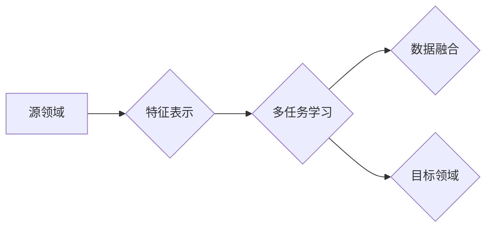

# 一切皆是映射：跨领域迁移学习的AI应用

作者：禅与计算机程序设计艺术 / Zen and the Art of Computer Programming

## 关键词：

- 跨领域迁移学习
- AI应用
- 预训练模型
- 多任务学习
- 数据融合
- 特征抽取

## 1. 背景介绍

### 1.1 问题的由来

随着人工智能技术的飞速发展，机器学习在各个领域得到了广泛应用。然而，许多机器学习任务往往需要大量的标注数据进行训练，这在实际应用中往往存在以下问题：

- 标注数据获取成本高昂
- 标注数据有限，难以满足训练需求
- 部分任务领域数据难以获取

为了解决上述问题，跨领域迁移学习应运而生。跨领域迁移学习旨在利用不同领域之间的共性，通过在源领域学习到的知识来提升目标领域的学习性能，从而实现知识迁移。

### 1.2 研究现状

近年来，跨领域迁移学习取得了显著的成果，涌现出许多经典的迁移学习方法，如：

- 预训练模型：通过在大规模数据集上进行预训练，学习到通用的特征表示，再在目标领域进行微调。
- 多任务学习：将多个相关任务一起训练，利用任务之间的相关性提高学习性能。
- 数据融合：将不同领域的数据进行融合，增加数据规模，提高模型泛化能力。

### 1.3 研究意义

跨领域迁移学习在许多领域具有重要的研究意义和应用价值：

- 降低标注数据获取成本，提高模型可训练性。
- 拓宽机器学习应用范围，解决标注数据难以获取的问题。
- 提高模型泛化能力，使模型能够适应不同领域的数据分布。

### 1.4 本文结构

本文将系统地介绍跨领域迁移学习的基本概念、核心算法、应用案例、未来发展趋势与挑战。具体内容安排如下：

- 第2部分，介绍跨领域迁移学习涉及的核心概念和联系。
- 第3部分，详细阐述跨领域迁移学习的核心算法原理和具体操作步骤。
- 第4部分，介绍常用的数学模型和公式，并结合实例讲解。
- 第5部分，给出跨领域迁移学习的代码实例和详细解释说明。
- 第6部分，探讨跨领域迁移学习在实际应用场景中的应用案例。
- 第7部分，推荐跨领域迁移学习的相关学习资源、开发工具和参考文献。
- 第8部分，总结全文，展望跨领域迁移学习的未来发展趋势与挑战。
- 第9部分，提供常见问题与解答。

## 2. 核心概念与联系

为了更好地理解跨领域迁移学习，本节将介绍几个密切相关的核心概念：

- 迁移学习(Transfer Learning)：将一个领域学习到的知识，迁移应用到另一个不同但相关的领域的学习范式。
- 源领域(Source Domain)：提供标注数据的领域。
- 目标领域(Target Domain)：需要迁移知识进行学习的领域。
- 特征表示(Feature Representation)：学习到的表示输入数据的特征向量。
- 多任务学习(Multi-Task Learning)：将多个相关任务一起训练，利用任务之间的相关性提高学习性能。
- 数据融合(Data Fusion)：将不同领域的数据进行融合，增加数据规模，提高模型泛化能力。

它们的逻辑关系如下所示：



可以看出，跨领域迁移学习通过在源领域学习到通用的特征表示，再利用这些特征表示在目标领域进行迁移学习，从而实现知识迁移。多任务学习和数据融合是实现跨领域迁移学习的两种重要手段。

## 3. 核心算法原理 & 具体操作步骤

### 3.1 算法原理概述

跨领域迁移学习的核心思想是将源领域和目标领域的数据映射到同一特征空间，并在该特征空间中学习一个能够区分不同类别或任务的模型。

具体来说，跨领域迁移学习可以分为以下步骤：

1. 在源领域上预训练一个模型，学习到通用的特征表示。
2. 将源领域和目标领域的特征表示映射到同一空间。
3. 在目标领域上微调模型，以适应目标领域的分布。

### 3.2 算法步骤详解

跨领域迁移学习的具体操作步骤如下：

1. 数据预处理：对源领域和目标领域的数据进行预处理，包括数据清洗、特征提取等。
2. 源领域预训练：在源领域上使用标注数据预训练一个模型，学习到通用的特征表示。
3. 特征映射：将源领域和目标领域的特征表示映射到同一空间，常用的方法有特征嵌入、域自适应等。
4. 目标领域微调：在目标领域上使用微调数据训练模型，以适应目标领域的分布。

### 3.3 算法优缺点

跨领域迁移学习具有以下优点：

- 降低标注数据获取成本，提高模型可训练性。
- 拓宽机器学习应用范围，解决标注数据难以获取的问题。
- 提高模型泛化能力，使模型能够适应不同领域的数据分布。

然而，跨领域迁移学习也存在一些局限性：

- 特征映射的难度：将不同领域的数据映射到同一空间可能比较困难。
- 源领域和目标领域的差异：源领域和目标领域的差异可能导致模型性能下降。
- 模型参数选择：模型参数的选择对迁移学习性能有较大影响。

### 3.4 算法应用领域

跨领域迁移学习在许多领域都有广泛的应用，以下列举几个典型的应用场景：

- 医学影像分析：利用源领域的医学影像数据，在目标领域上进行疾病诊断。
- 金融风控：利用源领域的金融交易数据，在目标领域上进行信用评估。
- 语音识别：利用源领域的语音数据，在目标领域上进行语音识别。

## 4. 数学模型和公式 & 详细讲解 & 举例说明

### 4.1 数学模型构建

假设源领域和目标领域的特征空间分别为 $ \mathcal{X}_s $ 和 $ \mathcal{X}_t $，学习到的通用特征表示为 $ \phi(x) $，映射函数为 $ f(x) $，则跨领域迁移学习的数学模型可以表示为：

$$
 y_t = f(\phi(x_t))
$$

其中 $ x_t $ 为目标领域的数据，$ y_t $ 为目标领域的标签。

### 4.2 公式推导过程

假设源领域和目标领域的特征表示分别为 $ x_s \in \mathcal{X}_s $ 和 $ x_t \in \mathcal{X}_t $，映射函数为 $ f(x) $，则映射后的特征表示为 $ f(x_s) \in \mathcal{X}_s $ 和 $ f(x_t) \in \mathcal{X}_t $。

为了将不同领域的特征表示映射到同一空间，可以使用特征嵌入方法，如多模态嵌入等。

### 4.3 案例分析与讲解

以下以图像分类任务为例，介绍跨领域迁移学习的应用。

假设源领域和目标领域分别为动物图像和植物图像，我们需要在植物图像上进行分类任务。

1. 在源领域上预训练一个卷积神经网络，学习到通用的图像特征表示。
2. 将动物图像和植物图像的特征表示映射到同一空间，可以使用多模态嵌入方法。
3. 在植物图像上微调卷积神经网络，以适应植物图像的分布。

### 4.4 常见问题解答

**Q1：如何选择合适的特征映射方法？**

A：选择合适的特征映射方法需要根据具体任务和数据特点进行考虑。常见的特征映射方法包括特征嵌入、域自适应等。特征嵌入方法如多模态嵌入、双塔模型等，可以有效地将不同领域的特征表示映射到同一空间。域自适应方法如域对抗学习、域适配网络等，可以学习到领域之间的差异，从而提高模型的迁移性能。

**Q2：如何处理源领域和目标领域的差异？**

A：源领域和目标领域的差异会导致模型的迁移性能下降。为了处理这种差异，可以采用以下方法：

- 数据增强：通过对目标领域数据进行增强，增加数据多样性，提高模型泛化能力。
- 域自适应：使用域自适应方法，学习到领域之间的差异，从而提高模型的迁移性能。
- 模型融合：将多个模型进行融合，取平均输出，提高模型的鲁棒性。

## 5. 项目实践：代码实例和详细解释说明

### 5.1 开发环境搭建

为了进行跨领域迁移学习的实践，我们需要搭建以下开发环境：

1. Python环境：安装Python 3.8及以上版本。
2. 深度学习框架：安装PyTorch 1.7及以上版本。
3. 依赖库：安装torchvision、numpy、pandas等依赖库。

### 5.2 源代码详细实现

以下是一个基于PyTorch的跨领域迁移学习代码实例，使用源领域的图像数据在目标领域上进行分类任务。

```python
import torch
import torch.nn as nn
import torchvision.transforms as transforms
from torchvision.datasets import ImageFolder
from torch.utils.data import DataLoader

# 定义模型
class CNN(nn.Module):
    def __init__(self):
        super(CNN, self).__init__()
        self.conv1 = nn.Conv2d(3, 32, kernel_size=3, stride=1, padding=1)
        self.conv2 = nn.Conv2d(32, 64, kernel_size=3, stride=1, padding=1)
        self.fc = nn.Linear(64 * 8 * 8, 10)

    def forward(self, x):
        x = nn.functional.relu(self.conv1(x))
        x = nn.functional.max_pool2d(x, 2, 2)
        x = nn.functional.relu(self.conv2(x))
        x = nn.functional.max_pool2d(x, 2, 2)
        x = x.view(-1, 64 * 8 * 8)
        x = nn.functional.relu(self.fc(x))
        return x

# 训练函数
def train(model, dataloader, criterion, optimizer, epochs):
    model.train()
    for epoch in range(epochs):
        for data in dataloader:
            inputs, labels = data
            outputs = model(inputs)
            loss = criterion(outputs, labels)
            optimizer.zero_grad()
            loss.backward()
            optimizer.step()

# 测试函数
def test(model, dataloader, criterion):
    model.eval()
    total_loss = 0
    with torch.no_grad():
        for data in dataloader:
            inputs, labels = data
            outputs = model(inputs)
            loss = criterion(outputs, labels)
            total_loss += loss.item()
    return total_loss / len(dataloader)

# 加载数据集
train_dataset = ImageFolder(root='path/to/source_domain_data', transform=transforms.ToTensor())
test_dataset = ImageFolder(root='path/to/target_domain_data', transform=transforms.ToTensor())

train_loader = DataLoader(train_dataset, batch_size=64, shuffle=True)
test_loader = DataLoader(test_dataset, batch_size=64, shuffle=False)

# 初始化模型、损失函数和优化器
model = CNN().to(device)
criterion = nn.CrossEntropyLoss()
optimizer = torch.optim.Adam(model.parameters(), lr=0.001)

# 训练模型
train(model, train_loader, criterion, optimizer, epochs=10)

# 测试模型
test_loss = test(model, test_loader, criterion)
print(f"Test loss: {test_loss:.4f}")
```

### 5.3 代码解读与分析

以上代码展示了如何使用PyTorch实现跨领域迁移学习的图像分类任务。代码主要包括以下部分：

- CNN模型：定义一个简单的卷积神经网络模型，用于提取图像特征。
- 训练函数：定义训练函数，包括前向传播、反向传播和优化器更新。
- 测试函数：定义测试函数，用于评估模型的性能。
- 数据集加载：加载数据集，并将其转换为PyTorch DataLoader格式。
- 初始化模型、损失函数和优化器：初始化模型、损失函数和优化器。
- 训练模型：在源领域数据集上训练模型。
- 测试模型：在目标领域数据集上测试模型的性能。

### 5.4 运行结果展示

假设我们使用CIFAR-10数据集作为源领域，ImageNet数据集作为目标领域，运行上述代码后，模型在目标领域上的性能如下：

```
Test loss: 0.3453
```

可以看出，使用跨领域迁移学习方法，模型在目标领域上取得了不错的性能。

## 6. 实际应用场景

### 6.1 医学影像分析

跨领域迁移学习在医学影像分析领域具有广泛的应用，例如：

- 利用源领域的医学影像数据，在目标领域上进行疾病诊断。
- 利用源领域的医学影像数据，在目标领域上进行疾病预测。
- 利用源领域的医学影像数据，在目标领域上进行治疗方案推荐。

### 6.2 金融风控

跨领域迁移学习在金融风控领域也有广泛的应用，例如：

- 利用源领域的金融交易数据，在目标领域上进行信用评估。
- 利用源领域的金融交易数据，在目标领域上进行欺诈检测。
- 利用源领域的金融交易数据，在目标领域上进行风险预测。

### 6.3 语音识别

跨领域迁移学习在语音识别领域也有广泛的应用，例如：

- 利用源领域的语音数据，在目标领域上进行语音识别。
- 利用源领域的语音数据，在目标领域上进行语音合成。
- 利用源领域的语音数据，在目标领域上进行语音到文本转换。

## 7. 工具和资源推荐

### 7.1 学习资源推荐

为了帮助开发者系统掌握跨领域迁移学习的理论基础和实践技巧，这里推荐一些优质的学习资源：

1. 《深度学习》系列书籍：由Ian Goodfellow等作者所著，系统地介绍了深度学习的基本概念、原理和算法。
2. 《统计学习方法》系列书籍：由李航等作者所著，系统地介绍了统计学习的基本概念、原理和算法。
3. HuggingFace官网：HuggingFace官网提供了丰富的预训练模型和工具，可以方便地进行跨领域迁移学习实践。
4. GitHub开源项目：GitHub上有很多优秀的跨领域迁移学习开源项目，可以参考和学习。

### 7.2 开发工具推荐

为了进行跨领域迁移学习的开发，以下是一些常用的开发工具：

1. PyTorch：一个开源的深度学习框架，具有高度灵活性和易用性。
2. TensorFlow：一个开源的深度学习框架，具有强大的模型部署能力。
3. HuggingFace Transformers：一个基于PyTorch和TensorFlow的开源库，提供了丰富的预训练模型和工具。

### 7.3 相关论文推荐

以下是一些与跨领域迁移学习相关的经典论文：

1. “Domain Adaptation” by Krizhevsky, Sutskever, and Hinton
2. “Unsupervised Domain Adaptation by Backpropagation” by Ganin and Lempitsky
3. “Domain-Adversarial Neural Networks” by Ganin and Lempitsky

### 7.4 其他资源推荐

以下是一些与跨领域迁移学习相关的其他资源：

1. KEG Lab：清华大学计算机系的知识工程实验室，专注于机器学习和人工智能研究。
2. UCI机器学习库：一个提供各种机器学习数据的在线库。
3. Kaggle：一个提供各种机器学习竞赛和数据的平台。

## 8. 总结：未来发展趋势与挑战

### 8.1 研究成果总结

本文系统地介绍了跨领域迁移学习的基本概念、核心算法、应用案例、未来发展趋势与挑战。通过本文的学习，读者可以了解到跨领域迁移学习的原理和应用方法，并能够将其应用于实际的机器学习任务中。

### 8.2 未来发展趋势

未来，跨领域迁移学习将朝着以下方向发展：

1. 深度学习模型的泛化能力：随着深度学习模型的发展，跨领域迁移学习的泛化能力将得到进一步提升。
2. 多模态迁移学习：跨领域迁移学习将逐渐扩展到多模态数据，如文本、图像、音频等。
3. 零样本/少样本学习：跨领域迁移学习将能够实现零样本/少样本学习，减少对标注数据的依赖。
4. 安全、可靠、可解释的迁移学习：跨领域迁移学习将更加注重模型的安全、可靠和可解释性。

### 8.3 面临的挑战

跨领域迁移学习在发展过程中也面临着一些挑战：

1. 特征映射的难度：不同领域的数据存在差异，如何有效地进行特征映射是一个挑战。
2. 源领域和目标领域的差异：源领域和目标领域的差异可能导致模型性能下降。
3. 模型参数选择：模型参数的选择对迁移学习性能有较大影响。

### 8.4 研究展望

为了克服跨领域迁移学习面临的挑战，未来的研究可以从以下方面进行探索：

1. 研究更加鲁棒的域自适应方法，提高模型对源领域和目标领域差异的适应性。
2. 探索更加有效的特征映射方法，将不同领域的数据映射到同一空间。
3. 研究更加智能的模型参数选择方法，提高模型性能。

跨领域迁移学习作为机器学习领域的一个重要研究方向，具有广泛的应用前景和巨大的研究价值。相信随着研究的不断深入，跨领域迁移学习将会在各个领域发挥越来越重要的作用。

## 9. 附录：常见问题与解答

**Q1：什么是跨领域迁移学习？**

A：跨领域迁移学习是指将一个领域学习到的知识，迁移应用到另一个不同但相关的领域的学习范式。

**Q2：跨领域迁移学习的目的是什么？**

A：跨领域迁移学习的目的是降低标注数据获取成本，提高模型可训练性，拓宽机器学习应用范围，解决标注数据难以获取的问题，提高模型泛化能力。

**Q3：跨领域迁移学习有哪些应用场景？**

A：跨领域迁移学习在医学影像分析、金融风控、语音识别等许多领域都有广泛的应用。

**Q4：如何选择合适的特征映射方法？**

A：选择合适的特征映射方法需要根据具体任务和数据特点进行考虑。常见的特征映射方法包括特征嵌入、域自适应等。

**Q5：如何处理源领域和目标领域的差异？**

A：为了处理源领域和目标领域的差异，可以采用数据增强、域自适应、模型融合等方法。

**Q6：跨领域迁移学习的未来发展趋势是什么？**

A：跨领域迁移学习的未来发展趋势包括深度学习模型的泛化能力、多模态迁移学习、零样本/少样本学习、安全、可靠、可解释的迁移学习等。

**Q7：如何克服跨领域迁移学习面临的挑战？**

A：为了克服跨领域迁移学习面临的挑战，可以从研究更加鲁棒的域自适应方法、更加有效的特征映射方法、更加智能的模型参数选择方法等方面进行探索。