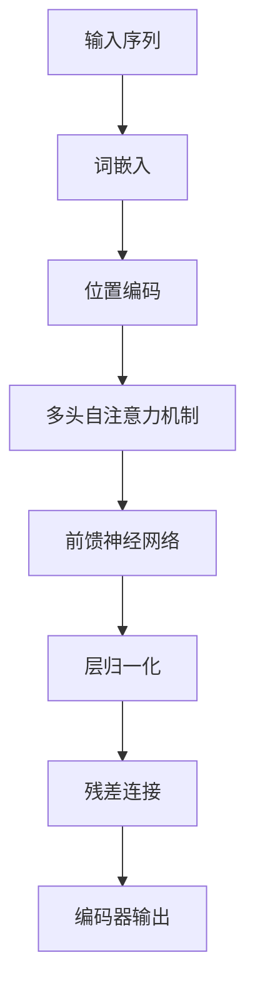
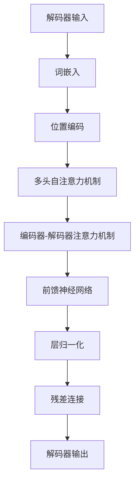

# Transformer 原理与代码实战案例讲解

## 1.背景介绍

在自然语言处理（NLP）领域，Transformer 模型的出现引发了一场革命。自从 Vaswani 等人在 2017 年提出 Transformer 模型以来，它迅速成为了机器翻译、文本生成、情感分析等任务的主流选择。Transformer 模型的核心创新在于其完全基于注意力机制的架构，摒弃了传统的循环神经网络（RNN）和卷积神经网络（CNN），从而显著提高了训练效率和模型性能。

## 2.核心概念与联系

### 2.1 注意力机制

注意力机制是 Transformer 的核心。它允许模型在处理输入序列的每个位置时，动态地关注输入序列的不同部分。注意力机制的基本思想是计算输入序列中每个元素对当前处理元素的重要性。

### 2.2 自注意力机制

自注意力机制（Self-Attention）是 Transformer 中的关键组件。它在同一个序列内计算注意力权重，从而捕捉序列中元素之间的依赖关系。自注意力机制的计算过程包括三个步骤：计算 Query、Key 和 Value，计算注意力权重，最后加权求和。

### 2.3 多头注意力机制

多头注意力机制（Multi-Head Attention）通过并行计算多个自注意力机制来捕捉不同的特征子空间。每个头独立地计算注意力，然后将结果拼接并线性变换。

### 2.4 位置编码

由于 Transformer 模型没有循环结构，它无法直接捕捉序列的位置信息。为了解决这个问题，Transformer 引入了位置编码（Positional Encoding），将位置信息显式地添加到输入序列中。

### 2.5 编码器-解码器架构

Transformer 模型采用编码器-解码器架构。编码器将输入序列编码为固定长度的表示，解码器则根据编码器的输出生成目标序列。编码器和解码器都由多个相同的层堆叠而成，每层包括多头注意力机制和前馈神经网络。

## 3.核心算法原理具体操作步骤

### 3.1 输入处理

首先，将输入序列转换为词嵌入（Embedding），并添加位置编码。词嵌入和位置编码的维度相同，以便相加。

### 3.2 编码器层

每个编码器层包括两个子层：多头自注意力机制和前馈神经网络。每个子层后面都跟着层归一化（Layer Normalization）和残差连接（Residual Connection）。



### 3.3 解码器层

解码器层与编码器层类似，但多了一个编码器-解码器注意力机制，用于将编码器的输出与解码器的输入结合。



### 3.4 输出生成

解码器的输出通过线性变换和 softmax 函数生成最终的预测结果。

## 4.数学模型和公式详细讲解举例说明

### 4.1 注意力机制公式

注意力机制的核心公式如下：

$$
\text{Attention}(Q, K, V) = \text{softmax}\left(\frac{QK^T}{\sqrt{d_k}}\right)V
$$

其中，$Q$ 是 Query 矩阵，$K$ 是 Key 矩阵，$V$ 是 Value 矩阵，$d_k$ 是 Key 的维度。

### 4.2 自注意力机制计算

对于输入序列 $X$，首先计算 Query、Key 和 Value：

$$
Q = XW_Q, \quad K = XW_K, \quad V = XW_V
$$

其中，$W_Q$、$W_K$ 和 $W_V$ 是可训练的权重矩阵。

然后，计算注意力权重并加权求和：

$$
\text{Attention}(Q, K, V) = \text{softmax}\left(\frac{QK^T}{\sqrt{d_k}}\right)V
$$

### 4.3 多头注意力机制计算

多头注意力机制通过并行计算多个自注意力机制来捕捉不同的特征子空间。假设有 $h$ 个头，每个头的计算如下：

$$
\text{head}_i = \text{Attention}(QW_{Q_i}, KW_{K_i}, VW_{V_i})
$$

然后，将所有头的输出拼接并线性变换：

$$
\text{MultiHead}(Q, K, V) = \text{Concat}(\text{head}_1, \ldots, \text{head}_h)W_O
$$

其中，$W_{Q_i}$、$W_{K_i}$、$W_{V_i}$ 和 $W_O$ 是可训练的权重矩阵。

### 4.4 位置编码公式

位置编码的公式如下：

$$
PE_{(pos, 2i)} = \sin\left(\frac{pos}{10000^{2i/d_{model}}}\right)
$$

$$
PE_{(pos, 2i+1)} = \cos\left(\frac{pos}{10000^{2i/d_{model}}}\right)
$$

其中，$pos$ 是位置，$i$ 是维度索引，$d_{model}$ 是模型的维度。

## 5.项目实践：代码实例和详细解释说明

### 5.1 环境准备

首先，确保安装了必要的库：

```bash
pip install torch transformers
```

### 5.2 数据预处理

使用 `transformers` 库中的 `Tokenizer` 进行数据预处理：

```python
from transformers import BertTokenizer

tokenizer = BertTokenizer.from_pretrained('bert-base-uncased')
text = "Hello, how are you?"
tokens = tokenizer(text, return_tensors='pt')
```

### 5.3 模型定义

定义一个简单的 Transformer 模型：

```python
import torch
import torch.nn as nn
from transformers import BertModel

class SimpleTransformer(nn.Module):
    def __init__(self):
        super(SimpleTransformer, self).__init__()
        self.bert = BertModel.from_pretrained('bert-base-uncased')
        self.fc = nn.Linear(768, 2)  # 假设是二分类任务

    def forward(self, input_ids, attention_mask):
        outputs = self.bert(input_ids, attention_mask=attention_mask)
        cls_output = outputs[1]  # [CLS] token 的输出
        logits = self.fc(cls_output)
        return logits

model = SimpleTransformer()
```

### 5.4 模型训练

定义损失函数和优化器，并进行训练：

```python
from torch.optim import Adam

optimizer = Adam(model.parameters(), lr=2e-5)
criterion = nn.CrossEntropyLoss()

# 假设有一个 DataLoader 提供训练数据
for epoch in range(3):
    for batch in dataloader:
        input_ids = batch['input_ids']
        attention_mask = batch['attention_mask']
        labels = batch['labels']

        optimizer.zero_grad()
        outputs = model(input_ids, attention_mask)
        loss = criterion(outputs, labels)
        loss.backward()
        optimizer.step()

        print(f"Epoch {epoch}, Loss: {loss.item()}")
```

### 5.5 模型评估

使用验证集评估模型性能：

```python
from sklearn.metrics import accuracy_score

model.eval()
all_preds = []
all_labels = []

with torch.no_grad():
    for batch in val_dataloader:
        input_ids = batch['input_ids']
        attention_mask = batch['attention_mask']
        labels = batch['labels']

        outputs = model(input_ids, attention_mask)
        preds = torch.argmax(outputs, dim=1)

        all_preds.extend(preds.cpu().numpy())
        all_labels.extend(labels.cpu().numpy())

accuracy = accuracy_score(all_labels, all_preds)
print(f"Validation Accuracy: {accuracy}")
```

## 6.实际应用场景

### 6.1 机器翻译

Transformer 模型在机器翻译任务中表现出色。Google 的翻译系统已经采用了基于 Transformer 的架构，大幅提升了翻译质量。

### 6.2 文本生成

Transformer 模型在文本生成任务中也取得了显著成果。OpenAI 的 GPT 系列模型就是基于 Transformer 架构，能够生成高质量的自然语言文本。

### 6.3 情感分析

Transformer 模型在情感分析任务中表现优异。通过预训练和微调，Transformer 模型可以准确地捕捉文本中的情感信息。

### 6.4 问答系统

Transformer 模型在问答系统中也有广泛应用。BERT 模型在多个问答数据集上取得了最先进的性能，显著提升了问答系统的准确性。

## 7.工具和资源推荐

### 7.1 预训练模型

- [BERT](https://github.com/google-research/bert)
- [GPT-3](https://github.com/openai/gpt-3)
- [T5](https://github.com/google-research/text-to-text-transfer-transformer)

### 7.2 数据集

- [GLUE](https://gluebenchmark.com/)
- [SQuAD](https://rajpurkar.github.io/SQuAD-explorer/)
- [WMT](http://www.statmt.org/wmt19/translation-task.html)

### 7.3 开源库

- [Transformers](https://github.com/huggingface/transformers)
- [Fairseq](https://github.com/pytorch/fairseq)
- [OpenNMT](https://github.com/OpenNMT/OpenNMT-py)

## 8.总结：未来发展趋势与挑战

Transformer 模型在 NLP 领域取得了巨大成功，但仍面临一些挑战。首先，Transformer 模型的计算复杂度较高，训练和推理成本较大。其次，Transformer 模型对大规模数据的依赖较强，数据不足时性能会显著下降。未来，研究人员可能会在以下几个方面进行探索：

### 8.1 模型压缩与加速

通过模型剪枝、量化和蒸馏等技术，减少 Transformer 模型的计算复杂度，提高推理速度。

### 8.2 多模态学习

将 Transformer 模型应用于多模态数据（如图像、文本、音频）的联合学习，提升模型的泛化能力。

### 8.3 自监督学习

探索更有效的自监督学习方法，减少对大规模标注数据的依赖，提高模型的鲁棒性。

## 9.附录：常见问题与解答

### 9.1 Transformer 模型的优势是什么？

Transformer 模型的优势在于其并行计算能力和长距离依赖捕捉能力。与 RNN 和 CNN 相比，Transformer 模型在处理长序列时表现更好，训练效率更高。

### 9.2 如何选择预训练模型？

选择预训练模型时，应根据具体任务和数据集的特点进行选择。BERT 适用于句子级别的任务，如分类和问答；GPT 适用于生成任务，如文本生成；T5 适用于多任务学习。

### 9.3 如何处理小数据集？

在小数据集上训练 Transformer 模型时，可以采用数据增强、迁移学习和模型蒸馏等方法，提高模型的性能和泛化能力。

### 9.4 Transformer 模型的计算复杂度如何？

Transformer 模型的计算复杂度主要来自于自注意力机制，其复杂度为 $O(n^2d)$，其中 $n$ 是序列长度，$d$ 是模型维度。通过模型剪枝和量化等技术，可以降低计算复杂度。

### 9.5 如何解释 Transformer 模型的输出？

Transformer 模型的输出可以通过注意力权重进行解释。注意力权重反映了模型在处理输入序列时，关注不同部分的程度。通过可视化注意力权重，可以理解模型的决策过程。

---

作者：禅与计算机程序设计艺术 / Zen and the Art of Computer Programming