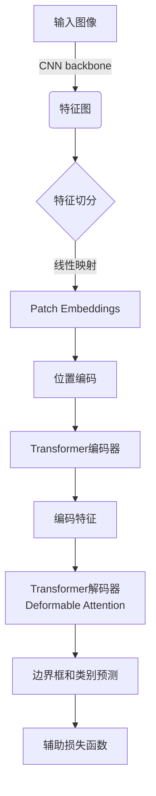

# ViTDet原理与代码实例讲解

## 1.背景介绍

在计算机视觉领域,目标检测是一项非常重要和具有挑战性的任务。近年来,基于卷积神经网络(CNN)的目标检测模型取得了巨大的进展,但仍然存在一些局限性,如对小目标和遮挡目标的检测效果不佳、计算复杂度高等。为了解决这些问题,研究人员开始探索基于Transformer的目标检测模型。

Transformer最初被提出用于自然语言处理任务,之后在计算机视觉领域也取得了巨大成功。Vision Transformer(ViT)直接将图像分割为patches(图像块),并将这些patches作为Transformer的输入,最终实现了在图像分类任务上超越CNN的性能。ViTDet(Vision Transformer for Detection)则是将ViT应用到目标检测任务中。

## 2.核心概念与联系

### 2.1 Transformer原理

Transformer是一种全新的基于注意力机制(Attention Mechanism)的神经网络架构,不同于CNN的局部连接和权重共享特性,Transformer可以直接对任意两个位置的输入进行建模,捕捉全局依赖关系。

Transformer的核心组件是多头自注意力(Multi-Head Attention)和前馈神经网络(Feed-Forward Neural Network)。多头自注意力机制允许模型关注输入序列中的不同位置,捕捉输入和输出之间的长程依赖关系。前馈神经网络则对每个位置的表示进行非线性映射,为模型增加了非线性变换能力。

### 2.2 Vision Transformer(ViT)

Vision Transformer直接将图像分割成patches,并将这些patches线性映射为patch embeddings,作为Transformer的输入。ViT通过堆叠Transformer编码器块对图像进行建模,最终输出用于图像分类的特征表示。

### 2.3 ViTDet

ViTDet将ViT应用到目标检测任务中。它首先使用一个标准的CNN backbone(如ResNet)提取图像的特征图,然后将特征图分割成patches,并将这些patches输入到Transformer解码器中。解码器的输出被用于预测边界框和类别。

ViTDet的创新之处在于,它引入了一种新的注意力机制——去卷积的自注意力(Deformable Attention),以更好地捕捉目标的几何信息。此外,ViTDet还采用了一种新的辅助损失函数,用于提高检测精度。

## 3.核心算法原理具体操作步骤 

ViTDet的核心算法流程可以概括为以下几个步骤:

1. **特征提取**: 使用CNN backbone(如ResNet)对输入图像进行特征提取,得到特征图。

2. **特征切分**: 将特征图分割成patches,并将这些patches线性映射为patch embeddings。

3. **位置编码**: 为patch embeddings添加位置编码,保留patch在原始特征图中的位置信息。

4. **Transformer编码器**: 将patch embeddings输入到Transformer编码器中,捕捉patches之间的全局依赖关系,得到编码特征。

5. **Deformable Attention**: 在Transformer解码器中,使用Deformable Attention机制对编码特征进行建模,捕捉目标的几何信息。

6. **边界框和类别预测**: 解码器的输出被用于预测目标的边界框和类别。

7. **辅助损失函数**: 引入新的辅助损失函数,提高检测精度。

下面是ViTDet的架构示意图:



## 4.数学模型和公式详细讲解举例说明

### 4.1 Transformer编码器

Transformer编码器由多个相同的层组成,每一层包含两个子层:多头自注意力机制(Multi-Head Attention)和前馈神经网络(Feed-Forward Neural Network)。

**多头自注意力机制**

给定输入序列 $X = (x_1, x_2, ..., x_n)$,自注意力机制计算的是查询(Query)与键(Key)和值(Value)之间的相似性得分,从而捕捉输入序列中元素之间的依赖关系。多头注意力机制是将注意力机制运用到不同的子空间,最后将结果拼接起来,可以表示为:

$$\begin{aligned}
\text{MultiHead}(Q, K, V) &= \text{Concat}(\text{head}_1, \text{head}_2, \cdots, \text{head}_h)W^O\\
\text{where } \text{head}_i &= \text{Attention}(QW_i^Q, KW_i^K, VW_i^V)
\end{aligned}$$

其中, $W_i^Q \in \mathbb{R}^{d_\text{model} \times d_k}, W_i^K \in \mathbb{R}^{d_\text{model} \times d_k}, W_i^V \in \mathbb{R}^{d_\text{model} \times d_v}, W^O \in \mathbb{R}^{hd_v \times d_\text{model}}$ 是可学习的线性投影参数。

**前馈神经网络**

前馈神经网络对每个位置的输入进行非线性映射,其计算过程如下:

$$\text{FFN}(x) = \max(0, xW_1 + b_1)W_2 + b_2$$

其中,线性变换的参数矩阵 $W_1 \in \mathbb{R}^{d_\text{model} \times d_\text{ff}}$, $W_2 \in \mathbb{R}^{d_\text{ff} \times d_\text{model}}$, $b_1 \in \mathbb{R}^{d_\text{ff}}$, $b_2 \in \mathbb{R}^{d_\text{model}}$。

### 4.2 Deformable Attention

Deformable Attention是ViTDet提出的一种新的注意力机制,旨在更好地捕捉目标的几何信息。在标准的多头自注意力中,每个查询元素会平等地关注所有键元素。而在Deformable Attention中,每个查询元素会根据一个可学习的偏移量,聚焦于其周围的一小部分键元素,从而更好地建模目标的形状和空间位置关系。

Deformable Attention的计算过程如下:

1. 计算注意力权重:

$$\begin{aligned}
A(x) &= \text{softmax}(\frac{Q(x)K(x)^T}{\sqrt{d_k}})V(x)\\
&= \text{softmax}(\frac{1}{\sqrt{d_k}}\sum_{k=1}^{K}Q(x)W_k^QW_k^{K^T}V(x)W_k^V)
\end{aligned}$$

2. 计算偏移量:

$$\Delta p_n = f(p_n, g_n; \Theta)$$

其中, $p_n$ 是参考点的坐标, $g_n$ 是查询元素的特征, $\Theta$ 是可学习的参数。

3. 使用偏移量对注意力权重进行采样:

$$\hat{A}(x) = \text{sampling}(A(x), \Delta p)$$

通过这种方式,Deformable Attention可以专注于目标的局部区域,从而更好地捕捉目标的几何信息。

## 5.项目实践:代码实例和详细解释说明

下面是一个使用PyTorch实现ViTDet的简化版本代码示例,包括Transformer编码器、Deformable Attention和检测头。

```python
import torch
import torch.nn as nn
import torch.nn.functional as F

class MultiHeadAttention(nn.Module):
    def __init__(self, d_model, num_heads):
        super(MultiHeadAttention, self).__init__()
        self.num_heads = num_heads
        self.d_model = d_model

        self.W_q = nn.Linear(d_model, d_model)
        self.W_k = nn.Linear(d_model, d_model)
        self.W_v = nn.Linear(d_model, d_model)
        self.W_o = nn.Linear(d_model, d_model)

    def forward(self, query, key, value, mask=None):
        batch_size = query.size(0)

        query = self.W_q(query).view(batch_size, -1, self.num_heads, self.d_model // self.num_heads).transpose(1, 2)
        key = self.W_k(key).view(batch_size, -1, self.num_heads, self.d_model // self.num_heads).transpose(1, 2)
        value = self.W_v(value).view(batch_size, -1, self.num_heads, self.d_model // self.num_heads).transpose(1, 2)

        scores = torch.matmul(query, key.transpose(-2, -1)) / math.sqrt(self.d_model // self.num_heads)

        if mask is not None:
            scores = scores.masked_fill(mask == 0, -1e9)

        p_attn = F.softmax(scores, dim=-1)
        output = torch.matmul(p_attn, value).transpose(1, 2).contiguous().view(batch_size, -1, self.d_model)
        output = self.W_o(output)

        return output

class DeformableAttention(nn.Module):
    def __init__(self, d_model, num_heads, num_levels):
        super(DeformableAttention, self).__init__()
        self.d_model = d_model
        self.num_heads = num_heads
        self.num_levels = num_levels

        self.sampling_locations = nn.Sequential(
            nn.Conv2d(d_model, d_model // 2, kernel_size=3, stride=1, padding=1),
            nn.GELU(),
            nn.Conv2d(d_model // 2, num_heads * num_levels * 2, kernel_size=3, stride=1, padding=1),
        )

        self.attention = MultiHeadAttention(d_model, num_heads)

    def forward(self, query, key, value, spatial_shapes, level_start_index):
        sampling_locations = self.sampling_locations(query)
        attention = self.attention(query, key, value, spatial_shapes, level_start_index, sampling_locations)
        return attention

class DetectionHead(nn.Module):
    def __init__(self, d_model, num_classes):
        super(DetectionHead, self).__init__()
        self.cls_head = nn.Linear(d_model, num_classes)
        self.bbox_head = nn.Linear(d_model, 4)

    def forward(self, x):
        cls_logits = self.cls_head(x)
        bbox_pred = self.bbox_head(x)
        return cls_logits, bbox_pred
```

上面的代码实现了三个核心组件:

1. `MultiHeadAttention`: 实现了标准的多头自注意力机制。
2. `DeformableAttention`: 实现了Deformable Attention机制,包括计算采样位置偏移量和应用偏移量进行注意力采样。
3. `DetectionHead`: 实现了检测头,用于预测目标的类别和边界框。

在实际应用中,这些组件会被集成到ViTDet的整体架构中,与CNN backbone、Transformer编码器和解码器等其他模块一起工作,完成目标检测任务。

## 6.实际应用场景

ViTDet作为一种新型的基于Transformer的目标检测模型,具有以下优势:

1. **高效建模全局依赖关系**: 与CNN相比,Transformer能够直接对任意两个位置的输入进行建模,捕捉全局依赖关系,从而更好地处理小目标和遮挡目标的检测。

2. **几何建模能力强**: 通过引入Deformable Attention机制,ViTDet能够更好地捕捉目标的几何信息,提高检测精度。

3. **计算效率较高**: 与一些基于CNN的目标检测模型相比,ViTDet在保持较高精度的同时,计算复杂度更低,推理速度更快。

因此,ViTDet可以应用于各种需要高效准确目标检测的场景,如自动驾驶、机器人视觉、视频监控等。

## 7.工具和资源推荐

如果您想进一步了解和实践ViTDet,以下是一些有用的工具和资源:

1. **ViTDet官方代码库**: https://github.com/facebookresearch/deformable-detr
2. **Transformer相关资源**:
   - Transformer原论文: https://arxiv.org/abs/1706.03762
   - Transformer代码实现: https://github.com/pytorch/examples/tree/master/word_language_model
   - Transformer解释: http://jalammar.github.io/illustrated-transformer/
3. **PyTorch深度学习框架**: https://pytorch.org/
4. **目标检测相关资源**:
   - 目标检测survey: https://arxiv.org/abs/1905.05055
   - 目标检测代码库: https://github.com/facebookresearch/detectron2
5. **在线课程**:
   - 斯坦福公开课: http://cs