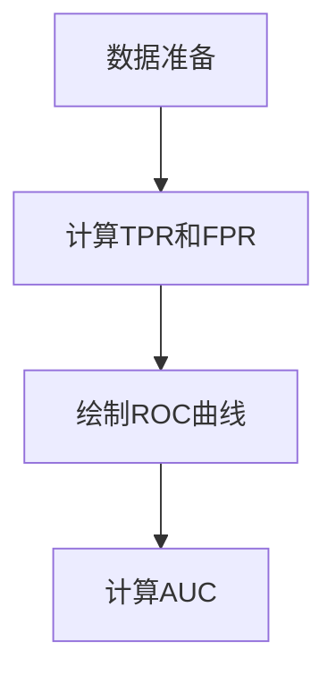

# ROC Curve 原理与代码实战案例讲解

## 1.背景介绍

在机器学习和数据挖掘领域，评估分类模型的性能是至关重要的。常见的评估指标包括准确率、精确率、召回率和F1分数。然而，这些指标在处理不平衡数据集时可能会失效。ROC（Receiver Operating Characteristic）曲线和AUC（Area Under the Curve）提供了一种更为全面的评估方法，能够在不同的阈值下评估模型的性能。

ROC曲线最初用于信号检测理论，后来被广泛应用于医学诊断、信用评分、信息检索等领域。它通过绘制真阳性率（TPR）和假阳性率（FPR）之间的关系，帮助我们理解模型在不同阈值下的表现。

## 2.核心概念与联系

### 2.1 真阳性率（TPR）

真阳性率（True Positive Rate, TPR），也称为召回率（Recall），表示在所有实际为正类的样本中，被正确预测为正类的比例。其计算公式为：

$$
TPR = \frac{TP}{TP + FN}
$$

其中，TP为真阳性数，FN为假阴性数。

### 2.2 假阳性率（FPR）

假阳性率（False Positive Rate, FPR）表示在所有实际为负类的样本中，被错误预测为正类的比例。其计算公式为：

$$
FPR = \frac{FP}{FP + TN}
$$

其中，FP为假阳性数，TN为真阴性数。

### 2.3 ROC曲线

ROC曲线是通过绘制TPR对FPR的曲线来评估分类模型性能的图形工具。曲线下方的面积（AUC）越大，模型的性能越好。

### 2.4 AUC（曲线下面积）

AUC（Area Under the Curve）是ROC曲线下方的面积，数值范围在0到1之间。AUC值越接近1，模型的性能越好。

## 3.核心算法原理具体操作步骤

### 3.1 数据准备

首先，我们需要准备一个包含实际标签和预测概率的数据集。预测概率是模型对每个样本属于正类的置信度。

### 3.2 计算TPR和FPR

对于每一个可能的阈值，计算对应的TPR和FPR。阈值从0到1，通常以0.01为步长。

### 3.3 绘制ROC曲线

将所有阈值对应的TPR和FPR绘制在二维坐标系中，得到ROC曲线。

### 3.4 计算AUC

使用数值积分的方法计算ROC曲线下方的面积，即AUC值。

以下是ROC曲线生成的Mermaid流程图：



## 4.数学模型和公式详细讲解举例说明

### 4.1 计算TPR和FPR的公式

如前所述，TPR和FPR的计算公式分别为：

$$
TPR = \frac{TP}{TP + FN}
$$

$$
FPR = \frac{FP}{FP + TN}
$$

### 4.2 ROC曲线的数学定义

ROC曲线是通过在不同阈值下计算TPR和FPR，并将这些点绘制在二维坐标系中得到的。假设我们有一个包含N个样本的数据集，每个样本的实际标签为 $y_i$，预测概率为 $p_i$。我们可以通过以下步骤生成ROC曲线：

1. 对预测概率 $p_i$ 进行排序，得到排序后的预测概率 $p_{(i)}$ 和对应的实际标签 $y_{(i)}$。
2. 初始化TPR和FPR为0。
3. 对于每一个可能的阈值 $t$，计算对应的TPR和FPR。
4. 将所有阈值对应的TPR和FPR绘制在二维坐标系中，得到ROC曲线。

### 4.3 AUC的计算

AUC可以通过数值积分的方法计算。假设我们有M个阈值，对应的TPR和FPR分别为 $TPR_i$ 和 $FPR_i$，则AUC的计算公式为：

$$
AUC = \sum_{i=1}^{M-1} (FPR_{i+1} - FPR_i) \cdot \frac{TPR_i + TPR_{i+1}}{2}
$$

## 5.项目实践：代码实例和详细解释说明

### 5.1 数据准备

我们将使用Python和Scikit-learn库来实现ROC曲线和AUC的计算。首先，导入必要的库并生成一个示例数据集：

```python
import numpy as np
import matplotlib.pyplot as plt
from sklearn.metrics import roc_curve, auc
from sklearn.model_selection import train_test_split
from sklearn.datasets import make_classification
from sklearn.linear_model import LogisticRegression

# 生成示例数据集
X, y = make_classification(n_samples=1000, n_features=20, random_state=42)
X_train, X_test, y_train, y_test = train_test_split(X, y, test_size=0.3, random_state=42)

# 训练逻辑回归模型
model = LogisticRegression()
model.fit(X_train, y_train)

# 预测概率
y_pred_prob = model.predict_proba(X_test)[:, 1]
```

### 5.2 计算TPR和FPR

使用Scikit-learn的 `roc_curve` 函数计算TPR和FPR：

```python
fpr, tpr, thresholds = roc_curve(y_test, y_pred_prob)
```

### 5.3 绘制ROC曲线

使用Matplotlib绘制ROC曲线：

```python
plt.figure()
plt.plot(fpr, tpr, color='darkorange', lw=2, label='ROC curve (area = %0.2f)' % auc(fpr, tpr))
plt.plot([0, 1], [0, 1], color='navy', lw=2, linestyle='--')
plt.xlim([0.0, 1.0])
plt.ylim([0.0, 1.0])
plt.xlabel('False Positive Rate')
plt.ylabel('True Positive Rate')
plt.title('Receiver Operating Characteristic')
plt.legend(loc="lower right")
plt.show()
```

### 5.4 计算AUC

使用Scikit-learn的 `auc` 函数计算AUC：

```python
roc_auc = auc(fpr, tpr)
print(f'AUC: {roc_auc:.2f}')
```

## 6.实际应用场景

### 6.1 医学诊断

在医学诊断中，ROC曲线被广泛用于评估诊断测试的性能。例如，评估某种疾病的检测方法的灵敏度和特异性。

### 6.2 信用评分

在金融领域，ROC曲线用于评估信用评分模型的性能。通过分析不同阈值下的TPR和FPR，可以选择最优的信用评分阈值。

### 6.3 信息检索

在信息检索系统中，ROC曲线用于评估检索算法的性能。通过分析不同阈值下的TPR和FPR，可以优化检索算法的参数。

## 7.工具和资源推荐

### 7.1 Scikit-learn

Scikit-learn是一个强大的机器学习库，提供了丰富的工具用于模型评估和性能分析。其 `roc_curve` 和 `auc` 函数非常方便地实现了ROC曲线和AUC的计算。

### 7.2 Matplotlib

Matplotlib是一个广泛使用的绘图库，能够轻松绘制各种图形，包括ROC曲线。

### 7.3 Kaggle

Kaggle是一个数据科学竞赛平台，提供了大量的公开数据集和竞赛项目，是学习和实践机器学习的好地方。

## 8.总结：未来发展趋势与挑战

### 8.1 未来发展趋势

随着机器学习和人工智能技术的不断发展，模型评估方法也在不断进步。未来，可能会出现更加复杂和全面的评估指标，以更好地衡量模型的性能。

### 8.2 挑战

尽管ROC曲线和AUC是强大的评估工具，但它们也有一些局限性。例如，在处理极度不平衡的数据集时，AUC可能会失去其解释力。因此，研究和开发新的评估方法仍然是一个重要的研究方向。

## 9.附录：常见问题与解答

### 9.1 为什么使用ROC曲线而不是准确率？

准确率在处理不平衡数据集时可能会失效，而ROC曲线能够在不同阈值下评估模型的性能，提供更全面的评估。

### 9.2 AUC值越大越好吗？

是的，AUC值越大，表示模型的性能越好。然而，AUC值并不是唯一的评估指标，还需要结合其他指标进行综合评估。

### 9.3 如何处理极度不平衡的数据集？

在处理极度不平衡的数据集时，可以考虑使用其他评估指标，如PR曲线（Precision-Recall Curve）和F1分数。

---

作者：禅与计算机程序设计艺术 / Zen and the Art of Computer Programming