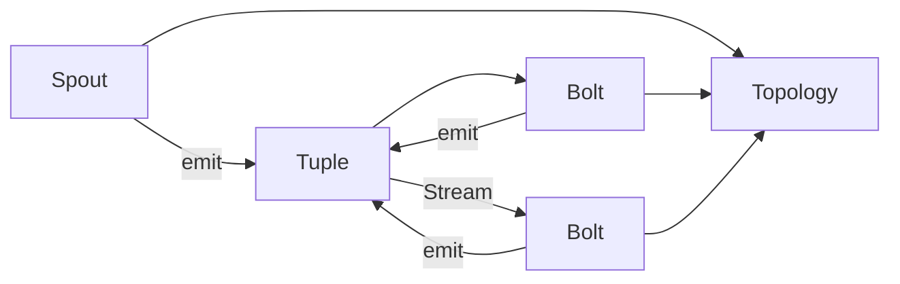

# Storm原理与代码实例讲解

## 1.背景介绍

### 1.1 大数据实时处理的重要性

在当今大数据时代,海量数据以前所未有的速度不断产生。传统的批处理模式已无法满足实时性要求,因此实时大数据处理技术应运而生。实时处理可以让企业及时洞察业务状况,快速响应市场变化,从而在竞争中占据优势。

### 1.2 Storm的诞生与发展

Storm是由Twitter开源的一个分布式实时计算系统,用于处理大量的流式数据。它发展至今,已成为Apache顶级项目,被广泛应用于金融、电商、物联网等领域的实时数据处理场景中。

### 1.3 Storm在实时计算领域的地位

Storm凭借其高吞吐、低延迟、易扩展、容错性强等特点,在实时计算领域占据了重要地位。它与Hadoop等批处理框架形成互补,共同构建了完整的大数据处理体系。

## 2.核心概念与联系

### 2.1 Topology（拓扑）

Topology是Storm中的一个抽象概念,代表"计算任务"。它是Spout和Bolt的集合,以DAG(有向无环图)的形式组织在一起,定义了数据流的流动方向。一个运行中的Topology会持续处理数据,直到被显式终止。

### 2.2 Spout（数据源）

Spout是Topology的消息源,负责从外部数据源读取数据,并将数据以元组(tuple)的形式发送到下游的Bolt。常见的Spout包括KafkaSpout、TwitterSpout等,它们分别从Kafka、Twitter等数据源读取数据。

### 2.3 Bolt（处理单元）  

Bolt是Topology的处理单元,它接收来自Spout或其他Bolt的元组,执行计算或函数操作,并可以将结果发送给下游的Bolt。Bolt可以执行过滤、函数操作、聚合、数据库读写等任何操作。

### 2.4 Tuple（元组）

Tuple是Storm中的数据传输单元,它是一个命名的值列表。每个值可以是任意类型,在定义一个字段时,同时要定义它的名称。Spout发出的Tuple称为源Tuple,Bolt处理后发出的Tuple称为派生Tuple。

### 2.5 Stream（流）

Stream是Tuple的无界序列,代表了数据在Topology中的流动。每个Stream都有一个id,Spout和Bolt可以发射一个或多个Stream。

### 2.6 核心概念之间的关系

下面是一个Mermaid流程图,展示了Storm核心概念之间的关系:



## 3.核心算法原理具体操作步骤

### 3.1 数据分区

Storm采用数据分区的方式实现并行计算。每个Spout或Bolt会有多个Task在集群的不同机器上执行。每个Tuple只会被某个Task处理。Storm提供了多种流分组方式:

- Shuffle Grouping(随机分组):随机分发Tuple,保证每个Task获得相等数量的Tuple。 
- Fields Grouping(按字段分组):根据Tuple中指定字段的值进行分组,相同字段值的Tuple会进入同一个Task。
- All Grouping(全复制分组):每个Tuple都会复制到所有的Task。
- Global Grouping(全局分组):所有的Tuple都进入某个指定的Task。
- None Grouping(不分组):不关心Tuple如何分组,等同于随机分发。
- Direct Grouping(直接分组):由Tuple的生产者直接决定由哪个Task处理。

### 3.2 数据可靠性

Storm通过Acker机制保证数据处理的可靠性。Acker跟踪从Spout发出的每个Tuple,并等待Tuple树完全处理完成。如果在指定时间内没有完成,Acker会向Spout发送"fail"信息,Spout可以重发Tuple。如果处理成功,Acker会向Spout发送"ack"信息。

### 3.3 容错机制

Storm会自动重启失败的Worker、Task、Executor等组件,从而提供容错能力。对于Spout,如果Tuple处理失败,Spout可以重新发送。对于Bolt,如果Worker出现故障,其他Worker会接管它的任务。Storm还提供了事务性Topology,通过将状态保存在外部存储中,实现"exactly-once"语义。

## 4.数学模型和公式详细讲解举例说明

### 4.1 指数移动平均(Exponential Moving Average, EMA)

EMA是一种常用的时间序列平滑方法,Storm可以用它来统计一些实时指标,如TPS等。其计算公式为:

$$EMA_t = \alpha \cdot X_t + (1 - \alpha) \cdot EMA_{t-1}$$

其中,$X_t$是第$t$个时间点的值,$\alpha$是平滑系数,通常取$\frac{2}{N+1}$,其中$N$是时间窗口大小。例如,要计算最近1分钟的EMA,时间窗口大小为60,则$\alpha=\frac{2}{60+1}\approx0.0328$。

举例:假设每秒钟统计一次TPS,最近3秒的值为100、120、80,则$EMA_1=100$,$EMA_2=0.0328 \cdot 120 + 0.9672 \cdot 100 \approx 104$,$EMA_3=0.0328 \cdot 80 + 0.9672 \cdot 104 \approx 103$。可见,EMA可以平滑短期波动,反映数据的整体趋势。

### 4.2 布隆过滤器(Bloom Filter) 

布隆过滤器是一种概率数据结构,用于判断一个元素是否在集合中。它有一定的误判率(false positive),但不会漏判(false negative)。Storm可以用它来实现数据去重。

布隆过滤器由一个$m$位的位数组和$k$个哈希函数组成。当要添加一个元素时,用$k$个哈希函数计算它的哈希值,将位数组中对应位置设为1。当要查询一个元素时,同样计算$k$个哈希值,如果所有位置都为1,则认为元素存在(尽管有一定误判率)。

误判率$P$与$m$、$n$、$k$的关系为:

$$P = (1 - e^{-\frac{kn}{m}})^k$$

其中,$n$是元素数量。通常$k=0.7\frac{m}{n}$时误判率最低。

举例:假设$m=1000000$,$n=10000$,则$k=7$时误判率约为0.008。即如果判断一个元素存在,有0.8%的概率判断错误。增加$m$可以降低误判率。

## 5.项目实践:代码实例和详细解释说明

下面以单词计数(Word Count)为例,展示如何用Storm实现流式单词统计。

### 5.1 Topology定义

```java
TopologyBuilder builder = new TopologyBuilder();
builder.setSpout("sentences", new RandomSentenceSpout(), 1);
builder.setBolt("split", new SplitSentenceBolt(), 2).shuffleGrouping("sentences");
builder.setBolt("count", new WordCountBolt(), 2).fieldsGrouping("split", new Fields("word"));
```

这里定义了一个包含1个Spout和2个Bolt的Topology。RandomSentenceSpout随机生成句子,每个句子发送给SplitSentenceBolt的一个Task实例,实现负载均衡。SplitSentenceBolt将句子切分成单词,并按单词值将单词发送给WordCountBolt,保证相同单词进入同一个Task,在那里完成统计。

### 5.2 RandomSentenceSpout

```java
public class RandomSentenceSpout extends BaseRichSpout {
    private SpoutOutputCollector collector;
    private String[] sentences = {"the cow jumped over the moon", "an apple a day keeps the doctor away", "four score and seven years ago", "snow white and the seven dwarfs", "i am at two with nature"};

    @Override
    public void open(Map config, TopologyContext context, SpoutOutputCollector collector) {
        this.collector = collector;
    }

    @Override
    public void nextTuple() {
        String sentence = sentences[new Random().nextInt(sentences.length)];
        collector.emit(new Values(sentence));
        Thread.sleep(1000);
    }

    @Override
    public void declareOutputFields(OutputFieldsDeclarer declarer) {
        declarer.declare(new Fields("sentence"));
    }
}
```

这个Spout每秒钟随机选择一个句子发送出去。`nextTuple()`方法是Spout的核心,定义了如何获取数据并发送。`declareOutputFields()`方法声明了输出的字段名。

### 5.3 SplitSentenceBolt

```java
public class SplitSentenceBolt extends BaseRichBolt {
    private OutputCollector collector;

    @Override
    public void prepare(Map config, TopologyContext context, OutputCollector collector) {
        this.collector = collector;
    }

    @Override
    public void execute(Tuple tuple) {
        String sentence = tuple.getStringByField("sentence");
        for(String word: sentence.split(" ")) {
            collector.emit(new Values(word));
        }
    }

    @Override
    public void declareOutputFields(OutputFieldsDeclarer declarer) {
        declarer.declare(new Fields("word"));
    }
}
```

这个Bolt接收句子,将其切分成单词,并发送出去。`execute()`方法是Bolt的核心,定义了如何处理收到的每个Tuple。

### 5.4 WordCountBolt

```java
public class WordCountBolt extends BaseRichBolt {
    private OutputCollector collector;
    private Map<String, Integer> counts = new HashMap<>();

    @Override
    public void prepare(Map config, TopologyContext context, OutputCollector collector) {
        this.collector = collector;
    }

    @Override
    public void execute(Tuple tuple) {
        String word = tuple.getStringByField("word");
        Integer count = counts.get(word);
        if (count == null) count = 0;
        count++;
        counts.put(word, count);
        collector.emit(new Values(word, count));
    }

    @Override
    public void declareOutputFields(OutputFieldsDeclarer declarer) {
        declarer.declare(new Fields("word", "count"));
    }
}
```

这个Bolt接收单词,统计每个单词的数量,并发送单词和对应的数量。`counts`是一个内存中的Map,用于存储单词的数量。

### 5.5 运行Topology

```java
Config conf = new Config();
conf.setDebug(true);
conf.setNumWorkers(2);

StormSubmitter.submitTopology("word-count", conf, builder.createTopology());
```

这里设置了一些Topology的配置,如开启调试、使用2个Worker进程等,最后将Topology提交到Storm集群运行。

## 6.实际应用场景

Storm在很多场景下都有应用,下面列举几个典型场景:

### 6.1 实时日志分析

网站的访问日志、服务器的系统日志等海量日志数据,需要实时收集和分析。Storm可以实时读取日志,进行切分、过滤、统计等操作,并将结果实时展示或存储,帮助运维人员实时监控系统状态,及时发现和解决问题。

### 6.2 实时推荐

电商网站、新闻App等,需要根据用户的实时行为数据,如浏览、点击、收藏等,实时更新用户画像,计算用户的兴趣偏好,进而实时推荐用户可能感兴趣的商品或文章。Storm可以实时处理海量的用户行为数据,更新用户画像,并结合协同过滤等算法,生成实时推荐结果。

### 6.3 金融风控

银行、保险、证券等金融机构,需要实时监控用户的交易行为,进行风险识别和预警。Storm可以实时消费交易数据流,结合规则引擎和机器学习模型,实时计算每笔交易的风险度,生成预警信号,帮助风控人员及时处理风险事件。

### 6.4 物联网数据处理

工业设备、车载设备、可穿戴设备等物联网设备,会持续产生海量的传感器数据。Storm可以实时接收这些数据,进行清洗、转换、规则计算等处理,并将结果实时推送给相关的应用系统,如设备监控系统、故障预警系统等,帮助企业实时感知设备状态,优化业务流程。

## 7.工具和资源推荐

### 7.1 官方文档

Storm的官方文档是学习和使用Storm的权威资料,包含了Storm的方方面面的内容,从基本概念到高级特性,从编程指南到部署运维,是必读的资料。

官网地址:http://storm.apache.org/

### 7.2 Github

Storm的源码托管在Github上,可以阅读源码深入理解Storm的实现原理。Github上还有许多Storm的Demo项目,可以参考学习。

Github地址