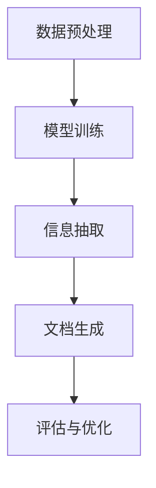

# 【大模型应用开发 动手做AI Agent】自主创建PPT

## 1.背景介绍

在人工智能领域，AI Agent（人工智能代理）已经成为一个热门话题。AI Agent不仅可以执行复杂的任务，还能通过学习和适应环境来提高自身的性能。随着大模型（如GPT-4、BERT等）的发展，AI Agent的能力得到了显著提升。本文将详细介绍如何利用大模型开发一个能够自主创建PPT的AI Agent。

## 2.核心概念与联系

### 2.1 大模型

大模型是指具有大量参数和复杂结构的深度学习模型，如GPT-4、BERT等。这些模型通过大量数据的训练，能够理解和生成自然语言。

### 2.2 AI Agent

AI Agent是一个能够自主执行任务的智能系统。它可以感知环境、做出决策并采取行动。AI Agent通常由感知模块、决策模块和执行模块组成。

### 2.3 自主创建PPT

自主创建PPT是指AI Agent能够根据输入的文本或数据，自动生成结构合理、内容丰富的PPT文档。这需要AI Agent具备自然语言处理、信息抽取和文档生成等能力。

### 2.4 核心联系

大模型为AI Agent提供了强大的自然语言处理能力，使其能够理解和生成高质量的文本。通过结合大模型和AI Agent，我们可以开发出一个能够自主创建PPT的智能系统。

## 3.核心算法原理具体操作步骤

### 3.1 数据预处理

在开发AI Agent之前，我们需要准备大量的训练数据。这些数据可以包括各种类型的文档、PPT模板和相关的文本描述。数据预处理的步骤包括数据清洗、数据标注和数据增强。

### 3.2 模型训练

使用大模型（如GPT-4）进行训练。训练过程中，我们需要设计合适的损失函数和优化算法，以确保模型能够生成高质量的文本。

### 3.3 信息抽取

在生成PPT之前，AI Agent需要从输入的文本或数据中抽取关键信息。这可以通过命名实体识别（NER）、关系抽取等技术实现。

### 3.4 文档生成

根据抽取的信息，AI Agent需要生成PPT文档。这包括生成PPT的结构、内容和格式。我们可以使用模板匹配、文本生成等技术来实现这一过程。

### 3.5 评估与优化

最后，我们需要对生成的PPT进行评估，并根据评估结果优化模型。这可以通过人工评估、自动评估等方法实现。



## 4.数学模型和公式详细讲解举例说明

### 4.1 语言模型

大模型通常基于Transformer架构，其核心是自注意力机制。自注意力机制的公式如下：

$$
\text{Attention}(Q, K, V) = \text{softmax}\left(\frac{QK^T}{\sqrt{d_k}}\right)V
$$

其中，$Q$、$K$、$V$分别表示查询、键和值矩阵，$d_k$是键的维度。

### 4.2 损失函数

在训练过程中，我们使用交叉熵损失函数来衡量生成文本与目标文本之间的差异：

$$
L = -\sum_{i=1}^{N} y_i \log(\hat{y}_i)
$$

其中，$y_i$是目标文本的第$i$个词，$\hat{y}_i$是生成文本的第$i$个词的概率。

### 4.3 优化算法

我们使用Adam优化算法来更新模型参数：

$$
\theta_{t+1} = \theta_t - \alpha \frac{\hat{m}_t}{\sqrt{\hat{v}_t} + \epsilon}
$$

其中，$\theta_t$是第$t$步的模型参数，$\alpha$是学习率，$\hat{m}_t$和$\hat{v}_t$分别是动量和二阶动量的无偏估计。

## 5.项目实践：代码实例和详细解释说明

### 5.1 数据预处理

```python
import pandas as pd

# 读取数据
data = pd.read_csv('data.csv')

# 数据清洗
data = data.dropna()

# 数据标注
data['label'] = data['text'].apply(lambda x: label_text(x))

# 数据增强
data_augmented = augment_data(data)
```

### 5.2 模型训练

```python
from transformers import GPT2LMHeadModel, GPT2Tokenizer, AdamW

# 加载模型和分词器
model = GPT2LMHeadModel.from_pretrained('gpt2')
tokenizer = GPT2Tokenizer.from_pretrained('gpt2')

# 定义损失函数和优化器
loss_fn = torch.nn.CrossEntropyLoss()
optimizer = AdamW(model.parameters(), lr=1e-5)

# 训练模型
for epoch in range(num_epochs):
    for batch in data_loader:
        inputs = tokenizer(batch['text'], return_tensors='pt')
        labels = tokenizer(batch['label'], return_tensors='pt')
        outputs = model(**inputs, labels=labels['input_ids'])
        loss = outputs.loss
        loss.backward()
        optimizer.step()
        optimizer.zero_grad()
```

### 5.3 信息抽取

```python
import spacy

# 加载预训练的NER模型
nlp = spacy.load('en_core_web_sm')

# 信息抽取
def extract_info(text):
    doc = nlp(text)
    entities = [(ent.text, ent.label_) for ent in doc.ents]
    return entities

text = "OpenAI发布了GPT-4模型。"
info = extract_info(text)
print(info)
```

### 5.4 文档生成

```python
from pptx import Presentation

# 创建PPT
prs = Presentation()

# 添加幻灯片
slide = prs.slides.add_slide(prs.slide_layouts[1])

# 添加标题和内容
title = slide.shapes.title
content = slide.placeholders[1]
title.text = "AI Agent"
content.text = "AI Agent能够自主创建PPT。"

# 保存PPT
prs.save('output.pptx')
```

### 5.5 评估与优化

```python
from sklearn.metrics import accuracy_score

# 评估模型
def evaluate_model(model, data_loader):
    all_preds = []
    all_labels = []
    for batch in data_loader:
        inputs = tokenizer(batch['text'], return_tensors='pt')
        labels = batch['label']
        outputs = model(**inputs)
        preds = torch.argmax(outputs.logits, dim=-1)
        all_preds.extend(preds.tolist())
        all_labels.extend(labels.tolist())
    accuracy = accuracy_score(all_labels, all_preds)
    return accuracy

accuracy = evaluate_model(model, data_loader)
print(f"模型准确率: {accuracy}")
```

## 6.实际应用场景

### 6.1 教育领域

在教育领域，教师可以利用AI Agent自动生成教学PPT，提高教学效率。AI Agent可以根据教材内容生成结构合理、内容丰富的PPT，帮助教师更好地传授知识。

### 6.2 商业领域

在商业领域，企业可以利用AI Agent自动生成商业报告PPT，提高工作效率。AI Agent可以根据业务数据和市场分析生成专业的PPT，帮助企业做出更明智的决策。

### 6.3 科研领域

在科研领域，研究人员可以利用AI Agent自动生成科研报告PPT，提高科研效率。AI Agent可以根据实验数据和研究成果生成详细的PPT，帮助研究人员更好地展示研究成果。

## 7.工具和资源推荐

### 7.1 开源工具

- **Hugging Face Transformers**：一个强大的自然语言处理库，支持多种大模型。
- **spaCy**：一个高效的自然语言处理库，支持命名实体识别、依存解析等任务。
- **python-pptx**：一个用于生成和修改PPT文档的Python库。

### 7.2 数据集

- **OpenAI GPT-4 Dataset**：一个包含大量文本数据的数据集，用于训练GPT-4模型。
- **CoNLL-2003 Dataset**：一个用于命名实体识别任务的数据集。

### 7.3 在线资源

- **Hugging Face Model Hub**：一个提供预训练模型和数据集的在线平台。
- **Kaggle**：一个提供各种数据集和竞赛的平台，适合数据科学和机器学习研究。

## 8.总结：未来发展趋势与挑战

### 8.1 未来发展趋势

随着大模型和AI Agent技术的不断发展，AI Agent在各个领域的应用将越来越广泛。未来，AI Agent将能够处理更复杂的任务，提供更智能的服务。

### 8.2 挑战

尽管AI Agent技术已经取得了显著进展，但仍面临一些挑战。例如，如何提高模型的泛化能力，如何处理多模态数据，如何确保生成内容的准确性和可靠性等。这些问题需要进一步的研究和探索。

## 9.附录：常见问题与解答

### 9.1 如何选择合适的大模型？

选择大模型时，需要考虑模型的性能、训练数据的规模和计算资源的要求。一般来说，GPT-4等大模型在自然语言处理任务中表现优异，但需要大量的计算资源。

### 9.2 如何提高AI Agent的生成质量？

提高生成质量的方法包括：使用更大的训练数据集、优化模型结构、调整超参数、使用数据增强技术等。

### 9.3 如何评估AI Agent的性能？

评估AI Agent的性能可以通过多种方法，包括人工评估、自动评估和用户反馈。常用的评估指标包括准确率、召回率、F1值等。

### 9.4 如何处理生成内容的多样性？

处理生成内容的多样性可以通过引入多样性损失函数、使用温度采样等技术来实现。

### 9.5 如何确保生成内容的准确性？

确保生成内容的准确性可以通过引入知识图谱、使用验证机制等方法来实现。

---

作者：禅与计算机程序设计艺术 / Zen and the Art of Computer Programming