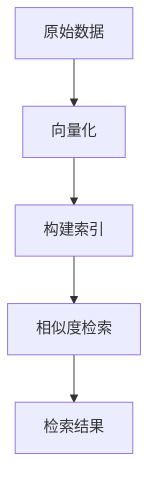

# 高效检索：构建基于向量数据库的高性能搜索引擎

## 1.背景介绍

在信息爆炸的时代，如何高效地从海量数据中检索出有用的信息成为了一个重要的课题。传统的基于关键词的搜索引擎在处理复杂查询和大规模数据时，往往显得力不从心。随着深度学习和自然语言处理技术的发展，基于向量的检索方法逐渐成为一种高效的解决方案。向量数据库通过将数据表示为高维向量，并利用向量之间的相似度进行检索，能够显著提升搜索的准确性和效率。

## 2.核心概念与联系

### 2.1 向量表示

向量表示是将数据转换为高维向量的过程。对于文本数据，可以使用词嵌入（如Word2Vec、GloVe）或句子嵌入（如BERT、GPT）将文本转换为向量。对于图像数据，可以使用卷积神经网络（CNN）提取特征向量。

### 2.2 向量相似度

向量相似度是衡量两个向量之间相似程度的指标。常用的相似度度量方法包括余弦相似度、欧氏距离和内积。余弦相似度通过计算两个向量夹角的余弦值来衡量相似度，适用于高维稀疏向量。欧氏距离则通过计算两个向量之间的直线距离来衡量相似度，适用于低维稠密向量。

### 2.3 向量数据库

向量数据库是一种专门用于存储和检索高维向量的数据库。它通过高效的索引结构和相似度计算方法，能够快速地从海量向量中找到与查询向量最相似的向量。常见的向量数据库包括Faiss、Annoy和Milvus。

## 3.核心算法原理具体操作步骤

### 3.1 向量化数据

首先，需要将原始数据转换为向量表示。以文本数据为例，可以使用预训练的BERT模型将句子转换为向量。对于图像数据，可以使用预训练的ResNet模型提取特征向量。

### 3.2 构建索引

将向量数据存储到向量数据库中，并构建索引。索引的构建方法有多种，包括树结构（如KD树、Ball树）、哈希方法（如LSH）和图结构（如HNSW）。不同的索引方法在构建速度、检索速度和检索精度上有所不同，需要根据具体应用场景进行选择。

### 3.3 相似度检索

在向量数据库中进行相似度检索时，首先需要将查询数据转换为向量表示，然后利用构建好的索引结构快速找到与查询向量最相似的向量。检索结果可以根据相似度排序，并返回前K个最相似的向量。



## 4.数学模型和公式详细讲解举例说明

### 4.1 余弦相似度

余弦相似度是通过计算两个向量夹角的余弦值来衡量相似度。公式如下：

$$
\text{cosine\_similarity}(A, B) = \frac{A \cdot B}{\|A\| \|B\|}
$$

其中，$A \cdot B$ 表示向量 $A$ 和 $B$ 的点积，$\|A\|$ 和 $\|B\|$ 分别表示向量 $A$ 和 $B$ 的模。

### 4.2 欧氏距离

欧氏距离是通过计算两个向量之间的直线距离来衡量相似度。公式如下：

$$
\text{euclidean\_distance}(A, B) = \sqrt{\sum_{i=1}^{n} (A_i - B_i)^2}
$$

其中，$A_i$ 和 $B_i$ 分别表示向量 $A$ 和 $B$ 的第 $i$ 个分量。

### 4.3 示例

假设有两个向量 $A = [1, 2, 3]$ 和 $B = [4, 5, 6]$，我们可以计算它们的余弦相似度和欧氏距离。

余弦相似度：

$$
\text{cosine\_similarity}(A, B) = \frac{1 \cdot 4 + 2 \cdot 5 + 3 \cdot 6}{\sqrt{1^2 + 2^2 + 3^2} \sqrt{4^2 + 5^2 + 6^2}} = \frac{32}{\sqrt{14} \sqrt{77}} \approx 0.9746
$$

欧氏距离：

$$
\text{euclidean\_distance}(A, B) = \sqrt{(1 - 4)^2 + (2 - 5)^2 + (3 - 6)^2} = \sqrt{27} \approx 5.196
$$

## 5.项目实践：代码实例和详细解释说明

### 5.1 数据准备

首先，我们需要准备一些数据。以文本数据为例，我们可以使用一个简单的句子列表。

```python
sentences = [
    "我喜欢机器学习",
    "自然语言处理是人工智能的一个分支",
    "向量数据库可以高效地存储和检索数据",
    "深度学习在图像处理方面表现出色"
]
```

### 5.2 向量化

使用预训练的BERT模型将句子转换为向量。

```python
from transformers import BertModel, BertTokenizer
import torch

tokenizer = BertTokenizer.from_pretrained('bert-base-chinese')
model = BertModel.from_pretrained('bert-base-chinese')

def sentence_to_vector(sentence):
    inputs = tokenizer(sentence, return_tensors='pt')
    outputs = model(**inputs)
    return outputs.last_hidden_state.mean(dim=1).detach().numpy()

vectors = [sentence_to_vector(sentence) for sentence in sentences]
```

### 5.3 构建索引

使用Faiss构建向量索引。

```python
import faiss

d = vectors[0].shape[1]  # 向量维度
index = faiss.IndexFlatL2(d)  # 构建L2距离索引
index.add(np.array(vectors))  # 添加向量到索引中
```

### 5.4 相似度检索

使用构建好的索引进行相似度检索。

```python
query = sentence_to_vector("机器学习是人工智能的一个重要领域")
D, I = index.search(query, k=2)  # 检索最相似的2个向量

print("相似度最高的句子索引：", I)
print("相似度最高的句子：", [sentences[i] for i in I[0]])
```

## 6.实际应用场景

### 6.1 文本检索

在文本检索中，向量数据库可以用于快速找到与查询文本最相似的文档。例如，在法律文档检索中，可以使用向量数据库快速找到与查询案件最相似的法律条文。

### 6.2 图像检索

在图像检索中，向量数据库可以用于快速找到与查询图像最相似的图像。例如，在电商平台中，可以使用向量数据库快速找到与用户上传的商品图片最相似的商品。

### 6.3 推荐系统

在推荐系统中，向量数据库可以用于快速找到与用户兴趣最相似的物品。例如，在音乐推荐系统中，可以使用向量数据库快速找到与用户喜欢的歌曲最相似的歌曲。

## 7.工具和资源推荐

### 7.1 向量数据库

- Faiss：由Facebook AI Research开发的高效相似度搜索和聚类库，支持多种索引结构和相似度度量方法。
- Annoy：由Spotify开发的近似最近邻搜索库，适用于大规模高维数据的相似度检索。
- Milvus：开源的向量数据库，支持多种索引结构和相似度度量方法，适用于大规模向量数据的存储和检索。

### 7.2 向量化工具

- BERT：由Google AI开发的预训练语言模型，适用于多种自然语言处理任务。
- Word2Vec：由Google开发的词嵌入模型，能够将词语转换为向量表示。
- ResNet：由Microsoft Research开发的卷积神经网络模型，适用于图像特征提取。

## 8.总结：未来发展趋势与挑战

向量数据库在高效检索方面展现了巨大的潜力，但也面临一些挑战。首先，随着数据规模的不断增长，如何进一步提升向量数据库的检索速度和存储效率是一个重要课题。其次，如何在保证检索精度的同时，降低计算资源的消耗，也是一个需要解决的问题。未来，随着硬件技术的发展和算法的不断优化，向量数据库有望在更多领域得到广泛应用。

## 9.附录：常见问题与解答

### 9.1 向量数据库与传统数据库有何不同？

向量数据库专门用于存储和检索高维向量，而传统数据库主要用于存储和检索结构化数据。向量数据库通过高效的索引结构和相似度计算方法，能够快速地从海量向量中找到与查询向量最相似的向量。

### 9.2 如何选择合适的向量化工具？

选择向量化工具时，需要根据具体应用场景和数据类型进行选择。对于文本数据，可以使用BERT、Word2Vec等预训练语言模型。对于图像数据，可以使用ResNet等卷积神经网络模型。

### 9.3 向量数据库的检索速度如何提升？

提升向量数据库的检索速度可以从以下几个方面入手：选择合适的索引结构（如HNSW、LSH）、优化相似度计算方法、利用并行计算和分布式计算等。

---

作者：禅与计算机程序设计艺术 / Zen and the Art of Computer Programming