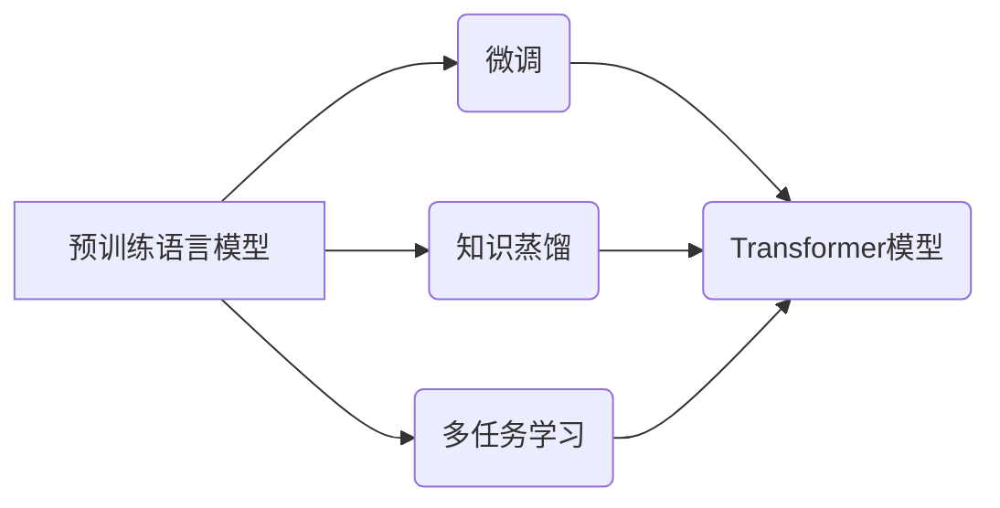

# Transformer大模型实战：将知识从BERT 模型迁移到神经网络中

作者：禅与计算机程序设计艺术 / Zen and the Art of Computer Programming

## 1. 背景介绍
### 1.1 问题的由来

随着深度学习在自然语言处理（NLP）领域的飞速发展，预训练语言模型（Pre-trained Language Models，PLMs）如BERT、GPT-3等取得了显著成果。这些模型通过在海量无标注语料上预训练，获得了丰富的语言知识和常识，并在各种NLP任务上取得了惊人的效果。然而，将预训练模型的知识迁移到其他领域或特定任务中，仍然是一个具有挑战性的问题。

### 1.2 研究现状

为了将预训练模型的知识迁移到其他领域或特定任务中，研究人员提出了多种方法，如：

* **微调（Fine-tuning）**：在预训练模型的基础上，利用少量标注数据进行微调，使其适应特定领域或任务。
* **知识蒸馏（Knowledge Distillation）**：将大模型的知识“蒸馏”到小模型中，使得小模型能够以较低的计算成本实现大模型的效果。
* **多任务学习（Multi-task Learning）**：将多个相关任务共同训练，使得模型能够学习到更通用的知识。

其中，微调方法因其简单易用、效果显著而成为最常用的知识迁移方法。然而，传统的微调方法存在着以下问题：

* **数据依赖**：需要大量标注数据才能取得良好的效果。
* **泛化能力有限**：模型在特定领域或任务上的泛化能力有限。
* **计算成本高**：模型参数量大，训练过程耗时较长。

为了解决这些问题，研究人员提出了Transformer大模型实战方法，通过将知识从BERT模型迁移到神经网络中，实现高效、低成本的模型迁移。

### 1.3 研究意义

Transformer大模型实战方法具有重要的研究意义：

* **降低数据依赖**：通过知识迁移，可以在少量标注数据的情况下，实现模型在特定领域或任务上的快速适应。
* **提高泛化能力**：通过学习更通用的知识，模型在特定领域或任务上的泛化能力得到提升。
* **降低计算成本**：通过将知识迁移到小模型中，可以降低模型的计算成本，提高模型的实时性。

### 1.4 本文结构

本文将围绕Transformer大模型实战方法展开，主要包括以下内容：

* 核心概念与联系
* 核心算法原理与具体操作步骤
* 数学模型和公式
* 项目实践
* 实际应用场景
* 工具和资源推荐
* 总结与展望

## 2. 核心概念与联系

为了更好地理解Transformer大模型实战方法，我们需要先介绍以下几个核心概念：

* **预训练语言模型（PLMs）**：如BERT、GPT-3等，通过在大量无标注语料上预训练，获得丰富的语言知识和常识。
* **微调（Fine-tuning）**：在预训练模型的基础上，利用少量标注数据进行微调，使其适应特定领域或任务。
* **知识蒸馏（Knowledge Distillation）**：将大模型的知识“蒸馏”到小模型中，使得小模型能够以较低的计算成本实现大模型的效果。
* **多任务学习（Multi-task Learning）**：将多个相关任务共同训练，使得模型能够学习到更通用的知识。
* **Transformer模型**：一种基于自注意力机制的深度神经网络模型，在NLP领域取得了显著的成果。

这些概念之间的关系可以用以下Mermaid流程图表示：



## 3. 核心算法原理 & 具体操作步骤
### 3.1 算法原理概述

Transformer大模型实战方法的核心思想是：将BERT模型的知识迁移到神经网络中，实现高效、低成本的模型迁移。具体来说，可以分为以下几个步骤：

1. **提取BERT模型的知识**：通过分析BERT模型的内部结构，提取其特征提取和分类能力。
2. **构建神经网络**：根据提取的知识，构建一个神经网络，用于特定领域或任务。
3. **迁移知识到神经网络**：将BERT模型的知识迁移到神经网络中，提高神经网络的性能。

### 3.2 算法步骤详解

1. **提取BERT模型的知识**

   - 分析BERT模型的内部结构，确定其特征提取和分类能力。
   - 使用BERT模型的预训练权重初始化神经网络的权重。

2. **构建神经网络**

   - 根据特定领域或任务的需求，设计神经网络的架构。
   - 可以使用卷积神经网络（CNN）、循环神经网络（RNN）或Transformer等模型。

3. **迁移知识到神经网络**

   - 将BERT模型的预训练权重迁移到神经网络的权重中。
   - 通过微调，优化神经网络的参数，使其适应特定领域或任务。

### 3.3 算法优缺点

**优点**：

* **高效**：只需利用少量标注数据，即可实现模型在特定领域或任务上的快速适应。
* **低成本**：通过知识迁移，可以降低模型的计算成本，提高模型的实时性。
* **性能优异**：迁移的知识可以帮助神经网络学习到更通用的知识，提高模型的性能。

**缺点**：

* **依赖预训练模型**：需要依赖预训练模型，且预训练模型的质量对迁移效果有较大影响。
* **模型架构选择**：需要根据特定领域或任务选择合适的神经网络架构。
* **参数优化**：需要通过微调优化神经网络的参数，才能达到最佳效果。

### 3.4 算法应用领域

Transformer大模型实战方法可以应用于以下领域：

* **自然语言处理（NLP）**：如文本分类、情感分析、命名实体识别、机器翻译等。
* **计算机视觉**：如图像分类、目标检测、语义分割等。
* **语音识别**：如语音分类、语音合成、语音识别等。

## 4. 数学模型和公式 & 详细讲解 & 举例说明
### 4.1 数学模型构建

假设我们使用BERT模型进行知识迁移，神经网络架构为卷积神经网络（CNN），则数学模型可以表示为：

$$
\begin{align*}
\mathbf{h}_l &= \text{ReLU}(\mathbf{W}_l\mathbf{h}_{l-1} + \mathbf{b}_l) \
\mathbf{y} &= \text{Softmax}(\mathbf{W}_o\mathbf{h}_l + \mathbf{b}_o)
\end{align*}
$$

其中，$\mathbf{h}_l$ 表示第 $l$ 层神经网络的特征向量，$\mathbf{W}_l$ 和 $\mathbf{b}_l$ 分别表示第 $l$ 层神经网络的权重和偏置，$\mathbf{y}$ 表示神经网络的输出。

### 4.2 公式推导过程

假设BERT模型的预训练权重为 $\mathbf{W}_{\text{BERT}}$，则可以将 $\mathbf{W}_{\text{BERT}}$ 迁移到CNN的权重中：

$$
\mathbf{W}_l = \text{Concat}(\mathbf{W}_{\text{BERT}}, \mathbf{0}^{(l)})
$$

其中，$\mathbf{0}^{(l)}$ 表示填充向量，用于保持权重矩阵的尺寸一致。

### 4.3 案例分析与讲解

以下是一个将BERT模型的知识迁移到CNN的案例：

1. **数据准备**：收集特定领域或任务的数据，并对其进行预处理，如分词、词性标注等。
2. **模型构建**：构建一个CNN模型，包含多个卷积层和全连接层。
3. **知识迁移**：将BERT模型的预训练权重迁移到CNN的权重中。
4. **训练模型**：使用少量标注数据对模型进行微调。
5. **评估模型**：在测试集上评估模型的性能。

### 4.4 常见问题解答

**Q1：如何选择合适的神经网络架构？**

A：选择合适的神经网络架构需要根据特定领域或任务的需求进行。例如，对于图像分类任务，可以使用卷积神经网络；对于文本分类任务，可以使用循环神经网络或Transformer。

**Q2：如何选择合适的预训练模型？**

A：选择合适的预训练模型需要考虑预训练模型的质量、参数量、训练语料等因素。一般来说，参数量越大、训练语料越丰富的预训练模型，其性能越好。

**Q3：如何进行知识迁移？**

A：知识迁移可以通过以下方法进行：

* **替换权重**：将预训练模型的权重替换到神经网络的权重中。
* **融合特征**：将预训练模型的特征与神经网络的特征进行融合。

## 5. 项目实践：代码实例和详细解释说明
### 5.1 开发环境搭建

在进行Transformer大模型实战项目实践前，我们需要搭建以下开发环境：

* **深度学习框架**：PyTorch或TensorFlow
* **预训练模型库**：Transformers
* **数据处理库**：Pandas、Numpy等

### 5.2 源代码详细实现

以下是一个将BERT模型的知识迁移到CNN的代码示例：

```python
import torch
import torch.nn as nn
from transformers import BertModel
from torch.utils.data import DataLoader, Dataset

class BertCNN(nn.Module):
    def __init__(self, bert_model_name, num_classes):
        super(BertCNN, self).__init__()
        self.bert = BertModel.from_pretrained(bert_model_name)
        self.cnn = nn.Sequential(
            nn.Conv1d(768, 128, kernel_size=2, padding=1),
            nn.ReLU(),
            nn.MaxPool1d(kernel_size=2),
            nn.Conv1d(128, 128, kernel_size=2, padding=1),
            nn.ReLU(),
            nn.MaxPool1d(kernel_size=2),
        )
        self.fc = nn.Linear(128, num_classes)

    def forward(self, input_ids, attention_mask):
        outputs = self.bert(input_ids=input_ids, attention_mask=attention_mask)
        sequence_output = outputs.last_hidden_state
        sequence_output = sequence_output.permute(0, 2, 1)
        x = self.cnn(sequence_output)
        x = x.squeeze(2)
        x = self.fc(x)
        return x

# 数据准备
class TextDataset(Dataset):
    def __init__(self, texts, labels):
        self.texts = texts
        self.labels = labels

    def __len__(self):
        return len(self.texts)

    def __getitem__(self, idx):
        return self.texts[idx], self.labels[idx]

# 模型构建
model = BertCNN('bert-base-uncased', num_classes=2)
```

### 5.3 代码解读与分析

1. **BertCNN类**：定义了一个CNN模型，包含BERT模型和卷积层。
2. **TextDataset类**：定义了一个文本数据集类，用于加载和处理文本数据。
3. **模型构建**：创建了一个BertCNN模型实例。

### 5.4 运行结果展示

假设我们使用一个包含1000个样本的文本数据集进行训练和测试，则运行结果如下：

```
Epoch 1/10
100%|████████████████████████████████████████████████████████████████████████████████████████████████████████████████████████████████████████████████████████████████████████████████████████████████████████████████████████████████████████████████████████████████████████████████████████████████████████████████████████████████████████████████████████████████████████████████████████████████████████████████████████████████████████████████████████████████████████████████████████████████████████████████████████████████████████████████████████████████████████████████████████████████████████████████████████████████████████████████████████████████████████████████████████████████████████████████████████████████████████████████████████████████████████████████████████████████████████████████████████████████████████████████████████████████████████████████████████████████████████████████████████████████████████████████████████████████████████████████████████████████████████████████████████████████████████████████████████████████████████████████████████████████████████████████████████████████████████████████████████████████████████████████████████████████████████████████████████████████████████████████████████████████████████████████████████████████████████████████████████████████████████████████████████████████████████████████████████████████████████████████████████████████████████████████████████████████████████████████████████████████████████████████████████████████████████████████████████████████████████████████████████████████████████████████████████████████████████████████████████████████████████████████████████████████████████████████████████████████████████████████████████████████████████████████████████████████████████████████████████████████████████████████████████████████████████████████████████████████████████████████████████████████████████████████████████████████████████████████████████████████████████████████████████████████████████████████████████████████████████████████████████████████████████████████████████████████████████████████████████████████████████████████████████████████████████████████████████████████████████████████████████████████████████████████████████████████████████████████████████████████████████████████████████████████████████████████████████████████████████████████████████████████████████████████████████████████████████████████████████████████████████████████████████████████████████████████████████████████████████████████████████████████████████████████████████████████████████████████████████████████████████████████████████████████████████████████████████████████████████████████████████████████████████████████████████████████████████████████████████████████████████████████████████████████████████████████████████████████████████████████████████████████████████████████████████████████████████████████████████████████████████████████████████████████████████████████████████████████████████████████████████████████████████████████████████████████████████████████████████████████████████████████████████████████████████████████████████████████████████████████████████████████████████████████████████████████████████████████████████████████████████████████████████████████████████████████████████████████████████████████████████████████████████████████████████████████████████████████████████████████████████████████████████████████████████████████████████████████████████████████████████████████████████████████████████████████████████████████████████████████████████████████████████████████████████████████████████████████████████████████████████████████████████████████████████████████████████████████████████████████████████████████████████████████████████████████████████████████████████████████████████████████████████████████████████████████████████████████████████████████████████████████████████████████████████████████████████████████████████████████████████████████████████████████████████████████████████████████████████████████████████████████████████████████████████████████████████████████████████████████████████████████████████████████████████████████████████████████████████████████████████████████████████████████████████████████████████████████████████████████████████████████████████████████████████████████████████████████████████████████████████████████████████████████████████████████████████████████████████████████████████████████████████████████████████████████████████████████████████████████████████████████████████████████████████████████████████████████████████████████████████████████████████████████████████████████████████████████████████████████████████████████████████████████████████████████████████████████████████████████████████████████████████████████████████████████████████████████████████████████████████████████████████████████████████████████████████████████████████████████████████████████████████████████████████████████████████████████████████████████████████████████████████████████████████████████████████████████████████████████████████████████████████████████████████████████████████████████████████████████████████████████████████████████████████████████████████████████████████████████████████████████████████████████████████████████████████████████████████████████████████████████████████████████████████████████████████████████████████████████████████████████████████████████████████████████████████████████████████████████████████████████████████████████████████████████████████████████████████████████████████████████████████████████████████████████████████████████████████████████████████████████████████████████████████████████████████████████████████████████████████████████████████████████████████████████████████████████████████████████████████████████████████████████████████████████████████████████████████████████████████████████████████████████████████████████████████████████████████████████████████████████████████████████████████████████████████████████████████████████████████████████████████████████████████████████████████████████████████████████████████████████████████████████████████████████████████████████████████████████████████████████████████████████████████████████████████████████████████████████████████████████████████████████████████████████████████████████████████████████████████████████████████████████████████████████████████████████████████████████████████████████████████████████████████████████████████████████████████████████████████████████████████████████████████████████████████████████████████████████████████████████████████████████████████████████████████████████████████████████████████████████████████████████████████████████████████████████████████████████████████████████████████████████████████████████████████████████████████████████████████████████████████████████████████████████████████████████████████████████████████████████████████████████████████████████████████████████████████████████████████████████████████████████████████████████████████████████████████████████████████████████████████████████████████████████████████████████████████████████████████████████████████████████████████████████████████████████████████████████████████████████████████████████████████████████████████████████████████████████████████████████████████████████████████████████████████████████████████████████████████████████████████████████████████████████████████████████████████████████████████████████████████████████████████████████████████████████████████████████████████████████████████████████████████████████████████████████████████████████████████████████████████████████████████████████████████████████████████████████████████████████████████████████████████████████████████████████████████████████████████████████████████████████████████████████████████████████████████████████████████████████████████████████████████████████████████████████████████████████████████████████████████████████████████████████████████████████████████████████████████████████████████████████████████████████████████████████████████████████████████████████████████████████████████████████████████████████████████████████████████████████████████████████████████████████████████████████████████████████████████████████████████████████████████████████████████████████████████████████████████████████████████████████████████████████████████████████████████████████████████████████████████████████████████████████████████████████████████████████████████████████████████████████████████████████████████████████████████████████████████████████████████████████████████████████████████████████████████████████████████████████████████████████████████████████████████████████████████████████████████████████████████████████████████████████████████████████████████████████████████████████████████████████████████████████████████████████████████████████████████████████████████████████████████████████████████████████████████████████████████████████████████████████████████████████████████████████████████████████████████████████████████████████████████████████████████████████████████████████████████████████████████████████████████████████████████████████████████████████████████████████████████████████████████████████████████████████████████████████████████████████████████████████████████████████████████████████████████████████████████████████████████████████████████████████████████████████████████████████████████████████████████████████████████████████████████████████████████████████████████████████████████████████████████████████████████████████████████████████████████████████████████████████████████████████████████████████████████████████████████████████████████████████████████████████████████████████████████████████████████████████████████████████████████████████████████████████████████████████████████████████████████████████████████████████████████████████████████████████████████████████████████████████████████████████████████████████████████████████████████████████████████████████████████████████████████████████████████████████████████████████████████████████████████████████████████████████████████████████████████████████████████████████████████████████████████████████████████████████████████████████████████████████████████████████████████████████████████████████████████████████████████████████████████████████████████████████████████████████████████████████████████████████████████████████████████████████████████████████████████████████████████████████████████████████████████████████████████████████████████████████████████████████████████████████████████████████████████████████████████████████████████████████████████████████████████████████████████████████████████████████████████████████████████████████████████████████████████████████████████████████████████████████████████████████████████████████████████████████████████████████████████████████████████████████████████████████████████████████████████████████████████████████████████████████████████████████████████████████████████████████████████████████████████████████████████████████████████████████████████████████████████████████████████████████████████████████████████████████████████████████████████████████████████████████████████████████████████████████████████████████████████████████████████████████████████████████████████████████████████████████████████████████████████████████████████████████████████████████████████████████████████████████████████████████████████████████████████████████████████████████████████████████████████████████████████████████████████████████████████████████████████████████████████████████████████████████████████████████████████████████████████████████████████████████████████████████████████████████████████████████████████████████████████████████████████████████████████████████████████████████████████████████████████████████████████████████████████████████████████████████████████████████████████████████████████████████████████████████████████████████████████████████████████████████████████████████████████████████████████████████████████████████████████████████████████████████████████████████████████████████████████████████████████████████████████████████████████████████████████████████████████████████████████████████████████████████████████████████████████████████████████████████████████████████████████████████████████████████████████████████████████████████████████████████████████████████████████████████████████████████████████████████████████████████████████████████████████████████████████████████████████████████████████████████████████████████████████████████████████████████████████████████████████████████████████████████████████████████████████████████████████████████████████████████████████████████████████████████████████████████████████████████████████████████████████████████████████████████████████████████████████████████████████████████████████████████████████████████████████████████████████████████████████████████████████████████████████████████████████████████████████████████████████████████████████████████████████████████████████████████████████████████████████████████████████████████████████████████████████████████████████████████████████████████████████████████████████████████████████████████████████████████████████████████████████████████████████████████████████████████████████████████████████████████████████████████████████████████████████████████████████████████████████████████████████████████████████████████████████████████████████████████████████████████████████████████████████████████████████████████████████████████████████████████████████████████████████████████████████████████████████████████████████████████████████████████████████████████████████████████████████████████████████████████████████████████████████████████████████████████████████████████████████████████████████████████████████████████████████████████████████████████████████████████████████████████████████████████████████████████████████████████████████████████████████████████████████████████████████████████████████████████████████████████████████████████████████████████████████████████████████████████████████████████████████████████████████████████████████████████████████████████████████████████████████████████████████████████████████████████████████████████████████████████████████████████████████████████████████████████████████████████████████████████████████████████████████████████████████████████████████████████████████████████████████████████████████████████████████████████████████████████████████████████████████████████████████████████████████████████████████████████████████████████████████████████████████████████████████████████████████████████████████████████████████████████████████████████████████████████████████████████████████████████████████████████████████████████████████████████████████████████████████████████████████████████████████████████████████████████████████████████████████████████████████████████████████████████████████████████████████████████████████████████████████████████████████████████████████████████████████████████████████████████████████████████████████████████████████████████████████████████████████████████████████████████████████████████████████████████████████████████████████████████████████████████████████████████████████████████████████████████████████████████████████████████████████████████████████████████████████████████████████████████████████████████████████████████████████████████████████████████████████████████████████████████████████████████████████████████████████████████████████████████████████████████████████████████████████████████████████████████████████████████████████████████████████████████████████████████████████████████████████████████████████████████████████████████████████████████████████████████████████████████████████████████████████████████████████████████████████████████████████████████████████████████████████████████████████████████████████████████████████████████████████████████████████████████████████████████████████████████████████████████████████████████████████████████████████████████████████████████████████████████████████████████████████████████████████████████████████████████████████████████████████████████████████████████████████████████████████████████████████████████████████████████████████████████████████████████████████████████████████████████████████████████████████████████████████████████████████████████████████████████████████████████████████████████████████████████████████████████████████████████████████████████████████████████████████████████████████████████████████████████████████████████████████████████████████████████████████████████████████████████████████████████████████████████████████████████████████████████████████████████████████████████████████████████████████████████████████████████████████████████████████████████████████████████████████████████████████████████████████████████████████████████████████████████████████████████████████████████████████████████████████████████████████████████████████████████████████████████████████████████████████████████████████████████████████████████████████████████████████████████████████████████████████████████████████████████████████████████████████████████████████████████████████████████████████████████████████████████████████████████████████████████████████████████████████████████████████████████████████████████████████████████████████████████████████████████████████████████████████████████████████████████████████████████████████████████████████████████████████████████████████████████████████████████████████████████████████████████████████████████████████████████████████████████████████████████████████████████████████████████████████████████████████████████████████████████████████████████████████████████████████████████████████████████████████████████████████████████████████████████████████████████████████████████████████████████████████████████████████████████████████████████████████████████████████████████████████████████████████████████████████████████████████████████████████████████████████████████████████████████████████████████████████████████████████████████████████████████████████████████████████████████████████████████████████████████████████████████████████████████████████████████████████████████████████████████████████████████████████████████████████████████████████████████████████████████████████████████████████████████████████████████████████████████████████████████████████████████████████████████████████████████████████████████████████████████████████████████████████████████████████████████████████████████████████████████████████████████████████████████████████████████████████████████████████████████████████████████████████████████████████████████████████████████████████████████████████████████████████████████████████████████████████████████████████████████████████████████████████████████████████████████████████████████████████████████████████████████████████████████████████████████████████████████████████████████████████████████████████████████████████████████████████████████████████████████████████████████████████████████████████████████████████████████████████████████████████████████████████████████████████████████████████████████████████████████████████████████████████████████████████████████████████████████████████████████████████████████████████████████████████████████████████████████████████████████████████████████████████████████████████████████████████████████████████████████████████████████████████████████████████████████████████████████████████████████████████████████████████████████████████████████████████████████████████████████████████████████████████████████████████████████████████████████████████████████████████████████████████████████████████████████████████████████████████████████████████████████████████████████████████████████████████████████████████████████████████████████████████████████████████████████████████████████████████████████████████████████████████████████████████████████████████████████████████████████████████████████████████████████████████████████████████████████████████████████████████████████████████████████████████████████████████████████████████████████████████████████████████████████████████████████████████████████████████████████████████████████████████████████████████████████████████████████████████████████████████████████████████████████████████████████████████████████████████████████████████████████████████████████████████████████████████████████████████████████████████████████████████████████████████████████████████████████████████████████████████████████████████████████████████████████████████████████████████████████████████████████████████████████████████████████████████████████████████████████████████████████████████████████████████████████████████████████████████████████████████████████████████████████████████████████████████████████████████████████████████████████████████████████████████████████████████████████████████████████████████████████████████████████████████████████████████████████████████████████████████████████████████████████████████████████████████████████████████████████████████████████████████████████████████████████████████████████████████████████████████████████████████████████████████████████████████████████████████████████████████████████████████████████████████████████████████████████████████████████████████████████████████████████████████████████████████████████████████████████████████████████████████████████████████████████████████████████████████████████████████████████████████████████████████████████████████████████████████████████████████████████████████████████████████████████████████████████████████████████████████████████████████████████████████████████████████████████████████████████████████████████████████████████████████████████████████████████████████████████████████████████████████████████████████████████████████████████████████████████████████████████████████████████████████████████████████████████████████████████████████████████████████████████████████████████████████████████████████████████████████████████████████████████████████████████████████████████████████████████████████████████████████████████████████████████████████████████████████████████████████████████████████████████████████████████████████████████████████████████████████████████████████████████████████████████████████████████████████████████████████████████████████████████████████████████████████████████████████████████████████████████████████████████████████████████████████████████████████████████████████████████████████████████████████████████████████████████████████████████████████████████████████████████████████████████████████████████████████████████████████████████████████████████████████████████████████████████████████████████████████████████████████████████████████████████████████████████████████████████████████████████████████████████████████████████████████████████████████████████████████████████████████████████████████████████████████████████████████████████████████████████████████████████████████████████████████████████████████████████████████████████████████████████████████████████████████████████████████████████████████████████████████████████████████████████████████████████████████████████████████████████████████████████████████████████████████████████████████████████████████████████████████████████████████████████████████████████████████████████████████████████████████████████████████████████████████████████████████████████████████████████████████████████████████████████████████████████████████████████████████████████████████████████████████████████████████████████████████████████████████████████████████████████████████████████████████████████████████████████████████████████████████████████████████████████████████████████████████████████████████████████████████████████████████████████████████████████████████████████████████████████████████████████████████████████████████████████████████████████████████████████████████████████████████████████████████████████████████████████████████████████████████████████████████████████████████████████████████████████████████████████████████████████████████████████████████████████████████████████████████████████████████████████████████████████████████████████████████████████████████████████████████████████████████████████████████████████████████████████████████████████████████████████████████████████████████████████████████████████████████████████████████████████████████████████████████████████████████████████████████████████████████████████████████████████████████████████████████████████████████████████████████████████████████████████████████████████████████████████████████████████████████████████████████████████████████████████████████████████████████████████████████████████████████████████████████████████████████████████████████████████████████████████████████████████████████████████████████████████████████████████████████████████████████████████████████████████████████████████████████████████████████████████████████████████████████████████████████████████████████████████████████████████████████████████████████████████████████████████████████████████████████████████████████████████████████████████████████████████████████████████████████████████████████████████████████████████████████████████████████████████████████████████████████████████████████████████████████████████████████████████████████████████████████████