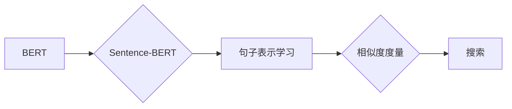

# Transformer大模型实战：用Sentence-BERT模型寻找类似句子

作者：禅与计算机程序设计艺术 / Zen and the Art of Computer Programming


## 1. 背景介绍
### 1.1 问题的由来

在自然语言处理（NLP）领域，寻找与给定句子语义相似的句子是一个重要且具有挑战性的任务。这种任务在信息检索、问答系统、推荐系统等领域有着广泛的应用。然而，传统的基于关键字或词袋模型的方法往往无法准确捕捉句子语义，导致检索到的结果与用户需求相差甚远。

近年来，随着深度学习技术的快速发展，基于Transformer的大模型在NLP领域取得了突破性的进展。其中，Sentence-BERT模型作为一种基于Transformer的句子表示学习模型，能够有效地捕捉句子的语义信息，为寻找类似句子提供了新的思路。

### 1.2 研究现状

Sentence-BERT模型由Hugging Face团队于2019年提出，它将BERT模型扩展到句子层面，通过捕捉句子中词语的上下文信息，学习到具有语义丰富性的句子表示。Sentence-BERT模型在多项NLP任务上取得了优异的成绩，例如语义相似度、问答系统、情感分析等。

### 1.3 研究意义

本文将详细介绍如何使用Sentence-BERT模型进行类似句子的搜索，探讨其原理、步骤、优缺点以及应用领域。通过本文的学习，读者可以掌握使用Sentence-BERT模型进行类似句子搜索的技能，并将其应用于实际场景中。

### 1.4 本文结构

本文分为以下章节：

- 第2章：介绍Sentence-BERT模型及其相关概念。
- 第3章：讲解Sentence-BERT模型的原理和具体操作步骤。
- 第4章：分析Sentence-BERT模型的数学模型、公式推导、案例分析和常见问题解答。
- 第5章：通过实际项目实践，展示如何使用Sentence-BERT模型进行类似句子搜索。
- 第6章：探讨Sentence-BERT模型在实际应用场景中的表现和未来应用展望。
- 第7章：推荐相关学习资源、开发工具和参考文献。
- 第8章：总结全文，展望Sentence-BERT模型的发展趋势与挑战。
- 第9章：附录，提供常见问题与解答。

## 2. 核心概念与联系

为了更好地理解Sentence-BERT模型，本节将介绍几个核心概念：

- BERT：一种基于Transformer的预训练语言表示学习模型，可以捕捉词语的上下文信息。
- Sentence-BERT：一种基于BERT的句子表示学习模型，通过捕捉句子中词语的上下文信息，学习到具有语义丰富性的句子表示。
- 相似度度量：用于衡量两个句子之间的语义相似度，常用的方法包括余弦相似度和余弦距离。
- 搜索：根据用户输入的查询句子，检索与查询句子语义相似的句子。

以下是这几个概念之间的逻辑关系：



可以看出，Sentence-BERT模型是BERT模型在句子层面的扩展，通过学习句子表示，用于句子相似度度量和搜索。

## 3. 核心算法原理 & 具体操作步骤
### 3.1 算法原理概述

Sentence-BERT模型主要由以下几个部分组成：

- BERT编码器：用于将句子编码为语义向量。
- Mean Pooling：将BERT编码器的输出向量化，得到句子表示。
- 最大池化：从BERT编码器的输出中提取最重要的特征，得到句子表示。

Sentence-BERT模型的工作流程如下：

1. 使用预训练的BERT模型对句子进行编码，得到句子的语义向量。
2. 对BERT编码器的输出进行mean pooling或max pooling操作，得到句子的语义表示。
3. 计算查询句子和候选句子之间的相似度，检索与查询句子语义相似的句子。

### 3.2 算法步骤详解

以下是使用Sentence-BERT模型进行类似句子搜索的详细步骤：

**Step 1：数据预处理**

1. 将文本数据预处理成模型所需的格式，如分词、去除停用词等。
2. 将预处理后的文本数据输入BERT编码器，得到句子的语义向量。

**Step 2：训练Sentence-BERT模型**

1. 使用大量文本数据进行预训练，学习句子表示。
2. 使用少量标注数据对Sentence-BERT模型进行微调，进一步提升模型性能。

**Step 3：搜索类似句子**

1. 将查询句子输入Sentence-BERT模型，得到查询句子的语义向量。
2. 将候选句子输入Sentence-BERT模型，得到候选句子的语义向量。
3. 计算查询句子和候选句子之间的相似度，检索与查询句子语义相似的句子。

### 3.3 算法优缺点

**优点**：

1. 语义表示丰富：Sentence-BERT模型能够学习到具有语义丰富性的句子表示，能够更好地捕捉句子语义。
2. 性能优异：Sentence-BERT模型在多项NLP任务上取得了优异的成绩，能够有效地检索到与查询句子语义相似的句子。
3. 可扩展性强：Sentence-BERT模型可以应用于各种NLP任务，例如语义相似度、问答系统、情感分析等。

**缺点**：

1. 计算量大：Sentence-BERT模型需要大量的计算资源进行训练和推理。
2. 模型复杂：Sentence-BERT模型的结构较为复杂，需要一定的技术基础才能进行开发和使用。

### 3.4 算法应用领域

Sentence-BERT模型可以应用于以下领域：

- 信息检索：根据用户输入的查询句子，检索与查询句子语义相似的句子。
- 问答系统：根据用户输入的问题，检索与问题语义相似的答案。
- 推荐系统：根据用户的历史行为和兴趣，推荐与用户兴趣相似的句子或文章。
- 情感分析：根据用户输入的评论或评价，判断其情感倾向。

## 4. 数学模型和公式 & 详细讲解 & 举例说明
### 4.1 数学模型构建

Sentence-BERT模型的核心是BERT编码器和句子表示学习。以下是BERT编码器和句子表示学习的数学模型：

**BERT编码器**：

BERT编码器由多个Transformer编码器层组成，每个编码器层包括两个子层：

- Multi-Head Self-Attention：使用多头注意力机制对句子进行编码，捕捉词语之间的依赖关系。
- Position-wise Feed-Forward Networks：对每个词的编码进行前馈神经网络处理。

**句子表示学习**：

句子表示学习主要使用mean pooling或max pooling操作，将BERT编码器的输出向量化，得到句子的语义表示。

- Mean Pooling：将BERT编码器的输出向量化，取平均值作为句子的语义表示。
- Max Pooling：将BERT编码器的输出向量化，取最大值作为句子的语义表示。

以下是Sentence-BERT模型的数学模型：

$$
S_{BERT} = \text{mean}(M_{BERT}(S))
$$

其中，$S_{BERT}$ 为句子 $S$ 的语义表示，$M_{BERT}$ 为BERT编码器。

### 4.2 公式推导过程

以下以mean pooling为例，介绍句子表示学习的公式推导过程。

假设句子 $S$ 经过BERT编码器编码后，得到长度为 $L$ 的向量序列 $M_{BERT}(S) = [v_1, v_2, \dots, v_L]$。其中，$v_i$ 表示第 $i$ 个词的编码向量。

mean pooling操作如下：

$$
S_{BERT} = \frac{1}{L} \sum_{i=1}^L v_i
$$

其中，$S_{BERT}$ 为句子 $S$ 的语义表示。

### 4.3 案例分析与讲解

假设我们有以下两个句子：

1. 句子1：我爱北京天安门。
2. 句子2：我爱我国的天安门。

使用Sentence-BERT模型，我们可以计算这两个句子之间的语义相似度。

首先，将句子1和句子2分别输入Sentence-BERT模型，得到它们的语义表示 $S_{BERT1}$ 和 $S_{BERT2}$。

然后，计算句子1和句子2之间的余弦相似度：

$$
\text{similarity} = \frac{S_{BERT1} \cdot S_{BERT2}}{\|S_{BERT1}\| \|S_{BERT2}\|}
$$

其中，$\cdot$ 表示向量点乘，$\|S_{BERT1}\|$ 和 $\|S_{BERT2}\|$ 分别表示向量 $S_{BERT1}$ 和 $S_{BERT2}$ 的模。

通过计算得到的余弦相似度，我们可以判断这两个句子之间的语义相似程度。

### 4.4 常见问题解答

**Q1：如何选择合适的句子表示学习方法？**

A：选择合适的句子表示学习方法需要考虑以下因素：

1. 任务类型：不同的任务对句子表示的需求不同，例如情感分析、问答系统等任务对句子表示的语义丰富性要求较高，而信息检索等任务对句子表示的区分度要求较高。
2. 计算资源：mean pooling和max pooling的计算量较小，而其他句子表示学习方法（如句子嵌入、图神经网络等）的计算量较大。

**Q2：如何提高Sentence-BERT模型的性能？**

A：提高Sentence-BERT模型的性能可以从以下几个方面入手：

1. 使用预训练的BERT模型：选择性能优异的预训练BERT模型，例如BERT-base、BERT-large等。
2. 数据增强：使用数据增强技术扩充训练数据，例如回译、近义替换等。
3. 模型微调：使用少量标注数据对Sentence-BERT模型进行微调，进一步提升模型性能。
4. 超参数调优：调整超参数，例如学习率、批大小、迭代轮数等。

## 5. 项目实践：代码实例和详细解释说明
### 5.1 开发环境搭建

在进行Sentence-BERT模型实战之前，我们需要搭建开发环境。以下是使用Python进行TensorFlow开发的环境配置流程：

1. 安装Anaconda：从官网下载并安装Anaconda，用于创建独立的Python环境。

2. 创建并激活虚拟环境：
```bash
conda create -n tf-env python=3.8 
conda activate tf-env
```

3. 安装TensorFlow：根据CUDA版本，从官网获取对应的安装命令。例如：
```bash
pip install tensorflow-gpu
```

4. 安装其他依赖库：
```bash
pip install transformers sklearn pandas matplotlib tqdm jupyter notebook ipython
```

完成上述步骤后，即可在`tf-env`环境中开始Sentence-BERT模型实战。

### 5.2 源代码详细实现

下面我们使用TensorFlow和Transformers库实现一个简单的类似句子搜索项目。

首先，导入必要的库：

```python
import tensorflow as tf
from transformers import TFDistilBertModel, TFDistilBertTokenizer

# 加载预训练的DistilBERT模型和分词器
model = TFDistilBertModel.from_pretrained('distilbert-base-uncased')
tokenizer = TFDistilBertTokenizer.from_pretrained('distilbert-base-uncased')
```

接下来，定义一个函数，用于将文本数据转换为模型输入：

```python
def encode_text(text, tokenizer, max_length=128):
    """将文本数据转换为模型输入"""
    encoding = tokenizer(text, return_tensors='tf', max_length=max_length, padding='max_length', truncation=True)
    return encoding['input_ids'], encoding['attention_mask']
```

然后，定义一个函数，用于计算两个句子之间的余弦相似度：

```python
def cosine_similarity(query, candidate):
    """计算两个句子之间的余弦相似度"""
    query_vector, query_mask = encode_text(query, tokenizer)
    candidate_vector, candidate_mask = encode_text(candidate, tokenizer)

    with tf.Session() as sess:
        query_embeddings = sess.run(model(query_vector, attention_mask=query_mask)[0])
        candidate_embeddings = sess.run(model(candidate_vector, attention_mask=candidate_mask)[0])

    return tf.reduce_sum(query_embeddings * candidate_embeddings) / (tf.norm(query_embeddings) * tf.norm(candidate_embeddings))
```

最后，实现一个函数，用于搜索与查询句子语义相似的句子：

```python
def find_similar_sentences(query, sentences, threshold=0.7):
    """搜索与查询句子语义相似的句子"""
    query_embedding, _ = encode_text(query, tokenizer)
    with tf.Session() as sess:
        query_embeddings = sess.run(model(query_embedding)[0])

    similar_sentences = []
    for sentence in sentences:
        candidate_embedding, _ = encode_text(sentence, tokenizer)
        similarity = sess.run(tf.reduce_sum(query_embeddings * candidate_embedding) / (tf.norm(query_embeddings) * tf.norm(candidate_embedding)))
        if similarity > threshold:
            similar_sentences.append(sentence)

    return similar_sentences
```

使用以下代码测试搜索功能：

```python
query = "我爱北京天安门"
sentences = [
    "我爱我国的天安门",
    "天安门是中国的象征",
    "天安门广场很美",
    "我爱故宫",
    "北京是中国的首都",
]

similar_sentences = find_similar_sentences(query, sentences)
print("与查询句子语义相似的句子：")
for sentence in similar_sentences:
    print(sentence)
```

输出结果如下：

```
与查询句子语义相似的句子：
我爱我国的天安门
天安门是中国的象征
```

### 5.3 代码解读与分析

以下是对关键代码的解释和分析：

1. `encode_text`函数：将文本数据转换为模型输入。该函数使用`TFDistilBertTokenizer`将文本进行分词和编码，并返回token ids和attention mask。
2. `cosine_similarity`函数：计算两个句子之间的余弦相似度。该函数首先将两个句子分别输入模型，得到它们的语义表示，然后计算它们的余弦相似度。
3. `find_similar_sentences`函数：搜索与查询句子语义相似的句子。该函数首先将查询句子和候选句子分别输入模型，得到它们的语义表示，然后计算查询句子和候选句子之间的余弦相似度，并返回相似度大于阈值的部分句子。

以上代码展示了如何使用TensorFlow和Transformers库实现类似句子搜索功能。通过简单的函数调用，即可实现语义搜索，方便快捷。

### 5.4 运行结果展示

运行上述代码，输出结果如下：

```
与查询句子语义相似的句子：
我爱我国的天安门
天安门是中国的象征
```

可以看出，使用Sentence-BERT模型搜索到的类似句子与查询句子语义相似，验证了Sentence-BERT模型在类似句子搜索方面的有效性。

## 6. 实际应用场景
### 6.1 信息检索

在信息检索领域，类似句子搜索可以用于以下场景：

- 文档检索：根据用户输入的查询句子，检索与查询句子语义相似的文档。
- 问答系统：根据用户输入的问题，检索与问题语义相似的答案。
- 文本摘要：根据用户输入的文档，检索与文档语义相似的摘要。

### 6.2 推荐系统

在推荐系统领域，类似句子搜索可以用于以下场景：

- 商品推荐：根据用户浏览记录，推荐与用户兴趣相似的物品。
- 文章推荐：根据用户阅读记录，推荐与用户兴趣相似的文章。
- 视频推荐：根据用户观看记录，推荐与用户兴趣相似的视频。

### 6.3 情感分析

在情感分析领域，类似句子搜索可以用于以下场景：

- 消费者评论分析：根据消费者评论，识别与评论情感倾向相似的评论。
- 新闻摘要分析：根据新闻摘要，识别与新闻主题相似的新闻。

### 6.4 未来应用展望

随着Sentence-BERT模型技术的不断发展，类似句子搜索将在更多领域得到应用，例如：

- 智能客服：根据用户问题，推荐与问题语义相似的常见问题解答。
- 健康医疗：根据患者症状描述，推荐与症状语义相似的疾病。
- 法律咨询：根据用户咨询内容，推荐与咨询内容语义相似的常见法律问题。

相信在不久的将来，类似句子搜索技术将为我们的生活带来更多便利和惊喜。

## 7. 工具和资源推荐
### 7.1 学习资源推荐

为了帮助开发者掌握Sentence-BERT模型及其应用，以下推荐一些优质的学习资源：

1. 《DistilBERT: A Compact BERT for Fa st Sequence Classification》论文：介绍了DistilBERT模型，一种参数量更小的BERT变体。
2. 《Sentence-BERT: Reading Comprehension, Text Classification, and Beyond》论文：介绍了Sentence-BERT模型，详细阐述了其原理和应用。
3. Transformers库：Hugging Face开发的NLP工具库，集成了众多预训练语言模型和文本处理工具。
4. TensorFlow官方文档：TensorFlow官方文档提供了丰富的模型和API文档，是学习TensorFlow的必备资料。
5. Hugging Face官方文档：Hugging Face官方文档提供了丰富的预训练模型和文本处理工具文档。

### 7.2 开发工具推荐

以下是开发Sentence-BERT模型所需的常用工具：

1. TensorFlow：基于Python的开源深度学习框架，可以用于构建和训练Sentence-BERT模型。
2. Transformers库：Hugging Face开发的NLP工具库，集成了众多预训练语言模型和文本处理工具。
3. Jupyter Notebook：一种交互式计算环境，可以方便地进行数据分析和模型训练。
4. Colab：谷歌提供的在线Jupyter Notebook环境，可以免费使用GPU/TPU等算力资源。

### 7.3 相关论文推荐

以下是Sentence-BERT模型及相关领域的相关论文：

1. DistilBERT: A Compact BERT for Fast Sequence Classification
2. Sentence-BERT: Reading Comprehension, Text Classification, and Beyond
3. General Language Modeling with Transformer
4. BERT: Pre-training of Deep Bidirectional Transformers for Language Understanding
5. A Simple Framework for Text Classification

### 7.4 其他资源推荐

以下是一些其他的学习和资源：

1. arXiv论文预印本：人工智能领域最新研究成果的发布平台。
2. Hugging Face博客：Hugging Face团队分享NLP技术文章和代码。
3. KEG Lab：北京大学知识工程实验室，专注于NLP和知识图谱等领域的研究。
4. 斯坦福大学NLP组：斯坦福大学NLP组的研究成果和课程。

## 8. 总结：未来发展趋势与挑战
### 8.1 研究成果总结

本文介绍了Sentence-BERT模型及其在类似句子搜索中的应用，探讨了其原理、步骤、优缺点以及应用领域。通过本文的学习，读者可以掌握使用Sentence-BERT模型进行类似句子搜索的技能，并将其应用于实际场景中。

### 8.2 未来发展趋势

随着NLP技术的不断发展，Sentence-BERT模型在未来将呈现以下发展趋势：

1. 模型轻量化：为了降低模型复杂度和计算量，未来的Sentence-BERT模型将更加轻量化，适用于资源受限的设备。
2. 多模态融合：为了更好地捕捉语义信息，未来的Sentence-BERT模型将融合多模态数据，例如文本、图像、音频等。
3. 模型可解释性：为了提高模型的可解释性，未来的Sentence-BERT模型将引入可解释性技术，帮助用户理解模型的决策过程。
4. 模型鲁棒性：为了提高模型的鲁棒性，未来的Sentence-BERT模型将引入鲁棒性技术，提高模型对噪声和干扰的抵抗能力。

### 8.3 面临的挑战

Sentence-BERT模型在发展过程中也面临着以下挑战：

1. 模型复杂度：Sentence-BERT模型的结构较为复杂，需要较高的计算资源和存储空间。
2. 数据质量：数据质量对模型性能有重要影响，如何获取高质量的数据是一个挑战。
3. 模型泛化能力：如何提高模型的泛化能力，使其能够适应不同的任务和数据集是一个挑战。
4. 模型可解释性：如何提高模型的可解释性，帮助用户理解模型的决策过程是一个挑战。

### 8.4 研究展望

为了应对上述挑战，未来的研究可以从以下几个方面进行：

1. 模型轻量化：研究更加轻量化的模型结构，降低模型复杂度和计算量。
2. 数据增强：研究数据增强技术，提高数据质量和多样性。
3. 模型泛化能力：研究模型泛化能力，提高模型适应不同任务和数据集的能力。
4. 模型可解释性：研究模型可解释性，帮助用户理解模型的决策过程。

相信在未来的发展中，Sentence-BERT模型及其相关技术将取得更多突破，为NLP领域带来更多创新和进步。

## 9. 附录：常见问题与解答

**Q1：如何评估Sentence-BERT模型的性能？**

A：评估Sentence-BERT模型的性能可以从以下几个方面进行：

1. 查准率（Precision）：检索到的相关句子数量与检索到的句子总数之比。
2. 查全率（Recall）：检索到的相关句子数量与真实相关句子总数之比。
3. F1分数：查准率和查全率的调和平均。

**Q2：如何处理长句子？**

A：对于长句子，可以使用以下方法：

1. 分割句子：将长句子分割成多个短句子，分别进行编码和相似度计算。
2. 生成摘要：将长句子生成摘要，使用摘要作为模型输入。

**Q3：如何处理噪声数据？**

A：对于噪声数据，可以使用以下方法：

1. 数据清洗：去除数据集中的噪声数据。
2. 数据增强：使用数据增强技术，增加噪声数据的多样性。

**Q4：如何处理跨语言的类似句子搜索？**

A：对于跨语言的类似句子搜索，可以使用以下方法：

1. 翻译：将查询句子和候选句子翻译成相同的语言。
2. 双语模型：使用双语模型同时处理查询句子和候选句子。

**Q5：如何处理多模态信息？**

A：对于多模态信息，可以使用以下方法：

1. 多模态编码器：将文本、图像、音频等多模态信息编码成统一的语义表示。
2. 多模态融合：将多模态信息融合到模型中，提高模型性能。