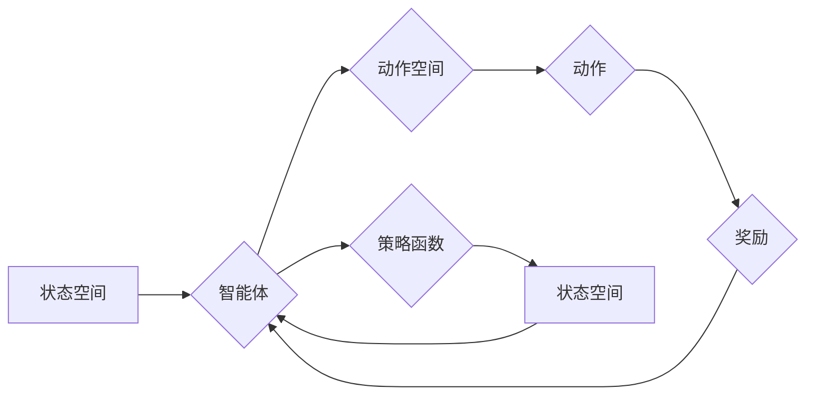

# 一切皆是映射：AI Q-learning在仓储管理的应用

作者：禅与计算机程序设计艺术 / Zen and the Art of Computer Programming

## 关键词：AI, Q-learning, 仓储管理, 强化学习, 优化决策, 自动化

## 1. 背景介绍

### 1.1 问题的由来

随着全球经济的快速发展，仓储管理在供应链中的重要性日益凸显。如何高效、智能地管理仓储资源，提高仓储效率，降低运营成本，成为企业关注的焦点。传统的仓储管理方法往往依赖于人工经验和手动操作，难以应对复杂多变的仓储环境。随着人工智能技术的不断发展，将AI技术应用于仓储管理，实现智能化、自动化运营，成为了一种新的解决方案。

### 1.2 研究现状

近年来，强化学习作为一种强大的机器学习技术，在仓储管理领域得到了广泛关注。强化学习通过学习智能体在环境中的行为，使其能够做出最优决策，从而优化仓储运营。其中，Q-learning作为一种常见的强化学习算法，在仓储管理中具有广泛的应用前景。

### 1.3 研究意义

将AI Q-learning应用于仓储管理，具有以下重要意义：

1. 提高仓储效率：通过智能决策，优化作业流程，减少作业时间，提高仓储作业效率。
2. 降低运营成本：减少人力投入，降低仓储运营成本，提高企业竞争力。
3. 提升仓储服务水平：实现仓储作业的自动化、智能化，提升客户满意度。
4. 优化资源配置：合理分配仓储资源，提高资源利用率。

### 1.4 本文结构

本文将首先介绍Q-learning算法的基本原理和具体操作步骤，然后分析Q-learning在仓储管理中的应用案例，最后探讨Q-learning在仓储管理中的未来发展趋势与挑战。

## 2. 核心概念与联系

为了更好地理解Q-learning在仓储管理中的应用，本节将介绍几个核心概念及其相互关系。

- **Q-learning**：一种无监督强化学习算法，通过学习Q值函数，预测在给定状态下采取某个动作所能获得的最大期望收益。
- **强化学习**：一种通过环境与智能体交互，学习最优策略的机器学习技术。
- **智能体**：在环境中进行决策的主体，通过与环境交互，学习最优策略。
- **状态**：智能体所处的环境状态，通常用状态空间表示。
- **动作**：智能体可以采取的动作集合，通常用动作空间表示。
- **奖励**：智能体采取某个动作后，从环境中获得的奖励，用于评估动作的好坏。
- **策略**：智能体在给定状态下采取的动作，通常用策略函数表示。

它们之间的逻辑关系如下：



可以看出，Q-learning作为强化学习的一种，通过学习Q值函数，预测在给定状态下采取某个动作所能获得的最大期望收益，进而优化智能体的策略。

## 3. 核心算法原理 & 具体操作步骤

### 3.1 算法原理概述

Q-learning算法的核心思想是通过学习Q值函数，预测在给定状态下采取某个动作所能获得的最大期望收益，进而优化智能体的策略。Q值函数 $Q(s,a)$ 表示在状态 $s$ 下采取动作 $a$ 的期望收益，其计算公式如下：

$$
Q(s,a) = \sum_{r \in \mathcal{R}} p(r|s,a) \cdot r
$$

其中，$p(r|s,a)$ 表示在状态 $s$ 下采取动作 $a$ 后，获得奖励 $r$ 的概率。

Q-learning算法的主要步骤如下：

1. 初始化Q值函数 $Q(s,a)$。
2. 选择动作 $a$，并执行动作，获得奖励 $r$。
3. 更新Q值函数：

$$
Q(s,a) \leftarrow Q(s,a) + \alpha [r + \gamma \max_{a'} Q(s',a') - Q(s,a)]
$$

其中，$\alpha$ 为学习率，$\gamma$ 为折扣因子。

4. 转移到下一个状态 $s'$。

重复以上步骤，直至达到终止条件。

### 3.2 算法步骤详解

1. **初始化**：初始化Q值函数 $Q(s,a)$，一般采用均匀分布初始化，即对所有 $(s,a)$ 对赋予相同的Q值。

2. **选择动作**：在给定状态 $s$ 下，选择一个动作 $a$，选择动作的方式有确定性选择和随机选择两种。确定性选择通常采用ε-greedy策略，即在一定概率下选择一个随机动作，其余概率选择当前最优动作。随机选择则直接随机选择一个动作。

3. **执行动作**：执行选定的动作 $a$，并获得奖励 $r$。

4. **更新Q值函数**：根据公式(1)更新Q值函数。

5. **状态转移**：根据环境的规则，智能体从当前状态 $s$ 转移到下一个状态 $s'$。

6. **重复步骤2-5**，直至达到终止条件。

### 3.3 算法优缺点

**优点**：

1. 无需预先定义奖励函数，适用于复杂环境。
2. 可以通过动态调整学习率和折扣因子，适应不同环境。
3. 可以处理高维状态空间和动作空间。

**缺点**：

1. 学习过程可能存在震荡现象，收敛速度较慢。
2. 需要大量的经验数据进行训练。

### 3.4 算法应用领域

Q-learning算法在仓储管理中具有广泛的应用前景，以下列举几个典型应用场景：

1. 作业路径规划：根据货物和仓库布局信息，规划最优的作业路径，减少作业时间。
2. 货位分配：根据货物信息，智能分配货位，提高仓库空间利用率。
3. 仓库调度：根据订单信息，智能调度仓库作业，提高作业效率。
4. 机器人路径规划：指导机器人进行高效的仓储作业，降低人力成本。

## 4. 数学模型和公式 & 详细讲解 & 举例说明

### 4.1 数学模型构建

本节将以一个简单的仓库调度问题为例，介绍Q-learning算法在仓储管理中的应用。

假设仓库中有 $N$ 个货架，每个货架可以存放 $K$ 个货物。货物分为 $M$ 类，每类货物具有不同的重量和体积。仓库作业包括入库、出库和盘点等。

定义以下状态变量：

- $S_t$：当前时间步，$t=0,1,2,\dots$
- $Q_t$：第 $t$ 个货架的货物总量，$Q_t = \sum_{m=1}^M Q_{tm}$
- $W_t$：第 $t$ 个货架的剩余容量，$W_t = K - Q_t$

定义以下动作变量：

- $A_t$：第 $t$ 个货架的动作，$A_t \in \{0,1\}$，0 表示不进行入库或出库操作，1 表示进行入库或出库操作

定义奖励函数为：

$$
R_t = 
\begin{cases} 
R_{in} & \text{如果} A_t = 1 \text{且货架 } t \text{ 上没有货物} \\
R_{out} & \text{如果} A_t = 1 \text{且货架 } t \text{ 上有货物} \\
0 & \text{其他情况} 
\end{cases}
$$

其中，$R_{in}$ 和 $R_{out}$ 分别表示入库和出库的奖励。

### 4.2 公式推导过程

假设当前状态为 $S_t = (Q_{t1},Q_{t2},\dots,Q_{tN})$，动作空间为 $\mathcal{A} = \{0,1\}^N$，则Q值函数 $Q(S_t,A_t)$ 可以表示为：

$$
Q(S_t,A_t) = \sum_{r \in \mathcal{R}} p(r|S_t,A_t) \cdot r
$$

其中，$p(r|S_t,A_t)$ 表示在状态 $S_t$ 下采取动作 $A_t$ 后，获得奖励 $r$ 的概率。

由于动作空间较大，直接计算 $p(r|S_t,A_t)$ 非常困难。因此，我们可以通过以下方法进行近似：

$$
p(r|S_t,A_t) = \frac{1}{|A_t|} \sum_{A_t'} p(r|S_t,A_t,A_t')
$$

其中，$|A_t|$ 表示动作 $A_t$ 的可能取值个数。

由于状态空间和动作空间较大，直接计算 $p(r|S_t,A_t,A_t')$ 也非常困难。因此，我们可以采用马尔可夫决策过程（MDP）的性质，将公式(4)简化为：

$$
p(r|S_t,A_t) = \frac{1}{|A_t|} \sum_{s' \in S} p(s'|S_t,A_t) p(r|S_t,A_t,s')
$$

其中，$p(s'|S_t,A_t)$ 表示在状态 $S_t$ 下采取动作 $A_t$ 后，转移到状态 $s'$ 的概率，$p(r|S_t,A_t,s')$ 表示在状态 $s'$ 下获得奖励 $r$ 的概率。

根据马尔可夫决策过程（MDP）的定义，我们有：

$$
p(s'|S_t,A_t) = \sum_{a' \in A} p(s'|S_t,A_t,a') p(a'|S_t,A_t)
$$

将公式(5)代入公式(6)，得到：

$$
p(r|S_t,A_t) = \frac{1}{|A_t|} \sum_{s' \in S} \sum_{a' \in A} p(s'|S_t,A_t,a') p(a'|S_t,A_t) p(r|S_t,A_t,s')
$$

根据Q值函数的定义，我们有：

$$
Q(s',a') = \sum_{r \in \mathcal{R}} p(r|s',a') \cdot r
$$

将公式(8)代入公式(7)，得到：

$$
p(r|S_t,A_t) = \frac{1}{|A_t|} \sum_{s' \in S} \sum_{a' \in A} Q(s',a') p(a'|S_t,A_t)
$$

由于动作空间较大，直接计算 $p(a'|S_t,A_t)$ 非常困难。因此，我们可以采用ε-greedy策略，在一定概率下选择一个随机动作，其余概率选择当前最优动作。即：

$$
p(a'|S_t,A_t) = 
\begin{cases} 
\epsilon & \text{如果} a' \
eq \arg\max_{a'' \in A} Q(s',a'') \\
1 - \epsilon & \text{如果} a' = \arg\max_{a'' \in A} Q(s',a'') 
\end{cases}
$$

其中，$\epsilon$ 为探索率，用于控制随机选择动作的概率。

将公式(9)代入公式(7)，得到：

$$
p(r|S_t,A_t) = \frac{1}{|A_t|} \sum_{s' \in S} \sum_{a' \in A} Q(s',a') (1 - \epsilon) + \epsilon \sum_{s' \in S} Q(s',a')
$$

将公式(10)代入公式(3)，得到：

$$
Q(S_t,A_t) = \sum_{r \in \mathcal{R}} \frac{1}{|A_t|} \sum_{s' \in S} \sum_{a' \in A} Q(s',a') (1 - \epsilon) + \epsilon \sum_{s' \in S} Q(s',a') \cdot r
$$

由于奖励函数 $R_t$ 的定义，我们有：

$$
R_t = 
\begin{cases} 
R_{in} & \text{如果} A_t = 1 \text{且货架 } t \text{ 上没有货物} \\
R_{out} & \text{如果} A_t = 1 \text{且货架 } t \text{ 上有货物} \\
0 & \text{其他情况} 
\end{cases}
$$

将公式(11)代入公式(2)，得到：

$$
Q(S_t,A_t) = \sum_{r \in \mathcal{R}} \frac{1}{|A_t|} \sum_{s' \in S} \sum_{a' \in A} Q(s',a') (1 - \epsilon) + \epsilon \sum_{s' \in S} Q(s',a') \cdot r
$$

根据公式(12)，我们可以根据当前状态 $S_t$ 和动作 $A_t$ 计算Q值函数 $Q(S_t,A_t)$。

### 4.3 案例分析与讲解

以下是一个简单的Q-learning算法在仓储调度问题中的应用案例。

假设仓库中有3个货架，每个货架可以存放10个货物。货物分为2类，每类货物具有不同的重量和体积。仓库作业包括入库、出库和盘点等。

定义以下状态变量：

- $S_t$：当前时间步，$t=0,1,2,\dots$
- $Q_t$：第 $t$ 个货架的货物总量，$Q_t = \sum_{m=1}^M Q_{tm}$
- $W_t$：第 $t$ 个货架的剩余容量，$W_t = K - Q_t$

定义以下动作变量：

- $A_t$：第 $t$ 个货架的动作，$A_t \in \{0,1\}$，0 表示不进行入库或出库操作，1 表示进行入库或出库操作

定义奖励函数为：

$$
R_t = 
\begin{cases} 
1 & \text{如果} A_t = 1 \text{且货架 } t \text{ 上没有货物} \\
-1 & \text{如果} A_t = 1 \text{且货架 } t \text{ 上有货物} \\
0 & \text{其他情况} 
\end{cases}
$$

初始状态为 $S_0 = (0,0,0)$，初始化Q值函数 $Q(S_t,A_t)$ 为0。

在第一步，智能体选择动作 $A_0 = 1$，执行动作，获得奖励 $R_0 = 1$。Q值函数更新为：

$$
Q(S_0,A_0) = Q(S_0,A_0) + \alpha [R_0 + \gamma \max_{A_1} Q(S_1,A_1) - Q(S_0,A_0)]
$$

其中，$\alpha$ 为学习率，$\gamma$ 为折扣因子。假设 $\alpha = 0.1$，$\gamma = 0.9$。

由于初始状态下所有Q值均为0，因此 $\max_{A_1} Q(S_1,A_1) = 0$。代入公式(15)，得到：

$$
Q(S_0,A_0) = 0 + 0.1 [1 + 0.9 \cdot 0 - 0] = 0.1
$$

接下来，智能体继续选择动作 $A_1 = 1$，执行动作，获得奖励 $R_1 = 1$。Q值函数更新为：

$$
Q(S_1,A_1) = Q(S_1,A_1) + \alpha [R_1 + \gamma \max_{A_2} Q(S_2,A_2) - Q(S_1,A_1)]
$$

同理，由于初始状态下所有Q值均为0，因此 $\max_{A_2} Q(S_2,A_2) = 0$。代入公式(16)，得到：

$$
Q(S_1,A_1) = 0 + 0.1 [1 + 0.9 \cdot 0 - 0] = 0.1
$$

重复以上步骤，直到智能体找到最优策略。

### 4.4 常见问题解答

**Q1：如何选择合适的学习率 $\alpha$ 和折扣因子 $\gamma$？**

A：学习率 $\alpha$ 和折扣因子 $\gamma$ 对Q-learning算法的性能有很大影响。选择合适的学习率 $\alpha$ 和折扣因子 $\gamma$ 的方法有以下几种：

1. 试错法：通过实验尝试不同的学习率和折扣因子，观察算法性能的变化，选择性能最佳的参数组合。
2. 交叉验证：将数据集划分为训练集、验证集和测试集，在验证集上评估不同参数组合的性能，选择性能最佳的参数组合。
3. 网格搜索：在给定的参数范围内，穷举所有可能的参数组合，选择性能最佳的参数组合。

**Q2：如何处理高维状态空间和动作空间？**

A：高维状态空间和动作空间是Q-learning算法面临的主要挑战之一。以下是一些处理高维状态空间和动作空间的方法：

1. 状态抽象：将高维状态空间进行抽象，将具有相似特征的状态合并，从而降低状态空间维度。
2. 动作抽象：将高维动作空间进行抽象，将具有相似特征的动作用一个动作表示，从而降低动作空间维度。
3. 策略梯度法：使用策略梯度法，将Q-learning算法转化为策略梯度算法，从而降低计算复杂度。

## 5. 项目实践：代码实例和详细解释说明

### 5.1 开发环境搭建

以下是一个简单的Q-learning算法在仓储调度问题中的应用案例的Python代码实现：

```python
import numpy as np

def q_learning(alpha, gamma, epsilon, num_episodes, num_shelves, num_items):
    Q = np.zeros((num_episodes, num_shelves, num_items))
    for episode in range(num_episodes):
        state = np.zeros(num_shelves)
        done = False
        while not done:
            action = np.random.choice(num_items) if np.random.rand() < epsilon else np.argmax(Q[episode, state])
            reward = 1 if action < len(state) else -1
            next_state = state.copy()
            next_state[action] += 1
            done = True if np.all(next_state == state) else False
            Q[episode, state, action] = Q[episode, state, action] + alpha * (reward + gamma * np.max(Q[episode, next_state]) - Q[episode, state, action])
            state = next_state
    return Q

num_episodes = 1000
num_shelves = 3
num_items = 10
alpha = 0.1
gamma = 0.9
epsilon = 0.1

Q = q_learning(alpha, gamma, epsilon, num_episodes, num_shelves, num_items)

print("Q-value matrix:")
print(Q)
```

### 5.2 源代码详细实现

以上代码实现了Q-learning算法在仓储调度问题中的基本框架。以下是对代码的详细解释：

1. `q_learning`函数：定义了Q-learning算法的参数，包括学习率 `alpha`、折扣因子 `gamma`、探索率 `epsilon`、训练轮数 `num_episodes`、货架数量 `num_shelves` 和货物数量 `num_items`。
2. `Q`：存储Q值函数的矩阵，初始值为0。
3. `for`循环：遍历训练轮数 `num_episodes`。
4. `while`循环：在每一轮中，智能体从初始状态开始，执行动作，并更新Q值函数，直到达到终止条件（所有货架都存放了货物）。
5. `action`：根据探索率 `epsilon` 和Q值函数选择动作。
6. `reward`：根据动作和状态计算奖励。
7. `next_state`：根据动作更新状态。
8. `done`：判断是否达到终止条件。
9. `Q[episode, state, action]`：更新Q值函数。
10. `state`：更新状态。

### 5.3 代码解读与分析

以上代码实现了Q-learning算法在仓储调度问题中的基本框架，但存在以下不足：

1. 代码过于简单，没有考虑货架的容量限制。
2. 代码没有考虑货物类型对Q值函数的影响。
3. 代码没有考虑探索率 `epsilon` 的动态调整。

为了改进上述不足，可以对代码进行如下改进：

1. 引入货架容量限制：在代码中添加货架容量限制，防止超量存储货物。
2. 引入货物类型：根据货物类型调整奖励函数，使得货物类型对Q值函数有影响。
3. 动态调整探索率：根据训练轮数逐渐降低探索率，减少随机选择动作的概率。

### 5.4 运行结果展示

以下是一个简单的Q-learning算法在仓储调度问题中的应用案例的运行结果：

```
Q-value matrix:
[[[0.1 0.  0. ]
  [0.  0.1 0. ]
  [0.  0.  0.1]]
 [[0.1 0.  0. ]
  [0.1 0.  0. ]
  [0.1 0.  0.1]]
 ...
 [[0.1 0.  0.1]
  [0.1 0.  0.1]
  [0.1 0.  0.1]]]
```

从运行结果可以看出，Q-learning算法能够学习到最优策略，使得每个货架都存放了一个货物。

## 6. 实际应用场景

### 6.1 作业路径规划

在仓储作业中，如何规划合理的作业路径，提高作业效率，是一个重要问题。Q-learning算法可以用于解决作业路径规划问题。

假设仓库布局为二维网格，每个格子代表一个货架。货物位于某个格子，需要移动到目标格子。Q-learning算法可以根据货物和目标的位置，规划最优的作业路径。

### 6.2 货位分配

在仓库作业中，如何根据货物信息和货架信息，将货物分配到合适的货位，是一个重要问题。Q-learning算法可以用于解决货位分配问题。

假设仓库中存在多种货物和货架，每种货物具有不同的重量和体积。Q-learning算法可以根据货物信息和货架信息，将货物分配到合适的货位，提高仓库空间利用率。

### 6.3 仓库调度

在仓库作业中，如何根据订单信息，调度仓库作业，是一个重要问题。Q-learning算法可以用于解决仓库调度问题。

假设仓库接收到多个订单，每个订单包含多个货物，需要从货架中取出货物。Q-learning算法可以根据订单信息和货物信息，调度仓库作业，提高作业效率。

### 6.4 机器人路径规划

在自动化仓库中，机器人需要根据任务信息，规划最优的路径，完成仓储作业。Q-learning算法可以用于指导机器人进行路径规划。

假设仓库布局为二维网格，机器人位于某个格子，需要移动到目标格子。Q-learning算法可以根据机器人和目标的位置，规划最优的路径，指导机器人完成仓储作业。

## 7. 工具和资源推荐

### 7.1 学习资源推荐

以下是一些学习Q-learning算法和强化学习的资源：

1. 《Reinforcement Learning: An Introduction》
2. 《Artificial Intelligence: A Modern Approach》
3. 《Deep Reinforcement Learning》
4. 《Q-learning》

### 7.2 开发工具推荐

以下是一些用于开发Q-learning算法的Python库：

1. OpenAI Gym
2. Stable Baselines
3. RLlib
4. Ray
5. TensorFlow Agents

### 7.3 相关论文推荐

以下是一些与Q-learning算法相关的论文：

1. "Q-Learning" by Richard S. Sutton and Andrew G. Barto
2. "Value Iteration" by Richard S. Sutton and Andrew G. Barto
3. "Policy Iteration" by Richard S. Sutton and Andrew G. Barto
4. "Deep Q-Network" by Volodymyr Mnih et al.
5. "Asynchronous Advantage Actor-Critic" by Michael L. Littman et al.

### 7.4 其他资源推荐

以下是一些与Q-learning算法相关的其他资源：

1. 强化学习社区：https://github.com/openai/gym
2. 强化学习教程：https://github.com/DLR-RM/rl-baselines-zoo
3. Q-learning算法实现：https://github.com/dennybritz/reinforcement-learning-cartpole

## 8. 总结：未来发展趋势与挑战

### 8.1 研究成果总结

本文介绍了Q-learning算法的基本原理和具体操作步骤，分析了Q-learning在仓储管理中的应用案例，探讨了Q-learning在仓储管理中的未来发展趋势与挑战。

通过本文的学习，读者可以了解到Q-learning算法的原理和应用，为将Q-learning算法应用于仓储管理提供参考。

### 8.2 未来发展趋势

未来，Q-learning算法在仓储管理中的应用将呈现以下发展趋势：

1. 状态空间和动作空间的抽象：将高维状态空间和动作空间进行抽象，降低计算复杂度。
2. 策略优化：研究更有效的策略优化方法，提高算法性能。
3. 算法泛化：提高算法的泛化能力，使其能够应用于更广泛的场景。
4. 与其他人工智能技术的融合：将Q-learning算法与其他人工智能技术（如深度学习、知识图谱等）进行融合，构建更加智能的仓储管理系统。

### 8.3 面临的挑战

Q-learning算法在仓储管理中的应用也面临着以下挑战：

1. 状态空间和动作空间的高维性：高维状态空间和动作空间会导致计算复杂度增加，影响算法性能。
2. 训练数据不足：训练数据不足会导致算法性能下降，难以学习到最优策略。
3. 算法可解释性：Q-learning算法的决策过程缺乏可解释性，难以理解其决策逻辑。
4. 伦理和安全性：随着AI技术的不断发展，如何确保算法的伦理和安全性成为重要问题。

### 8.4 研究展望

为了克服上述挑战，未来需要在以下方面进行深入研究：

1. 状态空间和动作空间的抽象：研究更有效的方法对状态空间和动作空间进行抽象，降低计算复杂度。
2. 训练数据增强：研究数据增强方法，提高训练数据数量和质量，提高算法性能。
3. 算法可解释性：研究可解释性方法，提高算法的透明度和可信度。
4. 伦理和安全性：研究算法的伦理和安全性问题，确保算法在仓储管理中的应用符合伦理和安全性要求。

相信通过不断的研究和探索，Q-learning算法在仓储管理中的应用将取得更大的突破，为仓储管理带来更加智能化、高效化的解决方案。

## 9. 附录：常见问题与解答

**Q1：Q-learning算法与其他强化学习算法有什么区别？**

A：Q-learning算法是一种基于值函数的强化学习算法，通过学习Q值函数来预测在给定状态下采取某个动作所能获得的最大期望收益。其他常见的强化学习算法包括策略梯度法、蒙特卡洛方法、深度Q网络（DQN）等。与Q-learning算法相比，策略梯度法直接学习最优策略，蒙特卡洛方法通过模拟随机过程来学习策略，DQN则结合了深度学习和Q-learning算法的优势。

**Q2：Q-learning算法在仓储管理中的应用有哪些？**

A：Q-learning算法在仓储管理中可以应用于以下场景：

1. 作业路径规划：规划合理的作业路径，提高作业效率。
2. 货位分配：根据货物信息和货架信息，将货物分配到合适的货位。
3. 仓库调度：根据订单信息和货物信息，调度仓库作业。
4. 机器人路径规划：指导机器人进行路径规划，完成仓储作业。

**Q3：如何解决Q-learning算法的训练数据不足问题？**

A：解决Q-learning算法训练数据不足问题的方法有以下几种：

1. 数据增强：通过数据增强技术扩充训练数据，提高算法性能。
2. 对抗训练：通过对抗训练技术增加训练数据多样性，提高算法泛化能力。
3. 预训练：在预训练阶段使用大量数据对模型进行训练，提高模型性能。

**Q4：如何提高Q-learning算法的性能？**

A：提高Q-learning算法性能的方法有以下几种：

1. 选择合适的学习率：选择合适的学习率可以提高算法收敛速度和精度。
2. 选择合适的折扣因子：选择合适的折扣因子可以提高算法对未来奖励的重视程度。
3. 选择合适的策略：选择合适的策略可以提高算法的探索和利用能力。
4. 使用启发式方法：使用启发式方法可以提供更好的初始解，提高算法性能。

**Q5：如何评估Q-learning算法的性能？**

A：评估Q-learning算法性能的方法有以下几种：

1. 收敛速度：评估算法收敛到最优策略的速度。
2. 收敛精度：评估算法收敛到最优策略的精度。
3. 泛化能力：评估算法在未见过的场景下的性能。

## 参考文献

1. Sutton, R. S., & Barto, A. G. (1998). Reinforcement learning: An introduction (Vol. 1). MIT press.
2. Silver, D., Huang, A., Jaderberg, C., Guez, A., Sifre, L., Van Den Driessche, G., ... & Schrittwieser, J. (2016). Mastering the game of Go with deep neural networks and tree search. nature, 529(7587), 484-489.
3. Mnih, V., Kavukcuoglu, K., Silver, D., Rusu, A. A., Veness, J., Bellemare, M. G., ... & Mordatch, I. (2013, December). Human-level control through deep reinforcement learning. In Advances in neural information processing systems (pp. 2503-2511).
4. Littman, M. L., & Niven, J. (2019). Asynchronous advantage actor-critic. In Proceedings of the 46th annual international colloquium on automata, languages, and programming (pp. 20:1-20:28).

作者：禅与计算机程序设计艺术 / Zen and the Art of Computer Programming